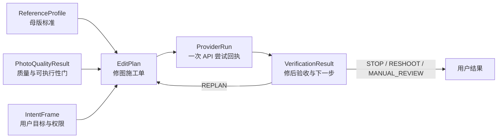

# 六个数据合同审析（`v0.2-frozen`）

> 更新：2026-08-27
>
> 当前状态：产品规则已冻结；Python `contracts.py`、可配置 Policy、SQLite 六表和合同测试已经同步为 `v0.2`。
> 产品语义见 [PRODUCT_RULES.md](PRODUCT_RULES.md)，LLM 边界与完整 Prompt 见 [AGENT_PROMPTS.md](AGENT_PROMPTS.md)。

## 1. 合同解决什么问题

合同是模块之间的“统一交接表”。视觉模块、意图解析器、规划器、腾讯 Adapter、验证器、数据库和界面不能互相猜字段，而必须通过版本化合同传递事实。这样才能回答：用户说了什么、系统如何理解、为什么生成这组参数、API 是否真实执行、结果是否改善，以及失败发生在哪一层。



## 2. 六个合同的责任边界

| 合同 | 它回答的问题 | 产生者 | 主要消费者 | 绝不包含 |
|---|---|---|---|---|
| `ReferenceProfile` | “长期要对齐成什么样？” | 母版确认/特征模块 | 质量门、规划器、验证器 | 原图、EXIF、肤色/妆面档案、明文主体锚点 |
| `PhotoQualityResult` | “这张照片能不能稳定比较和处理？” | 确定性视觉工具 | 状态机、规划器、UI | 原图、LLM 猜测、审美结论 |
| `IntentFrame` | “用户当前到底要什么、允许什么？” | LLM 或模板解析器，经 Schema 校验 | 状态机、规划器、UI | 原图、API 成功回执、自由生成参数 |
| `EditPlan` | “针对这一张照片，准备怎么改？” | 确定性规划器 | 用户确认、Provider Adapter | 修改后结果、密钥、超出能力卡的假参数 |
| `ProviderRun` | “某一次外部调用实际上发生了什么？” | Provider Adapter 与计时/审计代码 | 验证器、Trace、成本与 Bad Case 模块 | Base64、Secret、签名 URL、LLM 猜测的成功结果 |
| `VerificationResult` | “实际有没有改善，下一步是什么？” | 确定性复测器 | 状态机、报告解释器、评测 | 未测量的改善、未经校准的用户概率、审美判断 |

## 3. 跨合同不可破坏的规则

1. 六个合同都必须包含 `contract_version`，新增/删除/改义字段必须升版本、写迁移说明并补测试。
2. `ReferenceProfile.version`、目标照片哈希、最新 `IntentFrame.intent_id`、`PhotoQualityResult`、Provider Card 版本或权限范围任一变化，旧的未执行 `EditPlan` 都必须变为 `superseded`。
3. `EditPlan` 是不可变计划快照。复测后调整参数必须创建新 revision，不能原地修改旧计划。
4. 每次真实外部尝试都产生独立 `ProviderRun`。一次计划发生两次重试，就有两条 Run，不能覆盖第一条失败证据。
5. `VerificationResult` 必须引用一个真实的 `ProviderRun`；API 成功只表示工具完成，不能直接推出效果达标。
6. 用户层相对变化和供应商绝对参数分开保存。腾讯绝对参数只能在官方允许的 0—100 范围内。
7. 任何执行确认都必须绑定明确作用域、约束快照和有效期。意图、照片、母版或计划实质变化后确认失效。
8. 原图、Base64、密钥、确认 token、签名 URL、完整人脸向量和未脱敏自由文本不得进入合同 Trace 投影。
9. LLM 输出必须先通过 Schema 和权限校验；状态机、视觉工具、规划器和 Adapter 的真实结果优先于 LLM 提议。
10. V0 不展示接受概率；交互弱标签和模型合成数据不得替代人工金标准。

<span style="color:#C00000"><strong>【本轮耦合纠错】附件中的“意图 taxonomy”混合了用户意图、状态机状态和工具名。v0.2 将三者拆开：IntentFrame 只保存用户目标与约束；WorkflowState 决定当前允许做什么；Tool Registry 才包含 analyze_consistency、plan_edit、execute_beautify 等工具。</strong></span>

## 4. `ReferenceProfile`：母版档案

### 4.1 核心字段

| 字段组 | 必需内容 | 说明 |
|---|---|---|
| 身份与生命周期 | `profile_id`、匿名 `user_id`、`version`、`status`、`created_at`、`updated_at` | 同一用户只有一个 active/geometry-only Profile；新版本成功后替换旧版本 |
| 特征引用 | `feature_snapshot_ref`、归一化五官/脸型摘要、每项测量状态与置信度 | 跨模块只传结构化摘要/不透明引用，不传原始关键点或完整向量 |
| 用户约束 | `allowed_features`、`blocked_features`、`preserve_attributes`、`adjustment_mode` | 妆面、肤色、背景等保留项不能只靠隐含默认 |
| 版本 | `profile_schema_version`、`extractor_version`、`canonicalization_version`、`consent_policy_version` | 复现同一套特征计算与同意规则 |
| 主体锚点 | `subject_anchor` 中的加密引用、同意记录引用、访问策略、创建/到期/删除状态 | 单独同意、保存六个月、可删除、受限访问 |
| Provider 映射 | 特征到 `executable/suggestion_only` 的能力映射、能力卡 ID 与版本 | 防止未来参数被当前工具假执行 |

### 4.2 不变量

- 不保存母版原图、文件路径、文件名、EXIF、肤色、妆面、身体和隐私部位；
- 用户撤回同意或六个月到期且不续期时，删除主体锚点并降级为几何特征对齐；
- 更换母版时，先完整建立新版本，成功后再删除旧特征正文；只保留脱敏审计事件；
- Profile 更新立即使关联的未执行计划和确认失效。

## 5. `PhotoQualityResult`：照片质量与可执行性门

### 5.1 核心字段

| 字段组 | 必需内容 | 说明 |
|---|---|---|
| 对象 | `quality_result_id`、`photo_id`、`photo_sha256`、`face_count`、`selected_face_ref` | 多脸时必须由用户选择目标脸；引用不包含图像数据 |
| 三类信号 | `subject_match_status/evidence`、`quality_confidence`、`editability_confidence` | 不把同一人物、照片质量和工具能力混成一个数字；供应商原始同人分不冒充校准概率 |
| 质量事实 | 姿态、清晰度、曝光、遮挡、完整性、表情、分辨率等 metrics/flags | 来自确定性视觉工具 |
| 内容安全证据 | status + provider/operation/version + policy version + receipt ref/RequestId | `passed/blocked` 必须对应一次可审计的真实检查；用户声明不能冒充机器结果 |
| 路由 | `REJECT_REUPLOAD`、`WARN_CONTINUE`、`CONTINUE`、`SELECT_FACE` | 用户看到可解释原因 |
| 版本 | `analysis_version`、`subject_match_evidence.model/threshold_policy_version`、`routing_policy.policy_version`、`provider_card_id/version` | 阈值、主体模型或工具能力变化后仍可回放 |

### 5.2 当前路由

当前 Policy 阈值为 `≤0.50` 重新上传、`>0.50 且 <0.80` 警告后继续、`≥0.80` 继续。<span style="color:#C00000"><strong>该组阈值已冻结为只用于 quality/editability 两类内部置信度，并采用“最严格路由生效”；subject match 独立使用 match/uncertain/no_match，保存供应商原始分、分值范围、模型/阈值版本和回执。未完成授权样本校准前，`subject_match_confidence` 必须为空。</strong></span> 多脸自动隔离链路未实现前，运行时仍应拒绝或要求用户先裁剪，不能宣称已经只编辑所选脸。

==<span style="color:#C00000"><strong>==检查点 6 接入边界：</strong>本地 `PhotoObservation` 先用 Pillow + OpenCV Haar 产生尺寸、清晰度、曝光、人脸数、眼睛可见性和粗粒度脸框/眼睛几何；它只在内存中存在，不直接写入六合同。腾讯 `CompareFace` 作为当前会话 1:1 同人 Adapter，输出 `match/uncertain/no_match` 和未校准原始分；腾讯 `ImageModeration` 作为内容安全 Adapter，`Pass` 才能放行，`Review/Block` 在 V0 都保守拦截。两类 Provider 结果必须附带独立 evidence 和 RequestId。`ReferenceProfile` v0 由单脸、通过安全且质量路由允许的母版生成，只保存归一化脸框/眼睛几何和版本字段。==</strong></span>==

## 6. `IntentFrame`：用户目标、约束和权限请求

### 6.1 输入与输出

输入是用户本轮自然语言、当前会话状态、已确认的 Profile 默认值和工具能力摘要；输出是经过 Schema 校验、可以持久化和回放的意图快照。它不直接调用工具，也不代表外部执行已经获准。

### 6.2 <span style="color:#C00000">【补充完成：意图识别字段】</span>

| 字段组 | 建议字段 | 为什么需要 |
|---|---|---|
| 追踪 | `intent_id`、`session_id`、`turn`、`supersedes_intent_id` | 用户改口后能够让旧计划和确认失效 |
| 核心意图 | `goal`、`route`、`action` | 分别回答为什么做、单张/批量、诊断/方案/执行等动作 |
| 对象范围 | `target_scope`、`reference_source`、目标照片/批次引用 | 避免“执行”却不知道针对哪张图 |
| 输出偏好 | `report/manual_parameters/edited_images` | 支持只看诊断、给参数、直接执行，但不把它们变成固定问卷 |
| 编辑约束 | `allowed_features`、`blocked_features`、`preserve_attributes` | 妆面、肤色、表情、背景等保留项不能遗漏 |
| 策略偏好 | `adjustment_mode`、`priority`、`requested_max_rounds` | 分开记录一致优先、少改优先、速度/成本偏好和用户请求轮数 |
| 批量策略 | `batch_failure_policy` | 单张失败时继续有效照片、停止全部或询问 |
| 长期偏好请求 | `preference_memory_request` | 用户说“以后默认”只形成待确认请求，不直接写长期 Memory |
| 解释与置信 | `field_sources`、`slot_confidence`、`intent_confidence`、`missing_slots`、`reason_codes` | 知道每个字段从哪里来、为什么追问 |
| 确认 | `confirmation_status`、`confirmation_scope`、确认引用 | 执行、删数据、更新母版和长期偏好都有明确作用域 |
| 模型追踪 | `parser_mode`、`model_provider/version`、`prompt_version` | LLM 或模板失败时可复现 |

### 6.3 澄清与路由规则

- 用户可以直接说目标，不先填固定问卷；解析器先生成 IntentFrame，再只问一个会改变路由、参数、权限或数据生命周期的缺失槽位；
- action=execute 高置信时可以直接进入“确认页面”，不能直接绕过确认调用 API；
- 快捷回复是候选，不是用户真实意图；只有点击/明确回复后才能写入字段；
- 明确取消立即取消；含糊时最多澄清一次，不进行挽留；
- “以后默认直接执行”只可保存为经单独同意的 Profile 默认偏好，仍不能免除新任务的有界执行确认；
- 三到五秒内先返回真实进度反馈；流式文本或闪动光标是 UI/NFR，不写进 IntentFrame 数据合同；
- LLM 失败时模板 fallback 仍输出同一个 Schema。

### 6.4 Intent 与 Workflow/Tool 的拆分

`review_reference/lock_profile/clarify/confirm/diagnose/plan/execute/verify/delete/unsupported` 更适合作为状态或允许动作，而不是全部塞入 intent 字段。建议状态机使用：

```text
REFERENCE_REVIEW → PROFILE_CONFIRM → INTENT_CAPTURE → CLARIFY
→ QUALITY_GATE → DIAGNOSE → PLAN → CONFIRM → EXECUTE → VERIFY
→ STOP / REPLAN / RESHOOT / MANUAL_REVIEW
```

==ReAct 风格 LLM 只能在当前状态的白名单里提议下一工具，状态机负责真正放行。==

## 7. `EditPlan`：一张照片的不可变施工单

### 7.1 核心字段

| 字段组 | 建议字段 | 说明 |
|---|---|---|
| 标识与依赖 | `plan_id`、`revision`、`parent_plan_id`、`session_id`、`profile_id/version`、`photo_id/hash`、`intent_id`、`quality_result_id` | 任何关键输入变化都能使计划失效 |
| 基线 | `baseline_feature_differences` 或引用 | 只保存修前差异；修后差异属于 VerificationResult |
| 可执行变化 | `executable_changes[]`：feature、user_delta、current_absolute、proposed_absolute、reason/evidence | 用户值和腾讯值分开；同一特征不能重复 |
| 手动建议 | `suggestion_only_changes[]` | Provider 不支持时给醒图等手动建议，不阻塞其他参数 |
| 腾讯快照 | 四个绝对参数全部显式存在 | 当前官方范围均为 0—100；美白/磨皮默认 0 |
| 约束 | `constraints_snapshot`、完整 `safety_policy` 快照、`provider_card_id/version`、预算/轮次上限 | 不让 LLM 临时发明安全上限 |
| 预期与风险 | `expected_directions`、`risk_notes`、`requires_confirmation` | 只描述方向，不承诺分数/概率 |
| 生命周期 | `status`、`confirmation_scope/ref`、`created_at`、`expires_at`、`superseded_reason` | 计划确认和失效可审计 |
| 版本 | `planner_version`、`mapping_policy_version` | 参数映射可复现 |

### 7.2 <span style="color:#C00000">【本轮技术纠错】</span>

- 腾讯 `BeautifyPic` 的四个绝对参数必须在 0—100；用户可以表达更大的相对愿望，但规划器必须截断/拒绝并解释，后台不能发送超界值；
- 参数强度、单次/累计上限和轮次由确定性 Safety Policy 决定，不能交给 LLM；
- “最多三轮”应作为 V0 可配置运行策略，而不是永久写死在 `RoundNumber` 类型；本轮候选为总计最多 3 次外部执行、连续 2 轮无改善提前停止；
- 取消“最多三个部位”的固定产品规则，但实际可执行参数数量仍受 Provider Card 限制；当前腾讯一次最多只有四个已声明参数；
- 在上一结果上累加时，以最近一张“已验证且未变差”的结果为新输入，并创建新 plan revision；不能修改旧计划；
- 附件提出的“修改前后的特征差异”不能同时放在执行前的 EditPlan。EditPlan 只放修前差异和预计改善方向，修后实测归 VerificationResult；
- 自动降低参数再尝试属于 `VerificationResult → REPLAN → 新 EditPlan`，不是在同一计划中偷偷改值；
- 用户只看简化方案；UI 展示工具步骤、参数依据和回执摘要，不展示隐藏思维链。

### 7.3 批量、成本与确认

- 每张可执行照片独立生成一张 EditPlan；批量规划可以并行，但失败照片不生成执行计划；
- 外部执行服从 Provider 限频、并发和预算策略；规划器可优先一次覆盖相互作用小的参数，不能以“省调用”为由突破安全上限；
- 确认作用域采用“当前照片/当前批次 + 允许部位 + 最多轮数”的有界计划族。新轮次在原作用域内可自动生成计划；扩大部位、启用美白/磨皮、替换母版/照片或突破预算时必须重新确认。

## 8. `ProviderRun`：一次真实 API 尝试的回执

### 8.1 <span style="color:#C00000">【补充完成：回执字段】</span>

| 字段组 | 建议字段 | 用途 |
|---|---|---|
| 关联 | `run_id`、`trace_id`、`session_id`、`plan_id/revision`、`photo_id`、`attempt_number`、`retry_group_id/parent_run_id` | 区分同一计划的多次尝试 |
| Provider | provider、operation、API/SDK 版本、region、endpoint、Provider Card ID/version | 复现供应商环境和能力 |
| 请求投影 | `idempotency_key`、`request_hash`、脱敏参数快照、输入 artifact 的不透明引用/hash | 防止重复扣费；不保存 Base64、原图或签名 URL |
| 权限 | `confirmation_ref`、`confirmation_scope`、`consent_policy_version` | 证明本次执行没有越权 |
| 状态 | queued/running/succeeded/failed/timeout/skipped/cancelled | 明确尝试阶段 |
| 真实回执 | `provider_request_id`、`result_artifact_ref/hash` | 成功必须具备；结果引用带 TTL/删除状态 |
| 时间 | queued/started/completed 时间、queue/network/total latency | 分析用户时延和供应商时延 |
| 成本 | estimated/actual cost、计费单位、预算策略版本 | 评估成本和批量任务预算 |
| 错误 | phase、category、provider code、脱敏 message、retryable、retry_after | 支持确定性重试和 Bad Case 归因 |
| 生命周期 | result expiry、deleted_at、delete_status | 避免结果图无限期保留 |

### 8.2 不变量与重试

- ProviderRun 由代码生成，LLM 不能创造 RequestId、耗时、成本或成功状态；
- 一次真实尝试一条 Run，记录不可覆盖；重试必须增加 `attempt_number`；
- 只对超时、限频、可恢复网络错误或明确的 5xx 执行有界重试；参数错误、权限错误、内容安全、图片不支持等不自动重试；
- 成功需要 RequestId、结果引用/hash、耗时和完成时间；失败/超时需要错误码、阶段和 `retryable`；
- 结果图片引用不是长期母版数据，必须有测试期保留与删除策略；
- Bad Case Prompt 只读取真实回执辅助分类，最终根因仍需规则或人工确认。

## 9. `VerificationResult`：修后验收和下一步决策

### 9.1 核心字段

| 字段组 | 建议字段 | 说明 |
|---|---|---|
| 关联 | `verification_id`、`session_id`、`profile_id/version`、`photo_id`、`plan_id/revision`、`provider_run_id` | 防止验错结果 |
| 实测差异 | `feature_comparisons[]`：before_gap、after_gap、change_direction、measurement_confidence | 来自确定性视觉工具，不由 LLM 补算 |
| 总体趋势 | improved/no_change/worsened/unverifiable | V0 不包装成一致性分数 |
| 质量与约束 | 修后 quality flags、禁改部位是否触发、结果 artifact 可用性 | 结果坏掉时不能继续宣称成功 |
| 循环状态 | `round_number`、`no_improvement_streak`、`safety_policy_version` | 支持三轮上限和两轮无改善提前停的候选策略 |
| 用户反馈 | accepted/rejected/not_provided、`label_source`、feedback reason | 只有显式反馈可作为人工标签；沉默只能是弱信号 |
| 概率 | 可选 `calibrated_acceptance`：probability + model/data/calibration version | V0 必须为空；只有校准 Gate 通过后才能出现 |
| 决策 | STOP/REPLAN/RESHOOT/MANUAL_REVIEW + reason codes + next state | 状态机执行，LLM 只解释 |
| 回退 | last_known_good_artifact_ref、rollback_reason | “回滚”是选择上一张可用结果，不是撤销外部 API |
| 版本 | verifier、extractor、threshold policy 版本和时间 | 复现验收规则 |

### 9.2 <span style="color:#C00000">【本轮技术纠错】</span>

- V0 明确不显示、也没有经过校准的接受概率，因此不能以“真实概率达标”作为当前停止条件；Demo 只能依据逐特征实测趋势、质量/安全门和用户显式接受作出定性决策；
- 点赞/点踩和明确文字反馈可以形成显式标签；关闭页面、没有追问、打开新窗口只能是 `interaction_weak`，不能自动推断满意；
- 图片本身质量不足时走 RESHOOT/重新上传，不继续提高参数；API 瞬时失败由 Provider Retry Policy 处理，不由验证器无限规划；
- 结果变差时保留原图/上一张已验证结果为 last-known-good，新计划不得沿同方向继续；
- “最多三轮”和“连续两轮无改善停止”可以同时成立：前者是总执行上限，后者是更早触发的停止条件，二者都属于可配置 Safety Policy；
- MANUAL_REVIEW 只有存在真实测试负责人/队列时才能使用；V0 可标记 `manual_review_required` 并由项目开发者处理，不能向用户虚构在线客服或运营团队；
- 用户不满意时先澄清一个具体差异；只有仍在允许部位、确认作用域和安全预算内才 REPLAN，否则解释产品边界。

### 9.3 四类用户结果与状态机结果

用户界面可以保持四类结果：拒绝并重新上传、直接执行并复测、给参数手动调整、只看诊断。它们是任务入口/用户结果，不应全部塞入 VerificationResult。VerificationResult 只负责执行后的 STOP、REPLAN、RESHOOT、MANUAL_REVIEW；诊断和手动参数路径不会产生 ProviderRun，也不应伪造 VerificationResult。

## 10. 五项耦合规则：已冻结

以下五项会改变用户体验、成本或权限，已在 2026-08-27 由用户逐项确认：

1. <span style="color:#C00000"><strong>执行确认：</strong>采用一次确认授权“当前照片/批次 + 明确允许部位 + 当前 Policy 最大轮次”的有界计划族；扩大范围、启用美白/磨皮、换照片/母版或超预算必须重新确认。“以后默认执行”只预选路径，不取消确认。</span>
2. <span style="color:#C00000"><strong>停止规则：</strong>V0 没有校准概率，采用用户显式接受、质量/安全阻塞、当前 Policy 总轮次上限、无改善提前停止或结果变差为停止条件；当前配置是最多 3 轮、连续 2 轮无改善，逐特征 tolerance 要等 benchmark 后才能宣称“系统达标”。</span>
3. <span style="color:#C00000"><strong>多脸执行：</strong>产品负责选择、隔离、裁剪、回贴和复测；腾讯接口没有目标脸参数且会处理最多五张最大人脸，因此该链路未完成前拒绝多脸或要求先裁剪。自动链路失败时解释原因并要求用户裁剪。</span>
4. <span style="color:#C00000"><strong>人工复核：</strong>Beta 仅承诺“标记待开发者复核”，由项目负责人查看脱敏 Trace；未经照片单独授权不人工查看原图，也不宣称存在客服团队。</span>
5. <span style="color:#C00000"><strong>三类判断信号：</strong>0.50/0.80 只用于 quality/editability，并采用最严格路由；subject match 独立输出 match/uncertain/no_match，保留原始证据但不冒充概率，并在有授权样本后校准阈值。</span>

这五项已经进入 `contracts.py`、`core/policies.py`、SQLite schema 和自动化测试。

## 11. `v0.2-frozen` 落实结果

| 原 `v0.1` 问题 | `v0.2-frozen` 结果 | 状态 |
|---|---|---|
| `RoundNumber` 永久限制 1—3 | 正整数 Schema 可扩展；当前 3/2 停止门保存在版本化 `SafetyPolicySnapshot` | 已实现并测试 |
| IntentFrame 只有单一 `confidence` 和少量槽位 | 已增加对象范围、输出/保留偏好、字段来源/置信、替代关系和有界确认 | 已实现并测试 |
| EditPlan 最多 3 个 delta、含 `expected_index_gain` | 已取消部位硬上限和指数；分 executable/suggestion-only；计划冻结不可变 | 已实现并测试 |
| ProviderRun 缺 attempt、能力卡、确认、错误分类、TTL | 已增加完整单次尝试回执和 Artifact 生命周期 | 已实现并测试 |
| VerificationResult 使用 before/after/index_delta | 已改为逐特征实测、趋势、用户反馈和策略决策 | 已实现并测试 |
| SQLite 只存 IntentFrame 与 ProviderRun 投影 | 已增加六合同表、迁移标识和 Profile 特征正文删除审计 | 已实现并测试 |

## 12. 当前工程边界

本轮已经修改 `contracts.py`、SQLite schema、模板 IntentFrame、smoke 回执结构和测试。当前真实运行能力仍是基础设施、模板 IntentFrame、本地脱敏 Trace 和一次腾讯 BeautifyPic live smoke；没有实现 LLM、视觉特征、真实内容安全检查、真实 EditPlan 规划、自动多轮、多脸隔离或 VerificationResult 复测。SQLite 当前保存六类独立审计投影，但跨合同的 plan/run/verification 关系还没有由完整状态机和端到端集成测试强制。

## 13. 本模块的实际验收案例与 Trace

合同回归覆盖的代表案例：

1. quality=0.90、editability=0.70 时采用更严格的 `WARN_CONTINUE`；
2. subject match 不确定时，即使照片质量高也进入独立确认；
3. 多脸先选择目标脸，隔离失败后转为 `REQUIRE_USER_CROP`；
4. 第 4 轮对当前三轮 Policy 被拒绝，但对显式五轮的未来 Policy 合法，证明轮次未写死在类型中；
5. 腾讯不支持的唇厚可以 suggestion-only，但不能伪装成当前 Provider 的 executable change；
6. 连续两轮无改善后禁止 REPLAN；开发者复核查看原图必须有独立授权引用。

六合同落库测试实际产生的事件顺序为：

```text
session_created
→ photo_quality_result_saved
→ intent_frame_saved
→ edit_plan_saved
→ provider_run_saved
→ verification_result_saved
→ redaction_probe
```

测试同时验证六类表各有一条合同记录、迁移标识存在、Intent turn 可递增，以及确认引用和输入 artifact 引用不会出现在 JSONL。检查点 6 新增了真实 Pillow/OpenCV 解码与指标测试、Provider request 构造/失败测试、Profile v0 特征抽取和临时 SQLite 纵向切片测试；CompareFace 已在 IAI 服务开通、CAM 权限补齐后完成一次真实同图 smoke，返回原始分 100（仍不作为用户分数）。
