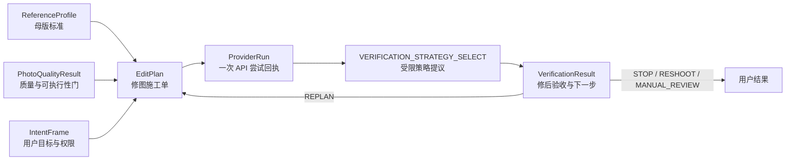

# 六个数据合同审析（`v0.4-frozen`）

> 更新：2026-08-29
>
> 当前状态：产品规则已冻结；Python `contracts.py`、可配置 Policy、SQLite 六类业务合同表、匿名运营事件账本和合同测试已经同步为 `v0.4`。`ProductEvent` 是运营账本，不是第七个图片处理合同，也不是训练 Dataset。<span style="color:#C00000"><strong>8C-1/8C-2 已落地：`VerificationStrategyProposal`、策略/出站字段、结构化目标证据、父子 `EditPlan`/`ProviderRun` 血缘和显式反馈事件均已接入。RAG P0-A/P0-B 已新增独立的 `rag_contracts.py`（不属于六个图片处理合同），P0-C 已把 `RagAdvisoryDecision` 受限回接到 8A/8C：本地 `KnowledgeItem/KnowledgeChunk/RagQuery/RagRetrievalResult`、`RagBadCaseRecord`、SQLite/FTS、可重建 dense 索引与脱敏检索 Trace 已实现；`EditPlan`/`VerificationStrategyProposal`/`VerificationResult` 只可保存来源引用，绝不把引用解释为外部/混合复测授权。</strong></span>
> 产品语义见 [PRODUCT_RULES.md](PRODUCT_RULES.md)，LLM 边界与完整 Prompt 见 [AGENT_PROMPTS.md](AGENT_PROMPTS.md)。

## 1. 合同解决什么问题

合同是模块之间的“统一交接表”。视觉模块、意图解析器、规划器、腾讯 Adapter、验证器、数据库和界面不能互相猜字段，而必须通过版本化合同传递事实。这样才能回答：用户说了什么、系统如何理解、为什么生成这组参数、API 是否真实执行、结果是否改善，以及失败发生在哪一层。



## 2. 六个合同的责任边界

| 合同 | 它回答的问题 | 产生者 | 主要消费者 | 绝不包含 |
|---|---|---|---|---|
| `ReferenceProfile` | “长期要对齐成什么样？” | 母版确认/特征模块 | 质量门、规划器、验证器 | 原图、EXIF、肤色/妆面档案、明文主体锚点 |
| `PhotoQualityResult` | “这张照片能不能稳定比较和处理？” | 确定性视觉工具 | 状态机、规划器、UI | 原图、LLM 猜测、审美结论 |
| `IntentFrame` | “用户当前到底要什么、允许什么？” | LLM 或模板解析器，经 Schema 校验 | 状态机、规划器、UI | 原图、API 成功回执、自由生成参数 |
| `EditPlan` | “针对这一张照片，准备怎么改？” | 确定性规划器 | 用户确认、Provider Adapter | 修改后结果、密钥、超出能力卡的假参数 |
| `ProviderRun` | “某一次外部调用实际上发生了什么？” | Provider Adapter 与计时/审计代码 | 验证器、Trace、成本与 Bad Case 模块 | Base64、Secret、签名 URL、LLM 猜测的成功结果 |
| `VerificationResult` | “实际有没有改善，下一步是什么？” | 确定性复测器 | 状态机、报告解释器、评测 | 未测量的改善、未经校准的用户概率、审美判断 |

## 3. 跨合同不可破坏的规则

1. 六个合同都必须包含 `contract_version`，新增/删除/改义字段必须升版本、写迁移说明并补测试。向后兼容的可选策略字段可以留在同一小版本，但必须增加明确的 schema migration 标记并补回归；本轮 `ConfirmationScope.subject_match_uncertain_acknowledged` 属于此类。
2. `ReferenceProfile.version`、目标照片哈希、最新 `IntentFrame.intent_id`、`PhotoQualityResult`、Provider Card 版本或权限范围任一变化，旧的未执行 `EditPlan` 都必须变为 `superseded`。
3. `EditPlan` 是不可变计划快照。对同一草案的确认会创建新 revision；修后继续则创建新的子 `EditPlan`（新 `plan_id` + `parent_plan_id`），两种情况都不能原地修改旧计划。
4. 每次真实外部尝试都产生独立 `ProviderRun`，记录不可覆盖。检查点 8B 的 `max_attempts_per_plan=1`，当前不允许在同一计划中自动重试；8C 若在已确认计划族内继续，必须创建新的子计划和新的 Run，以 `parent_run_id` 与上一结果图输入 hash 连回父回执，不能覆盖第一条失败证据。
5. `VerificationResult` 必须引用一个真实的 `ProviderRun`；API 成功只表示工具完成，不能直接推出效果达标。
6. 用户层相对变化和供应商绝对参数分开保存。腾讯绝对参数只能在官方允许的 0—100 范围内。
7. 任何执行确认都必须绑定明确作用域、约束快照和有效期。8B 的作用域绑定照片 hash、Profile 版本、可执行部位、显式参数和 10 分钟有效期；意图、照片、母版或计划实质变化后确认失效。
8. 原图、结果 Base64、密钥、确认 token、签名 URL、完整人脸向量和未脱敏自由文本不得进入合同 Trace 投影；8B 结果字节仅保留在当前浏览器会话内，数据库只存不透明的 `session_memory` 引用/哈希和生命周期事实。
9. LLM 输出必须先通过 Schema 和权限校验；状态机、视觉工具、规划器和 Adapter 的真实结果优先于 LLM 提议。
10. V0 不展示接受概率；交互弱标签和模型合成数据不得替代人工金标准。

### 3.1 RAG P0-A / P0-B / P0-C 的独立合同边界

RAG 的资料事实不能混进用户图片处理合同，也不能与运行账本混存，因此 P0-A 使用单独的 `core/rag_contracts.py`：

| 合同 | 它记录什么 | 绝不记录什么 |
|---|---|---|
| `KnowledgeItem` | 一份完整、版本化、已审核来源的标题、版本、生命周期、权威等级、Provider/operation、地区、Adapter/smoke 状态与内容 hash | 用户照片、原始网页全文、密钥、用户原话 |
| `KnowledgeChunk` | 从父来源拆出的能力/限制/权限/失败等原子事实，及其 feature/stage/出站要求 | 隐藏推理、自动参数、ProviderRun 回执正文 |
| `RagQuery` | 已校验的阶段、需要/允许部位、保留项、Provider/operation、人数/出站等结构化任务槽位 | 原始 prompt、Base64、脸向量、主体锚点、照片 URL |
| `RagRetrievalResult` | 安全路由、采用/未采用的 evidence、来源/版本/原因码、索引版本与耗时 | 可直接执行的授权、EditPlan、参数、隐藏思维链 |
| `RagAdvisoryDecision` | P0-C 对 `direct_evidence`、`reference_information`、`conflict_information` 的受限分类、非执行下一步和 baseline 降级事实 | 参数、确认 token、ProviderRun、`execution_authorized=true` |
| `RagBadCaseRecord` | 空召回、无直接证据、索引不可用、缺槽、硬冲突等脱敏诊断 | 原始 query、照片、模型推理、用户个人信息 |

`KnowledgeItem/KnowledgeChunk` 和用户运行账本是两个 SQLite 文件：前者的默认位置为 `storage/knowledge.sqlite3`，后者仍为 `storage/demo.sqlite3`。P0-B 另用 `storage/knowledge_vectors.sqlite3` 保存从当前审核 chunk 派生的归一化向量和文档 hash；它不是事实源，可由前者重建。P0-C 在知识账本中额外保存 advisory run/bad case 的脱敏投影。三者不能通过“检索命中”互相推导执行权限；P0-A/P0-B/P0-C 的完整 Trace 只保存结构化 query、来源引用、候选数量/排名、淘汰原因、模型/索引版本和路由，未读取照片或原始用户话术。

P0-C 的跨合同规则是：`EditPlan.knowledge_refs`、`VerificationStrategyProposal.knowledge_refs` 和 `VerificationResult.knowledge_refs` 都是版本化、去重的审核知识引用；它们说明“这一步参考了什么”，不说明“这一步被授权做什么”。发生 `conflict_blocked` 时规划器不得生成计划、现有 baseline 不得继续；发生 `unknown_stopped` 时 RAG 分支不得编造能力。仅在一个早已独立配置、且全部普通 Gate 已通过的 baseline 存在时，`baseline_degraded` 才可保持该 baseline 原样。

<span style="color:#C00000"><strong>【本轮耦合纠错】附件中的“意图 taxonomy”混合了用户意图、状态机状态和工具名。v0.4 将三者拆开：IntentFrame 只保存用户目标与约束；WorkflowState 决定当前允许做什么；Tool Registry 才包含 analyze_consistency、plan_edit、execute_beautify、verify_result 等工具。</strong></span>

## 4. `ReferenceProfile`：母版档案

### 4.1 核心字段

| 字段组 | 必需内容 | 说明 |
|---|---|---|
| 身份与生命周期 | `profile_id`、匿名 `user_id`、`version`、`status`、`created_at`、`updated_at` | 同一用户只有一个 active/geometry-only Profile；新版本成功后替换旧版本 |
| 特征引用 | `feature_snapshot_ref`、归一化五官/脸型摘要、每项测量状态与置信度 | 跨模块只传结构化摘要/不透明引用，不传原始关键点或完整向量 |
| 用户约束 | `allowed_features`、`blocked_features`、`preserve_attributes`、`adjustment_mode` | 妆面、肤色、背景等保留项不能只靠隐含默认 |
| 版本 | `profile_schema_version`、`extractor_version`、`canonicalization_version`、`consent_policy_version` | 复现同一套特征计算与同意规则 |
| 主体锚点 | `subject_anchor` 中的不透明加密引用、同意记录引用、访问策略、183 天保留、30/7 天提醒、撤回/删除截止时间和删除审计引用 | 单独同意、保存六个月、可删除、受限访问；不保存原图/向量/密钥 |
| Provider 映射 | 特征到 `executable/suggestion_only` 的能力映射、能力卡 ID 与版本 | 防止未来参数被当前工具假执行 |

### 4.2 不变量

- 不保存母版原图、文件路径、文件名、EXIF、肤色、妆面、身体和隐私部位；
- 用户撤回同意或六个月到期且不续期时，删除主体锚点并降级为几何特征对齐；
- 撤回时立即停止锚点访问；主存储删除截止为 24 小时、备份清理截止为 7 天，`delete_pending/deleted` 必须留下脱敏生命周期证据；
- 更换母版时，先完整建立新版本，成功后再删除旧特征正文；只保留脱敏审计事件；
- Profile 更新立即使关联的未执行计划和确认失效。

## 5. `PhotoQualityResult`：照片质量与可执行性门

### 5.1 核心字段

| 字段组 | 必需内容 | 说明 |
|---|---|---|
| 对象 | `quality_result_id`、`photo_id`、`photo_sha256`、`face_count`、`selected_face_ref` | 多脸时必须由用户选择目标脸；引用不包含图像数据 |
| 三类信号 | `subject_match_status/evidence`、`quality_confidence`、`editability_confidence` | 不把同一人物、照片质量和工具能力混成一个数字；供应商原始同人分不冒充校准概率 |
| 质量事实 | 姿态、清晰度、曝光、遮挡、完整性、表情、分辨率等 metrics/flags | 来自确定性视觉工具 |
| 内容安全证据 | status + provider/operation/version + policy version + receipt ref/RequestId | `passed/blocked` 必须对应一次可审计的真实检查；用户声明不能冒充机器结果 |
| 路由 | `REJECT_REUPLOAD`、`WARN_CONTINUE`、`CONTINUE`、`SELECT_FACE`、`SUBJECT_CONFIRMATION_REQUIRED` | 用户看到可解释原因；同人不确定不能静默执行 |
| 版本 | `analysis_version`、`subject_match_evidence.model/threshold_policy_version`、`routing_policy.policy_version`、`provider_card_id/version` | 阈值、主体模型或工具能力变化后仍可回放 |

### 5.2 当前路由

当前 Policy 阈值为 `≤0.50` 重新上传、`>0.50 且 <0.80` 警告后继续、`≥0.80` 继续。<span style="color:#C00000"><strong>该组阈值已冻结为只用于 quality/editability 两类内部置信度，并采用“最严格路由生效”；subject match 独立使用 match/uncertain/no_match，保存供应商原始分、分值范围、模型/阈值版本和回执。未完成授权样本校准前，`subject_match_confidence` 必须为空。</strong></span> `uncertain` 对应 `SUBJECT_CONFIRMATION_REQUIRED`：没有用户确认时规划器和执行器都必须阻断；用户明确确认“这是本人且我有权编辑”后，可把一次性布尔事实写入 `ConfirmationScope` 并在当前有界任务内继续，但不把状态改成 `match`、不更新长期主体锚点。`no_match` 永远硬拒绝。多脸自动隔离链路未实现前，运行时仍应拒绝或要求用户先裁剪，不能宣称已经只编辑所选脸。

### 5.3 第一位用户真实回执与新增字段

<span style="color:#C00000"><strong>2026-09-01 的真实 Cloud Trace 显示：母版和目标照的 IMS 均为 Pass，目标照 CompareFace 原始分 `56.231842041015625` 被路由为 `uncertain`；旧页面没有确认字段，8A 返回 `subject_match_not_confirmed` 与 `quality_route_not_continuable`，没有生成 EditPlan，也没有调用 BeautifyPic。修复后，`ConfirmationScope.subject_match_uncertain_acknowledged` 由页面一次性勾选生成，`edit_planner`、`confirm_execution` 和 `_ensure_execution_allowed` 共同校验并把该事实写入 Trace；测试覆盖“未确认阻断／确认后仅在当前 scope 继续／no_match 仍阻断”。</strong></span>

==<span style="color:#C00000"><strong>==检查点 6 接入边界：</strong>本地 `PhotoObservation` 先用 Pillow + OpenCV Haar 产生尺寸、清晰度、曝光、人脸数、眼睛可见性和粗粒度脸框/眼睛几何；它只在内存中存在，不直接写入六合同。腾讯 `CompareFace` 作为当前会话 1:1 同人 Adapter，输出 `match/uncertain/no_match` 和未校准原始分；腾讯 `ImageModeration` 作为内容安全 Adapter，`Pass` 才能放行，`Review/Block` 在 V0 都保守拦截。两类 Provider 结果必须附带独立 evidence 和 RequestId。`ReferenceProfile` v0 由单脸、通过安全且质量路由允许的母版生成，只保存归一化脸框/眼睛几何和版本字段。==</strong></span>==

截至 2026-08-28，CompareFace 已有成功 live receipt；ImageModeration 已分别获得服务开通后的真实 `Block` 和新授权照片的真实 `Pass`（RequestId `211483d5-4ee0-41e8-b5d5-156f81557a69`）。因此内容安全 Adapter 的真实回执与两条路由都有证据；单次 Provider 结果不代表完整内容安全覆盖。

## 6. `IntentFrame`：用户目标、约束和权限请求

### 6.1 输入与输出

输入是用户本轮自然语言、当前会话状态、已确认的 Profile 默认值和工具能力摘要；输出是经过 Schema 校验、可以持久化和回放的意图快照。它不直接调用工具，也不代表外部执行已经获准。

### 6.2 <span style="color:#C00000">【补充完成：意图识别字段】</span>

| 字段组 | 建议字段 | 为什么需要 |
|---|---|---|
| 追踪 | `intent_id`、`session_id`、`turn`、`supersedes_intent_id` | 用户改口后能够让旧计划和确认失效 |
| 核心意图 | `goal`、`route`、`action` | 分别回答为什么做、单张/批量、诊断/方案/执行等动作 |
| 对象范围 | `target_scope`、`reference_source`、目标照片/批次引用 | 避免“执行”却不知道针对哪张图 |
| 输出偏好 | `report/manual_parameters/edited_images` | 支持只看诊断、给参数、直接执行，但不把它们变成固定问卷 |
| 编辑约束 | `allowed_features`、`blocked_features`、`preserve_attributes` | 妆面、肤色、表情、背景等保留项不能遗漏 |
| 策略偏好 | `adjustment_mode`、`priority`、`requested_max_rounds` | 分开记录一致优先、少改优先、速度/成本偏好和用户请求轮数 |
| 批量策略 | `batch_failure_policy` | 单张失败时继续有效照片、停止全部或询问 |
| 长期偏好请求 | `preference_memory_request` | 用户说“以后默认”只形成待确认请求，不直接写长期 Memory |
| 解释与置信 | `field_sources`、`slot_confidence`、`intent_confidence`、`missing_slots`、`reason_codes` | 知道每个字段从哪里来、为什么追问 |
| 确认 | `confirmation_status`、`confirmation_scope`、确认引用 | 执行、删数据、更新母版和长期偏好都有明确作用域 |
| 模型追踪 | `parser_mode`、`model_provider/version`、`prompt_version` | LLM 或模板失败时可复现 |

### 6.3 澄清与路由规则

- 用户可以直接说目标，不先填固定问卷；解析器先生成 IntentFrame，再只问一个会改变路由、参数、权限或数据生命周期的缺失槽位；
- action=execute 高置信时可以直接进入“确认页面”，不能直接绕过确认调用 API；
- 快捷回复是候选，不是用户真实意图；只有点击/明确回复后才能写入字段；
- 明确取消立即取消；含糊时最多澄清一次，不进行挽留；
- “以后默认直接执行”只可保存为经单独同意的 Profile 默认偏好，仍不能免除新任务的有界执行确认；
- 三到五秒内先返回真实进度反馈；流式文本或闪动光标是 UI/NFR，不写进 IntentFrame 数据合同；
- LLM 失败时模板 fallback 仍输出同一个 Schema。

### 6.3.1 检查点 7：谁生成哪些字段

`DeepSeekIntentAdapter` 先验证一个**非持久化的候选信封**：`IntentCandidate + IntentClarification + user_summary`。它不是第七个业务合同，也不会进入 SQLite 作为新的事实表；它只是为了防止模型伪造系统字段的一层输入校验。

| 字段来源 | 本轮实现 | 为什么这样拆 |
|---|---|---|
| LLM / 模板候选 | `goal/route/action`、输出偏好、允许/禁止部位、保留项、偏好、缺失槽位、数值置信、原因码和一个澄清问题 | 这些是对用户文字的可审计理解，仍须 Schema 校验 |
| 确定性系统 | `intent_id/session_id/turn`、目标照片引用、文本 SHA-256、`parser_mode`、模型/Prompt 版本 | 模型不能编造身份、会话、追溯或版本事实 |
| 确定性确认桥 | 若候选为 `action=execute`，系统创建 `PENDING` 的 `ConfirmationScope/ref` | “想直接修”是意图，不等于外部编辑已获授权 |
| 状态机（后续） | 是否真的进入 `CONFIRM/PLAN/EXECUTE`，是否使旧计划失效 | Adapter 没有工具调用能力，不能绕过质量、安全、同人或确认门 |

本轮也加入“实质变化才 supersede”的确定性比较：同一任务重复解析不会无故废弃上一版；只有目标、范围、动作、约束或策略偏好发生变化时，新的 `IntentFrame.supersedes_intent_id` 才引用旧意图。

### 6.4 Intent 与 Workflow/Tool 的拆分

`review_reference/lock_profile/clarify/confirm/diagnose/plan/execute/verify/delete/unsupported` 更适合作为状态或允许动作，而不是全部塞入 intent 字段。建议状态机使用：

```text
REFERENCE_REVIEW → PROFILE_CONFIRM → INTENT_CAPTURE → CLARIFY
→ QUALITY_GATE → DIAGNOSE → PLAN → CONFIRM → EXECUTE → VERIFY
→ STOP / REPLAN / RESHOOT / MANUAL_REVIEW
```

==ReAct 风格 LLM 只能在当前状态的白名单里提议下一工具，状态机负责真正放行。==

## 7. `EditPlan`：一张照片的不可变施工单

### 7.1 核心字段

| 字段组 | 建议字段 | 说明 |
|---|---|---|
| 标识与依赖 | `plan_id`、`revision`、`parent_plan_id`、`session_id`、`profile_id/version`、`photo_id/hash`、`intent_id`、`quality_result_id` | 任何关键输入变化都能使计划失效 |
| 基线 | `baseline_feature_differences` 或引用 | 只保存修前差异；修后差异属于 VerificationResult |
| 可执行变化 | `executable_changes[]`：feature、user_delta、current_absolute、proposed_absolute、reason/evidence | 用户值和腾讯值分开；同一特征不能重复 |
| 手动建议 | `suggestion_only_changes[]` | Provider 不支持时给醒图等手动建议，不阻塞其他参数 |
| 腾讯快照 | 四个绝对参数全部显式存在 | 当前官方范围均为 0—100；美白/磨皮默认 0 |
| 约束 | `constraints_snapshot`、完整 `safety_policy` 快照、`provider_card_id/version`、预算/轮次上限 | 不让 LLM 临时发明安全上限 |
| 预期与风险 | `expected_directions`、`risk_notes`、`requires_confirmation` | 只描述方向，不承诺分数/概率 |
| 生命周期 | `status`、`confirmation_scope/ref`、`created_at`、`expires_at`、`superseded_reason` | 计划确认和失效可审计 |
| 版本 | `planner_version`、`mapping_policy_version` | 参数映射可复现 |

### 7.2 <span style="color:#C00000">【本轮技术纠错】</span>

- 腾讯 `BeautifyPic` 的四个绝对参数必须在 0—100；用户可以表达更大的相对愿望，但规划器必须截断/拒绝并解释，后台不能发送超界值；
- 参数强度、单次/累计上限和轮次由确定性 Safety Policy 决定，不能交给 LLM；
- “最多三轮”应作为 V0 可配置运行策略，而不是永久写死在 `RoundNumber` 类型；当前 `SafetyPolicy` 为最多 3 轮结果改变、连续 2 轮无改善提前停止，但检查点 8B 的单个已确认计划 `max_attempts_per_plan=1`；
- 取消“最多三个部位”的固定产品规则，但实际可执行参数数量仍受 Provider Card 限制；当前腾讯一次最多只有四个已声明参数；
- 在上一结果上继续时，以最近一张“已验证且有改善证据”的结果为新输入，并创建新的子 `EditPlan`；子计划有新 `plan_id`、`parent_plan_id` 和该结果图 hash，不能修改旧计划，也不能把上一轮腾讯参数当作持久滑杆累计；
- 附件提出的“修改前后的特征差异”不能同时放在执行前的 EditPlan。EditPlan 只放修前差异和预计改善方向，修后实测归 VerificationResult；
- 自动降低参数再尝试属于 `VerificationResult → REPLAN → 新 EditPlan`，不是在同一计划中偷偷改值；
- 用户只看简化方案；UI 展示工具步骤、参数依据和回执摘要，不展示隐藏思维链。

### 7.3 批量、成本与确认

- 每张可执行照片独立生成一张 EditPlan；批量规划可以并行，但失败照片不生成执行计划；
- 外部执行服从 Provider 限频、并发和预算策略；规划器可优先一次覆盖相互作用小的参数，不能以“省调用”为由突破安全上限；
- 确认作用域采用“当前照片/当前批次 + 当前 Profile 版本 + 当前计划的允许部位/显式参数 + 最多轮数”的有界授权。检查点 8B 不允许在确认页直接改参数：任何实质改口都必须产生新 IntentFrame/新 EditPlan 并重新确认。当前每个确认计划只允许一次外部尝试；8C-2 已实现：未改变作用域时，只有 `REPLAN + improved + cumulative_improvement`、当前结果图 hash 一致、期限/轮次都通过时，才可生成后继子计划继续使用计划族剩余轮次；每个子计划仍只允许一次 ProviderRun，且首次确认 scope 仍覆盖当前用途/Provider/照片/预算时，由确定性 preflight 后自动调用，不逐轮要求用户点击；scope 变化才重新确认。

### 7.4 检查点 8A 的实际规划不变量

`services/edit_planner.py` 是 `EditPlan` 的当前确定性生产者，遵循以下顺序：先验证 `PhotoQualityResult` 的内容安全、同人和质量路由，再从 `ReferenceProfile` 与目标照的内存特征计算 `FeatureDifference`，最后在既有 Provider Card 基线前消费可选的 P0-C advisory，再生成计划。它不接收图片字节、不调用 LLM 计算视觉数值，也不调用图片编辑 API。若 advice 是 conflict/unknown/manual-only，则确定性 preflight 阻断计划；若为 direct evidence，只附带 `knowledge_refs`，参数仍由 mapping Policy 决定。

- `face_width_height_ratio` 目标值高于母版时才允许候选 `FaceLifting`；
- `eye_area_mean_face_ratio` 只有恰好两只眼框时才可测量，目标值低于母版时才允许候选 `EyeEnlarging`；
- 眼距、构图占比和位置字段可记录为 `diagnostic_only`，不直接生成 Tencent 参数；
- 差异 `≤4%` 不生成自动变化；`4%—12%` 由 `mapping_policy_v0.1` 生成可配置强度；超过 `12%` 不无限叠加；
- 测量不可用、置信不足、用户禁改、Provider 方向不可达或前置门失败时，必须输出 `suggestion_only` 或阻断原因；
- 计划始终为 `proposed` 且 `requires_confirmation=true`，四个 Tencent 值显式存在，V0 美白/磨皮为 0；
- 计划的 `baseline_feature_differences` 只保存修前差异；修后事实只能进入 `VerificationResult`。

## 8. `ProviderRun`：一次真实 API 尝试的回执

### 8.1 <span style="color:#C00000">【补充完成：回执字段】</span>

| 字段组 | 建议字段 | 用途 |
|---|---|---|
| 关联 | `run_id`、`trace_id`、`session_id`、`plan_id/revision`、`photo_id`、`attempt_number`、`retry_group_id/parent_run_id` | 区分同一计划的多次尝试 |
| Provider | provider、operation、API/SDK 版本、region、endpoint、Provider Card ID/version | 复现供应商环境和能力 |
| 请求投影 | `idempotency_key`、`request_hash`、脱敏参数快照、输入 artifact 的不透明引用/hash | 防止重复扣费；不保存 Base64、原图或签名 URL |
| 权限 | `confirmation_ref`、`confirmation_scope`、`consent_policy_version` | 证明本次执行没有越权 |
| 状态 | queued/running/succeeded/failed/timeout/skipped/cancelled | 明确尝试阶段 |
| 真实回执 | `provider_request_id`、`result_artifact_ref/hash` | 成功必须具备；结果引用带 TTL/删除状态 |
| 时间 | queued/started/completed 时间、queue/network/total latency | 分析用户时延和供应商时延 |
| 成本 | estimated/actual cost、计费单位、预算策略版本 | 评估成本和批量任务预算 |
| 错误 | phase、category、provider code、脱敏 message、retryable、retry_after | 支持确定性重试和 Bad Case 归因 |
| 生命周期 | result expiry、deleted_at、delete_status | 避免结果图无限期保留 |

### 8.2 不变量与当前重试边界

- ProviderRun 由代码生成，LLM 不能创造 RequestId、耗时、成本或成功状态；
- 一次真实尝试一条 Run，记录不可覆盖；检查点 8B 的同一已确认计划只能有 `attempt_number=1`；
- 当前不对任何错误自动重试，包括超时、限频、网络和 5xx。参数错误、权限错误、内容安全、图片不支持同样不重试；8C-2 的合法后继调用不是重试：它使用上一轮结果图作为新输入、新的子计划/ProviderRun，并在首次确认的 scope 仍有效时由 Agent 受限自动触发；范围、用途、Provider、出境方、预算或确认失效时仍需新确认；
- 成功需要 RequestId、结果引用/hash、耗时和完成时间；失败/超时需要错误码、阶段和 `retryable`；
- `result_artifact_ref` 仅可为不透明的 `session_memory` 引用/哈希；结果图不是长期母版数据，不写入 SQLite、JSONL、Trace 或项目结果目录，浏览器会话结束或最多 10 分钟后不可用；
- Bad Case Prompt 只读取真实回执辅助分类，最终根因仍需规则或人工确认。

### 8.3 检查点 8B 的实际确认—执行不变量

1. 确认按钮是唯一把 `PENDING` 执行倾向变为 `CONFIRMED` 的入口；它由系统生成 `parser_mode=user_structured_input` 的 IntentFrame，LLM 无权生成确认、RequestId 或调用结果。
2. `confirmed` Plan 必须是原 `proposed` Plan 的新 revision，保留原草案；确认作用域 hash 与 Plan 中的 hash 必须一致。
3. 执行前必须重新比对确认期限、photo hash、Profile 版本、质量/内容安全/主体匹配门、参数范围和本地 idempotency key。任何一项失败都只记录阻断 Trace，不调用腾讯。
4. 本地 store 中已有同一 idempotency key 的 ProviderRun 时，重复点击被阻断。该机制不是跨进程/宕机恢复/供应商端 exactly-once 承诺，部署前需要另行评估。
5. Provider 成功只生成事实 `ProviderRun` 和当前会话内图像字节；不得写“已改善”或构造 `VerificationResult`，直到下一检查点的确定性复测器实际运行。

## 9. `VerificationResult`：修后验收和下一步决策

### 9.1 核心字段

| 字段组 | 建议字段 | 说明 |
|---|---|---|
| 关联 | `verification_id`、`session_id`、`profile_id/version`、`photo_id`、`plan_id/revision`、`provider_run_id` | 防止验错结果 |
| 实测差异 | `feature_comparisons[]`：before_gap、after_gap、change_direction、measurement_confidence | 来自确定性视觉工具，不由 LLM 补算 |
| 总体趋势 | improved/no_change/worsened/unverifiable | V0 不包装成一致性分数 |
| 质量与约束 | 修后 quality flags、禁改部位是否触发、结果 artifact 可用性 | 结果坏掉时不能继续宣称成功 |
| 循环状态 | `round_number`、`no_improvement_streak`、`safety_policy_version` | 支持三轮上限和两轮无改善提前停的候选策略 |
| 用户反馈 | accepted/rejected/not_provided、`label_source`、feedback reason | 只有显式反馈可作为人工标签；沉默只能是弱信号 |
| 概率 | 可选 `calibrated_acceptance`：probability + model/data/calibration version | V0 必须为空；只有校准 Gate 通过后才能出现 |
| 决策 | STOP/REPLAN/RESHOOT/MANUAL_REVIEW + reason codes + next state | 状态机执行，LLM 只解释 |
| 回退 | last_known_good_artifact_ref、rollback_reason | “回滚”是选择上一张可用结果，不是撤销外部 API |
| 版本 | verifier、extractor、threshold policy 版本和时间 | 复现验收规则 |

### 9.1.1 <span style="color:#C00000">8C-1/8C-2 已实现的扩展字段</span>

以下字段已在合同 `v0.4` 中实现，并由 `services/verification.py` 生成；它们记录建议、事实和边界，但不授予工具权限：

| 字段组 | 拟增加字段 | 作用 |
|---|---|---|
| 策略事实 | `VerificationStrategyProposal`、`verification_strategy`、`strategy_proposal_ref`、`strategy_reason_codes` | 记录允许集合、选中的复测方式和原因；当前选择器是确定性 baseline |
| 知识证据 | `knowledge_refs[]` | P0-C 已可把 direct evidence 的版本化来源引用写入 `EditPlan`、策略提议或 `VerificationResult`；引用仅说明“参考了什么”，绝不等于参数、权限或 external/hybrid 工具授权。reference/conflict 不可被写成执行依据 |
| 出站与授权 | `data_outbound`、`additional_consent_required` | 记录当前策略是否会再次发送图片，以及现有确认 scope 是否覆盖该出站；若未覆盖才需要额外同意，不能把同一有效 scope 内的每一轮误报为新授权 |
| 复测工具 | `verification_run_refs[]`、`verification_artifact_refs[]` | 当前本地复测不冒充外部 Run；真实外部复测后再填入事实引用 |
| 计划族 | `plan_family_id`、`previous_verification_id`、`cumulative_improvement`、`target_evidence_sufficient` | 支持三轮路线的证据接口和当前轮是否有结构化目标证据 |
| 保持项 | `preserved_attributes_verified` | 当前为 `false`，妆面/肤色/背景没有被自动验证，避免过度承诺 |

这些字段不能由 LLM 自己填写为事实；`strategy_proposal_ref` 是候选建议，真实 `verification_run_refs` 必须来自执行器/验证器。当前代码使用本地几何/人工复核白名单；P0-C 可给提议层附带受限 `knowledge_refs`，但不能替换白名单、出站/权限 Policy 或 Adapter。

### 9.1.2 8C-1 的验证语义

`services/verification.py` 先调用本地 `observe_result_bytes` 解码并提取同一套归一化几何，再以 `measurement_tolerance=0.01` 判断改善/无变化/变差。所有本轮 `EditPlan.executable_changes` 都有可测修前/修后证据且修后 gap 不超过 `target_gap_tolerance=0.04` 时，设置 `target_evidence_sufficient=true`，允许 `CLOSE/GOAL_MET`；这不是概率，也不跳过用户反馈。没有可比较结果走 `RESHOOT/INPUT_NOT_COMPARABLE`；变差要求 last-known-good，否则降级 `MANUAL_REVIEW`。

### 9.1.3 8C-2 的计划族与反馈语义

`services/plan_family.py` 不是另一个“会自己修图的 LLM”。它先核验上一轮真实 `ProviderRun` 成功、`VerificationResult` 为 `REPLAN + improved + cumulative_improvement=true`、当前结果图 hash 与回执一致、无质量标记、原确认仍在 10 分钟范围内且还有轮次；全部成立才生成新的子 `EditPlan`。子计划的 `photo_sha256` 是上一轮结果图的 hash，`parent_plan_id` 指向上一计划；后续 `ProviderRun.parent_run_id` 和 `input_artifact_ref/hash` 指向父回执。下一轮腾讯参数由 `followup_mapping_v0` 依据剩余可测 gap 生成 2—6 的新输入图单次强度，绝不是“上一轮强度 + 本轮强度”。如果首次确认 scope 仍覆盖照片、用途、Provider、预算和轮次，页面会写入自动 preflight/trigger Trace 并直接调用；用户不需逐轮点击，最终停止/达标后再统一展示结果和反馈入口。

点赞、点踩和文字评论以单独的 `UserFeedback`/`ProductEvent` 事实记录。点赞为明确接受；点踩为明确拒绝；文字评论是强反馈但其满意度状态保持 unknown，原话不落 SQLite/JSONL/Trace，只保留 hash。点踩或文字评论都关闭当前计划族；若用户要继续，必须回到 IntentFrame 重新表达目标，不能用自由文本直接绕过作用域和参数规划。

### 9.2 <span style="color:#C00000">【本轮技术纠错】</span>

- V0 明确不显示、也没有经过校准的接受概率，因此不能以“真实概率达标”作为当前停止条件；Demo 只能依据逐特征实测趋势、质量/安全门和用户显式接受作出定性决策；
- 点赞/点踩和明确文字反馈可以形成显式标签；关闭页面、没有追问、打开新窗口只能是 `interaction_weak`，不能自动推断满意；
- 图片本身质量不足时走 RESHOOT/重新上传，不继续提高参数；API 瞬时失败由 Provider Retry Policy 处理，不由验证器无限规划；
- 结果变差时保留原图/上一张已验证结果为 last-known-good，新计划不得沿同方向继续；
- “最多三轮”和“连续两轮无改善停止”可以同时成立：前者是总执行上限，后者是更早触发的停止条件，二者都属于可配置 Safety Policy；8C 后续轮要创建新的子 plan/ProviderRun，不能在同一 plan 上重试；
- MANUAL_REVIEW 只有存在真实测试负责人/队列时才能使用；V0 可标记 `manual_review_required` 并由项目开发者处理，不能向用户虚构在线客服或运营团队；
- 用户不满意时先澄清一个具体差异；只有仍在允许部位、确认作用域和安全预算内才 REPLAN，否则解释产品边界。

### 9.3 四类用户结果与状态机结果

用户界面可以保持四类结果：拒绝并重新上传、直接执行并复测、给参数手动调整、只看诊断。它们是任务入口/用户结果，不应全部塞入 VerificationResult。VerificationResult 只负责执行后的 STOP、REPLAN、RESHOOT、MANUAL_REVIEW；诊断和手动参数路径不会产生 ProviderRun，也不应伪造 VerificationResult。<span style="color:#C00000"><strong>8C 额外记录策略选择证据和计划族轮次；初次确认已覆盖的范围内可以产生后继子计划并受限自动执行，但每个计划仍只有一次 ProviderRun，且每次自动调用都必须有可回放的 preflight、trigger、scope、hash 和结果 Trace。</strong></span>

## 10. 运营事件账本：不作为第七个图片处理合同

`ProductEvent` 与六个合同并行存在，作用是让产品团队知道真实使用路径发生了什么，而不是替代任一视觉、计划或验证事实。每条事件只保存匿名用户 ID、session、阶段、事件类型、证据强度、路径结果、相关合同引用、原因码和时间；它不保存照片、原文、人脸几何、向量、Provider 请求体或密钥。

| 信号类型 | 典型事件 | 可得出的结论 | 不能得出的结论 |
|---|---|---|---|
| 强意图 | 首次提交 Prompt、同一匿名用户的新会话、追问 | 用户主动表达任务或继续使用 | 用户满意或修图有效 |
| 强反馈 | 点赞、点踩、明确结果评论 | 用户明确表达的正/负反馈或待归因意见 | 通用人群满意率、模型准确率 |
| 弱行为 | 退出、沉默、重新上传 | 某个路径可能中止或遇到阻塞 | 用户不满意；需结合“已要求重传”等上下文才可标记路径中止 |
| 运行事实 | 建档、计划展示、确认、Provider 成功、复测 | 漏斗和 API 调用实际发生 | 修图质量、用户接受或 PMF |

本地 SQLite 已建立 `product_events` 和匿名 session 映射，管理员 Dashboard 只聚合累计会话、建档、意图、工具成功、复测、显式反馈、重传、WAU/MAU 等运行指标。当前代码会自动写入 session、建档、Intent、Provider 成功、Verification 事实及 8C-2 的点赞/点踩/文字反馈事件；结果页文字只写 hash，不能把结果展示误写成满意度数据或训练真值。<span style="color:#C00000"><strong>后续真实受邀测试还要补 Profile 建立率、首次成功修图率、7/30 日回访、会话完成率、失败后重传率和明确满意/不满意比例；退出/沉默必须依据上下文记录为路径中止或 unknown，不能默认拒绝。</strong></span> 长期行为事件、留存含义和 Dataset 抽取仍需在后续真实受邀测试中另行校准。

## 11. 关键耦合规则：已冻结

以下规则会改变用户体验、成本或权限，已在 2026-08-27 至 2026-08-28 由用户逐项确认：

1. <span style="color:#C00000"><strong>执行确认：</strong>采用一次确认授权“当前照片/批次 + 明确允许部位 + 当前 Policy 最大轮次”的有界计划族；扩大范围、启用美白/磨皮、换照片/母版或超预算必须重新确认。“以后默认执行”只预选路径，不取消确认。</span>
2. <span style="color:#C00000"><strong>停止规则：</strong>V0 没有校准概率，采用用户显式接受、质量/安全阻塞、当前 Policy 总轮次上限、无改善提前停止或结果变差为停止条件；当前配置是最多 3 轮、连续 2 轮无改善，逐特征 tolerance 要等 benchmark 后才能宣称“系统达标”。</span>
3. <span style="color:#C00000"><strong>多脸执行：</strong>产品负责选择、隔离、裁剪、回贴和复测；腾讯接口没有目标脸参数且会处理最多五张最大人脸，因此该链路未完成前拒绝多脸或要求先裁剪。自动链路失败时解释原因并要求用户裁剪。</span>
4. <span style="color:#C00000"><strong>人工复核：</strong>Beta 仅承诺“标记待开发者复核”，由项目负责人查看脱敏 Trace；未经照片单独授权不人工查看原图，也不宣称存在客服团队。</span>
5. <span style="color:#C00000"><strong>三类判断信号：</strong>0.50/0.80 只用于 quality/editability，并采用最严格路由；subject match 独立输出 match/uncertain/no_match，保留原始证据但不冒充概率，并在有授权样本后校准阈值。</span>
6. <span style="color:#C00000"><strong>8B 计划编辑与确认：</strong>确认页不改滑杆；实质改口产生新 IntentFrame/新 EditPlan。确认绑定当前照片 hash、Profile、参数、允许部位和 10 分钟有效期。</span>
7. <span style="color:#C00000"><strong>8B 回执与重试：</strong>每个确认计划只允许一次外部尝试；超时/网络错误不自动重试，结果图仅当前浏览器会话内存展示/下载，不进入持久化账本。</span>

这些规则已经进入 `contracts.py`、`core/policies.py`、SQLite schema、执行服务和自动化测试。

## 12. `v0.4-frozen` 落实结果

| 原问题 | `v0.4-frozen` 结果 | 状态 |
|---|---|---|
| `RoundNumber` 永久限制 1—3 | 正整数 Schema 可扩展；当前 3/2 停止门保存在版本化 `SafetyPolicySnapshot` | 已实现并测试 |
| IntentFrame 只有单一 `confidence` 和少量槽位 | 已增加对象范围、输出/保留偏好、字段来源/置信、替代关系和有界确认 | 已实现并测试 |
| EditPlan 最多 3 个 delta、含 `expected_index_gain` | 已取消部位硬上限和指数；分 executable/suggestion-only；计划冻结不可变 | 已实现并测试 |
| ProviderRun 缺 attempt、能力卡、确认、错误分类、TTL | 已增加完整单次尝试回执和 Artifact 生命周期 | 已实现并测试 |
| 确认后可能重复调用、结果图落盘或自动重试 | 8B 新增确认 scope/hash/10 分钟期限、局部 idempotency key、`max_attempts_per_plan=1` 和 `session_memory` 结果生命周期 | 已实现并测试；非分布式 exactly-once |
| VerificationResult 使用 before/after/index_delta | 已改为逐特征实测、趋势、用户反馈和策略决策 | 已实现并测试 |
| SQLite 只存 IntentFrame 与 ProviderRun 投影 | 已增加六合同表、迁移标识和 Profile 特征正文删除审计 | 已实现并测试 |
| 用户行为、满意度和产品运行混在开发日志里 | 新增匿名 `ProductEvent`、证据强度与 Dashboard 聚合；不把弱行为当满意度 | 已实现并测试 |
| 主体锚点没有可审计的撤回/删除期限 | 新增版本化保留策略、撤回/主存储/备份截止字段和删除审计引用 | 合同已实现；真实加密/worker 待开发 |

## 13. 当前工程边界

当前真实运行能力包括基础设施、DeepSeek 文本 IntentFrame Adapter（及本地 template fallback）、本地脱敏 Trace、质量门/Profile v0、CompareFace 成功 live smoke、ImageModeration 的真实 `Block` 与另一张授权照片的真实 `Pass` 回执，以及检查点 8A 的严格双眼测量、逐特征诊断和确定性 `EditPlan` 草案。`Block` 样本仍必须停止，不能伪造为 `PASSED`；`Pass` 只证明一张样本可以进入后续门，不代表完整内容安全覆盖。Adapter 已离线验证 JSON/Schema/错误降级和 Trace，并完成一次固定文本的真实 live receipt（`parser_mode=llm`、`schema_validated=true`）。8B 已实现用户确认后的单次图片执行 Gate：确认产生系统结构化执行意图，执行器校验 scope/hash/期限/Gate 后调用 Adapter 一次，并持久化脱敏 ProviderRun；结果字节只保留在当前会话内。8C-1/8C-2 已实现会话内结果的本地观察、逐特征趋势、策略提议、`VerificationResult` 脱敏落账、父子计划/回执血缘、三轮上限拦截、用户可见下一轮执行和点赞/点踩/文字 hash 反馈。RAG P0-A/P0-B/P0-C 已实现本地知识合同、SQLite/FTS、3 张来源卡/10 条规则、本地 dense/RRF/rerank、模型缺失 sparse fallback、安全检索路由和对 8A/8C 的受限 evidence 回接；`execution_authorized=false`，不能改变工具权限。另有 RAG Dashboard 只读知识账本的脱敏聚合，不新增合同字段或外部执行能力。尚无新的 UI 真实多轮图片回执、真实视觉改善证据、真实 AES-GCM 主体锚点/TTL/delete worker、多脸隔离、external/hybrid 复测、自动 RAG worker/新 Provider 或 LLM 自由动态策略。SQLite 当前保存六类独立审计投影，RAG 知识库另行保存审核知识/advisory/bad-case 脱敏投影，向量索引只保存可重建派生数据；三者均由测试强制，完整跨会话状态恢复仍待部署前 Gate。

## 14. 本模块的实际验收案例与 Trace

合同回归覆盖的代表案例：

1. quality=0.90、editability=0.70 时采用更严格的 `WARN_CONTINUE`；
2. subject match 不确定时，即使照片质量高也进入独立确认；
3. 多脸先选择目标脸，隔离失败后转为 `REQUIRE_USER_CROP`；
4. 第 4 轮对当前三轮 Policy 被拒绝，但对显式五轮的未来 Policy 合法，证明轮次未写死在类型中；
5. 腾讯不支持的唇厚可以 suggestion-only，但不能伪装成当前 Provider 的 executable change；
6. 连续两轮无改善后禁止 REPLAN；开发者复核查看原图必须有独立授权引用。
7. `geometry_only` Profile 不得携带 active 或 `delete_pending` 主体锚点，避免“已降级”却仍可使用敏感主体特征。
8. 同一匿名用户的两个 session 可聚合为 WAU/MAU；Dashboard 事件行不暴露匿名用户 ID。

六合同落库测试实际产生的事件顺序为：

```text
session_created
→ product_event(session_started)
→ photo_quality_result_saved
→ intent_frame_saved
→ product_event(intent_submitted, strong_intent)
→ edit_plan_saved
→ provider_run_saved
→ product_event(provider_succeeded)
→ verification_result_saved
→ product_event(verification_completed)
→ redaction_probe
```

2026-08-29 的 P0-C 收尾全量 `.venv/bin/pytest -q` 曾实际得到 `106 passed, 4 warnings`；Dashboard 增加安全聚合回归后，当前全量为 `107 passed, 4 warnings`；四条均为既有 Pillow 弃用警告。8C-2 额外验证：子计划有新的 `plan_id`/父血缘与当前结果 hash；子轮运行只以父结果图为输入并写入 `parent_run_id`；首次确认 scope 内自动触发且 `execution_trigger=auto_bounded_followup`；scope 发生变化时在调用前阻断；明确点踩在调用前阻断；三轮上限阻断；文字反馈只保留 hash。RAG P0-A 的 9 条测试额外验证：来源导入幂等、已支持/未接入能力、多人限制、保持项、同人/安全语义、出站拒绝、缺槽、过期、硬冲突和注入式知识均不会放大执行权限。P0-B 的 6 条测试额外验证：稀疏+dense+rerank 路径、语义补召回、向量索引复用、模型缺失回退、缺槽短路、出站拒绝与知识注入仍不扩大执行权限。P0-C 与 Dashboard 的 5 条测试额外验证：G01 直接证据不可授权、G09 全量冲突来源阻断、未知能力停止并落 bad case、既有 baseline 只能原样降级，以及 Dashboard snapshot/catalog 不返回 source body、raw query、照片或密钥。测试同时继续验证六类表各有一条合同记录、迁移标识存在、Intent turn 可递增，以及确认引用和输入 artifact 引用不会出现在 JSONL。检查点 6 新增了真实 Pillow/OpenCV 解码与指标测试、Provider request 构造/失败测试、Profile v0 特征抽取和临时 SQLite 纵向切片测试；检查点 7 额外验证无密钥不联网、脱敏出站、JSON/HTTP 失败 fallback、系统字段所有权、执行倾向仍需确认、意图更新和提示注入式非法字段拒绝，并以固定文本完成一次真实 DeepSeek Schema receipt；检查点 8A 额外验证严格双眼可测/不可测、映射容差、不可达方向、用户禁改和计划 Trace；8B 额外验证确认新 revision、会话内结果不落 Trace、过期/换图不调用、timeout 不重试和取消不产生回执；8C-1 额外验证本地观察、策略 allow-list、改善/达标/变差/不可比较四类路由、last-known-good、外部出站同意约束和 VerificationResult 脱敏落账。CompareFace 已在 IAI 服务开通、CAM 权限补齐后完成一次真实同图 smoke，返回原始分 100（仍不作为用户分数）。ImageModeration 的前三次授权失败、服务开通后的真实 `Block` 和新授权照片的真实 `Pass` 回执都保留在 API Gate/Provider Card 文档；`Pass` 只证明单样本允许路由。

## 15. 2026-08-30 新增评测与候选 Provider 合同（不扩张六合同）

Gold Set evaluator/Judge 输入和新 Provider Adapter shell 是独立的工程合同，不属于六个图片处理合同，也不改变 `IntentFrame`、`EditPlan`、`ProviderRun`、`VerificationResult` 的职责边界：

- `rag_gold_eval.py` 只接收 answerless public/holdout case 和脱敏预测；输出指标、逐题状态和阈值 Gate。它不读照片、向量、原始文本、密钥、hidden 答案键，也不调用任何 Provider。`PENDING` 只表示尚无 predictions；当前 deterministic public prediction 已评分为 `FAIL`，不能被误写为 `PENDING` 或通过。
- `rag_gold_private_score.py` 是产品负责人私有目录中的 aggregate-only 辅助 scorer：私有 key 只在本机内存解析，输出不得包含题目、case ID、Gold、私有 key 路径、原始文本、图片、向量或逐题错误；不调用 LLM、Provider 或网络。若 key 的 `must_not` 是自然语言而非 canonical event ID，hard-safety 必须显示 `MANUAL_REVIEW_REQUIRED`，不得伪造 `PASS`。
- Blind Judge 输入只允许题干、系统输出和从真实预测派生的安全机器摘要；Judge 不能补 Gold、授权工具或生成 ProviderRun。当前 fake Judge 仅作结构检查，live Judge 明确未实现。
- 火山美颜 API V2.0 与腾讯特效移动/PC 细项的 candidate request 只保存 hash/计数/参数名称等脱敏元数据；Card、License、权限、预算、真实 receipt、Gold 回归和产品冻结未齐前，它们的 Adapter 只能返回 blocked/not_run，绝不发送图片。腾讯特效 Web 另有独立 `EffectWebRequest`：图片只进入浏览器桥接，不进入 Python/SQLite/Trace；其 Card 仍是 candidate，必须经过 Browser Receipt 和人工准入，不能由这条合同自动获得主流程权限。

2026-08-30 当前全量回归为 `144 passed, 4 warnings`；Ruff、compileall 和 `git diff --check` 已随本轮收口再次通过。当前 public/holdout 的 aggregate Gate 均为 `FAIL`，上述新增合同与六个业务合同并行，不把评测结果或候选 Card 误写为线上图片处理能力。

## 16. 2026-08-30 Failure Analysis / Dashboard 合同边界

failure-pattern 分析是评测报告层，不是六个业务合同的新字段。`build_failure_analysis()` 的输入限于 public cases、public annotations、redacted predictions 和可选的 private aggregate；输出限于版本、指标、错误类型、证据级别、候选差值、SOP 和安全布尔事实。它不得接收或输出 hidden answer key、隐藏题干/逐题 Gold、照片、人脸向量、密钥、原始用户文本、完整 Prompt 或 Provider 请求体。

`rag-correction-candidate-v0.1` 是独立实验 profile：候选预测和 Trace 必须与现役 baseline 分开生成，`active_baseline_changed=false`、`promotion_decision=not_promoted_proposal_only`；候选不得写入 `IntentFrame`、`EditPlan`、`ProviderRun`、`VerificationResult` 的执行字段，不得授予 `execution_authorized`。只有产品负责人批准并完成公开安全回归后，才可另开版本化规则变更。

`RagReportArtifact` 是显式 allow-list：Dashboard 只读取 `reports/` 目录下登记且已生成的 HTML，不递归发现任意文件；当前登记公开评测、隐藏聚合、failure-pattern 和 optimization-loop 四份报告。看板是只读的，不提供应用候选、调用 Provider、改写知识库或删除答案键的动作。

## 17. 2026-08-30 评测治理合同补充

Gold evaluator 的 `CaseScore` 现在同时保存三种 Precision：固定 `precision_at_k`、覆盖式 `precision_at_k_effective` 和返回式 `precision_at_k_returned`，并保存 `gold_evidence_count` 与按条数分层的聚合结果。固定口径继续兼容旧报告和项目 Gate；新增口径只能解释稀疏 Gold 与返回噪声，不能授予通过。

hard-safety 事件由 `rag-safety-events-v0.1` 的确定性字典归一化。已知 legacy label 或 `RAG_EVT_*` canonical ID 可比较；未知 label 进入 `MANUAL_REVIEW_REQUIRED`，不做模糊匹配。`data/evaluation/rag_safety_event_catalog_v0.json` 是公开词表，私有答案键仍由产品负责人单独确认，事件 ID 本身不携带题干、照片、向量、密钥或答案路径。

Holdout A 的运行合同仍只允许 `case_id + query`。v2 包及 aggregate 是历史诊断；v3 模板位于 `data/evaluation/rag_gold_v3_holdout_runtime.template.json`，空模板不能产生质量分数。正式 v3 答案键必须在工作区外保管，aggregate 输出不得包含逐题 case、题干、Gold 或私有路径。

## 18. 2026-08-30 最新评测治理状态

本文件中较早章节保留当时的测试快照；当前同步状态以本节及第 21 节为准：历史幂等修复快照为 `160 passed, 4 warnings`，当前全量回归为 `178 passed, 4 warnings`。Precision C、Holdout A、Safety ID C 已冻结并实现；public/failure 报告已用显式 predictions 重跑，v2 hidden 仍为历史 aggregate，v3 已完成一次性 answerless 盲测，未知安全标签仍进入 `MANUAL_REVIEW_REQUIRED`。腾讯 ImageModeration 的 UI 失败回执只保存 `error_code`/`provider_request_id` 等脱敏事实，不改变任何合同放行条件。这些评测合同不改变 RAG `execution_authorized=false`、候选 Provider fail-closed 或图片执行权限。

本地合同落账还要求“相同合同唯一键 + 相同脱敏投影”才可幂等复用；如果质量结果 ID、计划 ID+revision 或验证 ID 已存在但投影发生变化，写入必须 fail-closed 并返回可识别的 `ValueError`，不得覆盖旧证据或暴露底层 SQLite 唯一键异常。`LocalTraceStore` 的回归测试覆盖了质量置信度和 `photo_id` 变化两种冲突路径。

## 19. 2026-08-30 部署与候选 Provider 当前合同边界

本节不新增业务合同，只固定当前运行包的可追溯边界：

- GitHub 私有仓库 [`z1834691-coder/portrait-consistency-agent`](https://github.com/z1834691-coder/portrait-consistency-agent) 的 `main` 已包含当前代码、测试、审核 Provider Card 和文档；`.env`、照片/结果图、SQLite/JSONL、模型缓存、隐藏答案和本机报告由发布面排除。
- Community Cloud 只是 Private/受邀短期演示入口；它的 URL、Secrets、访问名单和 Cloud 存储不构成六个业务合同中的生产持久化、跨会话锚点 TTL 或删除 SLA 证据。
- 火山美颜 V2 的 candidate request 仍只能返回 `blocked/not_run`；官方“需要购买支持后付费 API 的创点套餐”与“公开 SDK 年包起价”只属于准入/预算事实，不会生成 `ProviderRun`，不改变 Tencent-only V0 执行链。

本轮没有修改 `ReferenceProfile`、`PhotoQualityResult`、`IntentFrame`、`EditPlan`、`ProviderRun`、`VerificationResult` 的字段职责；代码、测试和文档交叉检查保持一致。

## 20. 2026-08-30 评测与 License 状态同步

本轮仍没有修改六个业务合同的字段或职责。产品负责人已审核通过 `rag-safety-events-v0.1` 公开事件目录；v3 Holdout 题目、答案键和审核表在项目工作区外以 `OWNER_REVIEW_DRAFT` 保存，尚未进入 evaluator 或运行合同。正式 Holdout 运行继续只接受无答案的 `case_id + query`，答案键不得写入合同表、Trace、部署包或公开报告。

腾讯 Web 测试 License 已在控制台创建并显示“正常”，绑定精确 Cloud 主机名。License Key/Token 属于外部敏感凭据，不进入 `ProviderRun` 或任何合同字段；它只证明 Web License 资源状态，不改变 RAG `execution_authorized=false`、ProviderRun 必须由真实 Adapter 生成或候选 Provider fail-closed 的边界。

## 21. 2026-08-30 RAG 生命周期审计合同补充

本节新增的是 RAG 治理合同，不替换六个业务合同。`RagLifecycleItemAudit` 表示一张已入库知识卡的安全元数据检查结果（来源、版本、审核/复审时间、状态、原子规则条数和问题代码）；它不携带来源正文、照片、向量、用户文本或密钥。`RagIndexAudit` 表示派生 dense 索引与当前有效原子规则数量是否一致；索引只是可重建派生物，SQLite 知识账本仍是唯一权威来源。`RagLifecycleAudit` 是一次完整、不可变的审计快照，汇总条目问题、索引状态、审计版本、时间和脱敏 Trace。

审计的确定性规则是：过期、撤回或冲突待审条目不得继续作为有效证据；尚未生效或候选未发布条目只能保持 hold；到期复审、缺少来源 URI 或零原子规则只生成 `review_required`；干净且在有效期内的条目才是 `keep_active`。审计服务的两个不变量固定为 `auto_status_change_allowed=false` 与 `auto_publish_allowed=false`：它只能发现和报告，不能自动改状态、发布、删除、重建索引或授权工具调用。

持久化表 `rag_lifecycle_audits` 只保存 `audit_id`、`as_of`、结构化审计快照、脱敏 Trace 和创建时间；报告注册表只允许 `reports/rag_lifecycle_audit.html`。因此“实时”不是后台偷偷改知识，而是产品负责人或受控任务显式触发一次审计，再决定是否人工更新 Provider Card/Policy，更新后重新建索引并回归。RAG 仍保持 `execution_authorized=false`，该合同不改变图片出站、Provider 白名单、参数边界或六个业务合同。

## 22. 2026-09-01 RAG 优化报告合同补充

本轮新增的是评测/治理报告，不是六个图片处理合同的新字段。`rag_optimization_loop_v0.1` 的输入只允许 public dev/challenge cases、公开 annotations、脱敏 predictions 和可选的 private aggregate；输出包括版本、逐题结构化错误代码、候选代次、Rubric 指标、Composite、anti-overfit、停止原因，以及 v3 聚合模式的“观察事实 / 可验证假设 / 下一份 Holdout 证据”。逐题报告不复制原始题干，只保存 public `case_id`、split、标签、题干 SHA-256、证据数量和错误代码；v3 只允许保存 aggregate pattern，且三类计数不视为互斥。

每个候选的 Trace 必须由运行器真实生成，并明确 `hidden_answer_key_read=false`、`network_called=false`、`provider_api_called=false`、`llm_called=false`、`photo_or_face_vector_read=false`、`active_baseline_changed=false`。候选不能产生 `ProviderRun`、编辑参数、权限或图片出站；没有产品负责人批准，候选不替换现役 baseline。Composite 仅为 Dashboard 比较分，固定 project Gate 与 hard-safety 仍是权威门槛。

`RAG_OPTIMIZATION_RUBRIC.md`、`RAG_OPTIMIZATION_PROGRESS.md`、`reports/rag_optimization_loop_v1.json/.html` 和 page 5 共同构成该治理报告的可回放证据。Holdout A 继续有效：同一 v3 不重复正式运行，逐题答案不得进入合同、Trace、Prompt 或候选代码；再次正式验收必须新建独立 Holdout v4。

## 2026-09-01 当前 v3 Holdout 与 UI 证据状态

v3 Holdout 的最终运行合同已按 Holdout A 执行一次：answerless runtime 只允许 `case_id + query`；私有答案键只在产品负责人控制的工作区外用于 aggregate-only 评分，不进入六个业务合同、Trace、应用或公开报告。本次 36 题预测无缺失，hard-safety 0/36 违规（PASS），但质量 project Gate=`FAIL`（Route=30.56%、Recall@5=59.72%、MRR=77.78%、nDCG@5=63.81%、evidence relation=23.61%）。

该评测结果不改变 `RagAdvisoryDecision.execution_authorized=false`、Provider 白名单、图片出站或六个业务合同的字段职责。8C-1/8C-2 的 child plan/run/hash 和同 scope 自动续跑仍有代码/fixture 证据；真实 UI 多轮图片回执必须由产品负责人在 Private Streamlit 页面亲自产生，不能用 fixture 或离线合同记录冒充。

## 23. 2026-09-01 Cloud 重放下的合同落账幂等规则

第一位用户的 Cloud 页面出现 `ImageModeration request failed` 后，运行日志定位到 Streamlit 重跑时重复插入 `photo_quality_results.quality_result_id` 的底层唯一键异常。该异常属于运行账本写入问题，不是内容安全结果，也不能用“接口失败”一概替代。

因此六类合同的落账实现新增一条共同规则：同一业务唯一键再次提交时，只有在脱敏投影完全一致的情况下才幂等复用；如果上下文或事实内容发生变化，必须返回可识别的合同冲突并保留旧记录。重复复用可写 `*_reused` 诊断事件，但不得重复完成类产品事件。该规则让 Streamlit 重放可安全恢复，同时保持“证据不可覆盖、ProviderRun 必须来自真实 Adapter、IMS 仍 fail closed”的边界。

## 2026-09-01｜腾讯特效 Web Provider 合同扩展

`TencentEffectWebParams` 与 `ProviderRun` 的联合校验已经加入合同 `v0.4`。它与 `TencentBeautifyParams` 分开：前者是浏览器 Web SDK 的 `0..1` 浮点字段（`lift/shave/eye/chin/whiten/dermabrasion`），后者是 Python `BeautifyPic` 的 `0..100` 整数刻度。`ProviderRun.provider=tencent_effect_web` 时，`operation` 必须是 `WebARImage`，`request_params` 必须是 Web 参数合同；反之仍拒绝。

`EffectWebRequest` 只携带不透明输入引用、输入 hash、参数和 Card 版本；图片 data URL 仅作为一次性组件载荷，不进入持久化合同。`EffectWebBrowserReceipt` 只允许状态、request 引用、输入/输出 hash、尺寸、SDK 版本、耗时和安全错误；成功必须有输出 hash/尺寸，失败必须有 `error_code/safe_error`。它的 `receipt_id` 是本地浏览器桥接回执，不冒充 Tencent REST `RequestId`。`ProviderRun` 成功时结果生命周期为当前浏览器会话的短 TTL，数据库只存脱敏投影。

`EffectWebAdmissionInput/Decision` 是无副作用的准入合同：它把 License、精确域名、出站/区域、预算、Adapter、真实 smoke 和产品批准分开检查。所有证据齐全只产生 `promote_after_review` 建议，不能自动改 Provider Card 或授予图片出站权限。详见 [TENCENT_EFFECT_WEB_ADAPTER.md](TENCENT_EFFECT_WEB_ADAPTER.md)。

## 24. 2026-09-01｜失败驱动 RAG Loop v2 合同边界

本轮新增的 `rag_query_compiler_candidate.py`、`rag_failure_driven_loop.py` 和 28 题开发/挑战集属于评测治理合同，不是六个图片业务合同的字段扩展。候选输入是开发集中的自然语言 query，输出是受限的 `Prediction`、结构化 failure code、指标、Trace 和 promotion decision；它不能输出 `ProviderRun`、编辑参数、权限或图片。

Loop 的不变量是：每代只改一个可解释变量；必须记录 `changed_prediction_count`；`0` 条改变必须标记为 no-op；必须同时运行 dev/challenge 和既有 public regression；必须保留 hard-safety、project Gate、anti-overfit 和网络/LLM/Provider/hidden-answer 布尔回执。V2 的 22 条改变只证明 owner-review 开发集的工程改善，不能替换 active baseline。

28 题及 annotations 的状态是 `owner_review_required`；v3 Holdout 仍按 Holdout A 只可使用 aggregate，不得读取或重复运行逐题答案。合同与 RAG advisory 边界一致：`execution_authorized=false`、Provider 白名单、权限、参数上限和六个业务合同均不受候选影响。只有产品负责人审核 annotations 并用全新独立 Holdout v4 通过质量/安全 Gate 后，才可讨论 promotion。

### 24.1 当前一致性校验

2026-09-01 全量 `.venv/bin/pytest -q` 为 `178 passed, 4 warnings`；Ruff、format、compileall、`git diff --check` 及失败驱动 Loop、P0-A/P0-B/advisory/lifecycle/8C/8C2 smoke 均通过。4 条 warning 是既有 Pillow 弃用提示。该结果只证明合同实现与测试/报告一致，不代表 RAG project Gate 通过或改变六个业务合同的执行权限。

失败驱动报告的 `final_candidate_diagnostics` 额外保存 28 道公开题的 V0/终态诊断；它只包含 case ID、标签、错误码、路由和安全布尔事实。逐题解释见 [RAG_FAILURE_CASE_REVIEW_V2.md](RAG_FAILURE_CASE_REVIEW_V2.md)，不含 v3 私有答案，也不扩展任何执行合同。

## 2026-09-01｜Tencent Effect Web 运行合同状态

`TencentEffectWebParams`、`EffectWebBrowserReceipt` 与 `ProviderRun` 联合合同已在本机和 Cloud
构建中加载成功。Cloud 曾因旧进程缓存旧模块而报导入错误，Reboot 后已恢复；这只证明合同能被
部署加载，不是图片处理成功。由于 Cloud 尚缺三项 Effect Web Secrets，本轮没有 Browser Receipt，
因此不能把 `tencent_effect_web/WebARImage` 写成已执行或已验证的 ProviderRun。

继续保持以下合同不变量：Token 不进入浏览器或 Trace；图片 data URL 只在组件短时载荷；数据库
只接收脱敏 receipt；`candidate` Card 不能制造执行权限；单次成功回执必须携带输入/输出 hash、
尺寸、SDK 版本和耗时，失败必须携带安全错误码。补齐 Secrets 后才可运行一次官方示例图并落一条
真实 Browser Receipt。

## 2026-09-02｜Browser Receipt 与 Streamlit 重跑关联合同补充

page 6 的 Browser Receipt 可能在组件事件后触发一次完整 Streamlit 重跑。请求合同因此不能在每次
脚本执行时随机生成新的 `request_ref`：同一输入图片、输入 hash、参数、输入来源和 Card 版本组成一
个非敏感 request fingerprint，同一代次在重跑期间必须复用 `request_ref`；只有输入或参数变化才开启
新代次。签名时间可以刷新，但 `reset_token` 只标识请求代次，不能因时间刷新而清空浏览器组件状态。

后端仍以 `EffectWebBrowserReceipt.request_ref` 和 `input_sha256` 双重校验为事实边界。旧代次回执、
换图回执或 hash 不一致的回执必须安全忽略，不得写入 `ProviderRun`；同一代次的真实回执才可进入
ProviderRun 幂等保存。Session state 只保存脱敏 request 合同/fingerprint，不保存图片 data URL、
输出图或 Token。这项修复解决的是组件重跑造成的关联错位，不改变 Card 仍为 `candidate`、RAG
`execution_authorized=false` 或真实 Web 准入清单。

## 2026-09-02｜V3 validation 诊断合同补充

V3 的原始 Holdout-A answerless 运行合同仍保持“一次性、不可重跑”的历史快照；产品负责人明确授权后，另建 `rag-v3-validation-unlocked-2026-09-02` 验证合同。验证合同的输入是 36 个 `case_id + query`，另有已审核 annotations；它只供离线诊断，不被在线 RAG、Prompt、Provider 或现役 baseline 读取。

每个 G0–G5 代次必须输出逐题 `Prediction`、失败码、根因/SOP、评分、查询投影和完整安全 Trace。Trace 允许保留题干/Gold 是因为这是负责人授权的内部 validation 报告，但仍不得含照片、向量、密钥或隐藏链路；必须明确 `network_called=false`、`llm_called=false`、`provider_api_called=false`、`photo_or_face_vector_read=false`。`RagAdvisoryDecision.execution_authorized` 继续为 `false`，诊断候选不得写入六个业务合同或生成 `ProviderRun`。

当前最终 G3 保守候选的 validation Route=100%、Evidence relation=97.22%、Recall@5=100%；G2 虽为 100% 但因 public regression 退化而不采纳，G4/G5 无增益。固定 Precision/project Gate 仍 `FAIL`，hard-safety `PASS`；只能用新建且与 V3 不重叠的 V4 Holdout 讨论 promotion。

## 2026-09-02｜Tencent Effect Web 真实重试合同证据

真实重试已证明稳定 `request_ref` 能正确关联浏览器回执；腾讯 Web SDK 随后返回失败回执（SDK
鉴权错误码 100），未产生输出图。该失败仍按 `EffectWebBrowserReceipt` → `ProviderRun` 合同入账，
不允许用页面状态或模型判断替代真实回执。

失败回执之后组件必须可重试，服务端必须拒绝 URL 形式 `TENCENT_EFFECT_APP_ID`，页面只能展示
脱敏 `error_code/safe_error`。原始 SDK 错误对象、License Token、图片 data URL 和密钥不进入
合同持久化或 Trace；Card 继续 `candidate`，直到数字 APPID 修正后取得成功回执并完成准入清单。
