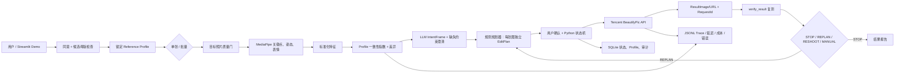

# 母版人像一致性 Agent｜项目启动蓝图 <span style="color:#C00000">v0.5（冻结 MVP·智能澄清/RAG 可演进版·9/4 提交版）</span>

> <span style="color:#C00000"><strong>更新日期：2026-08-26</strong></span>（初版决策：2026-08-24）
> 决策：**Conditional GO（调整承诺后启动）**
> 项目定位：一个面向本人照片的「母版一致性诊断—最小修图建议—复测迭代」C 端产品，不是身份认证系统，也不是“接满技术名词”的 Demo。
> 证据边界：本文中的指标门槛、权重、用户数和版本路线都是待验证的产品方案，不是已经取得的结果。
> <span style="color:#C00000"><strong>本次更正｜2026-08-25：</strong>增加 2026-09-04 腾讯产培生提交硬截止。执行模式改为“截止日前 Demo-first，提交后再补用户和生产化证据”。</span>
> <span style="color:#C00000"><strong>本次更正的证据边界：</strong>9 月 4 日交付的是可运行原型与宣传演示，不写成已上线、已生产化、已经过大样本用户验证。</span>
> <span style="color:#C00000"><strong>本轮更新｜2026-08-26：</strong>冻结 V0 的自然语言意图澄清、IntentFrame、RAG 分阶段路线和后续 LLM 评测；三选一只作为低置信 fallback/执行确认。</span>
> <span style="color:#C00000"><strong>本次冻结补充：</strong>产品正式保留两条主通路：①单张照片对母版；②同组照片选一张母版后批量统一。9 月 4 日完整演示单张通路，批量通路用同一套能力做小规模 smoke case；两条通路都属于产品定义，不再把批量一致性写成可有可无的附加功能。</span>
> <span style="color:#C00000"><strong>本轮冻结覆盖旧决策：</strong>核心目标由“相似度/自然不自然”改为“母版人像一致性”；执行主路径由“醒图手动参数或未来 SDK”改为“后端调用腾讯云 BeautifyPic，执行后复测”。醒图只保留为手动兜底，不再是 V1 的默认执行器。</span>
> <span style="color:#C00000"><strong>本轮新增冻结：</strong>“三选一”不再是 Agent 的智能核心，只保留为低置信度时的快捷回复和执行前确认。V0 采用“自然语言表达目标 → LLM 生成结构化 IntentFrame → 只追问缺失约束 → 用户确认 → 工具执行”的澄清方式；后续可接多轮上下文、Provider RAG 和模型评测，但不改变确定性视觉工具、参数规划器和复测器的权责边界。</span>
> <span style="color:#C00000"><strong>标注说明：</strong>红色为本次 deadline-first 与双通路冻结更正；黑色为仍然保留的长期产品和技术蓝图。</span>

---

## 0. 先给最终判断

这个项目值得做，而且比再做一个信息推送或通用聊天助手更能补你的 AI 产品经理缺口。它天然具备：

- 真实而具体的 C 端任务；
- 多模态输入和可解释输出；
- 明确的成功/失败终点；
- 很丰富的 bad case；
- 用户可见的产品交互与信任问题；
- 数据库、API、工具、状态、监控、成本和隐私的真实工程约束；
- 可以持续迭代的外部 outcome：用户按建议操作后的照片，是否真的更接近母版。

本轮冻结三个判断：

1. **核心不是身份相似，也不是“自然不自然”，而是母版一致性。** 用户建立一套自己的 Reference Profile，Agent 让单张或一组照片分别接近这套标准。姿态、表情和画质只用于可比性判断，不用来定义“美”。
2. **“一致度指数”只是诊断辅助，不是产品承诺。** V0 可以显示 0—100 的实验性母版一致性指数，但主 CTA 是“诊断—执行—复测”，不再把“90%”当作默认目标。用户可以选择保守、标准或一致优先三种调整强度。
3. **9 月 4 日主执行器冻结为腾讯云 BeautifyPic。** 它是后端真实 HTTP/API 调用，支持 `FaceLifting`、`EyeEnlarging`、`Whitening`、`Smoothing`；系统用自己的 UI 增量值映射到腾讯 API 的绝对强度值，并在 API 返回后复测。唇厚、眼距、鼻翼等细项留给获得授权后的腾讯美颜特效 SDK；醒图不做 API 依赖，也不做 RPA。

最终产品名称冻结为：

> **母版人像一致性 Agent：帮助用户建立自己的长期人像标准，并将单张或整组照片分别调整到这一标准。**

一句话产品承诺：

> 用户先确认母版和调整边界；Agent 判断单张/批量任务，为每张照片生成不同的编辑计划，调用图片编辑 API，复测真实结果，并对失败照片重新规划或建议重拍。

---

## <span style="color:#C00000">0.1 腾讯产培生截止日重置：先交付可演示闭环</span>

<span style="color:#C00000"><strong>截止日：2026 年 9 月 4 日。</strong>从 8 月 26 日开始到截止日还有 9 个日历日；按包含首尾计算为 10 个日期，其中 9 月 3 日应留给录制，9 月 4 日只用于 QA 和提交。不再按“先完成全部用户验证，再开发 App”的顺序执行。新的优先级是：<strong>先保住一条真的、可点击、可计算、可复测的产品闭环；再保证视频和备份；最后才加技术名词和非核心功能。</strong></span>

<span style="color:#C00000"><strong>提交规则边界：</strong>本文的 60—90 秒是作品演示建议，不是已核验的腾讯官方格式。开工当天必须在提交页面核对并截图保存时长、文件大小、格式、链接权限和截止时刻；官方字段与本文冲突时，以官方页面为准。</span>

### <span style="color:#C00000">9 月 4 日必须拿到的三件东西</span>

1. <span style="color:#C00000"><strong>可运行 Demo：</strong>本地或可访问网页中跑通“候选母版检查 → Reference Profile 锁定 → 目标照上传 → LLM 结构化意图澄清（快捷回复兜底） → 差异诊断 → 腾讯云 BeautifyPic 执行 → 修后图复测 → STOP/REPLAN”。</span>
2. <span style="color:#C00000"><strong>60—90 秒演示视频：</strong>即使现场网络或部署失败，评审也能完整看懂用户问题、产品闭环、AI 分工和当前边界。</span>
3. <span style="color:#C00000"><strong>可追问证据包：</strong>README、架构图、5—10 个 smoke case、1 个失败 case、1 条 Agent trace、当前未实现/未验证列表。</span>

### <span style="color:#C00000">Demo 的 Definition of Done</span>

- <span style="color:#C00000">不是 Figma 点击原型；上传新照片后必须真实运行人脸检测、特征提取和差异计算。</span>
- <span style="color:#C00000">至少能稳定演示 1 条 Happy Path，并正确处理“图片不可比”和“修后 Profile 指数下降”两条失败路径。</span>
- <span style="color:#C00000">至少有 1 张没有参与调参的 holdout 目标照，用来证明不是对演示素材硬编码输出。</span>
- <span style="color:#C00000">若演示批量通路，至少用 2—3 张同组照片证明每张有独立 plan、达标图会停止、异常图会隔离；不把这个 smoke case 写成已完成规模化批处理。</span>
- <span style="color:#C00000">同一组输入在同一算法版本下的 Profile 指数和计划完全一致；LLM 断网时仍可用模板解释完成核心流程。</span>
- <span style="color:#C00000">演示页明示“实验性母版一致性指数，不是身份概率；腾讯云参数是本次执行的绝对值，用户看到的是相对调整量；不承诺一次达到 90”。</span>
- <span style="color:#C00000">演示完成后可删除会话；原图默认不进入 LLM，不为了赶截止日放弃隐私底线。</span>

### <span style="color:#C00000">9 月 4 日前明确砍掉/延后</span>

- <span style="color:#C00000">公开获客、宣传投流和正式用户增长；</span>
- <span style="color:#C00000">大样本人工校准、90 分阈值的统计有效性和正式 A/B 实验；</span>
- <span style="color:#C00000">LangGraph、长期 Memory、向量数据库和完整 RAG pipeline；截止日前保留可追溯的结构化 Provider Card 检索，不把它包装成完整 RAG。</span>
- <span style="color:#C00000">登录、支付、多租户、正式云存储、高可用部署和复杂 dashboard；</span>
- <span style="color:#C00000">醒图自动操控、手机 RPA、未授权 SDK/API 和通用图像生成式重绘；腾讯云 BeautifyPic 是本次已选定的后端执行器。</span>
- <span style="color:#C00000">所有非核心 UI、多人合照、大规模批量处理、分享社区和商业化；批量主通路只保留 2—3 张照片的 smoke case，用于证明逐张规划和异常隔离。</span>

<span style="color:#C00000"><strong>判断标准：</strong>一个体量小但真实运行的闭环，比一个只在 PPT 上拥有 RAG、多 Agent、Memory 和数据飞轮的大系统更适合这次截止日。</span>

---

## 1. 为什么它匹配你的求职目标

我按你提供的两份诊断文档和 `c/` 中 9 张 benchmark 图检查后，得到的结论不是“把所有技术都接上”，而是“用一个窄任务形成完整证据闭环”。

### 1.1 它能补什么

| 目标缺口 | 本项目的补强潜力 | 必须留下的证据 |
|---|---:|---|
| C 端用户任务与体验 | 5/5 | 问题访谈、真实任务、无引导可用性录像、退出原因 |
| 多模态产品判断 | 5/5 | 视觉质量门、分项诊断、模型不确定性和拒答 |
| 用户反馈驱动迭代 | 5/5 | 每版反馈、失败样本、改动和回滚记录 |
| Agent 编排 | 4/5 | 诊断→计划→执行/等待→验证→重规划的状态轨迹 |
| 数据库与状态 | 4/5 | 母版版本、会话、参数计划、迭代结果、权限隔离 |
| API / 工具调用 | 5/5 | 视觉工具、评分器、参数优化器、编辑预览/执行器 |
| 评测与 bad case | 5/5 | person-disjoint holdout、人工校准、失败 taxonomy |
| 稳定性、成本、延迟 | 4/5 | p50/p95、错误率、重试、每次成功任务成本 |
| 隐私与安全 | 5/5 | 单独同意、最短保存、删除、加密、访问审计 |
| RAG | 2/5 | 只适合版本化 provider/SDK 能力卡，不适合核心诊断或参数计算 |
| 大规模增长/商业化 | 2/5 | 个人项目只能做小样本真实验证，不能冒充规模化 |

### 1.2 它不能补什么

- 大厂百万用户、正式线上 A/B、跨部门资源协调；
- 真正的 SLA、灰度发布和商业事故责任；
- 基座模型、训练数据和推理平台经验；
- 只靠一个项目获得的统计显著增长或留存结论。

当前阿里 2027 届官方 AI 应用岗位把需求定义、Prompt/RAG/Agent 选型、数据飞轮、评测实验、稳定性、成本、监控和人工接管放在同一条交付链里；这印证了你需要展示“端到端闭环”，不是 API 数量。[阿里巴巴 2027 AI 应用岗位](https://campus-talent.alibaba.com/campus/position/199903540003?deptCodes=AT1LW3%2C9SQM5Z)

### 1.3 对 benchmark 的正确借鉴

`c/` 中两个项目真正值得借鉴的不是架构图密度，而是：

| Benchmark | 真正强的证据 | 本项目该怎样迁移 |
|---|---|---|
| AI 客服 | 有真实商户；功能来自用户共创；连续发版；因为成本和店铺隔离问题重构；覆盖差评申诉、文件发送等非 Happy Path | 找真实修图用户；每 5 个用户做一次失败归因；记录一次因为效果、隐私或成本做出的范围收缩 |
| SecondBrain | 有独立 App/灵动岛入口；主动找资讯；同一 harness 能建技能、定时任务、记忆和修改界面 | 做“上传—诊断—执行—复测”的原生任务界面；让 Agent 改变照片结果或下一步动作，而不只生成报告 |

两张漂亮架构图和一段“用了很多模型”的说明，仍然不能证明产品有效。你的作品集必须让面试官看到：用户是谁、哪次失败、为什么改版、真实 outcome 是什么。

---

## 2. 产品定义：先把任务做窄

### 2.1 第一目标用户

不用按性别、年龄或“爱美”定义，按行为定义：

> 每月会处理 5 张以上本人照片；已经有一张最满意的“母版”；在意社交主页、写真组图或个人形象中的脸型/五官一致；愿意授权工具执行，但不想逐张试错参数。

候选种子人群：

- 小红书/朋友圈持续发布本人内容的轻量创作者；
- 有毕业照、求职照、约会头像、旅行九宫格等一组照片要处理的人；
- 摄影社、妆造工作室、个人摄影师的高频客户；
- 会使用任意修图工具、但不愿为每张照片反复试参数的人。

<span style="color:#C00000"><strong>第二个核心场景（与单张通路并列）：同组照片统一。</strong>照相馆写真、毕业照、旅行九宫格或一次拍摄产生 8—9 张照片的用户，会先从这一组中选一张最满意的照片作为母版，再要求其他照片都修成同一个“自己”。这不是多人合照，也不是把所有照片套同一个滤镜，而是对每张照片分别诊断、执行和复测。</span>

### 2.2 Job to be Done

> 当我准备发布另一张本人照片时，我想让它符合我已经确认的母版人像标准；我希望 Agent 先说明差异，再按我的调整边界直接处理并验证结果，而不是让我凭感觉来回拉滑杆。

<span style="color:#C00000"><strong>同组照片 JTBD：</strong>当我一次拍了 8—9 张写真或一组社交照片时，我想选出一张满意的脸作为母版，让 Agent 为每张照片计算自己的差异和参数，逐张执行并验证；我希望看到哪些照片已完成、哪些需要人工确认或无法处理，而不是对整组照片盲目套同一套参数。</span>

### 2.3 不做清单

V1 明确不做：

- 不做人脸库、陌生人搜索、身份认证或 1:N 检索；
- 不评价“美丑”、不生成医美结论；
- 不建议改变种族、年龄、性别等敏感特征；
- 不承诺“改完一定达到 90%”；
- 不自动发布照片；
- 不允许上传未获授权的他人照片；
- 不做多人合照；
- 不用 LLM 直接看图后凭感觉打分；
- 不保存原图作为默认设置。

### <span style="color:#C00000">2.3.1 母版确认阶段与 Reference Profile</span>

<span style="color:#C00000">候选母版不能上传后自动锁定。用户必须先确认“这张照片是否代表我以后想保持的版本”，再生成 `Reference Profile`：</span>

1. <span style="color:#C00000">上传候选母版，运行质量门和可比性检查。</span>
2. <span style="color:#C00000">Agent 用报告告诉用户：这张母版的姿态、表情、画质是否适合作为长期参照，以及哪些部位可能需要先调整。</span>
3. <span style="color:#C00000">用户二选一：`直接锁定`，或 `先调整母版`。未经确认，Agent 不得修改或替换母版。</span>
4. <span style="color:#C00000">锁定后生成 Profile 版本；后续照片都对齐 Profile，而不是直接对齐原图像素。</span>

`Reference Profile` 保存以下内容，而不是默认永久保存原图：

```json
{
  "profile_id": "rp_001",
  "version": 1,
  "feature_vector": "encrypted_or_local_reference",
  "allowed_features": ["eye_enlarging", "face_lifting"],
  "blocked_features": ["skin_tone", "age", "gender"],
  "adjustment_mode": "balanced",
  "max_rounds": 3,
  "created_at": "2026-08-25T00:00:00+08:00"
}
```

调整模式冻结为：

| 模式 | 含义 | 默认约束 |
|---|---|---|
| 保守 `preserve_original` | 少改、优先保留目标照原貌 | 每轮最多 1—2 个参数，强度上限低 |
| 标准 `balanced` | 一致性与改动幅度平衡 | 每轮最多 3 个参数 |
| 一致优先 `consistency_first` | 允许更明显地向母版靠拢 | 仍受部位禁改、强度和轮数上限限制 |

### 2.4 用户完整流程

1. 用户阅读人脸信息处理说明并单独同意。
2. 上传候选母版，完成母版质量检查与母版确认；用户选择“直接锁定”或“先调整母版”。
3. 系统生成 `Reference Profile`，保存版本化特征、允许/禁止部位、调整模式和最大轮数。
4. 用户选择任务：`单张照片` 或 `一组照片`。
5. <span style="color:#C00000">用户可以直接用自然语言描述目标，例如“把这一组都修成第一张的脸，但不要太假，先给我看看”；Agent 从上下文中解析任务、范围、风格和是否授权执行。</span>
6. <span style="color:#C00000">澄清策略只追问当前缺失且会改变结果的约束：调整哪些部位、是否允许瘦脸/肤色妆面、最多执行几轮；高置信意图不重复询问，低置信意图才展示快捷选项或请求用户改写。</span>
7. 质量门检查目标照片；不可比时建议重拍或换母版，不强行生成参数。
8. <span style="color:#C00000">视觉工具提取特征并计算母版一致性指数、分项差异和置信度；LLM 解析用户意图并解释结构化结果，不改写视觉数值。</span>
9. 规划器基于差异、Profile 约束和腾讯 API 能力，生成每张照片独立的 `EditPlan`。
10. 用户确认后，后端调用腾讯云 BeautifyPic；返回处理图、`RequestId`、provider 版本和耗时。
11. 验证器对处理结果重新提取特征并复测；Agent 选择 `STOP`、`REPLAN`、`RESHOOT`、`MANUAL_REVIEW` 或 `CLOSE`。
12. 用户可删除会话；原图、临时结果和派生特征按 TTL 或删除请求清理。

### <span style="color:#C00000">2.4.1 智能澄清协议：自然语言优先，快捷选项兜底</span>

<span style="color:#C00000">Agent 不把“只看诊断 / 给参数 / 直接执行”当成固定问卷，而是把它们作为可被自然语言表达的三个任务意图。用户说“帮我把这组写真修成第一张那样，脸要一致但保留原来的妆”，系统应解析为“批量对齐 + 允许脸型/五官 + 禁止妆面 + 需要执行”；用户说“先告诉我哪里不一样”，系统应解析为“只诊断”。</span>

<span style="color:#C00000">LLM 只生成结构化 `IntentFrame`，不直接调用编辑工具：</span>

```json
{
  "goal": "align_to_profile",
  "route": "batch",
  "action": "execute",
  "allowed_features": ["face_lifting", "eye_enlarging"],
  "blocked_features": ["skin_tone", "makeup"],
  "style": "preserve_original",
  "max_rounds": 2,
  "needs_confirmation": true,
  "confidence": 0.86,
  "missing_slots": []
}
```

<span style="color:#C00000">澄清策略：</span>

- <span style="color:#C00000"><strong>高置信：</strong>复述“我理解为……”，只确认会造成外部图片修改的授权，不重复问用户已经表达过的约束。</span>
- <span style="color:#C00000"><strong>中置信：</strong>只问一个最影响结果的缺失问题，例如“你更希望保留原图妆面，还是也统一妆面？”然后更新 `IntentFrame`。</span>
- <span style="color:#C00000"><strong>低置信：</strong>给一个自然语言示例和快捷按钮作为 fallback；三选一只在这里出现，或作为执行前的最后确认，不作为主交互。</span>
- <span style="color:#C00000"><strong>安全边界：</strong>任何“直接执行”的理解都必须在真正调用腾讯 API 前由用户明确确认；LLM 不能从“帮我看看”“可以吗”等模糊表达推断授权。</span>
- <span style="color:#C00000"><strong>上下文边界：</strong>LLM 读取用户文本、Profile 约束、质量门结果和结构化差异，不读取原图，不推断年龄、性别、健康、种族或美丑。</span>

### <span style="color:#C00000">2.5 冻结后的两条主通路</span>

<span style="color:#C00000"><strong>通路 A｜单张照片对母版（9 月 4 日主演示）：</strong></span>

1. <span style="color:#C00000">用户锁定或更新 `Reference Profile`，确认允许调整的部位、调整模式和最大轮数。</span>
2. <span style="color:#C00000">上传一张目标照片后，Agent 优先理解用户自然语言；若用户没有表达清楚，才用快捷选项补齐“诊断、参数或执行”意图，并继续确认是否允许瘦脸、是否调整肤色/妆面等边界。</span>
3. <span style="color:#C00000">质量门通过后，系统输出母版一致性指数、分项差异和最多 3 个动作；不可比时给重拍建议，不强行生成参数。</span>
4. <span style="color:#C00000">用户选择“直接帮我执行”时，后端调用腾讯云 BeautifyPic；不是调用醒图，也不是手机 RPA。用户选择其他两项时，系统分别输出诊断或带 provider 映射的参数计划。</span>
5. <span style="color:#C00000">腾讯云返回处理图后，验证器重新计算实际结果；Agent 只能根据真实增益选择 STOP、REPLAN、RESHOOT 或 MANUAL_REVIEW。</span>

<span style="color:#C00000"><strong>通路 B｜同组照片批量统一：</strong></span>

1. <span style="color:#C00000">用户上传母版和 8—9 张照片，或从这一组中选定一张作为母版；系统先完成母版确认阶段，再锁定 Profile。</span>
2. <span style="color:#C00000">Agent 检查整组质量，找出最接近和最偏离母版的照片，并按“已达标 / 可执行 / 建议重拍 / 需人工确认”分组。</span>
3. <span style="color:#C00000">所有照片共享同一个 Profile 目标，但每张照片独立计算差异、生成不同的 API 参数值；禁止复制同一组滑杆到 9 张图。</span>
4. <span style="color:#C00000">用户确认后，批量执行器逐张调用腾讯云 BeautifyPic，记录每张照片的 `plan_id`、绝对参数、`RequestId`、结果和错误；一张失败不阻塞其他照片。</span>
5. <span style="color:#C00000">逐张复测后输出“已完成 / 需人工确认 / 无法处理”清单，用户可以只接受部分结果或删除整组会话。</span>

| 冻结决策 | 单张通路 | 批量通路 |
|---|---|---|
| 母版 | 长期个人母版，可更新版本 | 该组中用户选定的一张；可先诊断再确认 |
| Agent 重点 | 澄清意图、给最小方案、等待修后复测 | 选择/检查母版、逐张规划、处理离群和失败 |
| 执行粒度 | 一张目标照一轮最多 3 个参数 | 每张照片独立计划，不能无脑套参 |
| 结束条件 | 达到个人目标、停止或转人工 | 整组完成、部分接受或列出需重拍/人工项 |

---

### <span style="color:#C00000">2.6 为什么这里需要 Agent，而不是普通修图 App</span>

<span style="color:#C00000">如果产品只是“上传两张图→输出一个分数→生成一张图”，它本质上是视觉算法加编辑器，不需要 Agent。Agent 的价值必须落在下面这些只有在任务不确定、跨步骤和需要用户授权时才成立的工作上：</span>

- <span style="color:#C00000"><strong>意图澄清：</strong>理解用户自然语言中的目标、范围、风格和授权；只追问会改变结果的缺失约束，快捷选项仅作为低置信 fallback 和执行前确认。</span>
- <span style="color:#C00000"><strong>任务路由：</strong>选择单张通路还是批量通路；遇到侧脸、遮挡、低清或母版不合格时，路由到重拍、换母版或人工处理。</span>
- <span style="color:#C00000"><strong>最小计划：</strong>把视觉差异转成受约束的 1—3 个动作，并解释预期作用、风险和不确定性。</span>
- <span style="color:#C00000"><strong>工具编排与权限：</strong>用户确认后调用腾讯云 BeautifyPic，检查 provider 能力、绝对参数、幂等键、`RequestId` 和结果回执；不能把“工具没调用成功”说成已修图。</span>
- <span style="color:#C00000"><strong>结果验证与重规划：</strong>读取真实修后图重新计算，决定停止、回滚、换方向、重拍或转人工。</span>
- <span style="color:#C00000"><strong>批量异常处理：</strong>让已达标照片直接停止，让离群照片单独处理，让失败照片保留原因，不因一张失败而污染整组。</span>
- <span style="color:#C00000"><strong>可控记忆：</strong>记住 `Reference Profile` 版本、禁改区域和用户确认过的约束；不把原图、敏感推断或未同意的偏好写进长期记忆。</span>

<span style="color:#C00000"><strong>边界：</strong>关键点提取、质量门、母版一致性计算、参数映射和结果验证必须由确定性工具完成；LLM 只负责澄清、解释、路由和生成下一步结构化动作。若没有澄清、授权、跨步骤状态、真实 API 调用、复测和重规划，这个项目就应诚实地称为“视觉修图 workflow”，而不是 Agent。</span>

---

## <span style="color:#C00000">3. 母版一致性怎么计算｜覆盖旧“相似度/90%”设计</span>

### 3.1 四个概念必须分开

| 概念 | 要回答的问题 | 在产品中的作用 |
|---|---|---|
| 身份 | 是否可能传错了人 | V1 让用户自我确认；不做身份认证、不做 1:N 搜索 |
| 可比性 | 两张图是否适合比较和编辑 | 质量门：清晰度、单人、遮挡、姿态、表情、曝光 |
| Profile 一致性 | 目标照的脸部特征是否接近用户锁定的母版标准 | 诊断、排序、执行前后对比 |
| 用户接受 | 用户是否认为已经达到自己的标准 | 最终停止条件之一，不把指数当成客观美丑 |

Google MediaPipe Face Landmarker 可输出 478 个三维关键点、52 个 blendshape 表情系数和脸部变换矩阵，可作为 V0 的姿态、表情与几何基础。[MediaPipe Face Landmarker](https://developers.google.com/edge/mediapipe/solutions/vision/face_landmarker/python)

NIST 的人脸算法评测也强调图像质量、头部姿态、表情和遮挡会影响表现。因此先做可比性 Gate，不能对不可比照片强行生成一致性结论。[NIST FRVT](https://www.nist.gov/programs-projects/face-recognition-vendor-test-frvt)

### 3.2 特征与差异

V0 不比较所有像素，而是将母版和目标照都转换成姿态归一化后的结构化特征：

- 脸型：脸宽/脸长、颧骨宽、下颌宽、下巴相对位置；
- 眼部：眼睛宽高、眼距、左右对称、眼角角度；
- 鼻唇：鼻翼宽、鼻长、口宽、上/下唇厚度、嘴角角度；
- 外观：只在用户允许时比较局部肤色、妆面和亮度；
- 表情：用于判断差异是否来自笑、张嘴或眨眼，不直接当作应该修掉的脸型差异。

计算链固定为：

1. 用脸部变换矩阵消除旋转和平移；
2. 以瞳距或脸宽归一化尺度；
3. 计算目标特征与 `Reference Profile` 特征的分项距离；
4. 根据 Profile 的允许/禁止部位过滤可执行差异；
5. 生成 `component_deltas`、`consistency_index`、`confidence` 和 `reason_codes`；
6. 将这些结构化结果交给规划器和 LLM，而不是让 LLM 重新看图猜参数。

### 3.3 指数只是诊断工具，不是“相似度概率”

V0 可以用固定版本的实验性指数表示前后变化：

```text
consistency_index = 100 - weighted_normalized_distance(target, reference_profile)
```

权重和阈值在人工数据不足时只能叫产品假设。UI 应这样写：

> 母版一致性指数：86/100（中等置信）
> 主要差异：眼睛尺寸、下颌宽度
> 可执行动作：EyeEnlarging 0→15；FaceLifting 0→8
> 说明：这是本产品的实验性诊断指数，不是身份识别概率，也不是美丑评分。

### 3.4 “达标”怎样决定

不冻结一个对所有人都适用的 90 分线。V0 的停止条件是：

- 可比性通过；
- 指数相对本轮有真实改善，且没有触发过度编辑或禁改部位；
- 用户在“已达到我的母版标准”中确认，或达到后续校准得到的个人阈值；
- 若连续两轮无改善，转为 `REPLAN`、`RESHOOT` 或 `MANUAL_REVIEW`。

提交材料可以展示指数，但不能写“90% 准确”“达到 90% 保证成功”。后续有足够盲评数据后，再决定是否保留统一阈值。

---

## <span style="color:#C00000">4. 从 Profile 差异到腾讯云 BeautifyPic 参数｜冻结真实执行链路</span>

### 4.1 参数规划：用户看增量，API 收绝对值

“大眼 +15、瘦脸 +8”是用户能理解的相对调整，但腾讯云 BeautifyPic 接收的是本次处理的最终强度。系统必须分开保存两种值：

```text
用户层 delta：本轮相对上一轮的调整，例如 eye_enlarging +15
provider absolute：发送给腾讯 API 的最终值，例如 EyeEnlarging = 15
```

第一轮执行时，四个 API 参数全部显式从 0 开始，避免使用官方非零默认值：

```json
{
  "Whitening": 0,
  "Smoothing": 0,
  "FaceLifting": 8,
  "EyeEnlarging": 15
}
```

第二轮不再把 `+15` 重新加到原始照片，而是基于已接受的 provider state 计算：

```text
next_absolute = clamp(previous_accepted_absolute + user_delta, 0, 100)
```

规划器必须同时读取：`Reference Profile`、目标照片差异、调整模式、已执行参数、API 能力和单项上限。LLM 不得直接生成 `FaceLifting` 或 `EyeEnlarging` 数值。

### 4.2 9 月 4 日冻结的真实 API：腾讯云 BeautifyPic

腾讯云官方接口为 `BeautifyPic`，请求域名 `fmu.tencentcloudapi.com`，版本 `2019-12-13`。它支持通过 `Image`（Base64）或 `Url` 输入图片，Base64 编码后不超过 5M、单边不超过 4000；`RspImgType` 可选 `base64` 或 `url`，URL 有效期为 1 天。官方文档列出的核心参数为：

| 用户概念 | 腾讯参数 | 范围 | V0 是否执行 |
|---|---|---:|---|
| 瘦脸 | `FaceLifting` | 0—100 | 是 |
| 大眼 | `EyeEnlarging` | 0—100 | 是 |
| 肤色/美白 | `Whitening` | 0—100 | 只有用户允许“肤色/妆面”时执行 |
| 磨皮 | `Smoothing` | 0—100 | 只有用户允许“肤色/妆面”时执行 |

官方文档当前给出的默认值并非全部为 0（美白 30、磨皮 10、瘦脸 70、大眼 70），所以客户端不能省略参数，必须由后端显式发送状态。接口默认频率限制为 20 次/秒；正式产品还要在自己的 Agent 层设置单用户并发、预算和重试上限。[腾讯云 BeautifyPic 官方文档](https://cloud.tencent.com/document/product/1172/40715)｜[腾讯云人脸美颜 API 概览](https://cloud.tencent.com/document/product/1172/40697)

后端的最小调用契约如下；`Image` 和 `Url` 二选一，密钥/签名由后端 SDK 或 TC3 签名层完成：

```json
{
  "Action": "BeautifyPic",
  "Version": "2019-12-13",
  "Region": "ap-guangzhou",
  "Image": "<base64>",
  "Whitening": 0,
  "Smoothing": 0,
  "FaceLifting": 8,
  "EyeEnlarging": 15,
  "RspImgType": "base64"
}
```

```json
{
  "Response": {
    "ResultImage": "<processed-base64>",
    "ResultUrl": "",
    "RequestId": "<request-id>"
  }
}
```

返回结果必须保存：`ResultImage` 或 `ResultUrl`、`RequestId`、provider 版本、耗时、请求参数 hash 和错误码。没有这些字段时不能在 UI 中宣称“执行成功”。

### 4.3 为什么必须迭代

即使腾讯 API 可直接执行，第一轮参数也只是规划器的预测。不同脸型、姿态、表情和原始修图程度会导致实际增益不同，所以每次调用后必须对结果重新提取特征。

```text
诊断 Profile 差异
→ 规则规划器生成每张图独立 EditPlan
→ 用户确认
→ 调用腾讯云 BeautifyPic
→ 保存 ResultImage/ResultUrl + RequestId
→ 重新测量真实结果
→ STOP / REPLAN / RESHOOT / MANUAL_REVIEW
```

如果某个参数连续导致反向变化，要记录 provider bad case 和实际响应，而不是只改 Prompt。

### <span style="color:#C00000">4.4 执行器接口与边界</span>

```text
capabilities(provider) -> 参数、范围、版本、是否支持该部位
execute_beautify(image_ref, absolute_params, idempotency_key)
  -> result_ref, request_id, provider_version, latency_ms, error
verify_result(result_ref, reference_profile)
  -> consistency_index, component_deltas, confidence, outcome
```

| 执行器 | 冻结决策 | 说明 |
|---|---|---|
| `TencentBeautifyPicExecutor` | **P0，9 月 4 日主路径** | 后端真实 API 调用，先做大眼/瘦脸，肤色/磨皮需用户允许 |
| `TencentBeautySdkExecutor` | P1，提交后 | 申请当前腾讯美颜特效 SDK/License，扩展眼距、眼角、嘴型、鼻翼、唇厚等细项 |
| `ManualFallbackExecutor` | P1 兜底 | API 不支持的细项输出操作说明；不影响主路径的 API 执行 |
| `XingtuRpaExecutor` | Kill | 不做手机自动点击；账号、权限、UI 变更和审核风险不可控 |
| 通用图像生成重绘 | Kill | 身份、背景和妆面可能被重绘，无法解释参数和验证因果 |

<span style="color:#C00000"><strong>直接执行的验收条件：</strong>Agent 先返回 `EditPlan` → 用户确认 → 后端调用腾讯云 → 返回 `result_ref`、`RequestId` 和实际图片 → `verify_result` 重新测量。缺少任一环节，只能显示“已生成建议”或“执行失败”，不能显示“已修好”。</span>

### <span style="color:#C00000">4.5 细项能力的后续升级</span>

腾讯 `TXBeautyManager` 文档列出了 `setEyeDistanceLevel`、`setMouthShapeLevel`、`setNoseWingLevel`、`setLipsThicknessLevel` 等细项，但页面同时标注部分高级接口依赖企业版/当前 License，并提示新版本使用腾讯美颜特效 SDK。因此“下嘴唇 +8”等能力可以作为后续 SDK 适配器，不应在 9 月 4 日 Demo 中假装由 BeautifyPic REST 接口支持。[TXBeautyManager 官方文档](https://cloud.tencent.com/document/product/454/84365)

### <span style="color:#C00000">4.6 直接执行的安全规则</span>

- 腾讯云密钥只在后端环境变量或密钥管理服务中，绝不进入浏览器、Prompt、日志或视频；
- 外部编辑前必须有用户确认；同一个 `plan_id` 使用幂等键，不重复扣费/重复处理；
- 失败时返回明确错误，不自动换供应商或放大参数；
- API 结果必须复测，只有拿到 `result_ref` 和 `verify_result` 才能显示“已执行并验证”；
- 短期 URL、原图和结果图按 TTL 删除，用户可主动删除会话。

---

## 5. 用户对这个项目到底有什么作用

<span style="color:#C00000"><strong>本次更正：长期仍然有必要找用户，但用户研究不再是 9 月 4 日前 Demo 的阻塞项。</strong>截止日前只安排 2—3 位目标用户做 smoke test，用于发现“不会用、看不懂、跑不通”的致命问题；不用这个小样本宣称需求已验证、产品有效或用户增长。</span>

<span style="color:#C00000">9 月 5 日起再恢复原计划：用用户分别验证下面四件不同的事。</span>

| 用户阶段 | 要验证什么 | 用户的作用 | 合格证据 |
|---|---|---|---|
| 问题发现 | 这是不是高频、痛苦且有替代方案的任务 | 告诉你何时发生、目前怎样做、为何放弃 | 5—8 次问题访谈；不要展示方案后问“好不好” |
| 可用性 | 用户能否理解母版、分项差异、指数、参数和风险 | 暴露误解、犹豫、退出与信任问题 | 8—12 人无引导完成录像 |
| 有效性 | 按建议操作后是否真的更接近 Profile，且没有触发禁改/过度编辑 | 提供真实 outcome 和主观接受度 | 前后照片、指数变化、盲评、本人偏好 |
| 产品决策 | 哪个问题值得下一版，哪个功能该砍 | 让反馈改变范围和优先级 | 决策日志、回滚、版本差异 |

用户不是：

- 给你凑 DAU 的同学；
- 帮忙点一下链接的人；
- 让你把 8 人测试写成正式 A/B 的素材；
- 为一个已经决定的方案背书的人。

### <span style="color:#C00000">5.1 分阶段的最低用户证据组合</span>

- <span style="color:#C00000"><strong>9 月 4 日前：</strong>2—3 人 smoke test，每人完成一次“上传—诊断—建议—复测”；保留录屏、失败点和修复记录，只能称为方向性可用性检查。</span>
- <span style="color:#C00000"><strong>9 月 5 日后：</strong>执行以下完整用户证据计划。</span>

- 5—8 名目标用户：问题访谈；
- 8—12 名目标用户：可用性与任务测试；
- 10—15 名参与者、每人若干照片对：形成 30—50 个有效 pair；
- 2 名有经验的修图者/摄影师：建立参数卡和人工校准；
- 20—30 名真实任务用户：只有进入公开 pilot 后再追求。

### 5.2 不靠“社牛”的招募方法

先做 concierge 测试，不拍大宣传片：

> 我在做一个“同一组照片别修成不同脸”的小工具。招募最近确实有 2—3 张本人照片要修、愿意上传一张满意母版的人，15 分钟。你带一张母版和两张待修图，我让 Agent 给诊断或直接生成一版腾讯云处理结果；照片测试后删除。不是测美丑，只测是否符合你的母版标准。

渠道按优先级：

1. 复旦摄影社、内容创作者、毕业照/求职照人群；
2. 熟人一对一邀请，每位完成者只转介一个真正符合条件的人；
3. 找 2 位摄影师或修图师做 design partner，用专业经验标注 bad case；
4. V1 成熟后发小红书招募贴，内容是一个经授权的真实前后闭环；
5. 最后再做 30—60 秒演示片。宣传片是分发资产，不是需求证据。

自然传播单元可以是“人像一致性报告卡”，但默认不包含原脸；用户主动同意后才生成带图版本。

---

## 6. Agent 功能候选与优先级

评分权重：用户价值 30%、技术可行性 20%、求职证据/学习价值 20%、安全与可控性 15%、投入效率 15%。每项 1—5 分；总分只是排序辅助，依赖关系优先。

| 功能 | 用户价值 | 可行性 | 证据价值 | 安全 | 效率 | 加权分 | 决策 |
|---|---:|---:|---:|---:|---:|---:|---|
| 输入质量门 + 重拍教练 | 5 | 5 | 4 | 5 | 5 | 4.80 | P0 |
| 母版候选确认 + Reference Profile 锁定 | 5 | 5 | 5 | 5 | 4 | 4.80 | P0，核心入口 |
| 分项一致度与可解释热区 | 5 | 4 | 5 | 4 | 3 | 4.35 | P0 |
| 修后重新上传、验证与重规划 | 5 | 4 | 5 | 5 | 3 | 4.50 | P0，真正 Agent 核心 |
| 最多 3 个腾讯 BeautifyPic 参数方案 | 5 | 4 | 5 | 4 | 3 | 4.35 | P0，先做大眼/瘦脸 |
| 一组照片批量一致性审计 | 5 | 4 | 5 | 4 | 4 | 4.45 | P0，第二条主通路 |
| 无人脸的可分享报告卡 | 3 | 5 | 3 | 5 | 5 | 4.00 | P1，获客 |
| 直接调用腾讯云 BeautifyPic 生成结果 | 5 | 4 | 5 | 3 | 3 | 4.05 | P0，9/4 主执行器 |
| Provider 能力 RAG / 修图操作问答 | 3 | 4 | 4 | 5 | 3 | 3.80 | P1/P2，先查官方能力，不进入打分 |
| 跨会话个人偏好 Memory | 4 | 3 | 4 | 2 | 3 | 3.35 | P2，需单独同意 |
| 主动提醒“这组照片风格漂移” | 3 | 2 | 4 | 2 | 2 | 2.70 | 暂不做，权限过大 |
| 公共脸型榜单/他人搜索 | 1 | 2 | 1 | 1 | 2 | 1.35 | Kill |

### 6.1 额外值得做的 Agent 能力

- **智能约束澄清**：理解用户自然语言中的目标、范围、风格和授权，只追问缺失槽位；三选一仅作为低置信快捷回复和执行前确认。
- **最小编辑计划**：不是把所有差异都改掉，而是找最少参数达到目标。
- **错误恢复**：指数下降、API 失败或结果图缺失时，解释原因并停止叠加，进入重规划/重拍/人工确认。
- **批量规划**：一组照片中先找离群图，只修最需要的 1—2 张。
- **可控记忆**：经同意后记住“用户通常拒绝瘦脸超过 +8”这类偏好，不保存完整照片。
- **专家升级**：连续三轮无效时停止自动建议，转为“重拍/人工修图”。

---

## <span style="color:#C00000">7. 技术架构：每一层为什么存在｜冻结 V0 开发栈</span>



### 7.1 推荐技术栈

| 层 | V0 选择 | 为什么 | 何时升级 |
|---|---|---|---|
| Demo UI | Streamlit + Python | 10 天内最快形成可演示 C 端任务界面；API 密钥始终留在服务端 | 提交后再拆 Next.js/PWA |
| 后端 | Python 模块；需要部署时再包 FastAPI | 先把 Profile、规划器、腾讯 API、验证器跑通，不被前后端联调拖慢 | 有真实并发后再拆 FastAPI/队列 |
| 本地视觉 | MediaPipe Tasks Vision + OpenCV | 抽 landmarks、姿态和质量特征；减少原图出端 | 浏览器性能不足时移到 Python worker |
| 特征/评分 | NumPy、OpenCV、scikit-learn | 可解释、可重复、容易做 baseline 与校准 | 有足够标注后再训练小模型 |
| 参数规划 | Python 规则 + `provider_capabilities` | 先把差异映射为 Tencent 4 参数绝对值，不让 LLM 猜 | 有真实 outcome 后再做响应矩阵/优化器 |
| Agent | V0 普通 Python 状态机 | 路径固定、最好调试 | V2 有跨会话等待、恢复、工具审批后用 LangGraph |
| LLM | 可替换 provider adapter；输出结构化 IntentFrame、解释和路由 | LLM 只处理自然语言澄清、解释和路由，不看原图打分、不直接写参数 | 用同一任务集比较不同模型的意图解析、追问次数、越权率和成本 |
| 数据库 | SQLite + JSON | Demo 足够保存 Profile、会话、计划、API run、结果和 Trace | 用户 pilot 后升级 PostgreSQL |
| 图片与 API | 后端临时文件 + 腾讯 BeautifyPic `Image`/`Url` | 真实调用图片编辑 API；结果按 TTL 清理 | 需要批量/并发后再上对象存储 |
| 观测 | OpenTelemetry + 自建事件表；Sentry 只收脱敏错误 | Trace、延迟、工具错误和成本可复盘 | Pilot 后再接 Grafana/Tempo 或托管平台 |
| 部署 | 本地 Docker → 国内云测试环境 | 中国用户访问和人脸数据合规更可控 | 不先做 Kubernetes |

### <span style="color:#C00000">7.1.1 9 月 4 日前的短期技术覆盖</span>

<span style="color:#C00000">上表是长期技术方向；截止日前用下面的最小实现替代，不在 10 天内强行完成生产化。</span>

- <span style="color:#C00000"><strong>界面：</strong>Streamlit 先做母版候选检查、Profile 锁定、单张执行、批量 smoke、复测和删除；不做登录和多租户。</span>
- <span style="color:#C00000"><strong>服务：</strong>Python 单进程先跑通，腾讯云调用必须在服务端；若需要公网部署，再用 FastAPI 包同一套函数。</span>
- <span style="color:#C00000"><strong>视觉：</strong>MediaPipe + OpenCV + 10—20 个可解释几何特征；先完成相对差异与质量门，不训练新模型。</span>
- <span style="color:#C00000"><strong>指数：</strong>使用固定版本的 Profile consistency index，UI 标注“未校准实验指数”；不在投递材料中写准确率或统一 90 阈值。</span>
- <span style="color:#C00000"><strong>参数计划：</strong>用 `provider_capabilities` 和规则映射生成腾讯 4 参数绝对值，同时保存用户看到的 delta；第一轮显式传 0 基线。</span>
- <span style="color:#C00000"><strong>Agent 编排：</strong>普通 Python 状态机实现 `REFERENCE_REVIEW → LOCK_PROFILE → CLARIFY_INTENT → FILL_CONSTRAINTS → DIAGNOSE → PLAN → CONFIRM → EXECUTE_TENCENT → VERIFY → STOP/REPLAN`；LLM 每轮只输出结构化 `IntentFrame` 和下一问。</span>
- <span style="color:#C00000"><strong>LLM：</strong>V0 做自然语言意图解析、缺失约束澄清和报告解释；提供确定性模板 fallback。三选一只作为低置信快捷回复和执行确认，避免录屏时因模型或网络不可用而卡住。</span>
- <span style="color:#C00000"><strong>数据：</strong>SQLite 存 `reference_profiles`、session、plan、provider_run、verify outcome 和 trace；图片用临时目录并在会话删除时清理。</span>
- <span style="color:#C00000"><strong>RAG：</strong>截止日前不建向量库；用带来源和版本的结构化 provider card 做 metadata retrieval baseline。提交后再扩展为官方文档分块、混合检索和引用回溯，RAG 仍只回答“当前能否调用、怎样调用”，不参与评分和参数计算。</span>
- <span style="color:#C00000"><strong>观测：</strong>每次 tool call 记录 JSONL/SQLite event，展示一条可读 trace；不先搭 Grafana。</span>
- <span style="color:#C00000"><strong>交付：</strong>本地一键启动 + 可重复录屏是 P0；在线 URL 是加分项，不是录制演示的单点依赖。</span>

LangGraph 的价值不是“项目里出现一个框架名”，而是 checkpoint、跨会话恢复、HITL interrupt 和故障续跑。9 月 4 日先用 Python 状态机；提交后若出现跨会话批量、恢复和人工审批需求，再引入。[LangGraph persistence](https://docs.langchain.com/oss/python/langgraph/persistence)

Anthropic 对 workflow/agent 的区分也适用于这里：预定路径应先用 workflow；只有模型需要根据复测结果动态决定下一步时才进入 agent loop。Agent 会用成本和延迟换灵活性。[Building Effective Agents](https://www.anthropic.com/engineering/building-effective-agents)

### 7.2 完整数据流（技术小白版）

1. **浏览器先检查照片**：像门卫，判断有没有一张清楚的正脸。
2. **关键点工具量尺寸**：不是判断美丑，而是把眼宽、脸宽、唇厚等变成数字。
3. **评分器比较数字**：它是尺子，不是大模型。
4. **参数优化器反求滑杆**：根据过去测过的“+10 会怎样”求最少动作。
5. **LLM 理解并把结果讲清楚**：先把用户话语解析成 `IntentFrame`，再读结构化视觉结果生成解释；不得改分、猜参数或自行授权执行。
6. **Agent 保存当前进度**：系统知道 Profile 版本、当前模式、每张图的轮次、腾讯 API 绝对参数和上次结果。
7. **复测工具查真实结果**：不是相信 Agent 说“应该变好”。
8. **数据库保存版本和证据**：每个指数都能追到算法版本、Prompt、provider card、绝对参数和腾讯 RequestId。
9. **监控记录失败和成本**：哪一步慢、贵、错一目了然。

---

## <span style="color:#C00000">8. RAG、意图识别和 query｜V0 Provider Card + 后续可演进路线</span>

### 8.1 RAG 不进入核心诊断和参数计算

母版一致性指数、分项差异和腾讯 API 参数都必须由确定性代码产生。用 RAG 搜索“眼睛是不是大”或让 LLM 读教程猜 `EyeEnlarging` 会降低稳定性。

RAG/知识检索只解决一个边界问题：不同 provider、SDK 版本和 License 的能力、参数范围、默认值、返回字段和限制会变化；Agent 需要检索“当前能不能做、怎么调用”，而不是检索一个审美答案。

### 8.2 Provider capability card

```json
{
  "card_id": "tencent-beautify-pic-2019-12-13",
  "provider": "tencent_cloud",
  "operation": "BeautifyPic",
  "version": "2019-12-13",
  "capabilities": ["face_lifting", "eye_enlarging", "whitening", "smoothing"],
  "ranges": {
    "FaceLifting": [0, 100],
    "EyeEnlarging": [0, 100],
    "Whitening": [0, 100],
    "Smoothing": [0, 100]
  },
  "defaults": {
    "FaceLifting": 70,
    "EyeEnlarging": 70,
    "Whitening": 30,
    "Smoothing": 10
  },
  "input_limit": "base64<=5MB, single side<=4000",
  "output": ["ResultImage", "ResultUrl", "RequestId"],
  "source": "https://cloud.tencent.com/document/product/1172/40715",
  "review_status": "verified_2026-08-25"
}
```

检索顺序：

1. 按 `provider`、operation、version 和 feature 做 metadata filter；
2. 读取 capability card 中的范围、默认值、是否需要 License；
3. 规划器只使用 `review_status=verified` 的能力；
4. 没有可靠 card 就返回“不支持该部位”，不得编造 API 或调用入口；
5. 记录 card 版本，便于复现同一轮结果。

### <span style="color:#C00000">8.3 V0 意图澄清：LLM 结构化理解，快捷回复只做兜底</span>

<span style="color:#C00000">用户不需要先填写固定问卷，可以直接说自己的目标。Agent 先把文本归一化为 `IntentFrame`，再根据缺失槽位追问；“只看诊断 / 给参数 / 直接执行”仍然保留，但变成 `action` 的三个候选值，而不是整段对话的唯一入口。</span>

例子：

```text
用户：我想把这组写真都修成第一张的脸，脸要一致，但保留每张原来的妆，先给我一版看看。
Agent 内部：route=batch；goal=align_to_profile；allowed_features=face/eyes；blocked_features=makeup；style=preserve_original；action=provide_plan；needs_confirmation=false。
Agent：我理解为“逐张向第一张母版靠拢，只调整脸型和眼部，不动妆面；先给你参数方案，不直接调用修图接口”。还需要限制最多调整几轮吗？
```

澄清算法的最小规则：

1. <span style="color:#C00000">解析用户已说出的目标、单张/批量范围、允许/禁止部位、自然程度、输出方式和轮数；每个字段保留来源 `user_explicit|profile_default|product_default`。</span>
2. <span style="color:#C00000">只问一个最影响下一步的缺失槽位；问题应能直接改变路由、参数或权限，而不是为了显得“会聊天”而追问。</span>
3. <span style="color:#C00000">高置信时复述理解并继续；中置信时追问一个问题；低置信时给一句示例和快捷回复。快捷回复是可选输入，不得冒充用户表达。</span>
4. <span style="color:#C00000">`action=execute` 永远需要单独的显式确认；`action=diagnose` 或 `provide_plan` 不触发外部写操作。</span>
5. <span style="color:#C00000">用户更改目标后，旧 `IntentFrame`、未执行 `EditPlan` 和相关确认全部失效并写入 trace。</span>

小型 intent 集（供状态机和评测使用）：

| intent | 动作 |
|---|---|
| `review_reference` | 检查候选母版并等待锁定/先调整 |
| `lock_profile` | 创建或更新 Reference Profile |
| `select_route` | 选择单张或批量 |
| `parse_intent` | 从自然语言生成 `IntentFrame` 和 confidence |
| `clarify_constraints` | 只补齐缺失槽位；低置信时可给快捷回复 |
| `confirm_action` | 对外部图片修改做一次明确确认 |
| `set_constraints` | 保存允许/禁止部位、模式、轮数 |
| `analyze_consistency` | 调用确定性视觉工具 |
| `plan_edit` | 调用规则规划器，为每张图生成独立计划 |
| `execute_beautify` | 二次确认后调用腾讯 API |
| `verify_result` | 复测并决定 STOP/REPLAN/RESHOOT/MANUAL |
| `delete_data` | 二次确认后清理会话和图片 |
| `unsupported` | 说明不支持并提出一个最小澄清问题 |

<span style="color:#C00000">删除、母版更新、外部编辑和长期记忆都必须显式确认。V0 断网或 LLM 失败时，用同一份 `IntentFrame` schema 的模板问句和快捷回复降级；这样 Demo 仍然可运行，同时没有把“接入 LLM”误写成核心视觉能力。</span>

### <span style="color:#C00000">8.4 RAG 的未来路线：先能力卡，后官方文档检索</span>

<span style="color:#C00000">RAG 是可迭代能力，不是 9 月 4 日前的交付前置。它未来解决的是“当前有哪些可用工具、某个参数在什么版本/License 下存在、调用限制是什么”，而不是决定脸部差异或生成审美结论。</span>

| 阶段 | 实现 | 何时做 | 验收证据 |
|---|---|---|---|
| P0（当前 Demo） | 结构化 `provider_cards` + metadata filter；每张卡有官方来源、版本、范围、默认值和 review 状态 | 9/4 前 | 能回答当前腾讯接口是否支持某参数；无卡时安全拒答；trace 记录 card_id |
| P1（提交后） | 官方文档分块、metadata + 关键词/向量混合检索、引用回溯；Provider Card 仍是最终约束 | 9/5 后第一个迭代 | Recall@k、引用正确率、unsupported rate、检索延迟和 token 成本 |
| P2（多 Provider） | 腾讯 BeautifyPic、腾讯美颜 SDK、其他已授权 provider 的兼容性路由；按 License/地区/版本过滤 | 有真实需求和授权后 | 同一任务的 provider 选择可解释；旧版本不被误调用 |

RAG 的安全规则：

- 只检索一手官方文档或已审核的内部能力卡，不把社区帖子当作可执行 API 事实；
- 检索结果必须带来源和版本，并写入 `provider_card_id`；
- 没有命中或来源过期时返回“不支持/需人工确认”，不让 LLM 补写参数；
- 用离线问题集评测“能否找到正确能力卡”，不把 RAG 命中率写成修图效果准确率。

---

## 9. 数据库设计

默认不保存原图。即使只是 landmarks/embedding，也按敏感派生数据处理。

| 表 | 关键字段 | 用途 |
|---|---|---|
| users | id、created_at | 匿名试用可不收手机号 |
| consents | user_id、scope、policy_version、granted_at、revoked_at | 单独同意与撤回证据 |
| reference_profiles | user_id、profile_id、version、feature_vector_encrypted、allowed_features、blocked_features、adjustment_mode、max_rounds、created_at、expires_at | 母版标准；可更新版本，不跨用户搜索 |
| sessions | user_id、profile_id、route、action_intent、state、constraints、created_at、expires_at | Agent 会话状态 |
| intent_frames | session_id、turn、text_hash、intent_json、confidence、missing_slots、model、prompt_version、confirmed | 可复现的自然语言理解和澄清轨迹 |
| photo_analyses | session_id、photo_role、quality_json、feature_hash、engine_version | 每张图的质量与版本 |
| scores | session_id、photo_id、iteration、consistency_index、components_json、confidence、engine_version | 可追溯 Profile 一致性指数 |
| diagnoses | score_id、feature、delta、cause_type、confidence | 差异解释 |
| plans | session_id、photo_id、iteration、user_delta_json、provider_absolute_json、expected_gain、status、planner_version | 每张照片独立计划；区分用户增量和 API 绝对值 |
| outcomes | plan_id、actual_index_delta、user_accept、human_rating | 外部 outcome |
| provider_runs | plan_id、provider、operation、request_id、input_hash、absolute_params、result_ref、status、latency_ms、cost、error_code | 腾讯 BeautifyPic/API 审计与复现 |
| feedback | session_id、stage、rating、reason、failure_tag | 用户反馈 |
| provider_cards | provider、operation、version、capabilities、ranges、defaults、source、review_status | 能力检索，不参与评分 |
| rag_runs | session_id、query_hash、filters、card_ids、source_versions、hit、latency_ms | 未来 RAG 检索、引用和过期卡审计 |
| eval_cases / eval_runs | split、case_type、expected、actual、versions | 离线评测与回归 |
| deletion_jobs | user_id、scope、requested_at、completed_at、status | 删除 SLA |

关键控制：

- user_id 级 row-level isolation；
- 原图若临时上传，使用短时 signed URL 和 TTL；
- 日志不写原图、完整特征向量或 Prompt 中的可识别内容；
- 每个报告都记录 profile index、prompt、provider card、provider run 和 verify 版本；
- 所有删除动作可审计，删除失败必须告警。

---

## <span style="color:#C00000">10. Tool schema 与 Agent 状态机｜冻结真实 API 工具</span>

### 10.1 工具目录

| 工具 | 输入 | 输出 | 是否允许 LLM 改结果 |
|---|---|---|---|
| review_reference_candidate | 候选母版 | 质量、可比性、母版风险 | 否 |
| lock_reference_profile | 特征、允许/禁止部位、模式、轮数 | Profile id/version | 需要用户确认 |
| validate_photo | 本地图片或临时文件 | 可用性、失败原因、质量指标 | 否 |
| extract_face_features | 图片 | 标准化 landmarks、姿态、表情、局部外观 | 否 |
| compute_profile_consistency | Profile/目标特征、版本 | 指数、分项差异、置信度 | 否 |
| diagnose_deltas | 两组特征 + Profile 约束 | 可执行/不可执行差异 | 否 |
| retrieve_provider_capabilities | provider、operation、version | 参数范围、默认值、限制、来源 | 否 |
| plan_edit | 差异、Profile、provider state | 每张图独立 EditPlan、delta、绝对值 | 否 |
| execute_beautify | 图片、腾讯绝对参数、幂等键 | ResultImage/URL、RequestId、错误 | 必须确认并验证 |
| verify_result | 处理结果 + Profile | 新指数、实际增益、下一状态 | 否 |
| route_batch_exceptions | 多张结果 | 已完成/人工确认/无法处理 | 否 |
| parse_intent | 用户自然语言 + 当前上下文 | `IntentFrame`、confidence、missing_slots | 否；不得改变视觉结果或授权状态 |
| clarify_constraints | `IntentFrame` + 缺失槽位 | 一个澄清问题、可选示例、更新后的约束 | 否；只补齐用户未表达的信息 |
| save_feedback | 结构化反馈 | event id | 用户触发 |
| purge_user_data | 范围、确认 token | 删除结果 | 二次确认 |

### 10.2 状态

```text
NEW
→ CONSENTED
→ REFERENCE_REVIEW
→ REFERENCE_LOCKED / REFERENCE_NEEDS_EDIT
→ ROUTE_SELECTED (SINGLE / BATCH)
→ INTENT_PARSED
→ CLARIFYING (only missing constraints)
→ INTENT_CONFIRMED (DIAGNOSE / PARAMS / EXECUTE)
→ TARGET_READY
→ COMPARABLE / REJECTED_INPUT
→ DIAGNOSED
→ PLAN_PROPOSED
→ WAITING_CONFIRMATION
→ EXECUTING_TENCENT
→ RESULT_READY / TOOL_FAILED
→ VERIFIED
→ STOP / REPLAN / RESHOOT / MANUAL_REVIEW
→ CLOSED / DELETED
```

幂等要求：

- 同一图片 hash + 同一引擎版本不重复计算；
- 同一 `plan_id` + provider 版本 + 幂等键不重复执行腾讯 API；
- 用户更新 Profile 后，旧 plan 自动失效；
- API 超时重试最多 2 次，外部写操作重试前先查 `RequestId`/结果状态；
- 每张批量照片独立状态，单张失败不回滚其他成功照片；
- 每个状态转换写审计事件。

---

## 11. Prompt 设计

### <span style="color:#C00000">11.0 意图解析与澄清 Prompt：把“三选一”升级为结构化对话</span>

<span style="color:#C00000">V0 先实现一个可替换的 `LLMProvider` 接口。模型接收用户文本、当前会话状态、Reference Profile 约束、质量门和视觉工具的结构化结果，不接收原图；输出必须通过 JSON Schema 校验。它的职责是“理解和追问”，不是“看图打分、猜参数或直接执行”。</span>

```text
SYSTEM
你是母版人像一致性 Agent 的意图解析器和澄清器。
你要把用户自然语言转换成 IntentFrame，并且只询问一个会改变处理结果的缺失约束。

硬规则：
1. goal、route、action、allowed_features、blocked_features、style、max_rounds 只能来自用户明确表达或产品默认值；不确定就放进 missing_slots。
2. “帮我看看”“可以吗”“试一下”不等于授权执行；action=execute 时必须 needs_confirmation=true。
3. 不推断年龄、性别、种族、健康、审美优劣，也不读取原图；只读取结构化视觉结果。
4. 如果用户表达已经足够，不重复问固定问卷；如果缺信息，只问最重要的一个问题。
5. 低置信时可以给自然语言示例和快捷按钮，但不能把快捷按钮当作用户真实意图。

输出 JSON：
{
  "intent_frame": {
    "goal": "align_to_profile|diagnose|manual_edit|unknown",
    "route": "single|batch|unknown",
    "action": "diagnose|provide_plan|execute|unknown",
    "allowed_features": [],
    "blocked_features": [],
    "style": "preserve_original|balanced|consistency_first|unknown",
    "max_rounds": null,
    "needs_confirmation": true
  },
  "confidence": 0.0,
  "missing_slots": [],
  "next_question": null,
  "quick_replies": [],
  "reason_code": "..."
}
```

<span style="color:#C00000">澄清后的 `IntentFrame` 必须持久化到 SQLite，并进入 trace；如果用户修改目标，旧的未执行 `EditPlan` 立即失效。这样未来更换 LLM、接入多轮记忆或增加 Provider 时，仍能复现“用户说了什么—系统理解成什么—为什么追问”。</span>

### 11.1 报告解释器 Prompt

LLM 不看原图，只读用户文本、会话上下文和结构化工具结果：

```text
SYSTEM
你是人像修图一致性产品的报告解释器，不是评分器，也不是审美裁判。

输入中的 consistency_index、component_deltas、diagnoses、quality_flags、
edit_plan、provider_capabilities 均来自确定性工具。你不得修改、补算或猜测任何数值。

目标：
1. 用中文解释最影响 Profile 一致性的 1—3 个差异；
2. 明确区分可通过修图处理的问题与应通过重拍解决的问题；
3. 只引用 edit_plan 中存在的用户层 delta 和腾讯绝对参数；
4. 不评价美丑，不做医美建议，不推断年龄、种族、健康或性别；
5. 不承诺修改后达到 90 或任何未经校准的固定分数；
6. confidence 为 low 或 quality_flags 非空时，优先说明不确定性；
7. 用户达到 Profile 目标、或连续两轮无改善时，明确建议停止、重拍或人工确认。

输出 JSON：
{
  "headline": "...",
  "why": [{"feature":"...", "evidence":"...", "editable":true}],
  "actions": [{"feature":"...", "user_delta":0, "provider":"TencentBeautifyPic", "absolute_value":0, "risk":"..."}],
  "reshoot_advice": [],
  "uncertainty": "...",
  "stop_reason": "..."
}
```

### 11.2 编辑计划 Agent Prompt

```text
SYSTEM
你负责决定“下一步调用哪个工具”，不负责直接给分数或自由猜参数。

硬规则：
- `IntentFrame` 未通过 JSON Schema 校验或存在 `missing_slots` 时，先调用 `clarify_constraints`，不得进入 `plan_edit`；
- 自然语言中的“帮我处理/试一下”只能作为执行意图候选，必须在 `execute_beautify` 前取得用户明确确认；
- consistency_index 和 component_deltas 只能来自工具；
- 腾讯绝对参数只能来自 `plan_edit` 和已验证的 provider card；
- `Reference Profile` 未锁定时不得进入执行；
- 每轮最多 3 个参数；
- 用户未选择“直接帮我执行”并确认时不得调用 `execute_beautify`；
- 角度、严重表情、遮挡、模糊或曝光导致不可比时，必须选择重拍建议；
- 复测指数下降、结果图缺失或触发禁改部位时，不得继续叠加同方向参数；
- 最多 3 轮；仍未达标则停止并升级人工/建议重拍；
- purge_user_data 必须二次确认。

优先级：
输入安全与可比性 > Profile 禁改约束 > 用户确认与真实结果 > 延迟 > 成本。

每一步输出：
{
  "next_tool": "...",
  "reason_code": "...",
  "requires_confirmation": true,
  "expected_outcome": "...",
  "stop_if": "..."
}
```

### 11.3 Bad case 归因 Prompt

只让 LLM辅助分类开放文本，最终标签由规则/人工确认：

```text
SYSTEM
根据 trace、质量指标、计划、真实 outcome 和用户反馈，为失败生成候选根因。
不能只写“模型能力不足”，必须定位到最小可修复层：
INPUT_QUALITY、FEATURE_EXTRACTION、SCORE_CALIBRATION、PARAMETER_MAPPING、
PARAMETER_INTERACTION、PROVIDER_CAPABILITY、TOOL_FAILURE、UX_MISUNDERSTANDING、
USER_PREFERENCE、PRIVACY_CONTROL、UNKNOWN。

先引用证据，再给候选标签、影响严重度、是否可复现和下一步实验。
没有足够证据时输出 UNKNOWN，不得猜测。
```

---

## 12. 评测体系：怎样证明产品有效

Anthropic 的 Agent eval 定义值得直接采用：task 是测试题，trial 是一次随机运行，trajectory 是完整工具轨迹，outcome 是环境中的真实结果。腾讯 API 返回的处理照片和复测指数才是 outcome，Agent 说“预计会提高”不是。[Demystifying Evals for AI Agents](https://www.anthropic.com/engineering/demystifying-evals-for-ai-agents)

### <span style="color:#C00000">12.0 9 月 4 日前只做 Demo smoke set</span>

- <span style="color:#C00000">5—10 个授权 case，覆盖正常输入、侧脸/模糊不可比、已达标、需要编辑、腾讯 API 成功和 API 失败。</span>
- <span style="color:#C00000">至少 1 个单张 case 和 1 组 2—3 张批量 case 在规则冻结后才加入 holdout；不能为了让视频好看再针对它们硬编码。</span>
- <span style="color:#C00000">同一 case 连续运行 3 次，确定性指数、计划和状态必须一致；腾讯 API 失败必须有可读错误和重试边界。</span>
- <span style="color:#C00000">至少留 1 个真实 bad case，说清哪里失败、截止日前怎样绕开、提交后怎样验证修复。</span>
- <span style="color:#C00000">2—3 人只做无引导 smoke test；可报告任务是否跑通和发现什么问题，不报告满意度、提升率、留存或产品有效性。</span>

<span style="color:#C00000">9 月 5 日后再执行下面的四层评测和 Gate A—D。</span>

### 12.1 四层评测

| 层 | 核心问题 | 指标 |
|---|---|---|
| 输入与视觉 | 该拒绝的图能否拒绝，特征是否稳定 | detection success、质量门 precision/recall、同图重复波动 |
| Profile 诊断 | 指数和分项差异是否贴近人类对“符合母版”的判断 | Spearman 相关、校准误差、不可比召回 |
| 执行建议 | 腾讯参数方向和幅度是否有效 | 正向增益率、median index gain、过度编辑率、API 成功率 |
| 意图/LLM | 是否理解用户目标且少问、不越权 | IntentFrame 字段准确率、schema valid rate、平均澄清轮数、越权执行率、fallback rate、token 成本 |
| RAG | 是否找对当前可用能力而非编造接口 | Recall@k、引用正确率、unsupported rate、检索延迟、过期卡拦截率 |
| Agent | 多轮是否真的更快达到用户标准且可恢复 | task success、轮数、错误恢复率、工具成功率、成本/成功任务 |

### 12.2 Dataset 设计

- 数据只来自本人或书面/可追溯同意的参与者；
- 按人切分 dev 与 holdout，不能让同一个人的照片同时出现在两边；
- 每个 case 含母版/Profile、目标、质量标签、人类母版一致度、是否应重拍、允许参数和用户模式；
- 包含“不需要改”的负例，防止系统永远给建议；
- 包含大侧脸、闭眼、张嘴、遮挡、过曝、模糊、强滤镜和多人的 non-Happy Path；
- 同一 case 重复 3 次运行有 LLM 的部分，确定性评分应完全一致；
- 盲评者看不到系统分数和推荐。

### 12.3 建议 Gate（均为待验证目标）

#### Gate A｜评分可用

- 30—50 个 pair，至少来自 5 位参与者；
- 每个 pair 尽量由至少 3 位独立盲评者判断，并按人切分开发与 holdout；
- 系统一致性指数与盲评一致度 Spearman ρ ≥ 0.60；
- 指数达到系统建议停止区间的 case 中，≥85% 被盲评为“符合母版标准”；
- 对严重不可比输入的召回率 ≥90%；
- 若不满足：取消“百分比”，先做分项诊断与重拍教练。

这一样本量只能用于学生项目的 feasibility Gate，不足以宣称生产级校准、公平性或普遍有效。

#### Gate B｜建议有效

- 至少 20 个未达标 case；
- ≥70% 的第一轮建议让系统指数和盲评至少一个方向改善，且不触发用户禁改部位；
- median 实际指数 gain ≥5 分；
- 过度编辑/本人认为“偏离 Profile”的比例 <10%；
- 若不满足：参数值改为方向性建议，暂不输出具体数字。

#### Gate C｜产品可用

- 8—12 名目标用户无引导完成；
- ≥70% 完成母版→诊断→参数→复测；
- ≥80% 能正确说出 Profile 指数含义和不确定性；
- 关键失败时能找到重拍/退出/删除入口；
- 零未授权数据留存。

#### Gate D｜Agent 值得存在

- 与单轮报告 baseline 比，多轮 Agent 显著提高任务完成或减少人工试错；
- 增益能覆盖额外延迟和调用成本；
- 至少一个真实失败依靠状态恢复或重规划被修复；
- 若不满足：诚实保留为 workflow，不强行称 Agent。

---

## 13. 监控与审计

每次 session 记录：

- session_id、匿名 user_id；
- consent/policy 版本；
- detector、feature、profile index、planner、Prompt、provider card 版本；
- IntentFrame、字段来源、confidence、missing_slots、clarification_count、用户最终确认；
- RAG query、命中的 provider_card_id、来源版本、未命中/过期卡原因；
- 每个 tool 的开始/结束、status、error_code、latency_ms、retry_count；
- 输入和输出 hash，不写原图；
- LLM model、input/output token、估算成本；
- consistency index before/after、expected/actual gain、provider absolute params；
- user accept/reject、失败原因；
- 删除请求与完成时间。

Dashboard 分四层：

| 类别 | 指标 |
|---|---|
| 系统 | p50/p95 latency、错误率、重试率、外部工具 timeout |
| 模型/算法 | 可比率、校准误差、holdout 指数、unsupported rate |
| 产品 | 完成率、首轮建议采纳率、复测率、达到目标轮数、退出原因 |
| 经济 | 每次 attempt 成本、每次 successful task 成本、人工复核时间 |
| 安全 | 未同意处理次数、跨用户访问失败测试、TTL/删除失败数 |

OpenTelemetry Python 可以统一记录 traces、metrics 和异常；其 GenAI 规范也特别提醒输入/输出内容可能包含 PII，因此本项目只记录结构化摘要和 hash，不记录图片或完整人脸特征。[OpenTelemetry Python](https://opentelemetry.io/docs/languages/python/instrumentation/)｜[GenAI 属性的敏感信息警告](https://opentelemetry.io/docs/specs/semconv/registry/attributes/gen-ai/)

---

## 14. Bad case taxonomy 与修复路由

| 类别 | 典型 bad case | 修复层 |
|---|---|---|
| INPUT_QUALITY | 模糊、侧脸、闭眼、遮挡、多脸 | 质量门/UX，不改 Prompt |
| FEATURE_EXTRACTION | landmarks 漂移、嘴唇区域取错 | CV 特征与测试 |
| SCORE_CALIBRATION | 人觉得符合 Profile 但系统指数低；不同人群偏差 | 标注、权重、校准模型 |
| PARAMETER_MAPPING | 建议方向相反、+10 实际过大 | 响应矩阵与版本卡 |
| PARAMETER_INTERACTION | 大眼+眼距共同作用导致过修 | 优化器、每轮参数上限 |
| PROVIDER_CAPABILITY | 当前 provider 不支持某个部位或参数范围变化 | provider card/版本识别/人工确认 |
| TOOL_FAILURE | Tencent API timeout、重复执行、返回成功但没产物 | retry、幂等、RequestId/outcome check |
| UX_MISUNDERSTANDING | 把 86 分理解成 86% 是同一个人，或把 delta 当成 API 绝对值 | 文案和参数展示 |
| USER_PREFERENCE | 指数提高但本人认为偏离 Profile | 用户模式、禁改部位与人工结果 |
| PRIVACY_CONTROL | 原图未按期删除、跨用户可见 | 立即 P0 安全事故 |
| UNKNOWN | 证据不足 | 先复现和补日志，不乱改 |

固定复盘模板：

```text
Case ID：
用户任务：
预期 outcome：
实际 outcome：
失败发生在哪个节点：
可重复吗：
证据（截图/trace/指数/反馈）：
根因标签：
用户影响严重度：
修复候选：
最小验证实验：
是否加入 regression set：
版本决策：
```

---

## 15. 隐私、安全与产品伦理

这是项目的高价值部分，不是上线前补一页隐私政策。

中国《个人信息保护法》将生物识别列为敏感个人信息，要求特定目的、充分必要、严格保护和单独同意。[个人信息保护法](https://www.samr.gov.cn/wljys/gzzd/art/2023/art_3ef1e889c1e644d4b65b5f5c7f432386.html)

2025 年 6 月 1 日生效的《人脸识别技术应用安全管理办法》针对利用人脸识别技术处理人脸信息的活动，要求显著告知目的、方式和保存期限，支持撤回，原则上采用最短保存，并采取加密、访问控制和审计等措施。本项目 V1 不做身份识别；若未来加入人脸 embedding 校验或云端识别能力，需再由专业人士确认具体适用边界。即使不直接落入该办法，也建议把其告知、撤回、最小保存、评估和审计要求当作保守的产品设计基线。[国家网信办原文](https://www.cac.gov.cn/2025-03/21/c_1744174262156096.htm)

V1 安全设计：

- 产品不做身份识别，不建立跨用户人脸库；
- 默认浏览器本地提取并比较特征；
- LLM 只接收“眼宽偏差 0.08”等结构化数据；
- 原图默认不出端；需要云端编辑时另行单独同意；
- 母版特征也加密并设置过期时间；
- 用户可一键删除本次会话和母版；
- 禁止未成年人测试，除非另行设计监护人同意流程；
- 参与者必须拥有照片权利；
- 公开作品集只用合成脸、本人照片或获得明确公开授权的素材；
- 不以“更美”为目标，只以用户自设的一致性目标为目标；
- 设置单项和总编辑强度上限，连续三轮失败就停止。

上线前必须留下一个简版 PIA（个人信息保护影响评估）文档：

1. 为什么处理这些特征是必要的；
2. 哪些数据可以留在端侧；
3. 保存多久、谁能访问、怎样删除；
4. 泄露、误用或过度编辑会伤害谁；
5. 怎样降低风险；
6. 哪些条件出现就停止 pilot。

---

## 16. 与你的投资助手相比，差距到底在哪里

你的投资助手不是“没有技术水平”，它已经证明了定时器、金融 API、个人策略规则和稳定推送。但按产品形态，它更准确是：

> **面向单一用户和固定策略的定时监控 workflow。**

| 维度 | 投资助手现状 | 本项目应补齐 |
|---|---|---|
| 用户 | 只有你，策略写死 | 明确目标人群、onboarding、可编辑约束 |
| 任务 | 定时触发、固定链路 | 用户目标驱动，有分支、有停止条件 |
| 泛化 | 依赖个人策略 | 同一产品对多用户隔离和配置 |
| AI 增量 | 信息聚合与推测 | 视觉测量、参数反求、解释与多轮重规划 |
| outcome | 消息发出 | 修后照片真的更接近且被用户接受 |
| 反馈 | 你个人调整 | 结构化反馈→bad case→版本回归 |
| 状态 | 定时任务为主 | 跨会话等待、恢复、幂等、回滚 |
| 评测 | 未形成通用 Gold Set | person-disjoint eval、盲评、holdout |
| 可靠性 | 能持续跑是优点 | trace、p95、工具错误、删除和权限审计 |
| 产品能力 | 个人生产力证明 | C 端任务、信任、漏斗、用户迭代证明 |

不要贬低旧项目。面试时可以说：

> 投资助手让我跑通了定时任务与 API，但也让我意识到“稳定自动化”不等于可泛化的 Agent 产品。新项目因此从第一天就把目标用户、外部 outcome、状态恢复、权限、评测和真实用户反馈设为验收条件。

这会比说旧项目“没技术”更成熟。

---

## <span style="color:#C00000">17. 提交优先的双轨开发路线</span>

### <span style="color:#C00000">Track A｜8 月 26 日—9 月 4 日：腾讯提交 Sprint</span>

| <span style="color:#C00000">日期</span> | <span style="color:#C00000">当天唯一主目标</span> | <span style="color:#C00000">当天结束时必须可检查的产物</span> |
|---|---|---|
| <span style="color:#C00000">8/26</span> | <span style="color:#C00000">合同 + API Gate + Profile 骨架</span> | <span style="color:#C00000">创建环境和数据契约；申请腾讯云密钥并设预算；建立 provider card；跑一次真实 API smoke 或保留可读失败 trace</span> |
| <span style="color:#C00000">8/27</span> | <span style="color:#C00000">跑通候选母版与视觉基线</span> | <span style="color:#C00000">MediaPipe 检测、landmarks、姿态/表情/画质质量门；可锁定 Reference Profile；不可比图返回 reason code</span> |
| <span style="color:#C00000">8/28</span> | <span style="color:#C00000">跑通腾讯 BeautifyPic 与参数规划</span> | <span style="color:#C00000">后端显式传 Whitening/Smoothing/FaceLifting/EyeEnlarging；保存 ResultImage/URL、RequestId、耗时和错误；规则规划器生成最多 3 个动作并保存 delta/absolute</span> |
| <span style="color:#C00000">8/29</span> | <span style="color:#C00000">连通 Streamlit 单张端到端界面</span> | <span style="color:#C00000">候选母版→锁定 Profile→自然语言澄清/快捷回复兜底→诊断→确认→腾讯 API→结果图→复测；不再只在 notebook/终端演示</span> |
| <span style="color:#C00000">8/30</span> | <span style="color:#C00000">完成 Agent 状态和批量 smoke</span> | <span style="color:#C00000">2—3 张同组照片共享 Profile、每张独立 plan、逐张调用/复测；实现 STOP、REPLAN、RESHOOT、MANUAL_REVIEW</span> |
| <span style="color:#C00000">8/31</span> | <span style="color:#C00000">smoke set 与 API 失败修复</span> | <span style="color:#C00000">5—10 个 case 覆盖不可比、已达标、API timeout、无结果图、复测下降；保留一条完整 provider trace</span> |
| <span style="color:#C00000">9/1</span> | <span style="color:#C00000">2—3 人无引导走查</span> | <span style="color:#C00000">只修 P0 理解/阻塞问题；补自然语言意图、缺失约束追问、低置信快捷回复、API 加载/错误态、删除入口和 LLM fallback</span> |
| <span style="color:#C00000">9/2</span> | <span style="color:#C00000">冻结代码与提交文案</span> | <span style="color:#C00000">一键启动通过；README、架构图、实现/未实现清单和演示口述定稿；从此不加功能</span> |
| <span style="color:#C00000">9/3</span> | <span style="color:#C00000">录制、剪辑与多备份</span> | <span style="color:#C00000">60—90 秒主视频 + 一条未剪辑完整录屏；文件本地和云端各一份；实际打开检查</span> |
| <span style="color:#C00000">9/4</span> | <span style="color:#C00000">只做最终 QA 与提交</span> | <span style="color:#C00000">断网重放视频；本地从零启动 Demo；检查链接/权限/文件名；建议中午前完成提交，不留到截止时刻</span> |

### <span style="color:#C00000">三个强制降级 Gate</span>

1. <span style="color:#C00000"><strong>8/26 API Gate：</strong>若腾讯密钥、签名或接口响应未跑通，不把 fixture 写成 live API；立即保留真实错误 trace，先修后端调用和密钥边界，不转去手机 RPA。</span>
2. <span style="color:#C00000"><strong>8/29 界面 Gate：</strong>若前后端拆分拖慢进度，冻结为单进程 Streamlit；真实腾讯 API 调用和复测优先于 UI 美观。</span>
3. <span style="color:#C00000"><strong>9/1 复测 Gate：</strong>若规划器无法稳定预测具体幅度，就降级为小幅、受上限约束的 API 计划；必须展示真实返回图和复测，不宣称一次成功。</span>

### <span style="color:#C00000">Track B｜9 月 5 日后：把 Demo 继续做成真正产品</span>

- <span style="color:#C00000"><strong>用户与问题：</strong>恢复 5—8 次问题访谈、8—12 人可用性测试和真实修图 outcome。</span>
- <span style="color:#C00000"><strong>评分：</strong>扩展到 30—50 个 Profile case、person-disjoint holdout 和独立盲评，决定是否能保留 0—100 指数。</span>
- <span style="color:#C00000"><strong>建议：</strong>记录腾讯参数 absolute→实际特征变化，逐步替换规则映射；获得 SDK/License 后再扩展唇厚、眼距、鼻翼。</span>
- <span style="color:#C00000"><strong>Agent/LLM：</strong>用真实对话集评测 IntentFrame 的解析正确率、平均追问轮数、越权执行率和成本；再引入跨会话上下文、LangGraph checkpoint 或更强模型，不能为了“更像 Agent”而盲目增加轮次。</span>
- <span style="color:#C00000"><strong>RAG/工程：</strong>将 SQLite 升级为 PostgreSQL；先把 provider card 扩成官方文档混合检索和引用回溯，再在真实失败出现后选择 LangGraph、Memory、腾讯美颜特效 SDK 和完整可观测平台。</span>
- <span style="color:#C00000"><strong>Pilot：</strong>找内容创作者、毕业照/求职照人群和 2 位修图/摄影 design partner，形成真实版本决策。</span>

<span style="color:#C00000">提交后每增加一项技术，仍必须写清：哪个已观察失败 → 为什么简单方法不够 → 新组件如何解决 → 质量/成本/延迟如何变化 → 是否保留。</span>

---

## 18. 今天就能建立的仓库

<span style="color:#C00000"><strong>本次更正：</strong>下面原树是长期目标结构，9 月 4 日前不必为每个目录填充内容。</span>

```text
portrait-consistency-agent/
├── app/
│   └── streamlit_app.py          # V0 C 端 Demo
├── services/
│   └── api_adapter.py             # 腾讯 API 适配；需要部署时再包 FastAPI
├── core/
│   ├── vision/                   # quality gate、landmarks、pose、appearance
│   ├── scoring/                  # profile_index、component_deltas、confidence
│   ├── planner/                  # provider mapping、absolute state、constraints
│   └── privacy/                  # consent、TTL、deletion
├── agent/
│   ├── state.py
│   ├── intent.py                 # IntentFrame 解析、缺失槽位和确认策略
│   ├── tools.py
│   └── prompts/
│       ├── intent.md
│       └── explain.md
├── knowledge/
│   ├── provider_cards/           # Tencent capability card；未来接官方文档 RAG
│   ├── retriever.py              # P1 metadata + hybrid retrieval
│   └── sources/
├── evals/
│   ├── cases/
│   ├── holdout/
│   ├── graders/
│   └── reports/
├── db/
│   ├── demo.sqlite
│   └── schema.sql
├── observability/
│   ├── events.md
│   └── dashboards.md
└── docs/
    ├── PRD.md
    ├── DECISIONS.md
    ├── FAILURE_TAXONOMY.md
    ├── PIA.md
    ├── MODEL_CARD.md
    └── USER_RESEARCH.md
```

### <span style="color:#C00000">9 月 4 日前实际创建的最小树</span>

<pre style="color:#C00000">portrait-consistency-agent/
├── app.py               # Streamlit 入口
├── api_adapter.py       # Tencent BeautifyPic 后端调用，密钥不进前端
├── core/
│   ├── vision.py         # quality gate + landmarks + pose
│   ├── profile.py        # Reference Profile 创建/版本/约束
│   ├── features.py       # 10—20 个可解释 feature
│   ├── scoring.py        # Profile consistency index v0
│   └── planner.py        # delta→Tencent absolute 参数计划
├── agent/
│   ├── state.py          # REFERENCE→CLARIFY_INTENT→PLAN→EXECUTE→VERIFY
│   ├── intent.py         # IntentFrame、缺失槽位、确认和快捷回复 fallback
│   ├── tools.py
│   └── explain.py        # LLM + template fallback
├── data/
│   ├── provider_cards/   # Tencent 4 参数能力卡；未来接官方文档 RAG
│   └── demo.db           # SQLite，不提交真实人脸数据
├── evals/                # 5—10 个 smoke case + 1 holdout + 1 bad case
├── docs/                 # DEMO_PRD / BOUNDARIES / DECISIONS
├── README.md
└── start.sh</pre>

### <span style="color:#C00000">18.1 开发第一步：先做“合同 + API Gate”的最小纵向切片</span>

<span style="color:#C00000">第一步不是先搭向量库，也不是先把 Prompt 写得很长；先证明“输入能进来、IntentFrame 能落库、腾讯 API 能真实返回、结果和 trace 能保存”。建议用半天完成以下四件事：</span>

1. <span style="color:#C00000">创建 Python 环境、`.env.example`、`requirements.txt` 和 `start.sh`；腾讯密钥只放本地 `.env`，不提交仓库。</span>
2. <span style="color:#C00000">先写数据合同：`ReferenceProfile`、`PhotoQualityResult`、`IntentFrame`、`EditPlan`、`ProviderRun`、`VerificationResult` 六个 JSON Schema/Dataclass；让每个模块只通过合同传数据。</span>
3. <span style="color:#C00000">建立 `provider_cards/tencent_beautify_pic.json`，并写一个单次 API smoke script：使用已获授权的测试照片，四个参数显式传 0，记录 `RequestId`、返回图、耗时和错误；即使失败，也要把真实失败写进 trace。</span>
4. <span style="color:#C00000">用一个最小 Streamlit 页面上传一张母版和一张目标照，先用固定模板生成一份 `IntentFrame`，显示“诊断/参数/执行”状态，再把 API 返回图显示出来。这个纵向切片通过后，再实现 MediaPipe、LLM 自然语言解析和批量模式。</span>

<span style="color:#C00000"><strong>第一步的通过标准：</strong>从零启动后，能看到一个真实的 Tencent `RequestId` 或一条可读的 API 错误；SQLite/JSONL 中能追到同一个 `session_id → intent_frame → provider_run → result_ref`。没有这条证据链，不进入 RAG、复杂 Agent 编排或 UI 美化。</span>

### <span style="color:#C00000">9 月 4 日前 backlog</span>

1. <span style="color:#C00000">冻结 Demo PRD、Profile 字段、IntentFrame schema 和 60—90 秒分镜。</span>
2. <span style="color:#C00000">定义 `PhotoQualityResult`、`ReferenceProfile`、`FaceFeatureVector`、`ProfileConsistencyResult`、`EditPlan`、`ProviderRun`、`VerificationResult` 数据契约。</span>
3. <span style="color:#C00000">跑通 MediaPipe，实现 pose、blur、exposure、单人脸 Gate 和候选母版检查。</span>
4. <span style="color:#C00000">定义 10—20 个几何 feature，对尺度/姿态做归一化，计算 Profile consistency index v0。</span>
5. <span style="color:#C00000">申请腾讯云密钥，跑通 BeautifyPic；显式传四个参数并保存 ResultImage/URL、RequestId 和错误。</span>
6. <span style="color:#C00000">建立 Tencent provider card：参数范围、非零默认值、输入限制、输出字段和版本来源。</span>
7. <span style="color:#C00000">实现最多 3 项的 rule planner，区分用户 delta 与腾讯 absolute，保存 provider state。</span>
8. <span style="color:#C00000">连通 Streamlit：母版确认、Profile 锁定、自然语言意图、缺失约束追问、低置信快捷回复、报告、执行、复测、停止/重规划与删除。</span>
9. <span style="color:#C00000">实现 Python 状态机、SQLite session/Profile/provider_run 和一条可读 trace。</span>
10. <span style="color:#C00000">建 5—10 个 case，至少含 1 个单张 holdout、1 组批量 smoke、1 个 API bad case。</span>
11. <span style="color:#C00000">找 2—3 人无引导走一遍，只修影响提交的 P0 问题。</span>
12. <span style="color:#C00000">9/2 冻结代码，9/3 录制主视频和完整备份录屏，9/4 只 QA 和提交。</span>

### <span style="color:#C00000">9 月 5 日后 backlog</span>

- <span style="color:#C00000">扩展到 30—50 pair、独立盲评和 person-disjoint holdout；</span>
- <span style="color:#C00000">记录腾讯 API absolute 参数到实际 Profile 特征变化，必要时再做 constrained optimizer；</span>
- <span style="color:#C00000">进行 5—8 次问题访谈、8—12 人可用性测试和真实 outcome 验证；</span>
- <span style="color:#C00000">升级 PostgreSQL、OpenTelemetry 和删除/权限测试；</span>
- <span style="color:#C00000">只根据已观察失败选择 RAG、LangGraph、Memory 或编辑 SDK。</span>

---

## 19. 最终作品集应该留下什么

### <span style="color:#C00000">19.0 9 月 4 日的提交包</span>

- <span style="color:#C00000"><strong>主材料：</strong>60—90 秒 MP4，优先于对部署 URL 的依赖。</span>
- <span style="color:#C00000"><strong>演示备份：</strong>未剪辑的完整录屏 + 本地可运行 Demo；如有稳定 URL 再作为加分入口。</span>
- <span style="color:#C00000"><strong>书面入口：</strong>README 首屏只讲用户问题、任务闭环、AI/工具分工、一个 bad case 和未验证边界；架构全图放后面。</span>
- <span style="color:#C00000"><strong>用词：</strong>“可运行原型”“实验性母版一致性指数”“腾讯 BeautifyPic API 执行”“方向性 smoke test”；不写“上线”“准确率”“已保证 90%”或“已获得用户增长”。</span>

### <span style="color:#C00000">90 秒视频分镜</span>

1. <span style="color:#C00000"><strong>0—10 秒：</strong>痛点——同一套母版人像标准无法靠手动滑杆稳定复制到每张照片。</span>
2. <span style="color:#C00000"><strong>10—25 秒：</strong>上传候选母版，展示质量检查、母版确认和 Reference Profile 锁定。</span>
3. <span style="color:#C00000"><strong>25—42 秒：</strong>上传目标照，用一句自然语言表达目标；展示 Agent 生成 IntentFrame、只追问一个缺失约束，并在低置信时出现快捷回复。</span>
4. <span style="color:#C00000"><strong>42—62 秒：</strong>展示 Agent 生成每张独立 EditPlan，后端调用腾讯云 BeautifyPic，返回处理后图片与 RequestId。</span>
5. <span style="color:#C00000"><strong>62—78 秒：</strong>展示复测前后指数和 Agent 选择 STOP/REPLAN；用 2—3 张图快速展示批量模式逐张处理例外。</span>
6. <span style="color:#C00000"><strong>78—90 秒：</strong>打开 trace，说明 CV 测量、规则规划器、腾讯 API、LLM 澄清和 verify_result 的分工，并坦诚细项 SDK 尚未接入。</span>

<span style="color:#C00000"><strong>视频要让评审先看见产品价值和真实闭环，再看见技术；不要用 40 秒念架构图。</strong></span>

最终不是只放一个可访问链接，而是一个证据包：

- 90 秒真实任务演示；
- 两页产品案例；
- 用户任务与“不做”；
- 架构与完整数据流；
- 30—50 条 eval、dev/holdout 和 grader；
- 一张版本对比表；
- 一个指数变好但用户拒绝/触发禁改约束的反例；
- 一个因为隐私/成本/效果而砍掉的功能；
- 一条完整 Agent trace；
- p50/p95、tool error、cost per successful task；
- 5—12 名用户的原始反馈摘要；
- PIA、删除证明和数据边界；
- GitHub README、DECISIONS、FAILURE_TAXONOMY；
- 只在真实完成后填写的简历数字。

未来安全的简历骨架应是：

> 面向【真实目标用户】构建人像修图一致性产品；将姿态/表情质量门、可解释几何评分与参数优化拆开，以【真实 pair 数】的 person-disjoint 测试集和人工盲评校准；通过“计划—用户/工具执行—复测”闭环处理【真实 bad case】，在【真实用户数】次方向性测试中形成【真实版本取舍】。

方括号在有证据之前一律不能填。

---

## 20. 对四个问题的直接回答

### 问题 1：能否覆盖 Agent、RAG、数据库、API、工具、LLM、监控审计？

**可以覆盖，而且现在冻结为一条真实执行链：Reference Profile → 视觉工具 → 规则规划器 → 腾讯云 BeautifyPic → 复测 → Agent 重规划。**
数据库保存 Profile/状态/API run；工具负责视觉、规划、执行和验证；LLM 负责澄清、解释和路由；RAG 只查 provider capability card，不参与评分或参数猜测；监控记录 RequestId、延迟、成本、错误和删除。

<span style="color:#C00000"><strong>9 月 4 日前的冻结实现：</strong>Streamlit + Python 状态机 + SQLite + MediaPipe/OpenCV + 腾讯 BeautifyPic + LLM 结构化澄清/解释 + JSONL trace。LangGraph、长期 Memory、向量数据库和细项美颜 SDK 进入提交后路线，不在视频中假装已实现。</span>

### 问题 2：是否必须找用户，用户为了什么，怎样找？

<span style="color:#C00000"><strong>长期必须找，截止日前不把它作为开发前置。</strong>9 月 4 日前只找 2—3 人做 smoke test，用于发现致命交互问题；9 月 5 日后再从 5—8 位目标用户开始，依次验证问题、可用性、编辑 outcome 和产品决策。一对一 concierge 招募仍优先于公开投流。</span>

### 问题 3：Agent 还可以做什么？

Agent 的核心不是聊天，而是：理解自然语言意图、补齐必要约束、母版确认、单张/批量路由、每张图独立计划、腾讯 API 调用、逐张复测、失败解释和重规划。三选一只是低置信快捷回复与执行确认。公共人脸库、榜单、RPA 自动点击、自动发布和通用图像生成重绘不做。

### 问题 4：技术怎样选，怎样现在开始？

<span style="color:#C00000"><strong>现在直接按 Track A 开发：</strong>候选母版检查/Reference Profile → MediaPipe/OpenCV 质量门和特征 → 自然语言 IntentFrame/缺失约束澄清（快捷回复兜底）→ Tencent provider card + rule planner → Streamlit 单张执行 → 腾讯 BeautifyPic → ResultImage/RequestId → verify_result → 2—3 张批量 smoke → SQLite trace → 录屏。9 月 2 日冻结代码，9 月 3 日录制，9 月 4 日只 QA 与提交。LLM 永远不直接生成指数、腾讯绝对参数或执行授权。</span>

---

## 21. 如果原路线失败，三个 pivot

| 触发条件 | Pivot | 仍能补的能力 |
|---|---|---|
| 一致度无法和人类判断稳定相关 | 人像照片“可比性与重拍教练”，取消总分 | 多模态 UX、拒答、bad case、用户验证 |
| 腾讯四参数无法稳定映射 | 保留 Profile 差异诊断，降级为方向性参数或申请腾讯美颜特效 SDK | CV、工具执行、批量工作流、监控 |
| 用户频率和付费/复用意愿很弱 | 回到高考虑型消费决策助手 | RAG、引用、约束、工具、真实购买任务 |

<span style="color:#C00000"><strong>本次更正：截止日前不换题，也不把“完成生产级校准”或“拿到细项 SDK”作为 Demo 前置。</strong>若指数不稳，就突出分项差异和可比性；若腾讯参数幅度不稳，就限制为小幅、显式绝对值并真实复测；若 API 不可用，保留明确失败 trace，不用 RPA 或生成式重绘伪装成功。</span>

---

## 主要一手资料

- [MediaPipe Face Landmarker：3D landmarks、blendshapes 和 transformation matrix](https://developers.google.com/edge/mediapipe/solutions/vision/face_landmarker/python)
- [ArcFace：身份 embedding 的原始论文](https://openaccess.thecvf.com/content_CVPR_2019/html/Deng_ArcFace_Additive_Angular_Margin_Loss_for_Deep_Face_Recognition_CVPR_2019_paper.html)
- [InsightFace 模型许可：公开预训练模型通常仅限非商业研究](https://github.com/deepinsight/insightface/blob/master/server/LICENSING.md)
- [NIST Face Recognition Vendor Test](https://www.nist.gov/programs-projects/face-recognition-vendor-test-frvt)
- [腾讯云 BeautifyPic 人脸美颜官方文档](https://cloud.tencent.com/document/product/1172/40715)
- [腾讯云人脸美颜 API 概览](https://cloud.tencent.com/document/product/1172/40697)
- [腾讯云 TXBeautyManager 参数文档](https://cloud.tencent.com/document/product/454/84365)
- [Anthropic：Building Effective Agents](https://www.anthropic.com/engineering/building-effective-agents)
- [Anthropic：Demystifying Evals for AI Agents](https://www.anthropic.com/engineering/demystifying-evals-for-ai-agents)
- [LangGraph persistence 与 HITL](https://docs.langchain.com/oss/python/langgraph/persistence)
- [OpenTelemetry Python instrumentation](https://opentelemetry.io/docs/languages/python/instrumentation/)
- [国家网信办：人脸识别技术应用安全管理办法](https://www.cac.gov.cn/2025-03/21/c_1744174262156096.htm)
- [个人信息保护法](https://www.samr.gov.cn/wljys/gzzd/art/2023/art_3ef1e889c1e644d4b65b5f5c7f432386.html)
- [AAAI 2026 PerTouch：反馈驱动、多阶段个性化修图 Agent](https://ojs.aaai.org/index.php/AAAI/article/download/37264/41226)
- [肖像修图的 group-level consistency 研究](https://arxiv.org/abs/2112.03536)
- [美图秀秀官方批量人像美颜说明](https://pc.meitu.com/pchelp/batch/plrxmy20241018)
