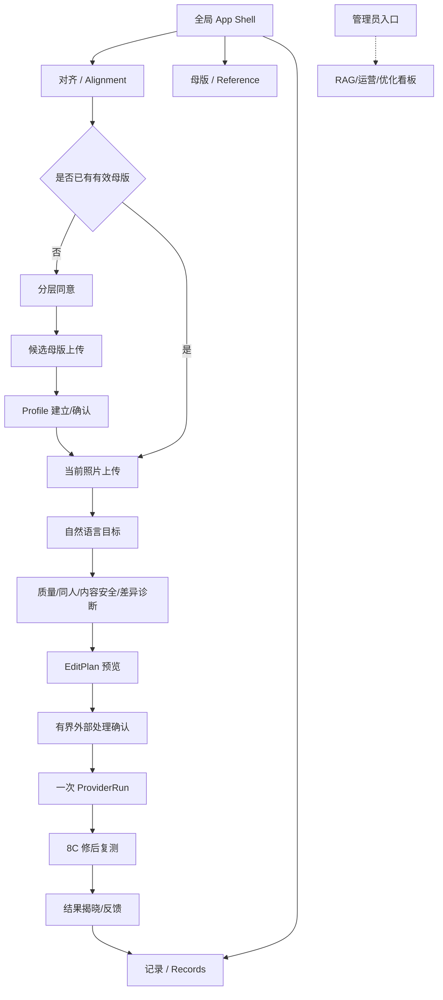

# 母版人像一致性 Agent｜前端与交互设计需求文档

> 文档版本：<span style="color:#C00000">`UI/UX-SPEC-v0.2`（Agent-first 交互方向增补版）</span>
>
> 编写日期：<span style="color:#C00000">2026-09-02</span>
>
> 文档状态：<span style="color:#C00000">Agent-first 信息架构与文案方向已整理；桌面关键帧、交互原型、可访问性复核和真实用户验证仍待 UI Gate，未冻结为代码行为</span>
>
> 适用范围：C 端最终前端、信息架构、交互流程、视觉设计系统、组件行为、文案和验收指标。
>
> 本文不是新的业务合同，也不改变 `ReferenceProfile`、`PhotoQualityResult`、`IntentFrame`、`EditPlan`、`ProviderRun`、`VerificationResult`、RAG advisory 或权限规则。所有“已实现/已冻结/待决策”的判断，优先以[执行版 PRD](母版人像一致性Agent-执行版PRD.md)、[PRODUCT_RULES.md](PRODUCT_RULES.md)、[CONTRACTS.md](CONTRACTS.md)、代码、测试和真实回执为准。

<span style="color:#C00000"><strong>本轮更新说明：</strong>本节把产品经理新增的 Agent-first 判断整理为可执行设计输入。它覆盖信息架构、模块关系、交互自动化边界和文案，不自动修改业务合同；红色内容是本轮新增或改写、待 UI 关键帧和产品负责人确认后再冻结的设计提议，黑色内容是此前已确认或已验证的产品事实。</span>

---

## 0. 先看结论

### 0.1 要交付的前端体验

把当前“按检查点操作的工程验证页”升级成一个用户不需要学习参数的 C 端 Agent 工作台：

```text
看见我现在要完成什么
→ 上传一张当前需要对齐的照片
→ 用一句话告诉 Agent 想保留/改变什么
→ 看见真实的检查、诊断和计划
→ 在外部图片处理前明确授权
→ 看见结果揭晓与逐特征趋势
→ 接受、停止、重新表达目标或在有效范围内让 Agent 继续
```

核心视觉隐喻不是“科技仪表盘”，而是**把一张照片轻轻推回到用户自己确认过的视觉标准**。因此页面的视觉关系必须稳定呈现：

```text
Reference（我认可的标准）  ↔  Current（这次要处理的照片）
                  ↓
          Difference（可解释的差异）
                  ↓
             Reveal（真实结果）
```

### 0.2 目标形态与当前事实

| 项目 | 当前观察/事实（2026-09-01） | 本 Spec 的目标 |
|---|---|---|
| 入口 | [Streamlit Private 页面](https://portrait-consistency-agent-x7cqcqsucatfbk7mmzch3q.streamlit.app/) 已可打开 | 首页只让用户理解一个当前任务并开始 |
| 主结构 | 侧栏含 `app`、运营数据、RAG 知识/治理/优化等工程页面；主区按 1、2、检查点 6、3、8A、8B、8C、5 展开 | C 端导航只保留“对齐 / 母版 / 记录”；运营与 RAG 页面进入管理员入口 |
| 输入 | 首屏同时出现候选母版和目标照片两个上传框、长段说明和多个按钮 | 新用户分流；已有母版时首屏只突出一个“上传待对齐照片”动作和一个 Agent 输入 |
| Agent | 文本解析、规则规划、受限 8C 续跑已在代码/fixture 中存在；用户可见内容仍接近 JSON/检查点 | 用短的人话状态呈现“正在做什么、为什么、还需要什么”；结构化证据进入第二层 |
| 结果 | 8B 结果图只在当前会话内存、8C 结果/反馈链存在；没有新的 UI 真实多轮图片回执 | 结果页提供前后对比、趋势、下载、点赞/点踩和继续说明；仍不虚构质量或视觉改善 |
| 视觉 | 四色家族、低装饰密度、中央对齐舞台、强 Agent 入口已冻结方向；外层四区工作台为本轮候选 | <span style="color:#C00000">先用关键帧评审四区布局、A/B/C 明暗变体与中文字体候选，完成 UI Gate 后才改 Streamlit</span> |

### 0.3 证据标记

本文使用以下标记，避免把设计目标写成已有结果：

| 标记 | 含义 |
|---|---|
| **已实现并验证** | 当前代码、测试或真实运行回执已经证明；前端可直接包装，但仍需做视觉适配 |
| **已冻结待实现** | 产品规则或交互方向已确认，当前 UI 尚未完整实现 |
| <span style="color:#C00000"><strong>产品经理待决策</strong></span> | 会影响范围、成本、隐私或最终视觉选择，不能由设计师静默替用户决定 |
| **未来候选** | 尚未通过对应产品/外部 Gate，前端只能预留状态，不可对外宣称可用 |

### 0.4 本轮结构化设计 Prompt（供 UI 设计/前端设计阶段直接使用）

<span style="color:#C00000"><strong>角色：</strong>你是负责 C 端 Agent 产品的资深产品设计师、交互设计师和视觉设计师。请基于本 Spec、执行版 PRD、现有状态机/合同和已批准的配色与中文字体候选，设计一个可验证、可解释、低学习成本的“母版人像一致性 Agent”工作台。</span>

<span style="color:#C00000"><strong>产品背景：</strong>用户先建立一张自己认可的母版照片；之后每次上传一张当前照片，用自然语言告诉 Agent 想保留、改变或先查看什么。Agent 负责理解目标、调用确定性检查和规划、在必要时请求一次有界的外部图片处理授权，并返回诊断、参数摘要或临时结果图。用户不应被迫学习修图参数、选择 Plan A/B/C，或为后台内容安全检查重复点击确认。</span>

<span style="color:#C00000"><strong>首要任务：</strong>把“我上传当前照片 → 我说一句话 → Agent 自动完成可安全完成的步骤 → 我看到解释和结果”设计成桌面端最短主链。第一眼只回答三个问题：我现在在哪个项目、当前要完成什么、我下一步是否需要操作。</span>

<span style="color:#C00000"><strong>信息架构候选：</strong>桌面优先采用左侧全局导航、项目/母版上下文、中央对齐工作区、右侧 Agent 对话四个区域；对话负责意图、状态和下一步，中央工作区负责照片、差异、结果和证据。项目列表只呈现脱敏任务事实，不暗示结果图永久保存。</span>

<span style="color:#C00000"><strong>交互规则：</strong>质量、同人、内容安全、RAG 依据查询和诊断等确定性步骤在满足既有同意边界后由 Agent/系统自动完成；外部 Provider 图片处理仍必须在调用前出现一次明确、绑定当前照片与计划的授权。后台安全检查不是用户按钮，但自动调用不等于取消既有隐私告知和权限约束。</span>

<span style="color:#C00000"><strong>文案规则：</strong>使用短标题、短状态和结构化解释；首页标题控制在 2—8 个中文字符，正文先结论后理由；删除无业务作用的英文 slogan、夸张承诺、隐藏思维链和技术字段。所有阻塞必须给出“原因 + 现在能做什么”，所有成功必须区分 Provider 回执与真实复测改善。</span>

<span style="color:#C00000"><strong>视觉规则：</strong>沿用已批准的配色家族、中文字体候选和低装饰密度；先保持布局与状态语义不变，再比较色彩明度/饱和度和字体气质。不要用科技仪表盘、密集卡片、发光网格、雷达图或大段说明制造“智能感”。</span>

<span style="color:#C00000"><strong>必须交付：</strong>（1）桌面 1440×900 主关键帧和 1280×800 降级帧；（2）新用户、已有母版、上传中、自动检查、需澄清、需外部授权、执行失败、结果复测、点踩停止九类状态；（3）模块关系图与状态映射；（4）完整中文文案表；（5）A/B/C 色彩明度变体和十种中文字体候选的同页评审；（6）Critical 视觉批评清单与 Audit 验收清单；（7）Streamlit 组件映射与不改变合同的实现边界。</span>

<span style="color:#C00000"><strong>禁止事项：</strong>不要凭空增加业务能力、持久化结果图、自动绕过授权、让用户逐项批准后台安全门、展示 0—100 一致性分数或接受概率、把一次视觉样张说成已实现或已验证，也不要在没有产品负责人确认时把候选视觉方案写成最终规范。</span>

---

## 1. 产品理解：这个 Agent 到底在替用户做什么

### 1.1 用户任务

目标用户有一张自己认可的成片作为长期参照，想让不同时间、角度或同组照片中的本人脸型与五官保持一致，但不想逐张猜修图滑杆。用户不是来学习 `FaceLifting=10` 或 `EyeEnlarging=10` 的；用户只需要表达：

- “把这张照片向我的母版靠拢”；
- “尽量少改，妆面保留”；
- “先给我看差异和建议”；
- “脸型可以，眼睛不要再动”；
- “我不满意，先停下”。

系统负责把这些表达转换成可验证的意图、局部几何差异、受约束计划、一次外部调用和修后复测。Agent 的智能不在于聊天很多，而在于**能记住母版、理解本次目标、知道什么可以做、知道什么时候必须停**。

### 1.2 用户必须持续看懂的四件事

每个页面和每条 Agent 消息都要回答四个问题：

1. **目标**：我现在要完成什么？
2. **动作**：Agent 正在替我做什么？
3. **依据**：为什么现在这样做？
4. **下一步**：现在还需要我做什么？

如果不能回答其中一项，界面应减少信息、改成等待/澄清/停止状态，而不是展示更多技术字段。

### 1.3 不应被误解的产品边界

- 不是陌生人搜索、身份认证、1:N 人脸库或“谁和谁像”；
- 不是统一审美、医美建议或“自然度评分”；
- 不展示 0—100 一致性指数、固定 90 分线或未经校准的接受概率；
- LLM 只理解脱敏文字、生成一个澄清问题或解释结构化事实，不看照片、不计算视觉数值、不猜参数、不授权工具；
- RAG 只查已审核的 Provider 能力、限制和降级依据，`execution_authorized=false`；
- `Pass/Block`、CompareFace、Provider 成功都只证明对应门或回执事实，不等于“已经达到母版一致”；
- 结果图只在当前会话内存中短暂展示/下载，不能从记录或管理员页重新拉取；
- 用户明确点踩、文字表达不满意或范围发生变化后，当前计划族必须停止，不能静默继续。

---

## 2. 设计原则

### 2.1 视觉本身就是产品概念

页面要让用户感觉自己在一个“对齐舞台”上工作，而不是在后台配置一个图像 API。视觉层级由以下关系产生：

- **参照与当前**：母版是安静、稳定的长期锚点；当前照片是本次任务的主角；
- **差异与方向**：用少量几何线、对齐轴和局部标记表达“哪里偏、向哪边收敛”，不使用科技网格或雷达图；
- **揭晓与证据**：结果用前后对比和趋势呈现，参数和回执退到“为什么/执行记录”第二层；
- **留白与尺度**：高级感主要来自留白、尺度、纸张/雾面材质对比和排版节奏，而不是复杂渐变、粒子或发光；
- **诚实与克制**：等待状态可以有节奏，但不能用假进度、假成功或“模型思考动画”掩盖真实状态。

### 2.2 奥卡姆式首屏

第一层只放当前步骤真正需要的实体：

- 新用户：`建立我的母版`、`我已有母版，开始本次对齐` 两条入口；
- 已有母版用户：一个当前照片上传动作 + 一个显著自然语言 Agent 输入；
- 复杂参数、RAG、Trace、批量、治理和隐私细则：进入第二层或管理员空间；
- 每个页面只保留一个主 CTA，次要动作降为文字按钮/菜单。

### 2.3 Agent 交互四原则

1. **先理解，再行动**：用户先表达目标，Agent 先用一句话复述结构化理解；
2. **先说明，再出境**：任何照片发送给腾讯或其他外部 Provider 前，出现明确、可读、绑定当前计划的授权层；
3. **先事实，再解释**：几何、质量、同人、内容安全、Provider 回执和复测由对应确定性模块产生，Agent 只解释，不替代；
4. **先停下，再追问**：不满意、冲突、未知、过期、范围变化、无法可靠复测时，优先停止并说明下一条安全路径。

### 2.4 设计语言定位

推荐气质：**安静、编辑感、柔和但有决断、非科技化的高级工作台**。

避免气质：

- 赛博蓝/荧光绿/霓虹紫的“AI 工具箱”；
- 多卡片仪表盘、长段技术说明、密集表格；
- “魔法”“一键变美”“百分之百一致”等夸张承诺；
- 过多装饰圆、漂浮粒子、摄影视觉背景或复制参考站素材。

### 2.5 Agent-first 交互原则（本轮新增，待 UI Gate 冻结）

<span style="color:#C00000"><strong>聊天是入口，工作区是证据。</strong>右侧对话框承接用户的自然语言目标、Agent 的短状态和下一步；中央工作区承接照片、差异、计划、结果与“为什么”。两者必须指向同一个当前任务，不能让用户在聊天和表单之间重复填写同一目标。</span>

<span style="color:#C00000"><strong>一个状态只给一个默认路径。</strong>在正常链路中，Agent 根据冻结规则选择唯一的默认计划并解释原因，不要求用户比较 Plan A/B/C；如果用户不满意，用自然语言改口生成新意图并让旧计划失效。只有会改变外部副作用、费用或范围的动作，才出现明确确认。</span>

<span style="color:#C00000"><strong>后台自动化不等于无边界。</strong>质量、同人、内容安全、已审核依据查询和修后复测属于系统状态，不应做成“请点击确认”的前台任务；外部图片处理、保存主体锚点、公开演示和任何 scope 变化仍需沿用既有分层同意与有界授权。</span>

<span style="color:#C00000"><strong>模块关系必须可解释。</strong>每个模块都要回答“输入是什么、输出是什么、谁触发、失败后去哪”。如果一个卡片只展示技术字段而不能帮助用户决策，应降到“为什么/执行记录”第二层或删除。</span>

## 3. 信息架构与路由

### 3.1 三空间模型

| 空间 | 用户问题 | 主要内容 | 首要 CTA |
|---|---|---|---|
| **对齐 / Alignment** | “我现在要把哪张照片向母版靠拢？” | 当前照片、Agent 输入、诊断、计划、授权、执行、复测、反馈 | 上传当前照片 / 开始对齐 |
| **母版 / Reference** | “我的长期标准是什么、保存到哪里？” | 当前 Profile 版本、几何字段摘要、母版偏好、保存/撤回/更换入口、生命周期说明 | 建立/更换母版 |
| **记录 / Records** | “我之前发生了什么、结果还能不能看？” | 会话状态、计划/回执摘要、反馈、下载事实、结果图是否已过期 | 查看一条记录 / 开始新任务 |

### 3.2 路由结构



### 3.3 C 端与管理员边界

- C 端全局导航只出现“对齐 / 母版 / 记录”；
- 运营数据看板、RAG 知识库与检索、RAG 本地混合检索、RAG 治理看板、RAG 优化看板属于**管理员/开发者只读空间**，默认不出现在普通用户导航；
- 管理员空间仍不得显示原图、原始用户话术、人脸向量、密钥、隐藏思维链或 Provider 请求体；
- “为什么/执行记录”是用户可见的第二层，不等于把管理员 Dashboard 暴露给用户。

产品经理已决定：管理员入口采用登录角色；当前 Private Streamlit 只证明存在一个受邀入口，不证明最终鉴权、区域、费用或生产持久化方案。——已确认

### 3.4 响应式布局

| 断点 | 目标设备 | 布局规则 |
|---|---|---|
| `≥1440px` | 桌面主演示 | 左侧窄导航（200—240px）+ 中央舞台（最大 920px）+ 右侧可选详情抽屉；首屏不超过一个纵向滚屏的主要任务 |
| `1024—1439px` | 笔记本/平板横屏 | 导航收为图标+文字；详情抽屉覆盖式打开；当前照片和母版上下或 7:5 双列 |
| `768—1023px` | 平板竖屏 | 顶部导航；舞台单列；Agent 输入固定在内容底部但不遮挡 CTA |
| `<768px` | 手机 | 顶部三项导航；照片前后对比改为滑动/切换；确认和反馈使用底部 sheet；上传、授权、停止按钮始终可见 |

产品经理已决定：2026-09-04 Demo 不把移动端作为正式验收范围；视觉主基准为桌面 1440×900 和笔记本 1280×800。——已确认

### 3.5 桌面 Agent 工作台布局（本轮候选，待产品负责人确认）

<span style="color:#C00000">本轮建议把中心式传统产品改为 Agent 工作台，但保留“对齐 / 母版 / 记录”三个 C 端空间。桌面主基准为 1440×900，布局由四个区域组成；它是信息架构候选，不代表 Streamlit 已实现。</span>

```text
┌────────────┬────────────────┬──────────────────────────┬──────────────────────┐
│ 全局导航   │ 项目/母版上下文 │ 中央对齐工作区           │ Agent 对话            │
│ 56–72 px   │ 220–260 px     │ 约 680–820 px            │ 340–400 px            │
│ 对齐       │ 当前项目       │ 当前照片 / 母版 / 差异   │ 目标输入              │
│ 母版       │ 母版状态       │ 计划 / 结果 / 证据       │ 自动状态              │
│ 记录       │ 新建任务       │ 一个主 CTA               │ 下一步与反馈          │
└────────────┴────────────────┴──────────────────────────┴──────────────────────┘
```

| 区域 | 负责什么 | 不负责什么 |
|---|---|---|
| 全局导航 | 切换对齐、母版、记录；显示当前空间 | 不放 RAG、运营、调试入口 |
| 项目/母版上下文 | 告诉用户当前使用哪张母版、哪次任务；创建新任务 | 不展示原图仓库、向量、永久历史 |
| 中央对齐工作区 | 展示当前照片、母版参照、差异、计划和结果 | 不让用户拖动受合同约束的参数 |
| Agent 对话 | 接收一句话目标、解释状态、提出单个澄清问题、收集反馈 | 不展示隐藏思维链、不代替授权 Sheet |

<span style="color:#C00000"><strong>项目语义约束：</strong>“项目”在 V0 仅是一个脱敏的任务上下文（母版版本 + 当前会话 + 状态摘要），不是云端图片资产空间。记录页仍只保存任务事实；结果图过期后，项目列表不能伪装成永久图库。</span>

---

## 4. 页面规格

### 4.1 全局 App Shell

**结构**

```text
┌────────────────────────────────────────────────────────────┐
│                 对齐       母版       记录        当前状态/菜单 │
├───────────────┬────────────────────────────────────────────┤
│               │                                            │
│  可选侧栏     │              当前中心舞台                    │
│  (桌面)       │                                            │
│               │                                            │
└───────────────┴────────────────────────────────────────────┘
```

<span style="color:#C00000"><strong>本轮桌面候选覆盖：</strong>保留中央舞台作为对齐工作区，在 App Shell 外层增加项目/母版上下文与右侧 Agent 对话；实现时以 3.5 的四区比例为准，以上旧示意仅作为 v0.1 的历史结构参考。</span>

```text
┌──────┬──────────────┬──────────────────────────┬──────────────────┐
│ 导航 │ 项目/母版    │ 中央对齐工作区           │ Agent 对话        │
│      │ 上下文       │ 当前照片 / 差异 / 结果   │ 目标 / 状态 / 反馈│
└──────┴──────────────┴──────────────────────────┴──────────────────┘
```

**要求**

- 当前空间用墨黑胶囊/底线表达，不能同时高亮多个入口；
- 状态区只显示当前会话的**定性**状态，例如“母版已建立”“等待你确认”“结果待复测”；不显示 session ID、原始分数或内部置信度；
- 新会话、帮助、隐私和删除入口放在次级菜单，不与主任务 CTA 竞争；
- 管理员入口在角色允许时显示为低优先级菜单项，不混入 C 端三项导航。

### 4.2 对齐空间首页 `/align`

#### A. 新用户空状态

<span style="color:#C00000">本轮文案覆盖 v0.1 的长标题和英文小标签：实现采用 `建立母版`、`开始对齐` 等短标题；下方旧示意仅保留作历史对照，不能直接复制到最终 UI。</span>

**首屏目标**：5 秒内让用户知道这是“把我的照片向我的标准靠拢”，并选择下一步。

```text
小标签：YOUR STANDARD, YOUR PORTRAIT
大标题：把这一张，向你的母版靠拢
短说明：先建立一张你认可的母版，之后每次只需上传当前照片并告诉我想保留什么。

[ 建立我的母版 ]       [ 我已有母版，开始本次对齐 ]

轻量视觉：一条对齐轴 + 两个空的照片框（Reference / Current）
```

**要求**

- 两个入口都进入真实可运行路径；不能用“开始体验”这种不说明后果的泛 CTA；
- 不在首屏展示 RAG、参数、质量阈值、JSON、Trace、Provider 名称或长隐私条款；
- 隐私说明以“查看数据如何处理”链接打开分层同意 sheet；
- 仅当用户选择“建立我的母版”后，才进入母版上传和单独授权。

#### B. 回访用户空状态（已有母版）

```text
顶部锚点：我的母版 · v1 · 仍在有效期内
标题：今天想把哪一张，对齐到你的标准？

┌──────────────────────────────────────┐
│                                      │
│       拖入 / 选择一张当前照片          │  ← 唯一主上传动作
│       JPG / PNG · 单人 · 清晰          │
│                                      │
└──────────────────────────────────────┘

Agent 输入：告诉我想保留什么，或先让我看差异……
[保留妆面] [先看差异] [直接对齐]
```

**要求**

- 母版锚点持续可见但不占中央舞台；
- 上传成功后主舞台转换为“当前照片 + Agent 输入”，上传框不再重复出现；
- 快捷短语是辅助，不替代自由输入；
- 目标照片的文件名、EXIF、原图路径不作为用户可见信息或 Trace 内容。

#### C. 当前照片已上传

页面按“照片—目标—下一步”顺序渐进展开：

1. 照片预览：`当前照片` 标签 + 删除/更换；
2. Agent 状态：`正在检查这张照片是否适合调整`；
3. 若需用户动作，只出现一个明确 CTA：`继续检查`、`重新上传` 或 `查看需要确认的内容`；
4. 输入框保持在舞台下方，用户可以先描述目标，也可以先看门控结果；
5. 复杂信息折叠至“为什么”。

### 4.3 母版空间 `/profile`

#### A. 未建立母版

- 说明母版是用户自己认可的长期视觉参照，不是美丑评分；
- 展示“适合做母版”的照片条件：本人/有权使用、单人、清晰、接近正面、眼睛可见、无遮挡；
- 进入上传前先展示处理当前照片、发送给内容安全 Provider、保存主体锚点、公开演示四个独立授权项；
- 未成年人和未授权他人照片明确拒绝。

#### B. 已建立母版

```text
母版已建立                     状态：有效
Profile v1 · 归一化几何摘要     最近更新：YYYY-MM-DD

[查看母版规则] [更换母版]

长期保存：派生几何 / （若已单独同意）加密主体锚点
原图：不保存
有效期：183 天（到期前 30 天、7 天提醒）

允许关注：脸型、眼睛等已测量特征
默认保留：妆面、肤色、背景

[撤回主体锚点] [删除母版数据]
```

**要求**

- 不展示脸部向量、关键点坐标、供应商原始分或接受概率；
- “更换母版”必须说明成功建立新 Profile 后才替换旧版本；
- “撤回主体锚点”与“删除母版数据”区分：前者让跨会话主体能力失效，后者删除当前可删除数据；实际删除 SLA 以合同/部署 Gate 为准；
- 母版不可在此页面直接二次 P 图，用户要更换标准必须重新上传完整成片。

### 4.4 记录空间 `/records`

记录页不承诺永久保存结果图。它记录**发生过什么**，而不是提供一个可重新打开的图片仓库。

#### 记录卡字段

| 字段 | 用户可见内容 | 不可见内容 |
|---|---|---|
| 时间 | 任务发生时间、当前会话相对状态 | session ID、内部数据库 ID |
| 目标 | `脸型 + 眼睛`、`保留妆面` 等脱敏结构化摘要 | 原始话术全文 |
| 路由 | 可继续、需重传、已停止、待复核 | 原始质量/同人分数 |
| 结果 | 结果图仍在本次会话内存 / 已过期 | 结果 Base64、签名 URL、文件路径 |
| 证据 | “查看为什么/执行记录” | 隐藏思维链、密钥、请求体 |
| 反馈 | 已点赞、已点踩、文字反馈已记录 | 文字原文 |

结果图过期后，卡片显示：`结果预览已过期；保留的是脱敏任务事实，不会自动重新调用工具。`

### 4.5 第二层与瞬时层

| 层 | 组件 | 默认行为 |
|---|---|---|
| 第二层 | 为什么 / 执行记录抽屉 | 默认关闭；用户点击后看简化参数、证据来源、ProviderRun 摘要、复测趋势和脱敏 Trace |
| 瞬时层 | 授权确认 sheet | 外部照片调用前强制打开，不可用普通 toast 替代 |
| 瞬时层 | 澄清 sheet | 每次只问一个会改变路由/参数/权限的问题，提供最多 3 个快捷回复 |
| 瞬时层 | 错误 recovery dialog | 说明失败层、是否已调用、是否会重试、用户下一步；不提供“再试一次”绕过新确认 |
| 瞬时层 | 结果揭晓层 | 首先呈现前后对比和复测结论，再提供反馈和继续说明 |

### 4.6 首页改版的关键帧要求（本轮新增，待 UI Gate 冻结）

<span style="color:#C00000">以下关键帧用于替代“传统中心式首页”的表达方式；底层状态、合同和安全门保持不变。每个关键帧只保留一个主任务，不用大段 slogan 解释产品。</span>

| 场景 | 页面标题 | 中央工作区 | Agent 对话 | 唯一主动作 |
|---|---|---|---|---|
| 无母版 | `建立母版` | 一张母版上传卡 + 适合条件 | `先上传一张你认可的本人照片。` | `上传母版照片` |
| 有母版空状态 | `开始对齐` | 母版小型锚点 + 当前照片上传卡 | `上传当前照片，再告诉我想保留什么。` | `上传当前照片` |
| 已上传待表达 | `告诉我目标` | 当前照片预览 + 母版缩略参照 | `你想保留什么，或先看差异？` | `发送目标` |
| 自动检查中 | `正在检查` | 检查结果 rail（质量/同人/安全分开） | `我先检查这张照片是否适合比较和调整。` | 无（等待真实状态） |
| 计划已生成 | `建议已准备` | 差异列表 + 单一默认计划 | `我建议先调整脸型和眼睛，妆面保持不变。` | `查看这次调整` |
| 需要外部处理 | `确认这一次` | 计划范围、Provider、保存边界 | `这一步会发送当前照片；确认后只尝试一次。` | `确认这一次调整` |
| 结果返回 | `结果已返回` | 修前/修后对比 + 逐特征趋势 | `结果已返回，我正在确认变化是否朝目标移动。` | `查看结果` |
| 用户不满意 | `已停止` | 上一张可验证结果或空状态 | `我先停止这组计划。你可以重新告诉我想改变什么。` | `重新表达目标` |

<span style="color:#C00000"><strong>关键帧一致性规则：</strong>同一任务的母版缩略图、当前照片、Agent 消息、计划和结果必须共享一个明显的任务标识；不允许一个区域显示“已完成”、另一个区域仍显示“等待确认”。自动检查以时间线/状态文案呈现，不把后台门控拆成多个按钮。</span>

---

## 5. Agent 交互逻辑

### 5.1 可见状态机映射

页面内部可继续使用现有状态机；用户不需要看到状态码。下表是状态码到人话、动作和硬停止的映射。

| 系统状态 | 用户看到的短句 | 主动作 | 次动作/第二层 | 硬规则 |
|---|---|---|---|---|
| `NEW` | “先建立你的母版，或开始一次新的对齐。” | 建立母版 / 上传当前照片 | 查看数据处理方式 | 不显示工程导航 |
| `CONSENT` | “在上传前，先确认这四件事分别怎么处理。” | 逐项同意 | 查看保留/删除说明 | 四类同意不合并 |
| `REFERENCE_UPLOAD` | “上传一张你已经认可的本人照片。” | 选择文件 | 查看母版条件 | 文件只当前内存预览 |
| `REFERENCE_QUALITY_GATE` | “正在确认它适不适合做母版。” | 等待 | 看检查项 | 失败说明具体原因 |
| `PROFILE_CONFIRM` | “这张照片可以作为你的母版吗？” | 确认建立 | 更换照片 | 用户确认后才锁定 Profile |
| `PROFILE_ACTIVE` | “你的母版已准备好。” | 上传当前照片 | 查看母版档案 | 母版是轻量锚点 |
| `TARGET_UPLOAD` | “上传这次想调整的照片。” | 上传一张 | 重新选择 | 当前 V0 多脸失败时要求裁剪 |
| `TARGET_QUALITY_GATE` | “正在检查照片是否适合比较和调整。” | 等待 | 查看原因 | 质量/同人/安全分开 |
| `INTENT_CAPTURE` | “你想保留什么，或想先看什么？” | 发送一句话 | 点击快捷短语 | 远程文字调用需单独同意 |
| `CLARIFY` | “我只需要确认一件事：这次要不要动眼睛？” | 选择/回答 | 改写目标 | 一次只问一个关键槽位 |
| `DIAGNOSE` | “我正在比较可以可靠测量的差异。” | 等待 | 为什么 | 不显示接受概率 |
| `PLAN` | “我建议调整：脸型 +n、眼睛 +n。” | 查看计划 | 查看依据 | 参数由确定性规划器产生 |
| `CONFIRM` | “这一步会把当前照片发送给已列明的 Provider。” | 有界确认 | 取消/改目标 | 绑定照片 hash、Profile、部位、参数、10 分钟 |
| `EXECUTE` | “正在执行这一次已确认的调整。” | 等待/取消（若可取消） | 执行记录 | 每个计划最多一次外部尝试 |
| `PROVIDER_FAILED` | “工具没有完成这次尝试。” | 重新表达目标 | 查看失败事实 | 不自动重试，不伪造结果 |
| `VERIFY_OBSERVE` | “结果已返回，正在确认变化是否朝目标移动。” | 等待 | 查看测量项 | API 成功不等于效果成功 |
| `REPLAN` | “方向是对的，我会在原授权范围内继续一小步。” | 等待 Agent 继续 | 查看本轮范围 | 同 scope 才可自动子计划 |
| `STOP` | “我先停在这里，并保留上一张可用结果。” | 接受/新目标 | 查看停止原因 | 变差、无改善、不满意均停 |
| `RESHOOT` | “这张照片目前无法可靠判断，建议重新上传。” | 重新上传 | 查看要求 | 不因用户口头确认绕过 |
| `MANUAL_REVIEW` | “我无法安全判断，已标记给项目开发者复核。” | 结束/重新上传 | 查看脱敏记录 | 不宣称有客服团队 |
| `CLOSE` | “这次对齐已结束。” | 下载/新任务 | 查看记录 | 结果图按会话 TTL 处理 |

### 5.2 Agent 消息规范

- 每次只说一件事，最多 2—3 行；
- 先给结论，再给必要解释；
- 需要用户决定时，句末明确“现在需要你……”；
- 不显示“我正在思考”“我分析了 12 层”“模型置信度 95%”等不可验证叙述；
- 使用 `正在检查 / 已检查 / 需要确认 / 已停止 / 无法判断` 等可追溯动词；
- 每条关键消息都有对应可展开的事实来源，但不暴露隐藏思维链。

### 5.3 自然语言输入

**输入框层级**

1. Placeholder：`告诉我想保留什么，或先让我看差异……`；
2. 快捷短语：`保留妆面`、`先看差异`、`尽量少改`、`直接对齐`；
3. 发送后锁定当前文本 hash，显示 `正在理解这句话`；
4. 结果到达后显示结构化摘要：`我理解为：向当前母版靠拢；保留妆面；先看建议；允许脸型和眼睛调整。`；
5. 若缺失会改变结果的槽位，只问一个问题；
6. 用户改口会生成新 `IntentFrame`，让旧计划失效，不在 UI 上静默改旧参数。

**数据告知**

```text
文字只用于理解本轮目标。
如果你同意远程解析，系统只发送脱敏文字和最小任务上下文；不会发送照片、Base64、人脸向量、主体锚点、密钥或原始 Trace。
```

无 DeepSeek 密钥、用户未同意、网络/HTTP/Schema 失败时，页面应显示：`本轮使用本地模板理解；没有发送这段文字到远程模型。`

### 5.4 计划预览与授权

计划卡是用户决定“是否让 Agent 代做”的核心，不是参数调节器。

```text
这次我建议

脸型        向母版靠拢       +10       可执行
眼睛        向母版靠拢       +10       可执行
妆面/肤色   保持不变          —         默认不动
鼻子/嘴型   当前工具不支持    —         手动建议

为什么：目标照的可测量几何与母版存在方向性差异。
会发送：当前照片 → Tencent BeautifyPic
授权范围：当前照片 / 当前 Profile / 以上部位 / 最多三轮计划族
确认有效：10 分钟；首次计划只尝试一次

[ 取消 ]                          [ 确认这一次调整 ]
```

要求：

- 用户层显示“改什么、为什么、影响范围、会发给谁、结果保存多久”；
- Provider 绝对值可以放在“查看技术细节”中，但不能让用户拖滑杆修改当前不可变计划；
- `Whitening`、`Smoothing` 默认关闭；用户若要启用，必须在本任务重新说明和授权；
- RAG 依据卡只展示来源、版本和简短支持/降级理由，不显示“RAG 已授权”；
- 确认按钮文案必须包含“这一次/当前照片”等作用域，不使用“永久允许”“一键自动修好”。

### 5.5 执行、等待与自动续跑

**首轮**

```text
用户确认
→ scope/hash/Profile/质量/安全/同人/预算/轮次 preflight
→ 一次 Provider Adapter
→ ProviderRun 脱敏回执
→ 当前会话结果图
```

**8C 计划族内续跑**

只有以下条件全部满足，界面才显示“Agent 正在原范围内继续”：

- 修后结构化观察证明方向正确且存在累积改善；
- 新子计划仍在首次确认的照片、用途、Provider、部位、预算和最多三轮范围内；
- 父计划、父回执、结果图 hash 和当前质量状态匹配；
- 每个子计划只调用一次；
- 调用前写入自动续跑 preflight，调用后写入 ProviderRun/Verification Trace。

如果 scope 改变、结果无法复测、用户点踩/文字不满意、达到上限、连续无改善或变差，页面显示停止原因并回到新 Intent，而不是继续按钮。

### 5.6 结果揭晓与反馈

**结果页优先级**

1. 大幅前后对比（默认并排；移动端滑动）；
2. 一句人话结论：`脸型差异缩小；眼睛本轮无法可靠复测。`；
3. 逐特征趋势：`缩小 / 无变化 / 变大 / 无法判断`；
4. 下载（结果图仍在会话内存时）；
5. `👍 可以了`、`👎 不满意，停止这组计划`、可选文字反馈；
6. `查看为什么/执行记录`。

禁止：

- “相似度 92%”“成功率 95%”“保证达到母版”等数字或承诺；
- 把腾讯返回图片直接标为“已完成一致”；
- 让点踩后仍出现“继续自动优化”按钮；
- 结果图过期后自动重新调用 Provider。

### 5.7 自动执行与用户确认边界（本轮新增，待合同复核）

<span style="color:#C00000">为了让产品真正像 Agent，前端不再把每个后台步骤做成按钮；但“少按钮”不能变成“少边界”。下面的划分只规定可见交互，不改变既有服务合同。</span>

| Agent/系统可自动完成 | 仍需用户明确动作 |
|---|---|
| 在既有同意范围内进行质量检查、同人检查、内容安全检查、已审核依据查询、差异诊断和修后复测 | 上传照片前/相关处理时的分层数据同意 |
| 根据冻结规则生成一个默认 `EditPlan`，并在对话中解释改什么、为什么 | 把照片发送给外部图片处理 Provider 的一次有界确认 |
| 在同一 scope、预算和轮次内触发受限的 8C 子计划 | 保存主体锚点、公开演示、任何 scope/Provider/费用/轮次变化 |
| 把真实状态投影到时间线和对话消息 | 用户改口、点踩、接受结果或结束任务 |

<span style="color:#C00000"><strong>内容安全的前台表达：</strong>用户不需要点击“同意进行安全审查”；在适用的处理/外发告知已完成后，系统自动执行并显示“正在做安全检查 / 可以继续 / 暂不能处理”。若结果为 `Review` 或 `Block`，立即停止后续 Provider 路由，并说明原因与下一步。</span>

<span style="color:#C00000"><strong>计划选择的前台表达：</strong>正常链路只展示一个基于事实和策略生成的默认计划，不展示 Plan A/B/C 让用户比较。用户想改变方向时，直接在对话框重新表达目标；这会创建新的 `IntentFrame`，使旧计划失效并重新走必要的门控。</span>

---

## 6. 关键旅程与异常路径

### 6.1 首次建档

```text
新用户空状态
→ 建立我的母版
→ 四类独立同意
→ 上传候选母版
→ 本地质量/单脸检查
→ <span style="color:#C00000">在适用的处理/外发同意范围内自动完成内容安全检查</span>
→ 用户确认这就是母版
→ Profile v0 建立成功
→ 回到对齐空间上传当前照片
```

**页面必须看见**：当前检查是什么、是否需要用户授权、母版是否已锁定、原图是否保存。若 `Review/Block`、无脸、多脸、模糊或不可执行，给出具体原因和重传动作。

### 6.2 单张对齐主链

```text
已有母版
→ 上传当前照片
→ 质量 / 内容安全 / 当前会话同人门
→ 一句话目标
→ IntentFrame 摘要/一个澄清问题
→ 逐特征诊断
→ EditPlan 预览
→ 首次外部处理确认
→ Tencent BeautifyPic 一次调用
→ 结果揭晓
→ 8C 修后复测
→ 停止 / 重规划 / 重传 / 开发者复核
```

**体验目标**：上传后 3—5 秒内出现第一个真实反馈（例如“正在检查照片”），不是承诺完整处理在 5 秒完成。

### 6.3 多脸

未来完整链路：

```text
检测多脸 → 用户选目标脸 → 隔离 → 局部编辑 → 回贴 → 接缝/他人脸检查 → 只复测目标脸
```

当前完整隔离/回贴尚未实现，前端必须：

- 在检测到多脸时明确标注“当前版本不能安全隔离整张照片中的目标脸”；
- 提供“先裁剪成单脸再上传”的主动作；
- 不允许用户用一个“我确认是我”按钮绕过多脸限制；
- 不把多脸整图发给 Tencent 并宣称只修改所选脸。

### 6.4 批量

批量是后续能力，不进入首屏。进入后采用逐张状态清单：

```text
待检查 3 张 | 可执行 2 张 | 需重传 1 张
```

每张照片独立 `EditPlan`、`ProviderRun`、`VerificationResult`；一张失败不阻塞其他成功，也不显示“整组成功”。

产品经理已决定：批量不进入 9 月 4 日 Demo；导航与首屏都不暴露，页面不制作“即将上线”空入口。——已确认

### 6.5 失败与恢复

| 失败 | 用户看到 | 提供的动作 | 禁止 |
|---|---|---|---|
| 图片格式/尺寸不支持 | “这张照片无法读取” + 原因 | 重新上传 | 模糊显示为可用 |
| 质量过低 | “无法稳定比较” + 清晰/姿态建议 | 重拍/重传 | 显示低置信度数字 |
| 同人 `no_match` | “当前母版与目标照无法确认是同一人” | 检查照片/重新上传 | 口头确认绕过 |
| 安全 `Review/Block` | “这张照片暂不能进入处理” | 结束/换图 | 发送到下一 Provider |
| RAG conflict/miss | “当前没有足够已审核依据” | 手动建议/停止 | LLM 自由补全并执行 |
| Provider 超时/5xx | “工具没有完成这次尝试” | 新目标/稍后按新确认再试 | 同计划自动重试 |
| 复测无改善/变差 | “我先停下，保留上一张可用结果” | 接受/新 Intent | 继续自动调用 |
| 用户点踩/不满意 | “我已停止这组计划” | 重新表达目标 | 沿用旧计划 |

---

## 7. 视觉设计系统

### 7.1 视觉基线

从参考图只抽象层次语法，不复制摄影、品牌、文案或页面资产：

1. 雾灰紫的安静情绪场；
2. 奶油/肉粉的中心舞台；
3. 墨黑的导航与主要文字；
4. 桃红作为单一高光，用于主行动、结果强调和关键状态；
5. 大字号编辑感标题、紧字距、强留白；
6. 轻量几何线/对齐轴表达产品概念；
7. 不使用背景摄影、不使用发光科技网格、不堆叠彩色装饰。

### 7.2 颜色 Token（已冻结家族，推荐执行值）

| Token | 推荐值 | 用途 | 禁用方式 |
|---|---|---|---|
| `--mist` | `#9893AA` | 页面情绪场、次级背景、母版锚点 | 不作为小字号正文底色而不做对比检查 |
| `--cream` | `#F5DCD8` | 中央舞台、上传区、结果底板 | 不叠加低对比灰字 |
| `--ink` | `#211F25` | 标题、正文、导航、主按钮文字 | 不用纯黑 `#000000` 破坏柔和层次 |
| `--coral` | `#EE6276` | 唯一强调色、主 CTA、趋势高光、焦点状态 | 不把整页铺成高饱和红色 |
| `--paper` | `#FBF8F7` | 页面基础留白、卡片内部 | 不新增蓝/绿/黄家族 |

**可访问性默认组合**

- `ink` on `cream/paper/mist` 作为正文和标题；
- `ink` on `coral` 作为主按钮文字；
- 白字仅在大字号/图标型 Coral 控件中使用，并需单独做对比检查；
- 错误、警告和停止状态优先使用 `coral` + `cream/paper` + 图标/文字，不引入红绿灯式新颜色家族。

产品经理已决定：先用推荐值做可交互样张，再只比较同一颜色家族内的明度/饱和度，不同时改变布局。——已确认

#### 色彩变体候选（只允许 tonal QA，不是新颜色家族）

| 候选 | `mist` | `cream` | `ink` | `coral` | 气质 |
|---|---|---|---|---|---|
| A 静谧对齐（推荐） | `#9893AA` | `#F5DCD8` | `#211F25` | `#EE6276` | 最接近当前冻结基线，柔和、有编辑感 |
| B 深墨舞台 | `#787286` | `#F3E7E2` | `#1F1D22` | `#E85B70` | 对比更强，适合录屏和暗背景 |
| C 奶油留白 | `#B6B0BF` | `#FFF1EC` | `#28252B` | `#D9536B` | 更轻、更生活方式，需关注强调色可见性 |

候选只影响 token，不改变状态语义、权限、图片数据流或合同。

### 7.3 字体与排版

**推荐组合**

- 中文：`PingFang SC`, `Noto Sans SC`, `Microsoft YaHei`, sans-serif；
- 英文/数字：`Inter`, `Arial`, sans-serif；
- 标题最多使用 2 种字重，正文使用 Regular/Medium；
- 不使用装饰性手写字体承载状态、授权或错误。

| 层级 | 桌面 | 移动端 | 用途 |
|---|---:|---:|---|
| Display | 56—72px / `-0.04em` | 36—44px | 首页主标题，一屏最多一个 |
| H2 | 32—40px | 28—32px | 页面/结果标题 |
| H3 | 20—24px | 18—20px | 区块标题 |
| Body | 16px / 1.55 | 15—16px / 1.55 | 说明与 Agent 消息 |
| Label | 12—14px / Medium | 12—14px | 状态、字段、按钮 |
| Caption | 12px / 1.45 | 12px | 次要解释；不承载关键授权 |

### 7.4 形状、材质与布局 Token

| Token | 值 | 说明 |
|---|---:|---|
| `space-1…8` | 4/8/12/16/24/32/48/64px | 8pt 节奏；主舞台留白优先 |
| `radius-card` | 20px | 舞台、结果容器 |
| `radius-control` | 12px | 上传、输入、按钮 |
| `radius-pill` | 999px | 导航、状态、快捷短语 |
| `shadow-soft` | `0 12px 36px rgba(33,31,37,.08)` | 只用于悬浮层和结果揭晓，不用于所有卡片 |
| `max-stage` | 920px | 中央主任务最大宽度 |
| `content-gutter` | 32px desktop / 20px mobile | 保证照片与文字呼吸感 |

### 7.5 Icon 体系

**推荐**：Lucide 或同类线性图标库；最终库需在实现 Gate 统一，不混用 emoji、实心图标和不同笔画风格。

- 线性、圆角端点、`1.5px` stroke、24×24 基准；
- 图标辅助文字，不单独承载关键动作；
- 禁止用“魔法棒”暗示自动变美；优先用对齐轴、目标点、眼睛轮廓和停止符号。

| 语义 | 推荐 icon | 使用位置 |
|---|---|---|
| 对齐 | `AlignCenter` / `ScanLine` | 品牌、对齐空间 |
| 母版 | `CircleUserRound` / `Aperture` | Profile 锚点 |
| 当前照片 | `Image` | 上传区、结果卡 |
| 上传 | `Upload` | 唯一主上传动作 |
| Agent 输入 | `MessageCircle` | 输入框发送/状态 |
| 检查中 | `LoaderCircle` | 真等待状态，遵守 reduced motion |
| 通过 | `Check` | 已完成事实 |
| 警告/无法判断 | `TriangleAlert` | 风险、复测不足 |
| 停止 | `CircleStop` | 用户停止、硬停止 |
| 隐私/授权 | `ShieldCheck` / `LockKeyhole` | Consent sheet |
| 期限 | `Clock3` | 10 分钟确认、183 天锚点 |
| 结果 | `Columns2` / `Split` | 前后对比 |
| 下载 | `Download` | 结果仍在会话内存时 |
| 反馈 | `ThumbsUp` / `ThumbsDown` | 结果页 |
| 详情 | `ChevronDown` / `PanelRight` | 第二层抽屉 |

### 7.6 动效规范

动效是“真实状态的时间标记”，不是智能程度的证明。

| 场景 | 动效 | 时长/节奏 | 规则 |
|---|---|---|---|
| 空状态进入舞台 | 背景层和舞台轻微淡入/上移 | 240ms, ease-out | 只发生一次，不循环 |
| 上传后 | 图片从缩略图平滑进入当前照片框 | 320ms | 不遮挡检查状态 |
| 正在检查 | 对齐轴缓慢呼吸 + 明确文字 | 1.6s 循环 | 不能显示虚假的百分比进度 |
| Agent 回复 | 气泡/摘要按顺序出现 | 180ms | 不展示打字式隐藏思维链 |
| 计划展开 | 计划卡高度过渡 | 220ms | 参数内容一次性可读 |
| 授权 sheet | 底部/侧边 sheet 出现 | 240ms | 焦点移入 sheet，Esc 可关闭（关闭不执行） |
| 结果揭晓 | 对比容器先出现，再显示趋势摘要 | 420ms | 只在真实结果图存在时触发 |
| 错误/停止 | 局部 coral 高亮 + 图标 | 180ms | 不震动、不闪烁、不用红绿对比 |

**必须支持** `prefers-reduced-motion`：关闭循环、缩短过渡，所有状态以文字和图标保留。网络、Provider 或复测没有回执时，不能用动画替代错误或成功。

---

## 8. 组件规格与验收行为

| 组件 ID | 核心用途 | 必备状态 | 交互/数据边界 | 验收要点 |
|---|---|---|---|---|
| `AppShell` | 三空间容器 | active/idle/admin | 只渲染允许的导航；管理员页不污染 C 端 | 任一页面知道当前空间，返回不丢失当前会话 |
| `PrimaryNav` | 空间切换 | active/hover/focus/disabled | 不显示 RAG/运营给普通用户 | 键盘可达、移动端可折叠 |
| `ReferenceAnchor` | 显示 Profile 锚点 | empty/active/expiring/revoked | 不显示原图或向量；显示版本和生命周期定性状态 | 母版存在时持续可见但不抢主 CTA |
| `UploadZone` | 选择/拖拽照片 | idle/drag/reading/accepted/rejected | 文件只在当前会话内存；读取失败不进入后续门 | 主界面只出现一个当前动作；错误可恢复 |
| `AgentComposer` | 自然语言目标 | empty/typing/submitting/clarify/locked | 远程解析需文字单独同意；保存 hash/结构化结果 | Placeholder 清楚；发送后有真实状态 |
| `IntentSummary` | 显示结构化理解 | parsed/fallback/needs_clarify/superseded | 不显示原话全文、隐藏思维链或内部自评 | 一眼能看懂目标、保留项和下一步 |
| `GateStatusRail` | 质量/安全/同人/可编辑性 | pending/pass/warn/block/manual | 各门独立，不合并成一个分数 | 每个 block 给原因和下一动作 |
| `DifferenceList` | 逐特征诊断 | measured/tolerance/unavailable/suggestion | 差异是方向性几何事实，不是相似度 | 不出现百分比总分或接受概率 |
| `EditPlanCard` | 计划预览 | proposed/expired/superseded/confirmed | 参数不可在卡内拖动修改；保存策略版本 | 显示部位、原因、范围、Provider、轮次 |
| `ConsentSheet` | 外部调用授权 | pending/checked/expired/blocked | 绑定照片/Profile/计划/scope；取消不调用 | 关键告知在首屏可读，确认按钮有作用域 |
| `ExecutionTimeline` | 真实进度 | queued/running/succeeded/failed/stopped | 每个计划最多一次；不能用假进度 | 用户知道是否已发生外部调用 |
| `ResultReveal` | 结果对比 | unavailable/available/expired/fallback | 仅会话内结果；过期不重发 | 先对比，再趋势，再行动 |
| `FeedbackBar` | 显式反馈 | idle/liked/disliked/commented/closed | 点踩/文字反馈硬停止；文字只 hash | 反馈后明确显示计划族已停止 |
| `EvidenceDrawer` | 第二层依据 | closed/open | 只显示安全摘要、来源、版本、Trace 投影 | 不显示密钥、原文、向量、隐藏思维链 |
| `ErrorRecovery` | 失败解释 | transient/permanent/manual/expired | 重试必须新意图/新确认 | 说明是否已调用、是否可继续、下一动作 |

### 8.1 组件状态命名

前端状态名称应与合同/Trace 中的事实一一映射，但不把内部枚举直接暴露给用户：

```text
pending       → 正在检查/等待确认
pass          → 可以进入下一步
warn           → 存在风险，需你确认
blocked        → 当前不能继续
suggestion_only→ 当前只能给建议
succeeded      → Provider 有真实回执
improved      → 目标特征的结构化趋势改善
unverifiable  → 当前证据不足，不能判断
stopped       → 已按规则停止
```

### 8.2 不同屏幕尺寸的结果对比

- 桌面：并排 `before/after`，可拖动分割线；默认不自动播放；
- 平板：并排变为 60/40 或左右切换；趋势摘要始终在照片下方；
- 手机：`修前 / 修后` segmented control + 可选滑动对比；下载/反馈固定在底部安全区域；
- 每张图片提供描述性替代文本，例如“修前目标照片”和“修后腾讯返回的临时结果图，尚未/已完成本地复测”，不写“更美”“更像”等主观结论。

---

## 9. 文案系统

### 9.1 语气

- 短、具体、尊重用户决定；
- 用“当前照片/母版/可测量差异/这一次”而不是“AI 魔法/智能美颜”；
- 用“我无法可靠判断”而不是“模型置信度低”；
- 用“你可以重新表达目标”而不是“请重新输入参数”。

### 9.2 推荐文案

| 场景 | 文案 |
|---|---|
| 建立母版 | `先建立一张你认可的母版` |
| 上传当前照片 | `上传一张这次想对齐的照片` |
| 质量检查 | `正在检查这张照片是否适合比较和调整` |
| Intent 已理解 | `我理解为：向你的母版靠拢；保留妆面；先看可执行建议。` |
| 计划 | `我建议先调整脸型和眼睛；妆面与肤色保持不变。` |
| 授权 | `确认这一次：把当前照片发送给 Tencent BeautifyPic，按以上计划尝试一次。` |
| 执行中 | `正在执行这一次已确认的调整` |
| 回执成功 | `结果已返回；这只证明工具完成了返回，接下来还要检查变化。` |
| 复测中 | `正在确认变化是否朝你的目标移动` |
| 改善 | `脸型的可测量差异缩小了；眼睛本轮无法可靠复测。` |
| 停止 | `我先停在这里，保留上一张可验证的结果。` |
| 点踩 | `你说不满意，我已停止这组计划；如果愿意，请重新告诉我想改变什么。` |
| 结果过期 | `临时结果图已过期；不会自动重新调用工具。` |
| RAG 不知道 | `当前没有足够的已审核依据，我不会猜测或调用未知工具。` |

### 9.3 禁用文案

`相似度 90%`、`一致性指数`、`接受概率 95%`、`保证像母版`、`一键变美`、`模型正在深度思考`、`AI 已自动完成所有优化`、`重新尝试（不说明会否再次扣费）`、`结果永久保存`。

### 9.4 本轮新增的短文案规范

<span style="color:#C00000">文案不是装饰，而是 Agent 的控制面。首页不再使用“今天想把哪一张对齐到你的标准”这类长标题，也不放没有业务作用的英文 slogan。标题负责命名当前任务，Agent 消息负责解释动作，第二层负责展开依据。</span>

| 文案层级 | 推荐长度 | 推荐示例 | 禁止写法 |
|---|---:|---|---|
| 页面标题 | 2—8 个中文字符 | `开始对齐`、`建立母版`、`结果已返回` | 大段宣言、双语 slogan |
| 状态句 | 1 句，≤24 字 | `正在检查这张照片` | `AI 正在深度思考` |
| 解释句 | 1—2 句 | `脸型差异缩小；眼睛本轮无法可靠复测。` | 技术字段堆叠、未经验证的百分比 |
| 主按钮 | 2—8 个中文字符 | `上传当前照片`、`确认这一次调整` | `开始体验`、`一键变美` |
| 澄清问题 | 一次只问一个问题 | `这次要保留妆面吗？` | 同时询问多个参数 |

<span style="color:#C00000"><strong>文案验收：</strong>设计评审时逐条检查“用户是否知道现在发生什么、为什么、下一步是什么”。无法回答这三点的文字必须改写、折叠或删除；技术名词只有在“查看为什么/执行记录”中且确实帮助判断时才出现。</span>

---

## 10. 隐私、可访问性与信任设计

### 10.1 分层授权在 UI 中的表达

四类同意必须是四个独立的选择，而不是一个“同意以上全部”：

1. 处理当前照片；
2. 将当前照片发送给列明的外部 Provider；
3. 保存由母版派生的加密主体锚点 183 天；
4. 允许用于公开 Demo/视频。

每个选择都显示：用途、数据、保存/删除边界、撤回入口、当前是否已实现。若功能尚未实现，不把合同承诺写成已完成工程。

### 10.2 WCAG 2.2 AA 目标

以下是 UI 实现 Gate 的验收目标，不是当前页面已通过的结果：

- 正文对比度 ≥4.5:1，大字号 ≥3:1，非文本控件/焦点指示 ≥3:1；
- 所有主流程可只用键盘完成：导航 → 上传 → Agent 输入 → 授权 → 结果 → 反馈；
- focus ring 不被雾紫/肉粉背景吞掉；
- 所有上传、状态、错误、结果图有可读 label/alt text；
- 不能只用颜色区分 `pass/warn/block/stopped`，必须同时使用文字和图标；
- `prefers-reduced-motion` 关闭循环动画；
- 错误提示靠近产生错误的控件，且焦点可移到错误说明；
- 移动端底部 sheet 不遮挡确认、取消、停止和反馈动作。

### 10.3 信任可见性

每个外部动作都要显示一条可读事实：

```text
是否已发送照片：是/否
发送给谁：Provider 名称和用途
这次授权范围：当前照片、当前计划、有效时间
是否已收到回执：是/否
结果图还可用多久：当前会话内存 TTL
```

内部 RequestId、错误分类和策略版本可以在“执行记录”中显示为摘要，但不显示密钥、签名 URL、原始请求体或原始图片。

---

## 11. 指标、质量门与证据

这些指标是**设计验收目标**。只有真实用户测试、自动化测试或运行日志达成后，才能写成结果；不能把目标值写成当前 KPI。

### 11.1 首次理解与操作

| 指标 | 目标 | 测量方法 | 通过证据 |
|---|---:|---|---|
| 首屏主任务识别 | ≥80% 受邀测试者能在 5 秒内说出“上传当前照片并表达目标” | 观察测试/任务回放 | 带时间戳的测试记录 |
| 首个真实反馈 | ≤5 秒出现“正在检查/需要确认”等真实状态 | 浏览器录屏/事件时间 | `product_events` + 录屏 |
| 首次主 CTA 迷失率 | ≤10% 需要解释才能找到下一步 | 受邀可用性测试 | 逐人原始观察，不能由页面访问量推断 |
| 首屏竞争 CTA | 1 个主 CTA；新用户最多 2 个明确分流入口 | DOM/视觉 QA | 截图 + DOM 检查 |

### 11.2 信任与安全

| 指标 | 目标 | 测量方法 |
|---|---:|---|
| 未授权图片外发 | 0 次 | 自动化 gate + Provider mock/日志 |
| 外部调用前授权可见 | 100% | 逐状态测试；确认前不得出现 ProviderRun |
| 旧计划改口后继续执行 | 0 次 | contract/状态回归 |
| 同一计划重复外部调用 | 0 次（在应用可观测范围内） | 幂等测试；不扩写成分布式 exactly-once |
| 用户点踩后继续调用 | 0 次 | 8C 反馈硬停止测试 |
| 结果过期后自动重发 | 0 次 | TTL/刷新/重连测试 |

### 11.3 视觉与可访问性

| 指标 | 目标 | 测量方法 |
|---|---:|---|
| 主色家族数量 | 3—5 个；当前只允许雾紫、肉粉/奶油、墨黑、桃红 | 设计 token lint/人工 QA |
| 主流程键盘完成率 | 100% 关键步骤可达 | 键盘走查/自动化可访问性工具 |
| 关键文字对比度 | WCAG 2.2 AA | token 对比检查 |
| 关键状态可辨识 | 文字 + 图标 + 状态样式三重表达 | 视觉 QA |
| 动效降级 | reduced motion 下无信息丢失 | 浏览器设置 + 录屏 |

### 11.4 真实产品结果的边界

以下不能由本 Spec 或一次 Demo 证明：留存、WAU/MAU、PMF、用户满意度总体、RAG 泛化通过、图片视觉效果普遍改善、接受概率校准、生产 SLA。当前 v3 Holdout 质量 Gate=`FAIL`，真实 UI 多轮照片回执仍待产品负责人亲自操作；设计验收必须和这些质量/运营事实分开记录。

---

## 12. 产品经理待决策清单

前 9 项是已确认的产品决定；12.1 的第 10—14 项是本轮新增候选，在产品负责人明确确认前不由设计实现默认冻结：

1. **前端承载：**先用 Streamlit 做视觉皮肤；接受一定视觉质量损失，以换取 9 月 4 日前的开发速度。——已确认
2. **最终色彩 token：**在同一雾紫/肉粉/墨黑/桃红家族内选择 A/B/C 明暗变体，并完成对比度复核。——已确认候选评审，不一次性锁死
3. **字体与品牌字标：**使用系统中文字体；同时保留多版（十种中文候选）用于同页评审，不一次性定死。——已确认
4. **移动端 Gate：**只保证桌面录屏，不把移动端作为 2026-09-04 正式验收对象。——已确认
5. **结果记录形态：**V0 不支持持久化结果图、对象存储和跨会话恢复；UI 不暗示“历史可永久查看”。——已确认
6. **批量与多脸上线时点：**在对应隔离、回贴、复测和逐张异常链路完成前隐藏入口。——已确认
7. **管理员入口与访问控制：**管理员入口采用登录角色，RAG/运营/优化看板不向未授权人员开放。——已确认
8. **公开演示素材：**允许公开 Demo/视频，但使用授权素材；公开演示同意与照片处理、主体锚点同意分开记录。——已确认
9. **首屏两条入口的默认顺序：**已有母版的回访用户直接进入当前照片上传；新用户进入建立母版。——已确认

### 12.1 本轮新增、尚未冻结的交互决策

<span style="color:#C00000">以下事项是把你的新思考落成 UI 前必须确认的最小决策集。视觉设计可以先按推荐值出稿，但在写入 Streamlit 或改变合同前必须明确冻结。</span>

10. <span style="color:#C00000"><strong>桌面工作台结构：</strong>是否采用“全局导航 + 项目/母版上下文 + 中央对齐工作区 + 右侧 Agent 对话”的四区布局。推荐采用，理由是它把熟悉的聊天入口和可验证的照片工作区放在同一任务上下文中。</span>
11. <span style="color:#C00000"><strong>Agent 自动化边界：</strong>质量、同人、内容安全、已审核依据查询和复测默认后台自动执行；外部图片处理仍只保留一次有界确认。推荐采用，理由是减少无价值点击但不削弱副作用控制。</span>
12. <span style="color:#C00000"><strong>项目列表语义：</strong>“项目”只代表母版版本 + 当前会话 + 脱敏状态摘要，不代表永久图片资产。推荐采用，以免与 V0 结果图仅会话内存的事实冲突。</span>
13. <span style="color:#C00000"><strong>首页文案：</strong>采用 `开始对齐`、`建立母版`、`上传当前照片` 等短标题和动作型按钮；删除英文 slogan 和长段解释。推荐采用，先做 2—3 个文案密度候选再冻结。</span>
14. <span style="color:#C00000"><strong>首轮视觉关键帧：</strong>先评审一套固定布局下的 A/B/C 色彩明度变体与十种中文字体候选，再进入 Critical/Audit。推荐采用，以免同时改变布局、色彩和字体而无法归因。</span>

---

## 13. 现有 Streamlit 能力到目标 UI 的迁移映射

| 当前能力/区域 | 目标 UI 位置 | 迁移原则 |
|---|---|---|
| 候选母版上传 | 母版空间 / 首次建档 flow | 从首屏并列上传改为按状态出现；保留本地预览和授权门 |
| 目标照片上传 | 对齐空间唯一主上传 | 已有母版时只突出这一动作 |
| 检查点 6 质量/安全/同人/Profile | GateStatusRail + Profile 建档 step | 把 JSON 改成定性状态和原因；保留第二层事实 |
| 检查点 7 IntentFrame | AgentComposer + IntentSummary | 摘要在人话层，Schema/receipt 进详情 |
| 检查点 8A | DifferenceList + EditPlanCard | 逐特征解释，隐藏工程字段，保留依据入口 |
| 检查点 8B | ConsentSheet + ExecutionTimeline | 首次确认是明确的外部副作用边界 |
| 检查点 8C-1/8C-2 | ResultReveal + Follow-up status + FeedbackBar | 真实复测先于“已完成”；同 scope 子轮只显示可证实状态 |
| 当前会话 Trace | EvidenceDrawer / 管理员只读页 | 脱敏、折叠、不可暴露隐藏思维链 |
| 运营数据看板 | 管理员空间 | 不作为 C 端首屏 KPI 或满意度证明 |
| RAG P0-A/P0-B/P0-C/治理/优化 | 管理员/开发者只读空间 + 8A/8C 依据卡 | 只提议、可回放、不能授权 Provider |

---

## 14. UI 实现 Gate 与 Definition of Done

前端改造完成前，必须逐项证明：

### 14.1 结构

- [ ] C 端默认只显示对齐/母版/记录三个空间；管理员页隔离；
- [ ] 新用户可以从两条清楚入口开始；回访用户首屏只有一个当前照片上传动作；
- [ ] 每个页面只有一个主 CTA；复杂信息在第二层；
- [ ] 目标照片、母版、当前意图、Agent 状态和下一步在同一视觉层级内可见。

### 14.2 真实状态

- [ ] 上传、质量、安全、同人、意图、诊断、计划、授权、执行、回执、复测、停止和反馈均有 loading/success/warn/block/error/expired 状态；
- [ ] 动效只绑定真实状态，不伪造进度或成功；
- [ ] Provider 成功与复测改善分开表达；
- [ ] 8C 同 scope 续跑显示自动触发事实；点踩/改口/scope 变化后硬停止。

### 14.3 隐私和权限

- [ ] 四类同意可分别勾选、撤回和解释；
- [ ] 照片外发前没有任何路径可以绕过确认；
- [ ] LLM 文字告知清楚，失败回退不暗示发生云调用；
- [ ] 页面、记录、RAG 看板和 Trace 均不显示原图 Base64、原始文本、向量、密钥、签名 URL 或隐藏思维链；
- [ ] 结果图只会话内存，过期/刷新/重连不自动重发。

### 14.4 视觉和可访问性

- [ ] 颜色只来自冻结家族；所有关键组合通过 WCAG 2.2 AA 对比度检查；
- [ ] 线性图标 stroke/尺寸/语义统一；图标不替代文字；
- [ ] 桌面 1440×900、1280×800 完成正式视觉回归；移动端只做不阻塞的基础降级检查，不作为 2026-09-04 Gate；
- [ ] 键盘、焦点、屏幕阅读器标签和 reduced motion 走查通过；
- [ ] 结果对比在不同尺寸下不遮挡下载、停止和反馈。

### 14.5 证据包

交付 UI Gate 时必须保留：

1. 各主状态截图或录屏；
2. 浏览器 DOM/可访问性检查结果；
3. 关键状态到合同/事件/Trace 的映射表；
4. 无授权、过期、改口、点踩、RAG conflict/miss、Provider 失败和结果过期的回归记录；
5. 一次真实受邀用户走查记录（若尚未发生，明确标记为待完成）；
6. 与 [DEVELOPMENT_PROGRESS.md](DEVELOPMENT_PROGRESS.md)、[DECISION_LOG.md](DECISION_LOG.md)、README 和执行版 PRD 的状态同步。

### 14.6 Agent-first 交互 Gate（本轮新增）

<span style="color:#C00000">这一组 Gate 专门检查“看起来像 Agent”是否真的落实到交互，而不是只换了一个聊天气泡。</span>

- <span style="color:#C00000">桌面首屏能同时看见当前项目/母版、当前照片任务、Agent 对话和下一步；四区不会互相显示冲突状态。</span>
- <span style="color:#C00000">已有母版用户只有一个主要上传动作；上传后可以直接用自然语言继续，不必先填写参数表。</span>
- <span style="color:#C00000">质量、同人、内容安全和依据查询以真实状态自动出现，不拆成多个“确认/继续检查”按钮；发生 `Review/Block` 时前台清楚停止。</span>
- <span style="color:#C00000">正常路径只显示一个默认 `EditPlan`，不要求用户比较 Plan A/B/C；改口会使旧意图和旧计划失效。</span>
- <span style="color:#C00000">外部图片处理仍只有一次绑定 scope 的授权；授权前看得到发送给谁、改什么、结果保留多久。</span>
- <span style="color:#C00000">标题、按钮和状态通过中文短文案走查；删除无业务作用的英文 slogan、夸张承诺和隐藏思维链。</span>
- <span style="color:#C00000">必须用一条“上传当前照片 → 自然语言目标 → 自动门控 → 诊断/计划 → 一次授权 → 结果/复测 → 反馈停止”的录屏验证，不得只展示静态空状态。</span>

---

## 15. 实施顺序建议

本顺序只描述 UI 交付依赖，不替代产品决策或工程 Gate：

1. **先锁定已确认边界，再评审候选 token**：实现承载使用 Streamlit；在同一颜色家族内比较 A/B/C 明暗变体和中文字体候选，不改变合同或布局语义；
2. **先做 Shell + 三空间**：导航、中心舞台、母版锚点、记录空状态；
3. **再做单张主链**：上传 → Agent 输入 → Gate → 诊断 → Plan → Consent → Execute → Verify → Result；
4. **再做第二层**：为什么、执行记录、证据卡、失败恢复；
5. **再做可访问性与异常**：键盘、焦点、reduced motion、过期、block、点踩、RAG conflict/miss；
6. **最后接回管理员页和真实用户走查**：不让 RAG/运营看板重新侵入 C 端首屏；
7. **以真实操作证据收尾**：产品负责人亲自上传授权照片、完成首轮确认、复测和反馈；若出现真实改善且 scope 不变，再记录一次 8C-2 子轮，不为录屏强行重复调用。

### 15.1 与当前代码的接口纪律

- UI 只能调用现有状态机/服务，不在组件中计算视觉事实或生成 Provider 参数；
- `EditPlan`、`ProviderRun`、`VerificationResult` 继续由服务层生成，前端只渲染安全投影；
- RAG 依据只能作为 `knowledge_refs`/解释卡，不得由页面按钮直接触发新 Provider；
- 组件状态需能映射到 `product_events`，但事件仍是匿名运营账本，不是训练 Dataset；
- 新增 UI 只要改变 consent、scope、保存期、默认 Provider、轮次、自动续跑或多脸/批量行为，必须重新走“讨论—冻结—实现—测试”。

### 15.2 与 Frontend / Critical / Audit 的协作顺序（本轮新增）

<span style="color:#C00000">本项目的协作顺序不是“先写页面，再让设计师挑好不好看”。每一阶段有独立产物和暂停条件；没有通过上一 Gate，不进入下一阶段。</span>

| 阶段 | 主要工作 | 必须产出 | 进入下一阶段的条件 |
|---|---|---|---|
| 0. 对齐 brief | 明确用户、场景、当前事实、非目标、桌面基准和已确认决策 | 一页设计 brief + 决策表（已确认/候选/未知） | 没有把候选写成事实 |
| 1. 交互架构 | 画 IA、模块关系、状态矩阵、主链和异常链 | 路由图、状态表、模块输入/输出 | 每个状态都有下一步或停止原因 |
| 2. 文案与信息层级 | 先定标题、按钮、状态和解释，再排版 | 中文文案表 + 首屏信息密度稿 | 每个文字都能回答目标/动作/下一步 |
| 3. 关键帧 | 固定布局，只比较 A/B/C 色调和十种中文字体候选 | 1440×900、1280×800 关键帧与候选对照 | 产品负责人选出候选方向 |
| 4. Frontend 原型 | 把关键帧做成可点击状态原型，优先主链和阻塞态 | 可交互原型/录屏 + 状态映射 | 主链能从上传走到结果或清楚停止 |
| 5. Critical | 从视觉艺术与设计系统角度批评层级、留白、节奏、材质、字形和一致性 | Critical 问题清单（问题/影响/建议/优先级） | 没有“看起来漂亮但信息不可用”的关键问题 |
| 6. Audit | 从可用性、可访问性、信任、隐私、状态诚实和异常恢复角度审查 | Audit 清单 + 反例截图/录屏 | 未授权外发、假进度、死路、不可访问问题为 0 |
| 7. 产品冻结 | 产品负责人逐项确认布局、文案、自动化边界和候选视觉 | 冻结记录 + 变更清单 | 只冻结明确同意的项目 |
| 8. Streamlit 实现 | 按组件映射接入现有状态机，不新增隐含业务 | 实现 PR + 测试/截图 | 真实状态、合同和视觉映射一致 |
| 9. UI Gate | 真实受邀用户走查并记录失败案例 | 证据包、待修项和下一版决策 | 只把已验证内容写成结果 |

<span style="color:#C00000"><strong>工具可用性说明：</strong>当前会话没有暴露名为 “Frontend Skill” 或 “impeccable Critical/Audit” 的可调用技能；本 Spec 先把它们需要的输入、输出和 Gate 标准写清。后续若接入对应能力，应直接复用本节，不把“已写好 Prompt”误报为“已完成视觉评审”。</span>

---

## 16. 参考与当前状态来源

- [母版人像一致性 Agent｜执行版 PRD](母版人像一致性Agent-执行版PRD.md)：产品定义、三空间、8A/8B/8C、RAG、隐私和实现矩阵；
- [PRODUCT_RULES.md](PRODUCT_RULES.md)：质量/安全/同人、计划确认、结果与反馈硬边界；
- [CONTRACTS.md](CONTRACTS.md)：六个业务合同和用户可见事实的字段责任；
- [PROJECT_CONTEXT.md](PROJECT_CONTEXT.md)：技术冻结与不可变边界；
- [DEVELOPMENT_PROGRESS.md](DEVELOPMENT_PROGRESS.md)：当前代码、测试、部署和待完成 Gate；
- [FIRST_USER_E2E_TEST.md](FIRST_USER_E2E_TEST.md)：第一位用户真实页面操作与证据要求；
- [MIDTERM_STATUS_2026-09-01.md](MIDTERM_STATUS_2026-09-01.md)：v3 Holdout、真实用户和 9 月 4 日前收尾状态；
- [当前 Streamlit Private 页面](https://portrait-consistency-agent-x7cqcqsucatfbk7mmzch3q.streamlit.app/)：2026-09-01 只读 UI 基线观察。

### 当前一句话状态

<span style="color:#C00000"><strong>本轮更新后的状态：</strong>Agent-first 的信息架构候选、自然语言主链、后台自动门控/外部副作用确认边界、短文案方向和协作 Gate 已写入本 Spec；四区桌面工作台、关键帧、Critical/Audit 结果和 Streamlit 最终实现仍待产品负责人冻结与 UI Gate。当前页面仍是工程验证型原型，真实用户照片、多轮 UI 回执、视觉效果和 RAG 质量 Gate 不能由本文提前宣称。</span>

## 17. 产品经理与 Codex 协作时建议补充的决策

<span style="color:#C00000">你的原始流程已经覆盖“设计文档 → UI 设计 → 视觉打磨 → 代码”。为了减少返工，还需要在进入关键帧前补齐以下边界：</span>

| 容易遗漏的决策 | 为什么会影响 UI | 当前建议 |
|---|---|---|
| 首次用户与回访用户是否使用同一对话线程 | 决定项目列表、母版上下文和空状态 | V0 分成“建立母版”和“已有母版直接上传”两条状态路径 |
| 用户说“直接帮我处理”时默认返回什么 | 决定 Agent 是先诊断、给参数还是请求图片处理授权 | 先用一句话复述意图；只有外部处理需要授权，其余检查自动完成 |
| “成功”如何对用户定义 | 防止把 Provider 回执误写成视觉改善 | 统一显示“已返回 / 已复测 / 可测量差异缩小”三种事实 |
| 运行中离开页面、刷新或网络中断怎么办 | 决定是否会重复调用或给出假状态 | 回到会话后显示最后一个真实状态；过期不自动重发，重试必须新意图/新确认 |
| 费用、耗时和等待是否需要可见 | 决定用户是否会误以为 Agent 卡死或重复扣费 | 在授权/执行层显示定性提示，不展示未经验证的精确 SLA；Provider 失败必须说明是否已调用 |
| 反馈如何改变后续行为 | 决定点踩是否真的停止，而非仅换颜色 | 点踩或文字不满意立即停止当前计划族，重新表达目标才开启新计划 |
| 结果图与任务事实如何分离 | 防止项目列表变成未经授权的图库 | 结果图仅会话内存；记录/项目只显示脱敏任务事实和状态 |
| 谁可以看到管理员空间 | 决定 C 端导航和角色边界 | 管理员采用登录角色；非授权人员不显示入口、不返回原始数据 |

<span style="color:#C00000"><strong>推荐的下一步输入：</strong>产品负责人先确认 12.1 的第 10—14 项；确认后我再按 0.4 Prompt 产出一版桌面关键帧规格（四区布局、九类状态、中文文案、A/B/C 色调和十种中文字体评审位），再进入 Frontend 原型和 Critical/Audit，而不是直接改业务代码。</span>
