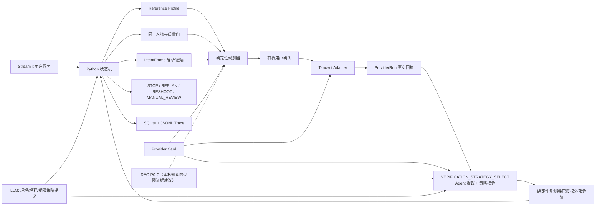

# 母版人像一致性 Agent｜执行版 PRD

> 文档版本：`v0.9-current`
> 最近同步：2026-08-30
> 文档性质：**当前产品与工程的共同真相源，持续更新**
> 当前阶段：合同 `v0.4-frozen` 已落地；检查点 6 的质量门、主体 Adapter、Profile v0、脱敏运营账本和 Streamlit 按钮入口已实现；CompareFace 已真实通过，IMS 服务开通后已分别验证真实 `Block` 拒绝路径和一张新授权照片的 `Pass` 允许路径；检查点 7 的 DeepSeek 文本 IntentFrame Adapter、Schema 校验、显式文字授权与本地 fallback 已实现，并完成一次真实云端 Schema receipt；检查点 8A 的严格双眼测量、局部差异诊断、确定性 EditPlan 草案、Streamlit 展示和脱敏 Trace 已实现；检查点 8B 的显式初次确认、单次 BeautifyPic 执行 Gate、ProviderRun 真实回执合同、会话内结果展示和离线回归已实现。<span style="color:#C00000"><strong>检查点 8C-1/8C-2 已实现本地结果观察、受限策略提议、VerificationResult 趋势路由、最多三轮的计划族续跑、父子计划/回执血缘、结果页反馈与硬停止；在首次外部处理同意和有界计划族仍有效时，后续轮次不再逐轮要求参数点击，改为 Agent 受限自动续跑并保留完整 Trace。RAG P0-C 已把本地审核证据受限回接 8A 规划前和 8C 策略提议层：它只能提议/留证，不能新增执行权限、外部/混合复测或 Provider；RAG 专属本地管理员 Dashboard 已实现并完成页面验证。Gold Set v2 现已完成 public deterministic predictions、无答案 holdout prediction 与一次私有仅聚合评分；当前基线没有通过，不能宣称 RAG 有泛化效果。部署包已推送至私有 GitHub 仓库，Streamlit Cloud App 已创建为 Private 应用，当前 URL 为 `https://portrait-consistency-agent-x7cqcqsucatfbk7mmzch3q.streamlit.app`，只读探针返回登录跳转；腾讯 Web License 测试 License 已提交并在控制台显示“正常”，有效期为 2026-08-30 至 2026-09-13。canonical Safety Event 目录已获产品负责人审核通过；v3 Holdout 已在工作区外生成题目/答案键审核草案，但仍不是正式 Holdout，也未回到仓库。火山美颜 V2 因需购买创点套餐且公开价格/试用额度不明，V0 暂不接入、不发照片；live Judge、外部/混合复测 Adapter、自动 lifecycle/observability worker、候选 Provider 正式准入和真实 UI 三轮照片回执仍按后续 Gate 推进。</strong></span>
> 提交目标：2026-09-04 前完成真实可演示闭环和录屏备份

## 0. 这份文档和原启动蓝图是什么关系

[原启动蓝图](../../outputs/人像修图一致性Agent-项目启动蓝图.md)记录了项目最初的探索、候选方案和排期，其中保留了一些后来被否决的设计，例如展示实验性 0—100 指数、把最多三轮写进合同类型、每轮最多三个参数等。它继续作为“为什么这样探索”的历史资料，但**不再代表当前实际产品**。

从现在开始，文档优先级固定为：

1. 代码、测试和真实运行回执：证明“已经做了什么”；
2. 本执行版 PRD：说明“当前产品最终要做什么、真实做到哪里”；
3. [PRODUCT_RULES.md](PRODUCT_RULES.md)、[CONTRACTS.md](CONTRACTS.md)、[AGENT_PROMPTS.md](AGENT_PROMPTS.md)：各模块的详细规则；
4. 原启动蓝图：只保留最初计划、研究和备选路线。

本文件中的状态标记只有三种：

| 标记         | 含义                          |
| ---------- | --------------------------- |
| **已实现并验证** | 代码存在，并有测试、真实运行或可读取的回执证明     |
| **已冻结待开发** | 产品规则已经由用户确认，但工程链路还没有完成      |
| **未来候选**   | 方向保留，尚未冻结具体产品规则，也不能对外称为已有能力 |

任何功能从“待开发”变成“已实现”，必须同时修改代码、测试、本文件的实现矩阵和开发进展；不能只改文案。

---

## 1. 产品定义

### 1.1 一句话定义

> **母版人像一致性 Agent：帮助用户建立自己的长期五官与脸型标准，并将单张或同组照片中的本人面部，分别调整到这套标准；执行后重新测量，处理失败和例外。**

它不是把两张照片变成像素级相同，也不是判断两个人长得像不像，更不是用统一审美评价用户。它解决的是：同一个人在不同时间、角度和拍摄组图中，修图结果容易“每张像不同的人”，而用户不想逐张猜滑杆。

### 1.2 核心用户

第一目标用户按行为定义：

- 经常发布本人照片，有一张自己认可的成片作为长期参照；
- 在意朋友圈、小红书、写真、毕业照、求职照或九宫格中五官与脸型的一致性；
- 会使用修图工具，但不想反复试参数；
- 愿意在明确告知、授权和可删除的前提下，让工具处理本人照片。

### 1.3 核心用户价值

用户不再自己判断“该瘦脸多少、眼睛该加多少”，而是完成以下任务：

```text
确认母版标准
→ 系统逐张判断是否可处理
→ 解释哪些五官/脸型存在差异
→ 生成当前工具真实能执行的计划
→ 用户授权
→ 工具执行
→ 系统重新测量结果
→ 接受、继续调整、重新上传或开发者复核
```

### 1.4 明确不做

- 不做陌生人搜索、1:N 人脸库、姓名识别、身份认证或风控；
- 不判断美丑，不提供医美建议，不推断年龄、性别、种族或健康；
- 不以肤色、妆面、身体或隐私部位建立长期母版；
- 不承诺“相似度 90%”或一次修好；
- 不让 LLM 看图凭感觉打分、猜滑杆或自行授权；
- 不自动发布图片，不操控醒图手机端，不使用通用生成模型重绘整张脸；
- 不把小样本 smoke test 写成上线、A/B、准确率或用户增长；
- Beta 不处理未获得权利人授权的他人照片，也不以未成年人为测试对象。

---

## 产品设计｜关键问题、调研路径与产品取舍

> 这一板块不只记录“最后定了什么规则”，还记录产品负责人如何从问题出发、识别冲突、比较方案并作出取舍。它是后续面试复盘和下一位开发协作者理解本项目的产品设计依据；每次新增或改变冻结决策，都要同步补入这里。

### 1. 从“相似度打分”转为“母版一致性任务”

**背景与问题。** 最初设想是给照片一个“和母版的相似度百分比”，并把 90% 作为完成线。但产品负责人识别到，这类数字既容易被用户理解成统计概率，也无法回答“为什么要改、改哪里、用户是否真的能接受”。单纯追求像素相似还会误伤表情、光线和背景。

**调研与判断。** 将人脸同一人物、照片质量、五官几何差异、外部工具执行和用户接受分别拆开后，确认腾讯 CompareFace 原始分只能说明两张脸的匹配证据，不能替代母版一致性或人类接受概率。

**冻结决策。** V0 不展示 0—100 指数、90 分目标线或未经校准的概率；用户看到的是“可继续/警告后继续/需重传”、可测量差异、当前可执行项、suggestion-only 项和修后趋势。未来只有在独立人工金标准、按人切分的 holdout 和校准报告完成后，才重新讨论接受概率。

**带来的效果。** 产品结果从一个无法解释的分数，变成能支撑诊断、执行、复测和 bad case 归因的闭环；也避免把 Demo 的规则输出夸写为模型准确率。

### 2. 证明 Agent 的价值，而不是做一个“套参数 App”

**背景与问题。** 如果只是把同一组滑杆套到多张照片，普通修图 App 已能完成，无法说明为什么需要 Agent。

**调研与判断。** 单张和批量照片都存在姿态、表情、遮挡、已有修图程度和允许修改范围不同的问题；同一母版目标不能等于同一组参数。用户也会表达模糊需求，例如“像母版但别太假”“先给建议”“这次不要动嘴巴”。

**冻结决策。** Agent 的职责是理解意图、补齐会改变路径的缺失约束、为每张照片独立规划、调用经确认的工具、复测、停止或降级。状态机拥有权限和状态迁移最终权；LLM 只在白名单内提议下一步，不直接决定参数、身份、内容安全或执行授权。

**带来的效果。** 这将“聊天”变成可追溯的任务编排，也让用户能理解系统为什么追问、为什么拒绝、为什么需要确认。

### 3. 把视觉事实、用户意图和工具执行拆开

**背景与问题。** 初期容易让 LLM 既看图、又猜参数、又决定能不能执行；这会造成越权、参数不可复现和 Provider 回执被编造。

**调研与判断。** 六个合同审计发现，`IntentFrame`、工作流状态和工具名不能混在一起；`EditPlan` 是修图前的计划，`ProviderRun` 必须是 API 的真实回执，`VerificationResult` 才能写修后实测。

**冻结决策。** 使用 Pydantic 合同和确定性状态机做控制面：CV/规则产生视觉事实，LLM 只解析自然语言和解释，规划器映射可执行参数，Adapter 产生事实回执，验证器决定 STOP/REPLAN/RESHOOT。任何模块都不能越过合同“补写”别人的事实。

**带来的效果。** 可将每个失败定位到输入、主体匹配、特征提取、参数映射、Provider、权限或用户偏好，而不是笼统地说“模型不行”。

### 4. 在“长期 Profile”与“不保存原图”之间解决隐私冲突

**背景与问题。** 用户希望后续照片自动对齐长期母版，但又不希望长期保存母版原图。若没有任何可比较的主体表示，跨会话同人确认就无法实现。

**调研与判断。** 比较了每次重传母版、云端两图比对、云人脸库和本地派生主体锚点。两图云比对只能覆盖当前会话；云人脸库工程简单但第三方长期持有生物特征；本地加密派生锚点较符合“无原图长期档案”，但需要模型许可、加密和删除工程。

**冻结决策。** 当前会话同人门继续使用腾讯 CompareFace 3.0；长期能力采用本地生成、AES-GCM 加密、受限访问的派生主体锚点，不保存母版原图。锚点保存 6 个月，到期前 30 天和 7 天提醒；用户撤回后立即停用，主存储 24 小时内删除、备份 7 天内清理。具体特征提取模型必须在许可核验后才可公开宣称启用。

**带来的效果。** 保留长期产品体验的技术路径，同时把“锚点仍是敏感生物特征”“当前尚未实现真实加密/TTL/delete worker”的边界写清楚。

### 5. 照片质量、同人判断和内容安全分别做门

**背景与问题。** 质量差、错人或高风险图片都可能让修图结果失真，但它们不是同一个问题；将它们混为一个分数会掩盖真实失败原因。

**调研与判断。** 通过当前代码和腾讯 API 能力核对，建立了独立的本地质量门、腾讯 CompareFace 当前会话同人门和腾讯 ImageModeration 内容安全门。CompareFace 已取得真实成功回执；ImageModeration 先后保留了服务开通前的三次权限失败证据，服务开通后真实返回 `Block`。因此内容安全的“拒绝路径”已验证，但不能把被拦截的照片写成审核通过，也不能把它推进到修图。

**冻结决策。** `match` 才可进入正常路径；`uncertain` 需要用户确认本人且只允许本会话降级继续、不得更新长期锚点；`no_match` 拒绝，不允许口头绕过。内容安全采用“本地格式预检 + 腾讯 IMS 主审核”，`Review/Block` 一律保守拦截；没有人工审核队列时不假装有人审。

**带来的效果。** 既能保护错人和高风险使用，也能把权限/服务失败、内容拦截、质量不足和同人不确定分别写进 Trace 与 bad case。

### 6. LLM 选型：只做语言理解，不做视觉识别

**背景与问题。** 产品需要自然语言交互，但不能让大模型替代视觉算法或把图片、生物特征发送到不必要的服务。

**调研与判断。** 先明确 LLM 的任务仅为：把用户自然语言转换为 `IntentFrame`、判断缺失约束、生成一个澄清问题、解释诊断与失败原因。随后比较模型能力、中文表达、JSON/Tool Calls、价格、调用复杂度、模型路由、数据出境、留存和 fallback。

**冻结决策。** 选择 DeepSeek V4 Flash 为主模型；失败时先回退到本地模板，不自动将同一段文本转发给第二个云模型。原因是当前任务不需要复杂视觉推理或多模型路由，优先获得中文能力、低成本、结构化输出、简单的单 Provider 治理和稳定的 Demo 降级路径。

**数据边界。** LLM 不接收照片、Base64、人脸向量、密钥或原始 Trace；只接收经过最小化和脱敏的文本、会话状态和结构化结果。9 月 4 日版本不默认启用跨境 OpenRouter 路由；若以后启用，必须另行说明 Provider、ZDR/日志策略和用户文本的跨境处理。

**带来的效果。** LLM 可提高交互自然度，却不会成为不可解释的“黑箱视觉大脑”。

**实现与验收。** 产品负责人没有把“接上 DeepSeek”直接等同于 Agent 能力，而是把模型输出限制为 `IntentCandidate + 一个澄清问题 + 用户可读摘要`，由 Pydantic 和确定性系统补入 ID、文本 hash、模型/Prompt 版本和确认作用域。页面只在用户勾选“发送本轮脱敏文字”且本机存在密钥时才触发远程调用；无勾选、无密钥、超时、HTTP、非 JSON 或 Schema 冲突时都回退到同 Schema 的本地模板。离线验收覆盖无密钥不联网、PII 脱敏、JSON/HTTP 失败、执行倾向仍为 `PENDING`、Trace 不含原话和提示注入式非法字段等案例；固定、无个人信息的真实文本已得到 `parser_mode=llm`、Schema 通过的云端回执。

### 7. 多脸不是“检测到了就能编辑”

**背景与问题。** 用户可能上传合照，但腾讯 BeautifyPic 没有指定目标脸的请求参数；整图调用可能修改错误的人脸。

**调研与判断。** 评估了重模型分割和轻量本地方案后，选择先用 YuNet 检测多脸、用户选择目标脸，再用 MediaPipe Face Landmarker/轻量遮罩完成裁剪、羽化回贴和复测；无法达到视觉安全阈值则要求用户先裁剪。

**冻结决策。** 多脸完整链路为“检测 → 用户选脸 → 裁剪/隔离 → 编辑 → 回贴 → 非目标区域检查 → 复测”。初始工程门包括目标脸尺寸、边距、遮罩覆盖、其他人脸泄漏和背景变化；完整算法尚未实现，当前产品只能拒绝多脸整图执行。

**带来的效果。** 不会为了演示“支持多脸”而产生误修他人的风险。

### 8. 用户不满意时以停止和澄清为先

**背景与问题。** “用户仍在授权范围内”不等于系统可以继续叠加修改；继续执行可能放大不满意。

**冻结决策。** 用户明确不满意后，立即停止下一次工具调用。LLM 只识别不满意的类型，例如改动太强、太弱、改错部位、影响背景或仍不像母版；确定性规划器再映射为撤销、减弱、仅改单一部位、只给参数、重新裁剪/上传或人工复核。新的执行仍需要用户确认。

**带来的效果。** 将“满意度优先”落实成可测试的 STOP/CLARIFY/REPLAN 路由，而不是一句口号。

### 9. 从开发日志走向产品数据闭环

**背景与问题。** SQLite/JSONL 最初只是开发账本，不能把沉默或一次新会话粗暴解释成满意度，也不能直接当训练 Dataset。

**调研与判断。** 将“用户意图”“显式反馈”“弱行为”“路径中止”“长期活跃”分层。首次 Prompt 是强意图，不是满意；点赞、点踩和明确评论是强反馈；退出/沉默默认未知，只在“要求重新上传后退出”等明确上下文中标记为当前路径中止。

**冻结决策。** 新增脱敏 `ProductEvent` 运营事件合同、匿名用户 ID 和本地管理员 Dashboard。系统记录母版建立、意图提交、工具成功、复测、显式反馈、要求重传等事件，并聚合会话、显式反馈、WAU/MAU 等指标。退出/沉默的事件类型和解释规则已冻结，但当前本地页面没有可靠的关闭页/心跳监听器，因此不会伪造这类事件；以后接入后再按上下文记录。它们当前只用于产品运行和迭代，不是训练数据、更不是 KPI 结论。

**带来的效果。** 端到端测试后可以从真实运行证据进入 bad case 归因、用户反馈和数据飞轮，而不会混淆开发记录、弱标签和人工金标准。

### 9A. 把运行账本变成可用于迭代的产品数据闭环（已确认，采集与聚合待开发）

<span style="color:#C00000"><strong>背景与问题。</strong> 产品负责人指出，用户与 Agent 的每次交互不只是开发日志，也是在验证“用户能不能建立母版、能不能完成一次修图、哪里会失败、结果是否被接受”。但首条 Prompt、继续追问、点赞、下载、退出和沉默所表达的含义不同；如果不区分事件类型和上下文，就会把“继续尝试”误报成满意，把一次退出误报成拒绝，也无法支持后续 bad case 归因。</span>

<span style="color:#C00000"><strong>调研与判断。</strong> 将数据分成三层：第一层是任务事实（session、Profile、IntentFrame、计划、ProviderRun、VerificationResult）；第二层是短期行为和显式反馈（首条 Prompt、追问、再开一轮、下载、点赞/点踩、文字评论、重传、退出/沉默）；第三层是跨会话产品健康度（Profile 建立率、首次成功修图率、7 日/30 日回访、WAU、MAU、会话完成率、失败后重新上传率、明确满意/不满意比例）。事件还要保存“它说明的是意图、反馈、继续使用还是路径结果”，不能只保存一个正负标签。</span>

<span style="color:#C00000"><strong>冻结决策。</strong> `product_events` 继续作为匿名产品运行账本，不作为训练 Dataset。首条 Prompt、追问和再开一轮分别记录为强意图/继续使用证据；点赞、点踩和直接文字评论记录为强满意度反馈（文字只保存 hash）；下载、重新上传和再次开启会话记录为继续使用信号，不能直接当作满意。退出与沉默记录为弱行为信号，并由当前上下文解释：系统要求重新上传而用户退出，记录为“当前路径中止/未完成”；系统已经给出诊断、参数或结果而用户退出，记录为“未知”；修图后明确说“不满意”才是强负反馈；重新开启一轮只说明继续尝试，不说明满意。</span>

<span style="color:#C00000"><strong>实现计划与效果。</strong> 短期先让事件随真实端到端任务写入 SQLite/JSONL 脱敏账本，再由本地管理员 Dashboard 聚合任务漏斗、失败原因、显式反馈和活跃指标；随后用受邀测试者的真实记录做 bad case 归因和产品迭代。当前代码已经有匿名 `product_events` 与 Dashboard 投影，但退出/沉默需要可靠的会话结束或心跳信号，现阶段没有证据就不伪造。只有完成真实采集、事件口径评审和按用户去重后，才进入后续 Dataset/人工金标准 Gate。</span>

### 9B. 用户数据隐私：最小化出境、单 Provider fallback 与 ZDR 边界（已确认，部分工程待开发）

<span style="color:#C00000"><strong>背景与问题。</strong> Agent 需要大模型理解用户文字，但照片、脸部向量、主体锚点和图片 API 回执都是更敏感的数据。若把整张图片或完整 Trace 一起发给 LLM，或在失败时自动把同一句话转发到第二个云模型，产品会扩大出境范围、留存方和撤回成本。</span>

<span style="color:#C00000"><strong>调研与判断。</strong> 本任务中 LLM 只负责自然语言 → `IntentFrame`、缺失槽位识别、一个澄清问题和结果解释，不需要看照片或计算视觉事实。因此最小数据路径是：用户文本先做常见 PII 脱敏，再附最小结构化任务上下文；不发送照片、Base64、人脸向量、主体锚点、腾讯密钥或原始 Trace。DeepSeek 失败时先回退本地模板，不自动把同一文本送到第二个云 Provider。Provider 日志优先关闭或要求明确的 ZDR（Zero Data Retention，不留存请求数据）承诺；ZDR 是否成立必须以供应商当前合同/控制台配置核验，不能只写在 Prompt 里。</span>

<span style="color:#C00000"><strong>冻结决策。</strong> 数据库只保存意图、模型/Prompt 版本、耗时、token、解析模式、错误分类和脱敏 Trace 投影，不保存原话、隐藏思维链或原始模型回复。9 月 4 日 Demo 默认不启用 OpenRouter/其他跨境路由；若以后启用，必须新增 Provider、数据所在地、留存/ZDR、费用和用户文字出境同意的决策 Gate。模板 fallback 是产品可靠性和隐私边界的一部分，不是“模型失败后悄悄换一家云服务”。</span>

<span style="color:#C00000"><strong>带来的效果。</strong> 用户可以看到系统是否走 DeepSeek 或本地模板、失败原因和结构化结果，但不会因为一次意图解析而把人脸数据扩散给 LLM；后续任何新增模型都能按同一数据最小化和 fallback 规则评估。</span>

### 9C. 照片处理、主体锚点与公开演示的权限矩阵（已确认，删除与部署工程待开发）

<span style="color:#C00000"><strong>背景与问题。</strong> “用户上传了照片”不等于产品自动拥有所有处理、长期保存、第三方传输和公开展示的权利。尤其是合照、未成年人、内容审核未通过和用户撤回时，单一的“我同意”无法覆盖不同用途。</span>

<span style="color:#C00000"><strong>调研与判断。</strong> 产品将权利声明、内容安全、外部处理、主体锚点保存和公开演示拆成不同门：用户声明“本人且有权编辑”只是授权事实，不等于腾讯 IMS 已审核通过；多人照片中上传者的同意不能自动代表其他人；公开演示也不能从“同意本次修图”推导出来。</span>

<span style="color:#C00000"><strong>冻结决策。</strong> V0 默认只接受本人单人照片和成年测试者；多人照片若要继续，必须确认所有可识别人员均已授权，并由系统自动隔离目标脸、只编辑该脸，隔离/回贴/复测失败则要求先裁剪为单脸；未成年人照片拒绝进入 Beta。产品分别取得以下同意：①处理本次照片；②将照片发送给已列明的外部编辑/验证 Provider；③保存由母版派生的加密主体锚点 6 个月；④允许用于公开 Demo/视频。保存锚点前告知其属于敏感生物特征数据，到期前 30 天和 7 天提醒；用户撤回后立即失效，主存储 24 小时内删除、备份 7 天内清理并保留脱敏删除审计。公开展示前再次确认；撤回公开演示授权后不再用于新视频或新页面。所有门的状态、版本、时间和责任主体只进脱敏审计，原图和锚点不进 Trace。</span>

<span style="color:#C00000"><strong>风险缓解与效果。</strong> 内容安全采用本地格式/文件预检 + 腾讯 IMS 主审核，`Review/Block` 保守拦截；未通过不建档、不做同人比对、不调用修图。权限策略还要覆盖越权查看、跨用户混用、过期锚点、撤回后的缓存/备份残留、第三方照片授权不足、公开展示范围扩大和供应商留存不明等风险。这样既保留 C 端体验，也把“能否处理、能否保存、能否出境、能否公开”变成可验证的不同产品决策。</span>

### 10. 部署与硬件按阶段决策

**背景与问题。** 本机可支撑开发和演示，但长期运行本地模型、加密存储、受邀测试与多用户访问可能需要新的服务器或托管方案。

**冻结决策。** 当前继续使用本机 Streamlit 开发；受邀部署的平台、访问密码、区域、费用上限和是否采购服务器设备暂缓决定。任何硬件购买、公开部署或数据跨境都不在本轮默认授权范围内。

**带来的效果。** 9 月 4 日前优先完成可运行、可录屏闭环，不把未来部署成本伪装为当前已具备的生产能力。

### 11. API 不是“接上就算 Agent”，必须成为可验证的执行工具

**背景与问题。** 最初用户希望 Agent 不只给醒图式参数建议，也能直接把图片处理好。若只描述“可调用 API”，却没有真实回执、用户确认、参数上限和修后验证，这只能证明接口拼接，不能证明 Agent 完成了任务。

**调研与判断。** 对腾讯 BeautifyPic 官方能力、参数范围与输出方式做了能力卡核对，并进行了真实 live smoke：调用已成功返回图片和 RequestId。该 API 当前确实能执行瘦脸、大眼、美白、磨皮，但不能指定合照中的某一张脸，也不能执行唇厚、鼻翼等细项。

**冻结决策。** `BeautifyPic` 是 V0 的真实图片执行器；每次调用必须由确定性 `EditPlan`、有效确认、Provider Card 和 `ProviderRun` 共同约束。脸型/五官优先，美白/磨皮默认关闭且需额外确认；无法由当前工具执行的部位必须标成 `suggestion_only`。修图 API 成功仅表示“工具有回执”，不表示用户满意或母版对齐完成。

**带来的效果。** Demo 能展示一个真实“理解目标 → 调用工具 → 保存回执 → 后续复测”的闭环起点，同时对外如实说明当前自动执行范围。

### 12. RAG 按“有可检索知识后再接”分阶段，而不是为了术语提前搭向量库

**背景与问题。** 项目希望跑通 RAG，但第一版的可用知识只有少量腾讯 Provider 文档、能力卡和错误说明。过早引入向量库会把基础设施复杂度加在尚未跑通的主流程上，也无法证明检索真的改善产品结果。

**调研与判断。** 当前 Provider Card JSON 已可追溯地提供 API 参数、版本、限制与安全策略，足够支持确定性规划器读取工具边界。真正有检索价值的语料应来自后续的多个 Provider 卡、经授权的失败案例、用户常见问题和版本化操作说明。

**历史方向（已由 2.17 节 P0-C 覆盖）。** 当时先将 Provider Card 作为可读取、可版本化的 RAG P0 基线，并约定在 8A 生成 `EditPlan` 前、质量门、`VERIFICATION_STRATEGY_SELECT` 和失败路由使用受限检索。此后 P0-A/P0-B/P0-C 已实现：本地 SQLite/FTS + dense/RRF/rerank + 8A/8C 的受限 evidence 回接；只读 RAG Dashboard 也已落地。当前冻结规则是 RAG 只能提议、不能授权；切片、召回、融合和上下文预算已版本化。Gold Set v2 已跑出 public 与私有 holdout 聚合结果，当前基线 `FAIL`，因此自动 worker、新 Provider 正式准入和 external/hybrid Adapter 仍不能推进到执行。

**带来的效果。** 项目仍保留 RAG 的真实升级路径，但先把 Agent 的任务闭环、数据边界和可验证执行做扎实。

### 13. 先做可解释的差异诊断，再接真实修图执行

**背景与问题。** 检查点 6 和 7 已经能产生 Profile、质量/安全/同人证据和 IntentFrame，但系统还不能说明“这张目标照具体哪里偏离母版、为什么提出这些参数”。如果直接让 LLM 看图猜滑杆，会使参数不可复现，也无法区分视觉测量、用户约束和 Provider 能力。

**调研与判断。** 核对现有 `PhotoObservation` 和 Provider Card 后确认，V0 可以可靠复用脸部宽高比例；当前 Haar 眼睛检测只有在恰好检测到两只眼睛并保留眼框时，才足以计算眼睛面积占脸部比例。眼距只能说明两只眼睛之间的距离，不能偷换成眼睛大小；脸在画面中的占比、中心和边缘余量是拍摄/构图信息，不能直接映射为瘦脸参数。腾讯 BeautifyPic 支持 `FaceLifting` 和 `EyeEnlarging`，但参数是 0—100 的工具强度，不是现实脸部变化百分比。

**冻结决策。** 检查点 8A 纳入“严格双眼测量”：只有正脸质量门通过、恰好两只眼框可用且特征置信度达到规划下限时，眼睛面积差异才可进入 `EyeEnlarging` 草案；否则降级为 suggestion-only。用户界面展示逐特征的母版值、目标值、局部差异和原因，不展示总分或接受概率。`mapping_policy_v0.1` 以版本化策略将可测量差异映射到保守的腾讯绝对参数，参数强度仍受调整模式上限约束；当前目标方向无法由工具实现、特征不可测量或用户禁止时，不继续硬改。

<span style="color:#C00000"><strong>`mapping_policy_v0.1` 的实际设计。</strong> 差异百分比只是归一化几何的测量结果，不能直接等价为腾讯滑杆强度：例如差异 8% 不意味着 `FaceLifting=8`。因此规划器先判断方向、可测量性和用户约束，再按版本化策略生成“用户可读的 +n”和“腾讯绝对参数”两套字段。局部差异 `≤4%` 视为当前测量容差，不自动加参；`4%—12%` 才进入保守规划区；`>12%` 不无限提高强度，而是提示重拍、手动调整或等待更强 Provider。调整模式 `preserve_original / balanced / consistency_first` 的自动强度上限暂定为 `8 / 15 / 22`，仍受腾讯 `0—100` 硬边界和本次允许部位约束。每份 `EditPlan` 保存 `mapping_policy` 版本、输入差异、原因码、用户范围、腾讯绝对值和 suggestion-only 降级原因；这些数字是 Demo 的可回归工程基线，不是大样本校准，更不是人类接受概率。</span>

**工程实现。** 新增 `services/edit_planner.py`，先做安全/同人/质量/意图前置检查，再复用同一套归一化特征计算 `FeatureDifference`，生成不可变、`proposed`、`requires_confirmation=true` 的 `EditPlan`，并将规则版本、参数依据、suggestion-only 原因和步骤写入 SQLite/JSONL 脱敏 Trace。该模块不接收图片字节、不调用 LLM 计算视觉数值，也不调用腾讯图片编辑 API；Streamlit 只展示草案和 Trace。

**验证与效果。** 5 个自动化案例覆盖双参数计划、容差内无需修改、不可实现方向、眼睛测量不可用、用户禁止瘦脸；离线 smoke 输出了完整的“前置门 → 测量 → 规则映射 → 待确认计划”Trace。两项示例参数分别为 `FaceLifting +10`、`EyeEnlarging +10`，美白/磨皮显式为 0；这证明规划链路可运行，但不证明视觉效果、接受率或参数已校准。下一模块才允许在用户确认后调用 BeautifyPic，并通过 VerificationResult 复测。

### 14. 把“用户确认”做成可执行、可回滚、可审计的授权，而不是一个普通按钮

**背景与问题。** 8A 已能产生一份只读 `EditPlan`，但“用户说直接修”或单击一个按钮，并不足以证明外部 API 可以合法调用：照片、母版、允许部位或计划参数可能已在生成方案后改变；同一次 API 的重复点击还可能产生重复付费。另一个容易混淆的问题是，腾讯返回图片只证明工具返回，不能证明它已经更接近母版。

**审计与判断。** 产品负责人先审计了六个合同、`SafetyPolicy`、腾讯 Provider Card、既有 BeautifyPic live Gate 及 Trace 的敏感字段边界，再把确认流程拆成四个需要明确选择的问题：确认页能否直接拖滑杆改计划、授权的有效时长、结果图能否写入本地账本、以及超时/网络错误能否自动再次调用。这样可以把“交互方便”与“越权、重复扣费、结果图留存、工具成功被误认为效果成功”的风险分开处理。

**冻结决策。** 用户确认后不提供数值滑杆直接改原计划；用户用自然语言提出“再少一点/不要动眼睛”等实质变化时，系统必须重新生成新的不可变 `EditPlan`，再让用户确认。确认仅覆盖当前目标照片、当前母版/Profile 版本、当前允许部位和当前计划的显式腾讯参数，10 分钟后失效；换图、换母版、变更约束、计划过期或重复点击均不能调用 API。V0 每份已确认计划只允许一次真实 BeautifyPic 尝试，不做自动重试；错误后要展示原因，并由用户重新确认才可发出新的付费请求。结果图只留在当前浏览器会话的内存中供预览或主动下载，最多 10 分钟；不写入 SQLite、JSONL、Trace 或项目结果目录。

**工程实现。** 新增 `services/execution.py`，它不看图、不决定五官参数、不调用 LLM 生成授权。用户勾选告知并点击确认后，代码生成一份 `parser_mode=user_structured_input` 的执行意图、一份新的 `confirmed` 计划 revision 和短期确认作用域；随后逐项校验计划状态、作用域哈希、有效期、照片 hash、Profile 版本、质量/安全/同人门和本地幂等键。全部通过才把现有 8A 计划交给腾讯 Adapter 一次。Adapter 的成功或失败才生成不可变 `ProviderRun`；回执只保存请求参数投影、RequestId、耗时、错误分类和不透明的会话内结果引用，绝不保存 Base64 或原图。重复点击由本地已保存回执拦截；这是一台本机进程内的防重复保护，不夸写为分布式、断电后仍严格 exactly-once 的保障。

**验证与效果。** 新增 6 个离线自动化案例和一条 fixture Trace，分别验证确认会产生用户结构化意图与新计划版本、成功回执不落图片、过期确认不调用腾讯、图片 hash 改变不调用腾讯、超时只记录一次失败回执且不重试、取消不产生 ProviderRun。离线 smoke 的 Provider double 只调用一次，输出 `fixture_only=true`、`network_called=false`、`verification_started=false`；Streamlit 页面可启动并显示 8B 确认入口。它证明了“授权—放行—一次调用—回执”的控制链，不证明腾讯输出在视觉上已改善；真实 UI 点击后的授权照片回执仍未新增，8C-1/8C-2 已在后续模块完成离线结果观察、受限计划族续跑和自动复测，真实 UI 三轮照片回执仍未验证。

### 15. RAG 的产品价值、知识边界与后续开发位置

<span style="color:#C00000"><strong>背景与问题。</strong> 产品负责人希望 Agent 不只是把腾讯当前能做的参数套上去，而是能够在质量门、规划、修后验证等工具决策点查找更多真实能力，并学习 RAG 的完整链路。这里必须先澄清：RAG 是“查版本化工具说明书”，不是视觉算法，也不是图片编辑器；知识库也不等于向量数据库，JSON/SQLite/全文索引都可以是知识库的第一种实现。</span>

<span style="color:#C00000"><strong>调研与判断。</strong> 当前 `data/provider_cards/` 已保存经审核的 Provider Card，记录参数、版本、限制、隐私和错误策略，属于 RAG P0 基线；没有实际接入的 Provider、Adapter、权限和测试，RAG 不能凭空创造“唇厚/眼距”等执行能力。RAG 的候选语料应来自官方能力卡、版本化 API 文档、已审计失败手册、隐私/成本规则和经过审核的 bad case；不把原始人脸照片、完整向量、密钥或未经审核的网页内容放入知识库。</span>

<span style="color:#C00000"><strong>当前冻结决策（P0-C 已实现）。</strong> RAG 不只服务质量门；8A `EditPlan` 之前、`VERIFICATION_STRATEGY_SELECT`、工具失败路由、新 Provider 评估和参数/权限冲突都可以触发受限检索。P0-C 已把 evidence 回接到 8A/8C 提议层；RAG 只能在已审核、已授权的工具目录内提出候选，`execution_authorized=false`，不能自由搜索、安装、调用未知 API 或新增图片出站。</span>

<span style="color:#C00000"><strong>带来的效果。</strong> 项目既能在后续展示“检索工具能力 → 提出路由 → 权限校验 → 执行”的 Agent 能力，又不会把尚未实现的工具或未经验证的知识夸写成当前产品能力。具体讨论见 [RAG 决策与开发 Gate](RAG_DECISION_GATE.md)。</span>

### 16. 检查点 8C：从固定复测改为目标驱动的策略选择与有限迭代

<span style="color:#C00000"><strong>背景与问题。</strong> 如果修图后永远只做一次本地复测，系统可能只证明“腾讯已经返回图片”，却没有围绕用户最终的母版一致性目标继续调整。产品负责人因此否定“固定本地复测即结束”的简单路径，同时要求 Agent 不能越过权限和成本边界随意调用云服务。</span>

<span style="color:#C00000"><strong>调研与判断。</strong> 将“选择复测方式”和“允许工具执行”拆开：Agent 根据修后结构化证据和（未来）RAG 检索结果提出 `local_geometry`、`external_subject_match`、`hybrid` 或 `manual_visual_review` 等候选；状态机检查当前状态、白名单、预算和作用域；权限策略决定是否需要新的云端传输同意；Adapter 只执行真实存在且已授权的工具。CompareFace 只能补充同一人物证据，IMS 只能补充内容安全证据，二者都不能替代五官/脸型几何复测。</span>

<span style="color:#C00000"><strong>本轮冻结决策。</strong> 8C 增加 `VERIFICATION_STRATEGY_SELECT`。验证范围按用户最终要求和本轮真实 `EditPlan` 动态确定：每个标记为 `executable` 且有可靠测量的目标特征都要复测；暂不支持或不可测的特征必须明确标记为 `unverifiable/suggestion_only`，不能被默认为完成。策略选择由 Agent 提议，状态机、权限策略和 Adapter 分工放行；不能让 LLM 自由搜索、自由发起外部调用。</span>

<span style="color:#C00000"><strong>本轮冻结的迭代与反馈规则。</strong> 在初次确认已授权的照片、允许部位、预算和最多三轮计划族内，Agent 可以在每一轮产生新的子 `EditPlan`；每个子计划仍只对应一次 `ProviderRun`，不得原地重试。只有当新一轮相对上一轮有目标方向上的可验证改善、且没有触发安全/质量/作用域变化时，才允许继续下一轮；达到目标、连续无改善、变差、不可判断或达到三轮上限时停止工具调用。这里的“Agent 认为结果已足够”必须来自结构化复测证据和版本化停止策略，而不是 LLM 的主观句子；LLM 只能提出候选，确定性验证器/状态机拥有最终 STOP/REPLAN 权。确认后再把结果交给用户反馈；用户任何时候都可中止。用户明确不满意时立即硬停止，先识别不满意点，再决定是否重新确认。用户反馈不再依赖固定三个按钮：点赞/点踩、对话框正负评论、追问、新一轮会话、下载和长期留存/WAU/MAU 作为分层事件记录；点赞/点踩和明确文字属于强反馈，追问/新会话/下载属于继续使用或行为证据，退出/沉默仍按上下文记录为未知，不直接当作不满意。</span>

<span style="color:#C00000"><strong>带来的效果。</strong> 8C 不再是“执行一次后固定本地检查”，而是围绕最终目标在有限预算内选择验证策略、积累有效改善并在合适时机让用户验收；同时保留每轮计划、回执、证据和反馈的可回放链路。</span>

<span style="color:#C00000"><strong>工程落地结果。</strong> `observe_result_bytes` 在内存中重新解码/提取结果图，`propose_verification_strategy` 记录 allow-list 内的策略建议，`verify_result` 输出逐特征趋势和 `target_evidence_sufficient`；当且仅当结果为 `REPLAN` 且改善证据、确认 scope、结果 hash、质量状态和轮次上限都通过时，`plan_family.py` 才生成新的子 `EditPlan`，`execution.py` 再以父 `ProviderRun` 的结果图作为下一轮输入。页面新增点赞、点踩和脱敏文字反馈；显式不满意立刻关闭当前计划族。离线测试和 fixture Trace 已覆盖改善续跑、父子回执、轮次上限、明确不满意和文字脱敏；真实外部/混合复测、LLM/RAG 动态提议及真实 UI 三轮照片回执仍未宣称完成。</span>

### 17. 8C-1 产品决策：先把“腾讯返回了图”变成“结果是否真的朝目标变化”的可解释事实

<span style="color:#C00000"><strong>背景与问题。</strong> 检查点 8B 已经能够在用户确认后调用腾讯并拿到结果图，但“API 成功”只说明腾讯返回了文件，完全不能证明人脸朝母版目标变好了。若由 LLM 直接看图后说“更像了”，会把供应商回执、视觉测量、Agent 解释和用户满意混为一谈，也无法在坏例发生时定位究竟是参数、工具还是测量出了问题。</span>

<span style="color:#C00000"><strong>调研与判断。</strong> 产品负责人将修后闭环拆为五个独立事实：重新观察结果图（解码、单脸检测、几何特征提取）→ 在允许集合内提出复测策略 → 比较修前 `before_gap` 与修后 `after_gap` → 生成 `VerificationResult` → 按证据路由到 `CLOSE / REPLAN / STOP / RESHOOT / MANUAL_REVIEW`。现有 V0 可靠可测的是脸部宽高比例和严格双眼面积比例；CompareFace 只能补充“是否同一人”的证据，IMS 只能补充内容安全证据，二者都不能替代五官/脸型是否朝母版靠近的复测。基于隐私和成本，结果图只在浏览器会话内存中处理，数据库只保存脱敏事实和 Trace。</span>

<span style="color:#C00000"><strong>冻结决策。</strong> V0 不再用总分或概率判断修后效果，而是逐项看“差异有没有缩小”。`measurement_tolerance=0.01` 表示变化落在当前测量误差内时记为无变化；所有本轮可执行特征的修后差异均不超过 `target_gap_tolerance=0.04` 时，产生“当前结构化目标证据足够”，但仍不等于用户满意。首个版本的 `VERIFICATION_STRATEGY_SELECT` 采用受限确定性 baseline：只允许 `local_geometry` 或 `manual_visual_review`；外部/混合策略保留为未来合同能力。若首次确认已覆盖该 Provider、用途、照片和出站范围，则可直接调用；只有新增图片用途、Provider、出境方或其他 scope 变化才需要再次确认。Agent 可以提出策略，状态机、权限策略和 Adapter 才拥有最终放行权。</span>

<span style="color:#C00000"><strong>用例校验与路由取舍。</strong> 以脸部差异为例，若从 `0.12` 降到 `0.05`，说明方向正确但未达到当前目标，系统应 `REPLAN`，而不是声称完成；若从 `0.12` 降到 `0.03`，则可 `CLOSE/GOAL_MET` 并等待用户看图反馈；若从 `0.12` 升到 `0.20`，说明至少一个已执行特征变差，有上一张已知良好结果才 `STOP/RESULT_WORSENED` 并保留回退证据，没有回退证据则 `MANUAL_REVIEW`，不伪造“已回滚”；结果无法解码或无法可靠测量时 `RESHOOT`，不继续叠加参数。四种路由均进入离线回归与 Trace。</span>

<span style="color:#C00000"><strong>带来的效果。</strong> 当前系统清晰区分：腾讯负责生成图，本地观察器负责测量，确定性验证器负责趋势和停止，策略提议只是受限建议，用户反馈是另一层事实。这样既能回放每一个 gap、阈值、策略和决定，也已为 8C-2 的三轮计划族提供事实输入，同时为未来 LLM/RAG 替换“提议层”留下接口，而不会破坏安全、授权和事实边界。</span>

### 18. 8C-2 产品决策：把 `REPLAN` 落成“可继续但绝不悄悄继续”的计划族

<span style="color:#C00000"><strong>背景与问题。</strong> 8C-1 能给出 `REPLAN`，但一个标签本身不能完成用户任务：如果系统把上一轮同一组腾讯参数再发一次，会把“重规划”偷换成重复扣费；如果每轮都重新要求用户填写完整问卷，又违背了“有界计划族减少无意义摩擦”的初衷。更关键的是，8A 保存的是待确认草案，而腾讯回执实际绑定的是已确认 revision；若复测拿错版本，系统即使有数字也无法证明它在验证哪一次执行。</span>

<span style="color:#C00000"><strong>调研与判断。</strong> 产品负责人把“下一轮”拆成四个必须同时成立的事实：上一轮有真实成功 `ProviderRun`；`VerificationResult` 显示方向改善但当前目标证据不足；当前结果图的 hash 与上一轮回执一致；首次确认的照片、部位、轮次与 10 分钟期限仍然有效。进一步核对腾讯参数语义后确认：下一轮的输入已经是上一轮结果图，腾讯的 0—100 是这一次请求的单次强度，不能写成“上一轮 10 + 本轮 5 = 15”的持久滑杆状态。因此需要生成一张新的子计划并记录父子血缘，而不是复用旧计划或让 LLM 自己叠加数值。</span>

<span style="color:#C00000"><strong>冻结决策。</strong> 当且仅当验证器给出 `REPLAN + improved + cumulative_improvement=true + target_evidence_sufficient=false`，且没有结果质量标记、用户明确不满意、hash/scope/Profile 变化或轮次超限时，系统可自动<strong>生成并执行</strong>第 2/3 轮 `EditPlan`；它继承首次确认引用，但有新的 `plan_id`、`parent_plan_id`、当前结果图 hash、iteration 和独立 `ProviderRun.parent_run_id`。新的 `followup_mapping_v0` 只在上一轮已改善且仍有剩余 gap 的可执行特征上生成 2—6 的保守单次参数；这是版本化工程策略，不是用户看到的概率或永久滑杆。首次确认已经明确覆盖照片、Profile、允许部位、用途、预算、Provider 和最多轮次时，计划族内不再逐轮要求用户点击；每次自动执行仍必须先通过确定性 scope/hash/质量/安全/预算/幂等前置检查并写入 Trace。范围、用途、Provider、出境方、预算或授权变化时立即停止并重新确认。首次确认文案同时明确告知“上一轮腾讯结果图可能作为下一轮输入”。</span>

<span style="color:#C00000"><strong>反馈与回退决策。</strong> 结果页不强迫用户填写固定问卷：点赞/点踩是强满意度标签，文字评论只保存 hash，不保存原文。点赞、点踩或文字评论都会停止当前计划族；点踩是硬停止，后续必须回到 IntentFrame 澄清新目标，不能沿用旧计划悄悄重修。若后续结果变差且上一张已知良好结果图仍在本次会话内存，页面展示该回退预览而不重新调用腾讯；若结果图已过期，只诚实说明无法预览。</span>

<span style="color:#C00000"><strong>参数与反馈的可追溯边界。</strong> 子计划不会累加上一轮腾讯参数；例如下一轮会是针对“上一轮结果图”的 `FaceLifting=2`、`EyeEnlarging=3`。点赞、点踩或文字反馈都会停止当前计划族；文字只留 hash，不留原话。</span>

<span style="color:#C00000"><strong>带来的效果。</strong> `REPLAN` 从一句解释变成“证据 → 新计划 → 受限自动执行 → 新回执 → 再复测”的闭环。它同时纠正了草案/确认版错配、结果 hash 替换、参数假累加、无边界多次调用和“沉默就是满意”的五类系统耦合风险；每一轮仍可单独在 Trace 和数据库账本中回放，最终停止或达标后再集中让用户查看结果并反馈。</span>

### 19. 外部/混合复测与三轮续跑：从“每轮点击”改为“前置同意 + 受限自动执行”

<span style="color:#C00000"><strong>背景与问题。</strong> 8C 的任务不是证明“腾讯当前能改什么”，而是围绕用户最终目标持续验证：脸型和眼睛等已执行特征是否真的朝母版靠近。CompareFace 主要回答“是不是同一个人”，IMS 主要回答“内容是否安全”，二者都不能替代五官/脸型的几何复测。若每一轮都让用户阅读参数、点击确认，用户既不容易理解 `FaceLifting=2` 的含义，也会被重复授权打断；但如果把“自动”理解成任意 API 都能调用，又会产生越权、费用、出境和不可回放风险。</span>

<span style="color:#C00000"><strong>调研与判断。</strong> 将 Agent 的价值定义为：在有限、真实、已审核、已授权的工具集合内，根据当前证据选择最合适的工具和复测策略，而不是自由搜索或调用未知 API。RAG 未来可以让这个集合扩展到新的 Provider，但每个能力必须先有版本化 Provider Card、真实 Adapter、权限范围、成本/延迟信息和回归测试。一次初始确认已经明确了照片、Profile、允许部位、预算和最多三轮，因而“同一范围内自动续跑”可以减少摩擦；真正的安全边界应由状态机、权限策略、Adapter、预算和幂等检查组成。</span>

<span style="color:#C00000"><strong>冻结决策。</strong> 8B 的首次图片处理仍需要一次明确的外部处理同意；在该确认的照片、Profile、允许部位、预算、Provider 和有效期范围内，8C 的 `VERIFICATION_STRATEGY_SELECT` 可以由 Agent 从已审核白名单中提出 local/external/hybrid/manual 策略，并在已有外部处理同意时直接调用对应 Adapter，不再为每一次 CompareFace 或后续子轮弹出二次确认。没有对应同意、超出范围、需要新的图片用途或出境方发生变化时，系统必须停止并请求新的授权。只有方向正确且有可验证累积改善时，系统才自动生成并执行新的子计划；每轮仍创建新的 `EditPlan` 和 `ProviderRun`，不累加上一轮参数、不重试原计划，最多三轮。用户不需要逐轮看参数或点击，但系统必须在执行前后记录授权范围、策略证据、父子 hash、Adapter、RequestId、耗时、成本、错误、结果生命周期和下一步路由，并在最终停止/达标后向用户展示结果与简明解释。</span>

<span style="color:#C00000"><strong>可观测与风险防范。</strong> 自动执行不是静默执行：每次调用前写入 `auto_followup_preflight`（原因、父验证结论、策略/知识版本、同意引用摘要、scope/profile/photo hash、轮次和预算），每次调用后写入真实 `ProviderRun` 和 `VerificationResult`；Trace 不含原图、Base64、向量、密钥或隐藏思维链。确定性 Gate 仍检查内容安全、同人状态、质量路由、允许部位、确认期限、三轮上限、Provider 白名单、幂等键和成本；失败、无改善、变差、不可测、用户点踩/评论、撤回或过期均 fail closed，不自动再次扣费，并保留 last-known-good。这样既减少用户操作成本，也保留了 Agent 决策可解释、可测试、可回放的产品边界。</span>

### 20. RAG 产品设计：从“加入向量库”变成可治理的工具知识系统（P0-A / P0-B 已完成本地验收）

<span style="color:#C00000"><strong>背景与问题。</strong> 产品负责人进一步指出，仅让系统读取一张腾讯 Provider Card，仍然会让产品受限于当前工具；但若把“做 RAG”理解成随意接一个向量数据库、让 LLM 根据检索结果自由调用 API，同样无法解决用户目标，还会扩大图片出境、错误工具调用、版本过期和不可解释的风险。因此，本轮不把 RAG 当作简历术语，而是把它界定为 Agent 在工具决策前查询“能力、限制、权限、失败处理与版本事实”的知识层。</span>

<span style="color:#C00000"><strong>调研与判断。</strong> 产品负责人先拆开了知识库、向量数据库、检索器、reranker、LLM、确定性规划器和真实 Adapter 的职责：知识库不是向量数据库；SQLite/FTS 可以先承载经审核事实，本地 embedding/向量索引是后续提升自然语言召回的能力；混合检索应先经过 Provider/版本/区域/权限等 metadata 硬过滤，再结合关键词和向量候选、重排和带来源 evidence。RAG 只负责找资料，不能测量脸部、生成腾讯参数、替代 `mapping_policy`、跳过用户同意或创造 ProviderRun。对检索分数、Top-K、切片与 overlap 也不直接拍成永久数字，而是要求先用 Gold Set、回归集和安全路由验证。</span>

<span style="color:#C00000"><strong>本轮已确认决策。</strong> 第一版只接受官方 API/SDK/License/隐私/成本资料与项目人工审核内容；Provider Card、失败规则、权限规则、真实 API 回执和经审计 bad case 可以入库，原图、人脸向量、密钥、未脱敏文本和未审核网页不能入库。P0 以本地 SQLite 作为权威事实库，人工双周复审、启动时加载、版本切换；生命周期 worker 只提醒和产出候选 diff，不能自动发布。后续保留 SQLite + 本地 embedding + 本地向量索引的升级路线，真实用户测试前不默认上云。RAG query 只使用已通过 Schema 校验的 `IntentFrame` 槽位、Provider Card、质量/安全/权限等结构化事实；用户原话本身、照片和人脸向量不进入 RAG query。关键槽位缺失时追问，非关键缺失时走已审核 baseline。8A 只让 RAG 查询工具能力/限制/权限/失败处理，参数仍由确定性规划器生成；8C 可以让 RAG 提出外部/混合复测候选，但不能仅因为检索到一段资料就改变出站、权限、预算或 Adapter 边界。</span>

<span style="color:#C00000"><strong>冲突处理、用户依据、评测与产品数据闭环。</strong> 每份知识须拥有统一的来源、版本、生效/复审/过期时间、权威等级、Provider/operation、区域、生命周期和冲突标签。新版本停止旧版本参与新工具放行，但旧版本为历史 Trace 保留；硬事实冲突（参数、权限、地区、可执行性）立即阻断并交人工审核，LLM 只能解释而不能裁决。产品负责人先提出“引用只留 Trace”，再从 C 端可解释性出发明确：P0 结果页展示来源名称、版本和“支持/为何降级”的紧凑依据卡，完整 `knowledge_refs`/淘汰原因仍只留后台；不展示原文、分数或隐藏推理。每轮 RAG 要记录 query hash、过滤、召回、重排、knowledge refs、淘汰原因、延迟、成本、fallback 与后续工具路由；监控 Dashboard 将检索质量、引用、过期/冲突拦截、越权调用、8A suggestion-only、8C 授权拒绝和 trace 串联，用于 bad case 归因。首批 Gold Set 先覆盖支持、未接入、多脸、过期、冲突、缺槽、无结果和提示注入，再根据人工审核冻结 Recall@k、Precision@k、MRR、nDCG、RAGAS 生成指标、安全拦截率、延迟和成本目标。</span>

<span style="color:#C00000"><strong>2026-08-29 冻结、开发并完成 P0-A/P0-B/P0-C 本地验收。</strong> 产品负责人确认“完整来源 `KnowledgeItem` + 可检索 `KnowledgeChunk`”双层结构；P0-A 先 SQLite FTS/metadata，P0-B 后接本地 embedding/向量/RRF/rerank；P0-A 的 FTS 前 5 是当前候选数，P0-B 采用 8+8、RRF10、rerank10、未来 LLM 上下文默认 3（最多 5）的实验配置；分数只作候选排序，不作为执行放行；结构化文档不固定 20% overlap、长文仅补同节相邻段/约 10%—15% 上下文；RAG 对外部/混合只提议、不执行。随后实现独立 SQLite 权威库、3 张审核来源卡/10 条原子规则、metadata 硬过滤、FTS5、过期/冲突/缺槽/注入安全降级、用户紧凑依据卡、Trace 与 P0-A 页面；再在同一硬边界内实现本地 embedding、可重建向量索引、FTS+dense 融合、reranker、模型缺失回退和 P0-B 页面；最后实现 P0-C 的 direct/reference/conflict 分类、bad case、8A/8C 受限 evidence 回接与 `execution_authorized=false` 合同。它不读照片或原话，不调用 LLM、腾讯或新 Provider；能写来源引用但不能产生参数/ProviderRun/权限。这证明“工具知识如何被查到、排序并安全地参与既有规划”，不等于“RAG 已自动修图”。具体决策台账、Gold Set 与实际证据见 [RAG 决策与开发 Gate](RAG_DECISION_GATE.md)、[RAG Gold Set 草案](RAG_GOLD_SET_DRAFT.md)、[RAG P0-A 检索 Gate](RAG_P0A_RETRIEVAL_GATE.md)、[RAG P0-B 混合检索 Gate](RAG_P0B_HYBRID_RETRIEVAL_GATE.md) 与 [RAG P0-C 回接 Gate](RAG_P0C_ADVISORY_INTEGRATION_GATE.md)。</span>

### 21. RAG 评测：从“能查到资料”升级为“能证明它不会越权”（v2 门槛已冻结，离线评测器已实现）

<span style="color:#C00000"><strong>背景与问题。</strong> 产品负责人要求 RAG 不只测“能否命中一个工具名”，而要同时测试工具能力、权限、隐私、过期、冲突和提示注入。原先的 12 题首批草案覆盖方向正确，却不足以判断复杂组合指令、语义改写、空召回、版本冲突和最终路由是否稳定；如果只看一个平均分，也会掩盖“某次错误把图片发给未知 Provider”这类不能容忍的失败。</span>

<span style="color:#C00000"><strong>调研与判断。</strong> 调研 RAGAS、传统信息检索指标和 RAGChecker 后，将评测拆为检索器、证据融合/路由、最终解释三层：`Precision@K` / `Recall@K` / MRR / nDCG 判断“资料找得准不准、排得靠不靠前”；Context Precision/Recall、Faithfulness、Answer Relevancy 判断未来 LLM 解释是否忠实；但产品安全不能由平均数决定。过期、撤回、冲突、无授权出站、Adapter 未就绪、缺关键槽位和提示注入必须是 100% fail-closed 的硬门。人工标注是事实权威，盲审 LLM 只能在与人审校准后辅助批量检查，不能替代产品负责人。</span>

<span style="color:#C00000"><strong>本轮冻结决策。</strong> 评测范围冻结为“工具能力 + 权限 + 隐私 + 生命周期 + 冲突 + 提示注入”；采用你作为唯一人工事实审核者、盲审 LLM Judge 和确定性指标的组合，暂不增加第二位人工评审。LLM Judge 可以看到本次运行已经计算出的机器分数/指标摘要，但不能看到 Gold 答案、答案键、开发集标签或系统实现版本；它只辅助检查解释忠实度、证据充分性和路由理由，不能替代人工，也不能决定是否放行工具。已冻结 v2 的 34 道开发题、18 道挑战题、20 道隐藏题。安全类题目要求 100% 正确拦截、0 次错误工具放行；检索/路由门槛冻结为 Direct Recall@5 ≥90%、Precision@3 ≥80%、MRR ≥80%、nDCG@5 ≥85%、路由/证据关系正确率 ≥90%；未来接入自由生成解释后，Faithfulness/引用支持率 ≥95%、人审与 Judge 一致率 ≥80%、Hidden 与 Dev 主要指标差距 ≤10 个百分点。以上指标是本项目小规模、高风险知识库的发布门槛，不是行业统一标准，必须同时报告样本数和错误清单。v2 材料见 [Gold Set v2](RAG_GOLD_SET_V2_REVIEW.md) 与 [隐藏答案键保管回执](RAG_GOLD_SET_V2_HOLDOUT_CUSTODY.md)。运行时只接收无答案的隐藏题；答案键已于 2026-08-30 移至产品负责人独立保管位置。</span>

<span style="color:#C00000"><strong>预期效果。</strong> 这把“RAG 很智能”的抽象说法变成未来可复盘的证据链：一条任务能追到正确来源、候选排序、融合路由、拒绝/降级原因、Judge 与人工分歧；而不是把 Fixture 回归或 LLM 自评写成检索质量结论。</span>

### 22. 扩展人像细项与批量能力：先选择“可控 Provider 类”，再选择具体供应商

<span style="color:#C00000"><strong>背景与问题。</strong> 当前 Tencent BeautifyPic 的真实执行基线只能覆盖有限参数。产品负责人明确后续要覆盖眼睛、嘴巴、鼻子、眉毛、耳朵、脸型细分，以及“同一个母版、每张写真分别生成不同 EditPlan”的批量一致性；只因为当前工具不支持就忽略用户目标，不是一个完整的 Agent。</span>

<span style="color:#C00000"><strong>调研与判断。</strong> 对腾讯特效 SDK、火山美颜 API V2.0、火山 Effect SDK 和通用生成式编辑进行了能力/可获得性/工程耦合/隐私/成本/可解释性比较。结论是：产品需要的是“参数级、可回执、可复测”的人像编辑 Provider，而不是名字上必须叫 SDK。静态图片 API 更贴合现有 Python Agent 和批量任务；客户端/Web SDK 的细项更丰富、可能降低后端图片出站，但需要 License、素材包和前端/原生工程。通用生成式编辑或醒图桌面自动化不具备稳定的参数语义、身份边界或审计证据，不采用为主线。</span>

<span style="color:#C00000"><strong>本轮冻结与待冻结边界。</strong> 已确认未来扩展方向选择“参数级人像美化 SDK/API”路线，并保持单人像、本人/成年/授权、同一身份、局部几何对齐、不自动复制肤色/妆面、每图独立计划、最多三轮和按 Provider 单独授权的既有边界。当前官方资料已给出眼距、鼻翼、嘴型、唇厚和脸型细分的候选参数证据；眉毛、耳朵在“静态照片 + 参数级执行”下尚无已核验能力，不写成自动能力。产品负责人冻结两条并行候选路线：火山美颜 API V2.0 静态/批量 API，以及腾讯特效 SDK 的细粒度参数路线；本轮同时建立两者的 Candidate Card、Adapter shell、权限/预算 Gate、离线测试和 live smoke 入口，但不把任一候选写成已接入或已验证。原生火山 Effect SDK 留作更长期的高工程量候选。完整候选和官方来源见 [Provider 扩展调研](PROVIDER_EXPANSION_RESEARCH.md)。</span>

<span style="color:#C00000"><strong>预期效果。</strong> RAG 将来能发现“新工具可能补齐唇厚或鼻翼”，但这仍只能进入 candidate；只有 Card → Adapter → 权限/预算 → 真实回执 → Gold 回归 → 产品冻结完成后，工具才变成真的产品能力。</span>

### 23. 外部/混合复测：保留本地几何主证据，CompareFace 只做同人辅助

<span style="color:#C00000"><strong>背景与问题。</strong> 用户选择“本地几何 + CompareFace”作为外部/混合复测的方向，但明确指出 CompareFace 不能证明五官已经像母版。若误把同人分作为一致性验收，会造成看似更智能、实际错误的成功声明。</span>

<span style="color:#C00000"><strong>冻结决策。</strong> 本地几何观察仍是“是否朝母版目标改善”的主证据；CompareFace 只在已有授权与白名单范围内充当“结果仍为同一人物”的辅助 guard，不能单独触发 CLOSE、不能替代 `VerificationResult` 的逐特征趋势。external/hybrid Adapter 仍未实现，未来若接入也必须走新的 Provider/隐私/成本/真实回执 Gate。</span>

### 24. RAG 专属 Dashboard：把受限证据链公开为可检查的管理员视图

<span style="color:#C00000"><strong>背景与问题。</strong> 仅有 SQLite Trace 意味着工程师能追问题，但产品负责人无法直观看到知识库状态、检索路由和 bad case。产品负责人选择保留现有 Trace/SQLite 作为权威账本，并要求现在补一个 RAG 专属的可视化 Dashboard，而不是等待 lifecycle worker。</span>

<span style="color:#C00000"><strong>冻结决策与实现。</strong> 本地管理员 Dashboard 只展示审核知识卡/原子规则数量、知识生命周期、检索/建议路由、Bad case 诊断、复审提醒、派生向量索引状态和最近脱敏记录；不显示照片、原话、人脸向量、知识全文、密钥、Provider 图片请求或隐藏思维链。它是运行可观测性，不是 RAG 质量通过率、用户研究或训练 Dataset。Gold evaluator 已另行实现并输出评测报告，但没有真实 predictions 时仍显示 `pending`；自动 lifecycle worker、生产指标告警和部署级管理员鉴权仍待后续 Gate。</span>

### 25. 2026-08-30 产品设计：冻结 Gold Set 评测门槛并行推进两条 Provider 准入线

<span style="color:#C00000"><strong>背景与问题。</strong> 产品负责人已经选择参数级人像美化 SDK/API 方向，但如果只证明“能搜到工具”，仍无法证明 Agent 会在权限、隐私、过期、冲突和提示注入场景下安全工作；如果只接一家供应商，也无法判断当前 Tencent BeautifyPic 的能力缺口是否真的被补齐。因此本轮把“评测怎么证明”和“候选工具怎么进入系统”同时冻结为下一阶段的工程入口。</span>

<span style="color:#C00000"><strong>调研与判断。</strong> 参考 RAGAS 的检索/生成分层指标、Microsoft 对 Precision@K、Recall@K、MRR 及正负例分开评估的建议，并结合本项目“图片出站和工具放行错误不可接受”的风险，不能使用一个平均分代替安全门。安全类错误必须逐题零容忍；质量类指标才使用召回、排序和路由阈值。Gold Set 因此拆成开发集、挑战集和隐藏集，分别用于定位、压力测试和防过拟合。新增工具也不能因 RAG 找到一段文档就自动获得权限，必须经过 Candidate Card、Adapter、权限/预算、真实 smoke、Gold 回归和产品冻结。

<span style="color:#C00000"><strong>冻结决策。</strong> v2 评测固定为 34 道开发题、18 道挑战题、20 道隐藏题；覆盖工具能力、权限、隐私、生命周期、冲突和提示注入。产品负责人作为唯一人工事实审核者，暂不加入第二位人工评审；盲审 LLM Judge 可以看到本次运行的机器分数/指标摘要，但不能看到 Gold 答案、答案键、开发集标签或实现版本，只能辅助检查证据、解释忠实度和路由理由。硬安全 Gate 为 100% 正确拦截、0 次错误工具放行；检索/路由门槛为 Recall@5 ≥90%、Precision@3 ≥80%、MRR ≥80%、nDCG@5 ≥85%、路由/证据关系正确率 ≥90%；未来自由生成解释的 Faithfulness/引用支持率 ≥95%、人审—Judge 一致率 ≥80%、Hidden—Dev 主要指标差距 ≤10 个百分点。隐藏集运行时只接收无答案题目；正式盲测前，答案键由产品负责人移出开发者可读工作区。候选 Provider 同时推进火山美颜 API V2.0 和腾讯特效 SDK 两条准入线，当前只建立 Card/Adapter shell、权限预算检查和离线测试入口，未将任何候选写成 live 能力。

<span style="color:#C00000"><strong>带来的效果。</strong> 评测结果可以区分“资料找没找对”“路由是否安全”“解释是否忠实”；Provider 选择可以用同一套真实回执和 Gold 回归比较，而不是凭演示效果或供应商宣传做决定。这样保留了 Agent 的可扩展性，同时不牺牲图片隐私、权限和可回滚边界。</span>

---

## 2. 当前冻结的产品决策

### 2.1 产品结果不展示总分

V0 不展示：

- 0—100“一致性指数”；
- 固定 90 分目标线；
- “与母版相似度 xx%”；
- 未经校准的接受概率。

==用户看到的是定性但可解释的结果==：

- 当前照片可继续、警告后继续或需要重新上传；
- 哪些脸型/五官差异可测量、哪些不可测量；
- 哪些变化可以由当前 Provider 自动执行，哪些只能手动建议；
- 执行后逐特征差异是缩小、无变化、变大还是无法复测；
- 下一步是接受、继续规划、重新上传还是待开发者复核。

未来只有在独立人工金标准、person-disjoint holdout、校准模型和校准报告全部成立后，才可以另行提案展示“人类接受概率”。腾讯参数、几何距离和 LLM 输出都不能直接冒充概率。

### 2.2 外部工具能力不写死在产品层

当前已接入的腾讯云 `BeautifyPic` 真实支持：瘦脸、大眼、美白、磨皮。四项都属于 Provider 能力，但产品默认只主动处理五官与脸型：

- `FaceLifting`、`EyeEnlarging`：可在允许范围内规划与执行；
- `Whitening`、`Smoothing`：默认值固定为 0，启用前必须单独说明影响并获得本任务授权；
- 眼距、嘴型、唇厚、鼻翼等保留在产品特征词表中；当前工具不支持时只能输出 suggestion-only，未来某个已审核 Provider Card 支持后才能自动执行。

腾讯参数是 0—100 的绝对值。用户可以表达“再瘦一点”或较大的相对愿望，但==确定性规划器必须依据能力卡和 Safety Policy 截断或拒绝；后台绝不发送小于 0 或大于 100 的值==。

### 2.3 检查点 8A 的差异诊断与参数规划规则

V0 只对可解释、可复测的局部几何做规划：

- `face_width_height_ratio`：目标照相对母版更宽时，才可候选映射到 `FaceLifting`；目标照更窄时不假装当前工具可以反向变宽；
- `eye_area_mean_face_ratio`：只有检测到恰好两只眼睛并得到两只眼框时才可测量；目标眼睛面积相对更小时，才可候选映射到 `EyeEnlarging`；眼距、脸在画面中的占比和中心位置只作诊断信息，不直接生成大眼/瘦脸参数；
- 局部差异百分比是归一化照片几何的方向性测量，不是相似度分数，也不是接受概率；
- `mapping_policy_v0.1` 使用可配置容差与调整模式上限生成腾讯绝对强度，策略版本保存进 `EditPlan`，不把差异百分比直接冒充腾讯强度；
- 特征不可测量、测量置信不足、当前工具无法朝目标方向调整或用户禁止该部位时，输出具体原因并降级为重拍、手动建议或暂不处理；
- 8A 只生成不可变的 `proposed` 计划，不执行任何图片 API；即便用户选择“直接帮我修”，仍必须先展示计划并取得有界确认。

当前 8A 初始策略参数（可通过新版本 Policy 调整，不是概率校准）：局部差异 `≤4%` 视为容差内；`4%—12%` 进入保守规划区；超过 `12%` 不继续无限增加强度。`preserve_original / balanced / consistency_first` 的自动强度上限暂定为 `8 / 15 / 22`。

### 2.4 检查点 8B 的执行确认采用“当前计划、短时、可核验”授权

一次确认只授权：

- 当前目标照片及其 hash；
- 当前母版/Profile 版本；
- 当前 `EditPlan` 已列明的可执行部位和四个腾讯绝对参数；
- 当前 Safety Policy 的轮次/成本上限；
- 10 分钟内的一次外部图片编辑尝试。

确认页不提供滑杆直接修改计划。用户表达“少一点”“不要动眼睛”“这次只给建议”等实质变化时，系统必须使旧草案失效，重新走“Intent → 诊断/规划 → 新 `EditPlan` → 新确认”；不能在旧计划上静默改数值。出现以下任一变化同样不得调用：==更换照片/母版、扩大部位、启用美白/磨皮、原确认过期、照片 hash/Profile 版本不一致、质量/安全/同人门不再通过、用户取消或同一确认已留下 ProviderRun。==

当前合同的 `max_provider_rounds=3` 仍是未来“修后复测后是否允许产生下一轮”的版本化上限；**它不等于 8B 可以不经新确认连续调用三次。** 8B 只执行当前已确认计划一次；8C 只有在首次确认已经覆盖后续照片用途、Provider、预算和轮次，且每次自动前置检查均通过时，才可在同一计划族内自动继续。任何超出 scope 的变化都必须重新确认。

“以后默认直接执行”只能作为以后预选执行路径，不能永久取消每一个新任务的有界确认。

### 2.5 轮次属于可配置策略

V0 当前 Safety Policy 为：

- 最多 3 轮真实 Provider 执行；
- 连续 2 轮无改善则提前停止；
- **同一个已确认计划最多 1 次外部尝试；不自动重试。** 8C 的每一轮是新的子计划和新的单次尝试，不是对原计划的重试；只要仍在首次确认的计划族 scope 内，可以自动发起，超出 scope 则重新确认。

这些数字保存在带版本的 Policy 快照中，不写死在 `RoundNumber` 合同类型。当前 `safety_v0@2026-08-28-8b` 的 `max_attempts_per_plan=1`；超时、限频、网络或 5xx 也只记录一次失败回执，用户若愿意再次尝试，必须经过新的显式确认。==未来基于成本、用户反馈和评测可以修改配置，而不用破坏六个合同==。

### 2.6 多脸目标是自动隔离，失败时要求用户裁剪

完整目标链路已经冻结为：

```text
检测多脸
→ 用户选择目标脸
→ 系统隔离目标脸和必要上下文
→ 编辑裁剪结果
→ 对齐并回贴原图
→ 检查接缝、背景和其他人脸是否被改变
→ 只对目标脸复测
```

==任何一步不能稳定完成时，说明具体失败原因，并要求用户先裁剪成单脸照片再上传==。当前工程尚未实现这条链路，所以现阶段运行时不能直接把多脸整图发送给腾讯并承诺“只改所选脸”。

### 2.7 Beta 人工复核的真实含义

`MANUAL_REVIEW` 只表示“==进入项目开发者待复核列表”==，不代表已有客服或运营团队。默认只能查看脱敏 Trace；如果确实需要查看原图排错，必须取得独立原图查看授权并留下引用。用户不同意时，只能基于脱敏信息复核或建议重传。

### 2.8 三类判断信号必须分开

==人脸一致性、质量检测和可编辑性==

- `subject_match`：独立输出 `match / uncertain / no_match`，同时保留供应商原始分、分值范围、模型/阈值版本与回执；未校准的原始分不写成 confidence，也不与照片质量混成一个数字；
- `quality_confidence`：照片本身是否适合稳定分析；
- `editability_confidence`：当前 Provider 是否有能力稳定处理。

页面不展示这两个内部置信数值，也不把它们解释为用户接受概率；V0 只展示定性路由和具体失败原因。

==当前 0.50/0.80 只应用于质量与可执行性==，并取两者中更严格的路由：

| 最严格置信度 | 路由 |
|---:|---|
| `≤0.50` | 拒绝并要求重新上传 |
| `>0.50 且 <0.80` | 告知偏差风险后继续 |
| `≥0.80` | 进入下一步 |

`subject_match=uncertain` 独立进入确认/重新上传；`no_match` 拒绝，不会因为质量高而放行。

### 2.9 同一人物门控采用“当前会话腾讯 + 长期本地锚点”

- 当前会话：腾讯 IAI `CompareFace` 3.0 做已授权母版与目标照的 1:1 路由；原始分只保留脱敏 evidence，不展示给用户，也不称为概率；
- 临时路由策略：`≥70=match`、`50—69=uncertain`、`<50=no_match`，属于可配置 Policy，等待授权 benchmark 后再校准；
- `uncertain`：先说明系统无法稳定确认；用户确认本人且有权编辑后，仅允许当前会话继续，不更新长期主体锚点；
- `no_match`：拒绝当前处理，要求检查母版/目标照或重新上传，不能靠一次口头确认绕过；
- 跨会话：未来由许可核验后的本地特征提取器生成派生主体锚点，AES-GCM 加密后保存；在这条工程链路完成前，不宣称跨会话长期同人能力已经实现。

### 2.10 内容安全采用腾讯 IMS 的保守门控

V0 路径为“本地格式/尺寸预检 → 用户确认向腾讯发送当前照片 → Tencent ImageModeration → `Pass` 放行，`Review/Block` 拦截”。受邀 Beta 的人工复核仍仅是开发者队列，不是自动放行机制。当前 Adapter 已实现；服务开通后，一张新授权 JPEG 的 live smoke 已返回 `status=succeeded`、`RequestId=211483d5-4ee0-41e8-b5d5-156f81557a69` 和 `Pass`，允许路径已获得一条真实证据。此前同一测试照的 `Block` 拒绝证据仍保留；单次供应商结果不等于完整内容安全覆盖。

### 2.11 LLM、文本数据与 fallback

- 主模型：DeepSeek V4 Flash；检查点 7 已采用 `/chat/completions` + JSON Output、关闭 thinking、20 秒超时和 900 token 上限。实际 model ID/API 路径已查官方文档；固定无个人信息文本已完成一次真实账号调用并拿到合法 Schema receipt，单次耗时/Token 有记录，但这不代表多轮或图片任务能力，也不构成稳定成本结论；
- fallback：LLM 超时、Schema 不合法或密钥缺失时，使用与 `IntentFrame` 同 Schema 的本地模板，不自动转发到 OpenRouter 或其他云模型；
- 输入最小化：不发送图片、Base64、人脸向量、密钥、签名 URL、原始 Trace 或 session/profile/照片 ID；文本仅在用户勾选允许且经常见 PII 脱敏后传入，持久化时默认只保存 hash 与脱敏结构化结果；
- 数据处理：Demo 默认不启用跨境模型路由；任何未来的 OpenRouter/多模型 fallback 都需要新的隐私和成本决策。

### 2.12 主体锚点的保存、提醒与撤回承诺

建立长期主体锚点前，必须分别取得“处理当前照片”“保存主体锚点 6 个月”“允许公开演示”的同意。三者不得用一个勾选项混合授权。

锚点有效时保存期限为 183 天；到期前 30 天和 7 天提醒。撤回后立即撤销访问，主存储在 24 小时内删除，备份在 7 天内清理，保留脱敏删除审计事件。加密后的锚点仍属于敏感生物特征数据；当前合同已记录策略和截止时间，真实加密、TTL worker、删除任务和密钥管理尚未实现。

### 2.13 反馈、运营账本和本地管理员 Dashboard

产品事件不是训练 dataset。它只记录匿名用户、会话、阶段、强弱证据、当前路径结果、关联合同引用和 reason code；不记录照片、人脸特征、自由文本原文或密钥。

- 强意图：首次 Prompt、主动提交意图；
- 强反馈：点赞、点踩、明确评论、明确接受/不满意、主动追问；
- 弱行为：退出、沉默、页面关闭、要求重传后的离开；
- 退出/沉默默认是 `unknown`，而不是不满意；只有明确上下文才标为“当前路径中止”，仍不把它冒充成满意度标签；
- 看板聚合会话、建档、意图提交、工具成功、复测、显式反馈、WAU 和 MAU；小样本阶段只能用于发现问题，不能作为留存或 PMF 结论。

### 2.14 用户不满意是硬停止信号

用户明确表达不满意后，状态机不得继续调用图片编辑工具。系统先记录显式反馈和当前计划版本，LLM 只识别问题类型，确定性规划器给出可撤销、减弱、改部位、改为手动建议、重传或开发者复核等方案；任何新执行都要重新确认。

### 2.15 部署与硬件尚未进入采购/公网 Gate

本机是当前开发环境，不等同于长期服务器。受邀 Streamlit 部署方向保留，但平台、管理员访问控制、访问密码/名单、费用上限、地区和本地服务器设备采购都尚未决定；当前没有采购新设备或开放公网的授权。

### 2.16 检查点 8C：目标驱动复测、策略选择和最多三轮计划族

<span style="color:#C00000"><strong>8C 不把“本地复测”写死为唯一方案。</strong>它增加 `VERIFICATION_STRATEGY_SELECT`：Agent 只在当前可用、已审核、已授权的策略集合内提出复测方案；状态机负责状态和白名单，权限策略负责外部处理同意、出站范围和成本，Adapter 负责真实调用。RAG P0-C 已在此节点提供“工具用途/限制”的受限证据建议；它不能自行选择并调用外部/混合复测，也不能自由搜索、安装或调用未知工具。CompareFace 只补充同一人物证据，IMS 只补充内容安全证据，二者都不替代几何复测。</span>

<span style="color:#C00000"><strong>验证完成条件按用户目标和实际能力决定：</strong>所有本轮 `EditPlan` 标记为 executable 且可可靠测量的目标特征，都必须有修前/修后证据；未接入或不可测特征必须明确显示 `unverifiable/suggestion_only`，不得默认为成功。CompareFace 只提供同一人物辅助证据，IMS 只提供内容安全证据，不能替代几何复测。</span>

<span style="color:#C00000"><strong>迭代规则：</strong>首次外部处理同意授权一个有界计划族，最多三轮；每个修后续跑都生成新的子 `EditPlan`（新 `plan_id`、`parent_plan_id`、上一结果图 hash）和独立 `ProviderRun`，不修改或重试同一计划。只有出现方向正确且可验证的累积改善、作用域未变、预算未超出时，Agent 才能自动进入下一轮；不再要求用户逐轮看参数或点击，但必须执行同一套确定性 preflight 并留下 `auto_followup_preflight` Trace。Agent 判断已足够时停止外部调用，再向用户展示结果和简明解释并收集反馈；无改善、变差、无法判断、达到上限、权限/同意变化或用户明确不满意时停止并给出原因，用户可再次发起新的 IntentFrame/授权。</span>

### 2.17 RAG 的产品设计：从“检索更聪明”到“受限证据回接”

**背景与问题。** 产品负责人希望 RAG 不只做一个能查说明书的演示，而是能在 8A 规划、8C 策略选择、Provider 失败降级、新 Provider 评估和参数/权限冲突时，提高 Agent 的工具知识覆盖面。同时又识别到：如果“检索到一条资料”就等于“可以调用一个新工具”，RAG 会绕过 Provider Card、Adapter、权限、预算和用户授权，反而让 Agent 变成不可控黑箱。

**调研与判断。** 对 P0-A 的关键词路径、P0-B 的本地语义路径、现有 Provider Card baseline、外部工具权限和 Gold Set 场景进行交叉检验后，确认 RAG 应该负责“找可回放的已审核证据”，而不是计算视觉事实、生成参数或放行外部副作用。硬事实冲突、没有直接证据、索引不可用和关键槽位缺失都不是让 LLM 自由补全的理由。

**冻结决策。** RAG 只能提议，不能授权。它可以在 8A 生成计划前、8C 选择复测策略时、工具失败后寻找降级方式、新增 Provider 时、参数或权限存在冲突时被调用；但 `RagAdvisoryDecision.execution_authorized` 固定为 `false`。每次返回必须分为 `direct_evidence`、`reference_information` 和 `conflict_information`：没有冲突时，已有规划器/策略选择器可以消费直接证据，参考信息只辅助解释；出现冲突时，带回全部冲突来源、停止执行，仅允许人工复核、手动建议或停止。用户/LLM 不能在冲突中选择一条事实来强行执行。检索 miss 时，对新能力/新策略立即返回“当前没有足够已审核依据，我不知道”，记录脱敏 bad case；只有原本已经独立审核、通过既有 Gate 的 baseline 才可以原样继续，且绝不因此扩大能力。

**分层检索策略。**

```text
P0-A: FTS 前 5                    ← 关键词通道，快速兜底精确匹配

P0-B: 关键词 8 + 向量 8           ← 双路召回：FTS 取 8 条 + 向量搜索取 8 条
       ↓
       RRF 前 10                  ← 用 RRF 融合两路结果，取 Top 10
       ↓
       重排前 10                  ← 用 Cross-Encoder 等重排序模型精排
       ↓
       给 LLM 3 条、最多 5 条      ← 后续 LLM 消费证据时的上下文预算，控制 Token 消耗
```

P0-B 当前不调用 LLM；当前运行时最多采纳 3 条已审核 evidence。最后一行只定义未来 LLM 解释层的上下文预算，不把 Top-K、模型分数或上下文数量变成工具放行条件。

**实际实现与验收。** `services/rag_advisory.py` 已将 P0-B 结果受限回接到 8A 计划前与 8C 策略建议前；`EditPlan`、`VerificationStrategyProposal` 和 `VerificationResult` 可以保存版本化 `knowledge_refs`，不把引用解释为权限。`RagBadCaseRecord` 记录知识缺失、空召回、无直接证据、索引不可用、缺关键槽位和硬冲突。首批验收锚点选 `RAG-G01`（瘦脸直接证据只能给确定性规划器参考）和 `RAG-G09`（冲突必须阻断）；本地 smoke 已验证 G01 为 `advisory_available`、G09 带回两条来源并 `conflict_blocked`、未知能力为 `unknown_stopped`，全程未读取照片/原话、未调用 LLM、腾讯或其他 Provider。

**带来的效果。** Agent 获得了“会查已审核工具知识、会解释依据、会在不知道时停下”的智能性，但执行控制仍在可测试的确定性系统中；未来新增工具也有 Card → Adapter → 权限 → smoke → Gold 回归 → 产品冻结的准入链，而不是被 RAG 搜到就自动接入。

<span style="color:#C00000"><strong>保留的 P0-A / P0-B 结论原文：</strong>P0-A 的结论很简单：现在系统已把 3 张审核过的腾讯工具卡拆成 10 条可检索事实。它能回答“瘦脸是否有已审核工具支持”“唇厚是否只能手动建议”“禁止图片出站时为什么必须停下”，并留下可回放证据。它不读照片、不调用 LLM 或腾讯、不产生修图参数。P0-B 的关键价值是：即使未来工具文档不用完全相同的词，也能靠本地语义检索找到意思相近的已审核资料。它使用本机缓存的 BGE embedding 与 reranker；模型只负责把“哪条说明书更相关”排在前面，不能决定参数、授权或工具调用。模型缺失时会自动退回 P0-A 的关键词路径，不会偷偷转发到云端。模型选择采用公开的 bge-small-zh-v1.5 与 bge-reranker-base 作为可替换的本地 Demo 基线。</span>

<span style="color:#C00000"><strong>下一产品负责人决策门：</strong>人工 Gold Set 的具体问法/人数和数值阈值、知识 lifecycle/observability worker 与 RAG Dashboard、任何新 Provider 的完整准入、以及 external/hybrid 复测 Adapter。RAG P0-C 已回接证据层，但 RAG 新提出的外部/混合复测仍不能默认执行；这不回溯当前已实现的 Tencent 同一计划族确定性自动续跑。</span>

---

## 3. 两条主用户旅程

### 3.1 通路 A：长期母版 + 单张照片

```text
阅读人脸数据说明并单独同意
→ 上传已完成、自己认可的候选母版
→ 内容安全、单脸、清晰度、姿态、遮挡等检查
→ 提取归一化五官/脸型特征
→ 用户确认“这就是长期母版”
→ 原子性建立 ReferenceProfile
→ 上传一张目标照并表达目标
→ 同一人物、质量、可执行性检查
→ IntentFrame 结构化 + 必要时只追问一个问题
→ 逐特征差异诊断
→ 生成该照片独立 EditPlan
→ 首次外部处理同意与有界计划族确认
→ 腾讯 API 执行并生成 ProviderRun
→ 重新提取特征并生成 VerificationResult
→ CLOSE / STOP / RESHOOT / MANUAL_REVIEW
  或 `REPLAN`：在首次同意范围内自动生成并执行新的子 EditPlan
→ 以上一轮结果图为输入生成新的 ProviderRun（无需逐轮点击）
→ 再复测，最多三轮
→ Agent 达到当前可验证目标或触发停止条件后，展示结果与简明解释并收集反馈
```

母版必须是用户已经确认的最终照片；系统不提供“在母版档案里继续 P”入口。用户要换母版时，重新上传完整成片，成功建立新 Profile 后才删除旧特征正文。

### 3.2 通路 B：同组照片统一

```text
上传一组照片
→ 用户从组内选择一张完成版作为母版
→ 建立/确认本组 Profile
→ 逐张做 subject/quality/editability 门控
→ 先列出失败、警告和可执行照片
→ 用户确认继续处理有效照片
→ 每张照片独立生成 EditPlan
→ 在授权、预算和并发限制内逐张执行
→ 每张独立复测
→ 输出已完成、需重传、待开发者复核清单
```

同组照片共享目标 Profile，但不能共享同一组滑杆，因为角度、表情、原始修图和遮挡都不同。一张失败不回滚其他成功照片，也不能用“整组成功”掩盖单张失败。

### 3.3 关键页面与反馈

| 页面/状态 | 用户必须看到 |
|---|---|
| 上传母版前 | 格式、单脸、正面、自然表情、清晰、无遮挡、本人/有授权、内容安全要求 |
| 建档中 | 真实的检查/提取/保存状态，不用虚假思考文本冒充成功 |
| 建档成功 | “母版档案已建立”；说明只保存派生五官/脸型数据，不保存原图 |
| 上传失败 | 明确失败原因和重新上传入口 |
| 意图澄清 | Agent 对已理解内容的简短复述；每次只问一个会改变结果的问题 |
| 计划确认 | 改哪些部位、用户层相对变化、Provider 绝对值、风险、轮次/预算作用域 |
| 执行中 | 正在调用的真实工具状态；不能显示隐藏思维链 |
| 执行成功 | 结果图、脱敏回执摘要、逐特征复测趋势和下一步 |
| 执行失败 | 失败层、可否重试、是否扣费未知/已知、换图或稍后再试建议 |
| 批量完成 | 每张照片的成功/警告/失败状态，允许部分接受 |

页面体验目标是 3—5 秒内出现首个真实反馈，例如“正在检查照片”，采用流式输出以及相应的产品ui设计。这只是响应体验目标，不代表完整处理要在 5 秒内完成。

---

## 4. 为什么这里需要 Agent

==底层仍是确定性图片处理系统；Agent 的价值不在“会聊天”，而在不确定任务中的自然语言转换、意图澄清、持续决策、规划、受限调用工具、权限和回滚恢复==：

1. 把自然语言目标转换成结构化约束；
2. 只补齐会改变路由、参数、权限或数据生命周期的缺失信息；
3. 根据当前 Profile、照片门控、用户授权和 Provider 能力选择可行路径；
4. 为每张照片产生独立计划；
5. 首次明确确认后调用外部工具，并在同一有界计划族内按策略自动续跑；
6. 读取真实回执和复测结果，决定停止、重规划、重传或开发者复核；
7. 在批量任务中隔离异常，不因单张失败污染整组。

如果最后只实现“上传两张图，然后固定参数调用一次 API”，它应被称为图片处理 workflow。只有==澄清、前置授权、状态、受限工具调用、真实复测和异常恢复都在运行，才可对外称为 Agent 闭环。==

---

## 5. Agent 编排与模块边界

### 5.1 冻结架构



控制权固定为：

- Python 状态机：决定当前合法状态、权限和可调用工具；
- 受限 ReAct：LLM 只能在当前状态的白名单中建议下一工具；
- 视觉工具：计算人脸、质量、特征和差异；
- 确定性规划器 + Safety Policy：生成数值、截断、预算和轮次；
- RAG：只提供版本化 `direct/reference/conflict` 证据和 bad case，不提供参数、权限或工具放行；
- Provider Adapter：真实执行并生成回执；
- 验证器：重新测量真实结果；
- LLM：理解用户话语、生成一个澄清问题、解释结构化事实和提出候选失败标签。

LLM 永远不能：修改工具数值、生成 RequestId、越过首次外部处理同意或扩大既有 scope、决定安全上限、把沉默解释成满意、输出隐藏思维链。计划族内的自动续跑也必须由确定性 Gate 放行，不能由 LLM 单独宣布“可以继续”。

### 5.2 为什么采用“状态机放行 + 受限 ReAct 提议”

这句话的意思是：LLM 不是这个产品里的“总负责人”，它更像一个会理解用户话、会解释结果、会提出下一步建议的前台助手；真正决定系统现在能不能做某件事的，是后面的状态机。比如用户说“直接帮我修吧”，LLM 可以理解为用户有执行倾向，但它不能立刻调用修图 API。状态机会先检查：母版有没有锁定、目标照有没有过质量门、是不是同一个人、内容安全有没有通过、用户有没有明确同意把照片发给腾讯、这一步是不是已经有可执行的 EditPlan。只有这些条件都满足，状态机才会放行到执行工具。

从 Agent 编排角度看，这个设计是在把“会思考”和“能行动”拆开。ReAct 风格的核心是让模型一边理解任务，一边选择下一步工具；但如果直接让 LLM 自由选择工具，它很容易因为一句模糊的话就越权执行，也可能在缺少证据时跳过质量门、跳过首次授权，甚至编造一个看起来合理的工具结果。所以我们只允许 LLM 在当前状态的白名单里提议下一步。当前状态是 `PROFILE_ACTIVE`，它最多只能提议上传目标照或进入意图澄清；当前状态是 `CONFIRM`，它最多只能提议等待用户首次确认或取消；当前状态是 `EXECUTE/VERIFY`，在首次确认仍有效且计划族边界未变时，它可以提议并触发已授权工具，最后仍由状态机检查权限、参数、预算和轮次边界。这就像给 LLM 一张“当前场景允许做什么”的菜单，它可以帮用户点菜，但不能自己进厨房改火候、改账单、或者假装菜已经做好了。

从产品设计角度看，这个设计解决的是信任问题。人像修图不是普通文本生成，它涉及用户照片、脸部特征、同一人物判断、外部 API 发送和不可逆的审美结果。用户愿意用这个 Agent，不只是因为它聪明，而是因为它每一步都能解释：为什么现在要问这个问题，为什么这张图不能处理，为什么要先确认，为什么只调用这些参数，为什么失败后不能继续硬修。如果产品把所有决策都交给 LLM，用户和面试官都会追问：你怎么保证它不会乱改、乱传、乱执行、乱解释？状态机就是这个产品的安全骨架，LLM 是让这个骨架变得自然好用的交互层。

这个设计也让项目更容易调试和复盘。之后每一次 bad case 都可以拆开看：是 LLM 把用户意图理解错了，还是状态机放行规则太松，还是质量门误判，还是 Provider API 失败，还是 VerificationResult 复测没变好。自动续跑还要额外拆出策略证据、同意范围、父子 hash、预算和轮次是否被正确检查。这样问题不会糊成一句“模型不稳定”。对 AI 产品经理来说，这正是你能把控的核心点：你不是只说“我接了一个大模型”，而是定义了任务状态、工具权限、前置授权、自动续跑安全条件、失败路由和可审计 Trace，让 Agent 的智能被放在一个可验证、可回滚、可解释的产品系统里。

所以这套编排的最终原则是：LLM 负责把用户表达变成结构化意图，并在证据范围内提出下一步；状态机负责判断当前是否允许这么做；确定性工具负责产生事实和数值；外部 Adapter 负责真实执行并返回回执；验证器负责检查结果是否真的变好。只有这几层合起来，才是一个可以拿去展示和追问的 C 端 Agent，而不是一个看起来很会聊天、但行为不可控的图片处理对话框。

### 5.3 当前状态机目标

```text
NEW
→ CONSENT
→ REFERENCE_UPLOAD
→ REFERENCE_QUALITY_GATE
→ PROFILE_CONFIRM
→ PROFILE_ACTIVE
→ TARGET_UPLOAD / BATCH_UPLOAD
→ INTENT_CAPTURE / CLARIFY
→ TARGET_QUALITY_GATE
→ DIAGNOSE
→ PLAN
→ CONFIRM
→ EXECUTE
→ VERIFY_OBSERVE
→ VERIFICATION_STRATEGY_SELECT
→ VERIFY
→ STOP / REPLAN / RESHOOT / MANUAL_REVIEW
→ CLOSE / DELETE
```

当前工程尚未实现完整状态机；质量门、主体/安全 Adapter、Profile v0、单轮文本 IntentFrame Adapter、8A 差异/计划草案、8B 的确认/单次执行/ProviderRun，以及 8C 的修后观察、VerificationResult、子计划/父子回执血缘、用户可见续跑和反馈硬停止已有独立服务、测试和 Streamlit 入口。RAG P0-C 已把本地审核证据接入 8A 计划前和 8C 策略建议前，但它仍是受限 evidence consumer，不是可自由调用外部工具的 Agent。多轮澄清状态、external/hybrid 复测、LLM 自由动态策略和批量异常路由尚未串起。

### 5.4 工具目录

| 工具 | 责任 | 当前状态 |
|---|---|---|
| `review_reference_candidate` | 检查候选母版是否可建档 | OpenCV/Pillow 质量门已实现；Streamlit 检查点 6 入口已接入 |
| `lock_reference_profile` | 原子性建立/替换 Profile | Profile v0 构建器与 SQLite 原子替换已实现；UI 待接入 |
| `validate_photo` | 内容安全、subject、quality、editability、多脸路由 | 质量门、CompareFace、ImageModeration Adapter 和页面显式按钮已实现；CompareFace live 已验证，IMS 已有真实 `Pass` 与 `Block` 回执，完整状态机待开发 |
| `extract_face_features` | 提取并归一化五官/脸型特征 | V0 已实现脸框/眼睛几何基线；关键点模型待后续替换 |
| `parse_intent` | 文本转 IntentFrame | DeepSeek 文本 Adapter + Pydantic Schema + template fallback 已实现；固定文本的真实 `parser_mode=llm` receipt 已验证 |
| `clarify_constraints` | 只问一个关键缺失槽位 | Adapter 可返回一个候选问题/快捷回复；多轮会话状态和用户回复回填待开发 |
| `diagnose_differences` | 逐特征差异与可执行性 | 检查点 8A 已实现并通过本地案例；从 V0 归一化几何生成可解释 `FeatureDifference` | 当前只支持脸部宽高比例、严格双眼面积等已测量字段；不是接受概率或通用审美判断 |
| `plan_edit` | 规则生成每张独立 EditPlan | 检查点 8A 已实现；`mapping_policy_v0.1` 生成 `proposed` 草案并保存 Trace；8C-2 的 `followup_mapping_v0` 可在已验证改善后生成子计划 | 8B 确认后每个计划只允许一次执行；美白/磨皮仍为 0；子计划只能沿用原确认范围；首次 scope 有效时由 preflight 后自动执行，scope 变化才重新确认 |
| `retrieve_provider_capabilities` | 查询已审核能力/限制/权限/失败知识 | P0-A/P0-B SQLite/FTS + local dense/RRF/rerank 检索器、3 张来源卡/10 条原子规则、依据卡和 Trace 已实现；P0-C 已在 8A 计划前/8C 策略建议前消费 `direct/reference/conflict` evidence，仍不产生参数、授权或工具调用 |
| `execute_beautify` | 调腾讯 BeautifyPic | 检查点 8B 已将用户显式确认、作用域/hash/期限/Gate 校验、本地幂等键、单次 Adapter 调用和 ProviderRun 接入 Streamlit；离线 fixture Trace 通过 | 8B 尚无新的 UI 真实照片回执；仅单脸、单次、会话内结果展示；不自动重试 |
| `select_verification_strategy` | 根据修后结构化证据，在已审核/已授权策略集合内提出 local、external、hybrid 或 manual 复测方案 | 8C 首个切片已实现确定性 baseline、allow-list、原因和出站要求；P0-C 可提供受限工具证据，外部 Adapter/执行仍待后续 |
| `verify_result` | 按已批准策略对修后结果逐特征复测并形成 VerificationResult | 8C-1/8C-2 已实现本地观察、逐特征趋势、目标证据和 STOP/REPLAN/RESHOOT/MANUAL_REVIEW；P0-C 直接证据可留 `knowledge_refs`；`REPLAN` 的证据可驱动新子计划、父子 ProviderRun 和反馈硬停止 | external/hybrid 复测、LLM 自由动态策略仍待后续 |
| `route_batch_exceptions` | 批量中隔离失败和部分成功 | 已冻结待开发 |
| `purge_user_data` | 按作用域删除会话/图片/Profile | 已冻结待开发 |

---

## 6. 六个数据合同

六个合同是模块之间的统一交接表，代码真相源为 `src/portrait_consistency_agent/core/contracts.py`，当前版本为 `0.4`。

### 6.1 `ReferenceProfile`：长期母版档案

==保存：版本、状态、归一化五官/脸型字段、每项可用性与置信度、提取/归一化版本、允许/禁止/保留项、Provider 能力映射，以及经单独同意的主体锚点元数据。==

不保存：原图、文件路径、文件名、EXIF、肤色/妆面/背景/身体、原始关键点数组、明文 embedding。

当前 V0 代码实际落库的几何字段以 `reference_profile.py` 为准：脸宽高/画面占比、中心和边界余量、眼距、眼中心位置、眼线斜率，以及严格检测到两只眼框时的眼睛宽度、高度和面积占脸比例。表中尚未接入的鼻、嘴、下颌等字段仍是后续关键点模型能力，不应写成当前已实现。

主体锚点为加密、受限访问、可删除的不透明引用，保留半年。到期后重新同意/上传，或删除锚点并将 Profile 降级为 geometry-only。

新 Profile 先写入；成功后旧 Profile 的特征正文才被删除，并保留脱敏替换事件。

### 6.2 `PhotoQualityResult`：照片能不能进入处理

==分别保存 subject match、quality、editability、内容安全、多脸选择/隔离状态和最终路由。==`passed/blocked` 内容安全结论必须附带 provider、operation、模型/策略版本及 receipt 引用，不能由用户声明直接生成。

路由由当前 `QualityRoutingPolicySnapshot` 计算，0.50/0.80 是配置值，不是合同类型边界。

多脸依次进入 `SELECT_FACE → ISOLATION_PENDING → CONTINUE`；隔离失败进入 `REQUIRE_USER_CROP`。目标照 subject 不确定时进入独立确认，不能被高质量置信度覆盖。

### 6.3 `IntentFrame`：用户当前要什么

==保存目标、单张/批量、输出偏好、目标范围、母版来源、允许/禁止/保留项、调整模式、速度/成本/少改优先级、用户请求轮数、批量失败策略、字段来源、逐槽置信、缺失槽位、解析模式和有界确认。==

它不保存工作流状态或工具成功结果。

高置信只能少问问题，不能取消执行确认。

用户改口后，新 IntentFrame 通过 `supersedes_intent_id` 覆盖旧意图，旧计划与确认应失效。

### <span style="color:#C00000"><strong>IntentFrame 真实 DeepSeek 测试案例（原始复盘记录）</strong></span>

```text
DeepSeek 这次已经真实跑通，但它跑通的是 Agent 的“听懂用户文字”这一段，不是“看图修图”整条链路。
用户一句话
→ 系统脱敏并附上最小任务背景
→ DeepSeek 把话翻译成结构化意图
→ 系统检查结果是否合规
→ 保存可审计记录
→ 停止，尚未调用修图 API
这次实际输入的是：请把当前照片向我的母版靠拢，保留妆面，先给我参数建议。
发送给 DeepSeek 的只有这句脱敏后的文字，以及“已有母版、目前一张目标照、默认允许瘦脸/大眼、默认不动肤色和妆面”这些任务背景。
没有发送照片、人脸向量、原图 Base64、腾讯密钥或运行日志。
模型实际返回并通过系统校验的理解是：
系统理解本次结果用户目标让当前单张照片对齐母版用户想要的结果先看报告和参数建议是否直接执行修图否要保留什么妆面是否还需要追问否可进入的后续能力瘦脸、大眼；不动肤色、妆面
真实回执是：
DeepSeek 已发生真实请求：是
解析方式：LLM，而不是本地模板
模型：deepseek-v4-flash
结构化格式校验：通过
耗时：2.957 秒
Token：输入 960 + 输出 511 = 1471
降级原因：无
关键不是“相信模型自己说得对”，而是系统只允许它回答一张规定好的“意图表单”。
它不能自己生成用户 ID、确认令牌、修图参数、腾讯 API 回执，也不能直接执行修图；这些都由我们写死的产品规则和后续模块控制。
模型自己给出的 0.95 只是内部自评，不是“95% 正确率”，不会对用户展示、更不会作为产品成功标准。
你在页面里实际能看到“结构化理解”和这条回执；原话、隐藏思维链和密钥不会落库。
```

### 6.4 `EditPlan`：单张照片的不可变施工单

==保存修前逐特征差异、Provider 可执行变化、suggestion-only 变化、四个显式腾讯绝对值、约束快照、Safety Policy、风险、确认引用和版本。==没有 `expected_index_gain`，也不保存修后结果。

计划一次创建后不可原地改参数；复测后必须创建新 revision。未来特征可留在词表，但没有能力卡时只能 suggestion-only。

### 6.5 `ProviderRun`：一次真实外部调用回执

每次尝试单独保存：==计划/照片/attempt、Provider/API/region/endpoint/能力卡、脱敏参数、输入哈希、确认与同意引用、幂等键、状态、RequestId、结果哈希/引用、耗时、成本、错误分类、是否可重试和结果删除生命周期。==

它只能由 Adapter 与审计代码生成。API 成功证明“工具确实返回结果”，不证明“修图已经符合母版”。Base64、密钥、签名 URL和原图不得进入回执投影。

### 6.6 `VerificationResult`：修后验收与下一步

==保存逐特征修前/修后差异和趋势、结果质量、禁改项、真实轮次、无改善连续次数、Safety Policy、显式用户反馈、结果回退引用和下一状态。==它没有 before/after 总指数。

V0 的 `calibrated_acceptance` 必须为空。达到可配置轮次或无改善门后禁止继续 REPLAN；结果变差时必须保留 last-known-good 并说明回退原因；MANUAL_REVIEW 必须明确责任人是项目开发者及是否获得原图查看授权。

### 6.7 合同存储

SQLite 目前已经有六类业务合同表：

```text
reference_profiles / photo_quality_results / intent_frames
edit_plans / provider_runs / verification_results
```

合同已升级为 `v0.4`，并保留原 `contract_v0_2_tables`、`contract_v0_3_analytics_lifecycle` 迁移；8C 策略提议和目标证据字段随合同版本升级进入运行代码：

```text
sessions.anonymous_user_id
product_events
verification strategy / target evidence fields
```

`product_events` 是运营账本，不是第七个图片处理合同，也不是训练 Dataset。它只记录脱敏事件，用于本地管理员 Dashboard 聚合会话、显式反馈、WAU/MAU 和端到端漏斗。当前本地数据库仍不是生产级生物特征库：真实 AES-GCM 锚点存储、密钥管理、多租户隔离、TTL worker、备份删除和部署访问控制尚未实现。

<span style="color:#C00000"><strong>待开发的真实产品数据记录。</strong> 在受邀测试的端到端链路跑通后，必须把以下事件持续写入 `product_events`，并由 Dashboard 做按匿名用户去重的聚合；这些是产品迭代指标，不是训练样本或对外 KPI：</span>

| 数据层 | 需要记录的事件/指标 | 解释边界 |
|---|---|---|
| 短期任务事实 | `session_started`、`profile_created`、`intent_submitted`、质量/安全/同人路由、`edit_plan_created`、`plan_confirmed`、`provider_succeeded/failed`、`verification_routed`、`replan`、`reshoot`、`manual_review`、`download`、`reupload` | 说明用户走到哪一步、哪一门失败，不等于满意 |
| 短期反馈 | 点赞、点踩、对话框正/负评论、明确“可以了/不满意”；反馈来源、强弱和当前路径结果 | 明确反馈是强满意度证据；文字原文仍只留 hash |
| 继续使用 | 首条 Prompt、追问、再次开启会话、再次上传、下载 | 反映意图或继续尝试，不直接当作正面满意 |
| 路径中止/未知 | 重新上传要求后的退出记为当前路径中止；已给诊断/结果后的退出或沉默记为 `unknown` | 必须带上下文 reason code；没有关闭/心跳证据不补写 |
| 长期产品健康 | Profile 建立率、首次成功修图率、7 日/30 日回访率、WAU、MAU、会话完成率、失败后重新上传率、明确满意/不满意比例 | 按匿名用户和时间窗口聚合；样本不足时只作内部方向性观察 |

<span style="color:#C00000"><strong>落地顺序。</strong> 第一步先保证真实端到端使用事件能进入账本；第二步在 Dashboard 上显示漏斗、失败原因、反馈和 7/30 日回访、WAU/MAU；第三步再用已授权、去标识化的记录做 bad case 归因和数据飞轮。只有另行通过人工金标准、合成数据和 Dataset Gate，才可把部分事件抽取为模型评测/校准数据。</span>

---

## 7. 人脸一致性判断与未来概率

### 7.1 V0 计算方式

V0 计划==由确定性视觉模块完成==：

1. 检测人脸与当前 V0 可用的眼框；
2. 以脸框为参照做旋转、平移和尺度无关的归一化比例测量；
3. 当前已实现脸宽高比例、脸在画面中的构图信息、眼距/眼线及“恰好两只眼框”下的眼睛宽高/面积比例；尚未实现完整鼻、嘴、下颌关键点字段；
4. 对每一特征比较母版与目标差异，明确区分脸型可执行项、眼睛严格测量项和仅诊断的构图/眼距项；
5. 根据可测量性、用户禁改项、调整模式与 Provider 能力标记 executable 或 suggestion-only；
6. 检查点 8A 已实现修前差异与待确认 `EditPlan`；8C 已对修图后的同一组可执行字段复测，并在改善但未达当前证据线时生成新的子计划，最多三轮。妆面、肤色、背景等仍不属于当前可靠自动验收范围。

检查点 6 已实现 ==OpenCV Haar + Pillow== 的可解释基线：尺寸、清晰度、曝光、脸框大小、眼睛可见性和脸框/眼睛归一化几何。检查点 8A 在同一基线上新增严格双眼框面积测量和确定性规划器。它不是完整关键点模型，不能声称覆盖所有角度、遮挡或五官，也不输出一致性总分；后续可替换为经过授权和 benchmark 验证的关键点 Adapter。

### 7.2 未来接受概率

未来概率模型需要：

```text
授权照片对 + 修前/修后特征
→ 人工独立回答“是否已达到这位用户的母版要求”
→ human_gold / interaction_weak / synthetic 分层
→ 按人切分训练集和 holdout
→ 训练接受分类模型
→ 概率校准与校准曲线
→ 只在限定人群、照片条件和评审标准下解释概率
```

用户点击接受/继续、重新上传等可以自动形成弱标签；模型可合成边界案例做规则和回归测试；两者都不能替代人工金标准或进入 holdout 自证结果。

---

## 8. 腾讯 BeautifyPic 执行链

截至 2026-08-27，官方文档确认：接口为 `BeautifyPic`，版本 `2019-12-13`，端点 `fmu.tencentcloudapi.com`；四个参数范围均为 0—100；Base64 编码后不超过 5M、单边不超过 4000；支持 PNG/JPG/JPEG/BMP，不支持 GIF 和透明通道；URL 输出有效期一天；接口可能处理图片中最大的五张人脸，但没有指定目标脸的请求参数。[腾讯云官方文档](https://cloud.tencent.com/document/product/1172/40715)

当前请求原则：

```json
{
  "FaceLifting": 0,
  "EyeEnlarging": 0,
  "Whitening": 0,
  "Smoothing": 0,
  "RspImgType": "base64"
}
```

四个值必须全部显式发送，避免腾讯的非零默认值产生无意修改。成功必须有 `RequestId`、结果引用/哈希和耗时；失败必须有错误阶段、类别、错误码和是否可重试。

当前真实 live smoke 证据（来自合同升级前的成功调用）：

- 日期：2026-08-26；
- 单人授权测试照片；
- 四个参数均显式为 0；
- `RequestId=1e519f22-b119-41bb-9242-76798f7cab61`；
- `latency_ms=3438`；
- 历史结果引用：`storage/results/1e519f22-b119-41bb-9242-76798f7cab61.jpg`；该文件产生于 8B“结果仅会话内存”规则冻结前，保留为历史 Gate 证据，不代表当前产品会再落盘结果图；
- `run_id=run_9559220a5f844122928399cd9d50cd9b`。

这只证明账号、权限、服务、SDK 签名和单次调用成功，不证明修图有效、稳定性、成本、批量、人脸一致性或用户接受。

当前 smoke 脚本和回执投影已与合同 `v0.4` 及 8B 会话内结果规则对齐，并通过不联网 dry run；8C 另有 `smoke_verification_8c.py`，输出 `fixture_only=true` 的四种路由和完整脱敏 Trace。真实 BeautifyPic 成功回执是既有证据，新的合同字段不能反向夸写为“每一种运行路径都已 live 验证”。8B 开发期间没有自动重发任何照片，也没有新的 UI 端到端 live receipt。

---

## 9. 技术栈与环境

| 层           | 当前实际采用                                | 当前状态                       | 为什么                                              |
| ----------- | ------------------------------------- | -------------------------- | ------------------------------------------------ |
| 语言/环境       | Python 3.10 + `uv` + `uv.lock`        | 已实现并验证                     | 可复现、适合 CV/SDK/Streamlit                          |
| UI          | Streamlit 单进程                         | 本地壳已实现                     | 截止日前最快形成真实任务界面                                   |
| 编排          | Python 状态机 + 受限 ReAct                 | 8B 确认/执行 Gate 已实现；完整状态机待开发          | 路径清楚、权限可控、便于 Trace                               |
| 合同          | Pydantic v2                           | v0.4 已实现并测试                | 模块输入输出、锚点生命周期、反馈语义和 8C 策略/目标证据可校验                         |
| 本地数据        | SQLite + JSONL + 本地管理员 Dashboard | 六业务合同表、运营事件和脱敏 Trace 已实现 | 运行账本与 Dataset 分离；Demo 仍无需先建云数据库                     |
| 图片编辑        | 腾讯云 FMU Python SDK                    | Adapter、独立 live smoke、8B 确认后单次执行 Gate 已实现 | 真实工具执行，不依赖醒图 API/RPA；结果图仅当前会话内存展示                             |
| Provider 知识 | JSON Provider Card + loader           | 已实现                        | 先解决版本、范围、默认值和限制                                  |
| 几何与质量视觉     | Pillow + OpenCV Haar V0               | 已实现并测试                     | 真实图片解码、质量/可编辑性指标和粗粒度几何；不承担同一人物判断                 |
| 主体匹配        | 腾讯 IAI `CompareFace` 3.0 + 独立 Adapter | Adapter 已实现；真实同图 smoke 已验证   | 只做当前会话 1:1 同人路由；供应商原始分不作为产品一致性分数展示               |
| 内容安全        | 腾讯 IMS `ImageModeration` + 独立 Adapter | Adapter 已实现；服务开通后已获得真实 `Block` 与另一张授权照片的 `Pass` | `Pass` 放行，`Review/Block` V0 保守拦截；两条样例路由已验证，但不代表完整安全覆盖 |
| LLM         | DeepSeek V4 Flash + 本地模板 fallback     | IntentFrame Adapter 已实现，固定文本 live receipt 已验证 | 只做意图、一个澄清问题和候选路由；不读图片或生物特征                    |
| RAG         | Provider Card → 本地 SQLite + metadata + FTS5（P0-A）→ local dense/RRF/rerank（P0-B）→ 受限 advice（P0-C）→ 本地治理 Dashboard → Gold evaluator → failure-pattern 分析/优化 Dashboard | 已实现/本地验证：独立知识库、3 张来源卡/10 条原子规则、FTS 前 5/8、dense 前 8、RRF/rerank 前 10、依据卡、Trace、P0-C 的 direct/reference/conflict 路由、只读看板、Gold public/holdout 隔离与 HTML 报告、failure-pattern/SOP/候选差值看板、144 条自动化测试 | 证据已受限回接 8A/8C；RAG 不授权执行。public 与私有 holdout 聚合均已跑出，当前阈值 Gate 为 `FAIL`；自动 worker、新 Provider 正式准入和 external/hybrid 执行仍待新的评测产品 Gate |
| 部署          | 本机 Streamlit；未来受邀入口待定               | 平台/访问控制/硬件采购均待定              | 本机不是长期服务器；没有公网或采购授权                             |

本地命令：

```bash
uv sync --all-groups
make check-env
make test
make lint
make run
```

本地服务只绑定 `127.0.0.1:8501`。真实密钥只在 Git 忽略的 `.env`；未来部署时放平台 Secrets，不进入浏览器、Prompt、日志或仓库。

### 9.1 为什么当前不用 LangChain/LangGraph

当前路径、权限和外部副作用高度确定，Python 状态机更易读、测试和回放。LangGraph 的 checkpoint、跨会话恢复和 HITL interrupt 只有在批量长任务、跨会话等待或复杂恢复真实出现后才有价值。框架不影响 Streamlit 部署；编排选择与公网部署是两件事。

### 9.2 RAG 的演进边界

- P0-A：已将经审核的 Provider Card 导入独立 SQLite 权威库，并实现 `KnowledgeItem/KnowledgeChunk`、metadata 过滤、FTS5 前 5、证据/降级、可回放 Trace 和紧凑依据卡；它不是向量数据库，也没有照片、LLM、腾讯或图片执行调用；
- P0-B：已在同一权威库之上实现本地 embedding、可重建向量索引、RRF 和轻量 rerank；切片、Top-K/上下文的 P0 实验规则和项目 Gold 门槛已冻结，public/holdout 预测已运行但当前基线 `FAIL`；
- P0-C：已在 8A 生成 `EditPlan` 前与 8C `VERIFICATION_STRATEGY_SELECT` 前消费本地审核 evidence，按 `direct/reference/conflict` 分层；它只留来源/降级依据和 bad case，`execution_authorized=false`，不能生成参数、跳过确认或调用 external/hybrid 工具；
- P0-A/P0-B/P0-C：已完成“SQLite + metadata/FTS → 本地混合检索 → 受限 evidence consumer”的可审计链。硬冲突阻断、检索 miss 停止 RAG 分支，既有 baseline 只可独立按原 Gate 继续。只读 RAG Dashboard 与 Gold evaluator/盲审输入已实现；public 与私有 holdout 结果均表明当前基线未达标，自动 worker、新 Provider 正式准入、external/hybrid Adapter 和 live Judge 仍待后续；
- P2：多 Provider、SDK/License/地区/版本兼容性路由。

RAG 只回答“当前工具能不能做、怎样调用、有什么限制、哪种复测策略有证据支持”，不回答“这张脸该怎么改”或“是否已经足够一致”。视觉事实仍由 CV，真实执行仍由 Adapter，最终放行仍由状态机/权限策略负责。

---

## 10. 数据、隐私与安全

### 10.1 数据生命周期

| 数据 | 当前/目标规则 |
|---|---|
| 原始母版 | 当前 Streamlit 只做内存预览；长期不保存 |
| 目标原图 | 只在完成本次分析/调用所需的临时上下文中存在；不得进入 Trace |
| 腾讯结果图 | 当前产品只在浏览器会话内内存展示，最多 10 分钟，可由用户主动下载；不写入 SQLite、JSONL、Trace 或结果目录。历史 smoke 文件仅为 8B 冻结前的 Gate 证据 |
| Profile 几何字段 | 结构化、版本化、可删除；不含肤色/妆面/身体 |
| 主体锚点 | 单独同意、AES-GCM 加密、受限访问、183 天到期；30/7 天提醒；撤回后立即失效、24 小时主存储删除、7 天备份清理；当前合同已实现，真实加密/TTL/delete worker 未实现 |
| Trace | 只保存哈希、结构化状态、版本、参数和脱敏回执；不保存照片、锚点、密钥、确认引用或原文 |
| 自由文本 | 当前仅保存文本哈希和脱敏结构化结果；DeepSeek 调用时只发送最小必要文本，不发送照片/向量；不默认跨境路由 |
| 运营事件 | 匿名用户 ID、会话、阶段、强弱证据、路径结果和 reason code；用于 Dashboard 和迭代，不作为训练集 |

### 10.2 内容与用途安全

拒绝或警告范围包括：色情/裸露、未成年人不当内容、暴力/血腥、自残/虐待、仇恨/羞辱、未经同意的第三方照片、恶意换脸、冒充/诈骗、证件伪造、身份认证或风控误用、绕过安全检查和删除水印。

安全失败时不调用外部图片 API、不保存原图到 Trace，只记录脱敏风险类别和处理结果。

### 10.3 当前仍缺少的隐私工程

- Profile 主体锚点的实际加密存储、许可核验和密钥管理；
- 同意/撤回页面、独立公开演示授权与策略版本；
- 183 天到期提醒 worker；
- 原图临时上下文的显式 TTL/删除证明、主体锚点删除证明与备份清理任务；当前结果图已改为会话内存边界；
- 部署后的访问控制、多用户隔离和权限测试；
- 简版 PIA 和受邀测试者授权材料。

---

## 11. Trace、监控和 Bad Case

### 11.1 Trace 必须回答的问题

- 这是哪个匿名 session、Profile 和照片；
- 用户目标被解析成哪个 IntentFrame；
- 哪些槽位来自用户、Profile 或产品默认；
- 哪个质量/主体/内容安全门放行或拒绝；
- 哪个 Provider Card 和 Safety Policy 生成了计划；
- 用户确认覆盖了什么范围；
- 外部 API 每一次尝试是否成功、RequestId、耗时、错误和可否重试；
- 修后哪些特征改善、无变化、变差或无法测量；
- 为什么 STOP/REPLAN/RESHOOT/MANUAL_REVIEW；
- 用户是否显式接受，以及标签来源、信号强度和当前路径结果；
- 是否形成产品事件：建档、意图、工具成功、复测、显式反馈、重传、退出或沉默。

当前 SQLite/JSONL 已递归红删密钥、确认引用、主体锚点、Base64、原图 payload、输入 artifact 引用和签名 URL。

==UI 可以显示进度、调用工具、参数依据、回执和决策摘要，不显示模型隐藏思维链。==

本地管理员 Dashboard 读取 `product_events` 的脱敏聚合。它可以帮助开发者发现“用户在哪一门退出”“是否频繁要求重传”“工具调用是否成功”，但不能把首次 Prompt、新会话、退出或沉默直接说成满意度，也不能在小样本下报告留存结论。

### 11.2 Bad Case taxonomy

| 类别 | 典型问题 | 首要修复层 |
|---|---|---|
| `INPUT_QUALITY` | 模糊、侧脸、遮挡、多脸隔离失败 | 质量门与上传 UX |
| `SUBJECT_MATCH` | 同一人物不确定或误判 | 主体锚点、模型与校准 |
| `FEATURE_EXTRACTION` | 关键点/几何特征漂移 | CV 算法与测试 |
| `ACCEPTANCE_CALIBRATION` | 系统趋势与人工接受冲突 | 金标准、模型与校准 |
| `PARAMETER_MAPPING` | 参数方向或幅度错误 | 规则规划器/响应矩阵 |
| `PARAMETER_INTERACTION` | 多参数叠加过修 | Safety Policy/规划器 |
| `PROVIDER_CAPABILITY` | 工具不支持或版本变化 | Provider Card/Adapter |
| `TOOL_FAILURE` | timeout、限频、5xx、无结果图 | 重试、幂等和 ProviderRun |
| `UX_MISUNDERSTANDING` | 用户误解授权、参数或结果 | 文案和交互 |
| `USER_PREFERENCE` | 几何改善但用户不满意 | 澄清、Profile 约束和反馈 |
| `PRIVACY_CONTROL` | 数据超期、越权查看或删除失败 | 立即停止 Pilot 并修复 |
| `UNKNOWN` | 证据不足 | 补日志与最小复现实验 |

LLM 只能根据已有证据提出候选根因；最终标签由规则或开发者确认。没有证据必须输出 UNKNOWN。

---

## 12. 评测与用户测试

### 12.1 ==9 月 4 日前==

- ==5—10 个获授权 smoke case；==
- ==至少一个未参与规则调整的 holdout；==
- ==一个正常单张闭环、一个质量拒绝、一个 API 失败、一个结果变差/无改善；==
- ==若批量可演示，用 2—3 张证明逐张 plan 和异常隔离；==
- ==2—3 名受邀用户做无引导可用性 smoke，只报告任务是否跑通、哪里误解和修了什么。==

### 12.2 提交后

- 问题访谈：5—8 名目标用户；
- 可用性：8—12 名无引导完成；
- ==接受概率准备：有授权照片对、按人切分、独立标注和 holdout；==
- ==Intent eval：字段准确率、Schema 合法率、平均澄清轮数、越权执行率、fallback 率、成本；==
- ==Agent eval：任务成功、执行轮数、恢复率、Provider 错误率、每成功任务成本；==
- ==RAG eval：能力卡 Recall@k、引用正确率、过期卡拦截和 unsupported rate。==

所有数字在真实产生前都是目标，不进入简历结果。

---

## 13. 当前真实实现矩阵

> ==这是本 PRD 最重要的防夸写区域==。最近核对时间：2026-08-30。

| 模块                                   | 状态           | 真实证据                                                                    | 当前边界                                                  |
| ------------------------------------ | ------------ | ----------------------------------------------------------------------- | ----------------------------------------------------- |
| 项目仓库与 Git 回滚点                        | **已实现并验证**   | 独立 Git 仓库，已有 5 个基础提交                                                    | 本轮未自动提交                                               |
| Python/uv 环境                         | **已实现并验证**   | Python 3.10、`.venv`、`uv.lock`、环境检查                                      | 仅本地开发                                                 |
| 六合同与运营事件 v0.4                       | **已实现并验证**   | Pydantic 合同、锚点生命周期、反馈语义、匿名事件 + 8B 执行/回执 + 8C VerificationResult 回归测试                         | 真实加密锚点/TTL/delete worker 未实现；运营账本不是 Dataset                  |
| 可配置质量/Safety/Execution Policy         | **已实现并验证**   | `core/policies.py`；8B 冻结 `max_attempts_per_plan=1`、确认 10 分钟、结果会话内存策略；8C 增加验证容差/策略白名单与 `followup_mapping_v0` 的 2—6 单次增量 | 单次增量不是视觉效果或校准概率；外部/混合复测仍待新 Policy + Adapter                                            |
| SQLite 业务合同表与运营事件表                 | **已实现并验证**   | `contract_v0_2_tables` + `contract_v0_3_analytics_lifecycle` + `contract_v0_4_verification_observation`；落库/看板测试               | 本地独立脱敏投影，不是生产数据库；Dashboard 仅本机管理员可看                   |
| Profile 原子替换                         | **已实现并验证**   | 新 Profile 成功后旧特征正文 tombstone，审计事件保留                                     | 真实 Profile 提取已实现 V0 脸框/眼睛基线；加密锚点未实现                   |
| 脱敏 Trace 与本地 Dashboard                 | **已实现并验证**   | SQLite + JSONL、`product_events`、敏感字段/聚合测试                                   | 没有部署级管理员鉴权；不展示照片、原文或锚点                            |
| Tencent Provider Card                | **已实现并验证**   | 官方来源、参数范围、默认值、多人行为和错误策略                                                 | 结构化读取，不是完整向量 RAG                                      |
| Tencent Adapter                      | **已实现并验证**   | SDK 请求构造、凭据前置检查、错误码保留测试                                                 | 仅 BeautifyPic 四参数                                     |
| Tencent BeautifyPic live smoke        | **已实现并验证**   | 授权内部单人照片的 IMS `Pass` 后，BeautifyPic 瘦脸/大眼各 5、美白/磨皮 0 得到真实 RequestId，1924 ms；结果仅内存引用 | 单样本既有 Provider 回执只证明当前工具链可用，不代表母版一致性效果、当前 UI 端到端或用户接受 |
| 8B 确认后单次编辑/ProviderRun Gate        | **已实现并离线验证** | 确认作用域、hash/期限/Gate 校验、一次调用、脱敏回执、6 个初始执行案例与 fixture Trace；8C-2 子轮回执新增 `parent_run_id`/上一结果输入血缘 | 尚无新的 UI 真实照片回执；本地幂等不是宕机后的分布式 exactly-once；首轮外部调用需页面可见确认，后继子轮在同一有效 scope 内由 preflight 后自动执行，scope 变化才重新确认 |
| Streamlit 本地壳                        | **已实现并验证**   | session、双图内存预览、质量门、显式安全/同人按钮、Profile v0、文本 IntentFrame、8A 草案、8B 确认/结果预览、8C 复测、子计划展示、点赞/点踩/文字反馈与回退预览；健康检查通过     | 首轮真实外部调用仅在用户勾选/点击后才允许；8C-2 同一有效 scope 内可受限自动续跑；没有完整多轮澄清、外部/混合复测或部署级会话恢复                     |
| Reference Profile 真实建档               | **部分已实现并验证** | `reference_profile.py` + 4 个 Profile 测试 + Checkpoint 6 临时 SQLite 纵向测试   | V0 仅脸框/眼睛几何；无加密锚点和 UI                                 |
| 内容安全 + subject/quality/editability 门 | **部分已实现并验证** | OpenCV/Pillow 质量门、Tencent Adapter、页面显式同意按钮、CompareFace live 成功；IMS 真实 `Pass` 与 `Block` 回执 | 两条安全路由已验证；完整状态机和多脸隔离尚未实现 |
| 多脸隔离/裁剪/回贴/复测                        | **已冻结待开发**   | 产品链路与合同路由                                                               | 当前必须要求用户单脸/先裁剪                                        |
| LLM IntentFrame                      | **已实现并真实 live 验证**   | DeepSeek 文本 Adapter、显式文字授权、Pydantic Schema、template fallback、9 条定向测试、默认不联网 smoke，以及一次 `parser_mode=llm` 真实回执                         | 只验证了固定文本的单轮解析；没有多轮状态机、图片理解或执行权限                         |
| Python 状态机/受限 ReAct                  | **部分已实现并验证**   | 8C `VERIFICATION_STRATEGY_SELECT` 的确定性 baseline、策略 allow-list、VerificationResult 路由、证据驱动的计划族续跑，以及 P0-C 受限 evidence consumer | 尚无完整 Agent loop；RAG 只能提议，不开放 external/hybrid、状态恢复和多轮澄清 |
| 差异诊断与规则规划器                           | **已实现并验证**   | `services/edit_planner.py`、严格双眼面积测量、5 个案例、离线 smoke Trace、Streamlit 8A 入口；P0-C 的 direct evidence 可写入 `EditPlan.knowledge_refs` | 参数仍由确定性 mapping；规则是 V0 可配置基线，不是概率校准；只生成待确认草案，不执行图片 API |
| UI 内真实 API 执行                        | **已实现并离线验证** | 8B 确认按钮、确定性 Gate、Tencent Adapter、ProviderRun、会话内结果预览；6 个 fixture 测试 | 尚无新的 UI live receipt；不自动重试、不持久化结果、不代表修图有效                                   |
| VerificationResult 与计划族续跑              | **已实现并离线验证**   | 结果图内存解码、同一几何观察器、逐特征趋势、目标证据、STOP/REPLAN/RESHOOT/MANUAL_REVIEW；子计划/父子回执/三轮上限/显式反馈/scope fail-closed 的 6 条 8C-2 测试与 fixture Trace；P0-C 可将受限策略 evidence 留入 `knowledge_refs` | 未有真实 UI 三轮照片回执；external/hybrid 复测、妆面/肤色自动验收和 LLM 自由策略未实现         |
| 批量模式                                 | **已冻结待开发**   | 用户旅程与逐张合同                                                               | 无批量执行代码                                               |
| 受邀 Streamlit URL / 本地服务器            | **私有 GitHub 部署包已推送；Cloud App 待用户操作** | 私有仓库 `z1834691-coder/portrait-consistency-agent` 的 `main/app.py`、`uv.lock`、`src/` 入口兼容、私有/受邀说明已同步 | Community Cloud 容器在美国且磁盘不保证持久化；真实照片、Secrets、名单、费用、删除策略和 URL 仍需用户在控制台确认 |
| 接受概率模型                               | **未来候选**     | 数据/评测规则已定义                                                              | V0 禁止显示                                               |
| RAG P0-A / P0-B 本地检索                         | **已实现并本地验证**     | SQLite `KnowledgeItem/KnowledgeChunk`、3 张来源卡/10 条原子规则、metadata/FTS5、dense8/RRF10/rerank10、过期/冲突/缺槽/注入降级、依据卡、Trace、15 条检索回归与默认禁止下载 smoke | 只排序已审核工具知识；不读照片/原话、不调用 LLM/腾讯、不产生参数/ProviderRun |
| RAG P0-C 受限 evidence 回接                    | **已实现并本地验证**     | `RagAdvisoryDecision` / `RagBadCaseRecord`、8A/8C advice 注入、direct/reference/conflict 分层、`EditPlan`/验证合同引用、G01/G09/miss/baseline 4 条回归与本地 smoke | `execution_authorized=false`；不新增 Provider、参数、外部/混合复测或自动 worker，也不产生人工 Gold Set 数值结论 |
| RAG 专属治理 Dashboard                         | **已实现并本地页面验证** | `pages/4_RAG治理看板.py` 读取独立知识账本的脱敏聚合；`rag_dashboard_snapshot` / `knowledge_catalog` 和定向回归验证不返回 source body、raw query、照片或密钥 | 本机只读管理员视图；不是 Gold 评测通过率、训练 Dataset、自动 lifecycle/observability worker 或部署级管理员鉴权 |
| RAG Gold Set v2 离线评测器                     | **已实现并本地验证；当前基线未通过** | `services/rag_gold_eval.py`、public 52 题、annotations、holdout 20 题、盲审输入合同、JSON/Markdown/HTML 报告和阈值 Gate；public prediction 与私有 aggregate holdout score 已实际生成；Precision C 双口径、Safety ID C 字典已实现 | public 固定分母 Precision@3=47.44%、覆盖式/返回式=100%，私有 holdout Route=25.00%，两者 project Gate 均 `FAIL`；私有旧 Markdown 仍需 machine-normalized event ID；live Judge 未实现 |
| RAG failure-pattern / 自校正候选 / 优化 Dashboard | **已实现并本地验证；候选未推广** | `services/rag_failure_analysis.py`、`rag-correction-candidate-v0.1`、脱敏 JSON/HTML、page 4 报告集合与 page 5 优化看板；公开回归差值和六步 SOP 可回放 | 只读 public/隐藏 aggregate；不读 hidden 答案、照片、向量或原始文本；不改变 active baseline、权限、Provider 或 project Gate（当前仍 `FAIL`） |
| 新 Provider candidate shells                 | **已实现并 fail-closed 验证；火山 V0 暂缓** | 火山美颜 API V2.0、腾讯特效 SDK 的 Card、typed Adapter、权限/预算 preflight、离线测试和 smoke；V0 实际执行仍 Tencent-only | 火山需购买创点且公开价格/试用未闭合，腾讯特效仍无 License/真实 receipt；均无 SDK/API、密钥、图片出站、Gold 回归或产品准入 |

### 13.1 当前测试证据

2026-08-30 当前验证：

```text
.venv/bin/pytest -q                     → `146 passed, 4 warnings`（2026-08-30 评测治理冻结与安全事件 ID 实现后的实际回执；包含检查点 7、8A、8B、8C-1、8C-2、RAG P0-A/P0-B/P0-C、Dashboard、Gold evaluator、私有聚合 scorer、failure analyzer、Holdout 模板与 Provider shell 回归；4 条为既有 Pillow 弃用警告）
DeepSeek 默认 smoke                     → offline_guarded；network_called=false（证明默认不联网）
DeepSeek --allow-live                   → passed；parser_mode=llm；schema_validated=true；model=deepseek-v4-flash；2957 ms；1471 tokens
Tencent CompareFace --allow-live        → succeeded，RequestId=b89e828a-8038-41d3-a598-575fdba23521
Tencent ImageModeration --allow-live #1 → 请求到达腾讯，RequestId=42c6ed4d-f035-466c-b775-4728dd43ca93，UnauthorizedOperation.Unauthorized
Tencent ImageModeration --allow-live #2 → IMS 关联后重新请求，RequestId=9385fe01-f182-4d74-9a52-3e6eb8be824a，仍为 UnauthorizedOperation.Unauthorized
Tencent ImageModeration --allow-live #3 → 核对 CAM/SecretId 后重新请求，RequestId=365e169e-427e-4550-8f60-316ab3dc94d5，仍为 UnauthorizedOperation.Unauthorized
Tencent ImageModeration --allow-live #4 → IMS 服务开通后成功返回 Block，RequestId=21bf408d-929a-46ec-83aa-78f071eff556
Tencent ImageModeration --allow-live #5 → 新授权照片成功返回 Pass，RequestId=211483d5-4ee0-41e8-b5d5-156f81557a69，image_sha256=513bddd89f6b52eb3dc508db5e4485a10a8ffc66db5e2296bdf2ac6772046006
Checkpoint 8A offline smoke            → fixture_only；FaceLifting +10 / EyeEnlarging +10；requires_confirmation=true；mapping_policy=2026-08-28
Checkpoint 8B offline smoke            → fixture_only；network_called=false；确认 10 分钟；Provider double 仅 1 次调用；结果引用=session_memory_only；verification_started=false
Checkpoint 8C-2 offline smoke          → fixture_only；network_called=false；父子 plan/run/hash 血缘；第 2 轮 FaceLifting=2、EyeEnlarging=3；点踩阻断后续调用
RAG P0-A local smoke                   → real_local_sqlite_fts_p0a；3 张来源卡/10 条规则；network_called=false；llm_called=false；provider_api_called=false；支持/未接入/出站拒绝/缺槽均留下 Trace
RAG P0-B local smoke                   → local_hybrid_rag_p0b；固定本地 embedding/reranker revision；默认禁止下载；不读照片/原话、不调用 LLM/Tencent/API；瘦脸=evidence_found、唇厚=manual_suggestion、外发拒绝=baseline_fallback、缺槽=query_underspecified
RAG P0-C local smoke                   → rag_advisory_v0.1；默认禁止下载；不读照片/原话、不调用 LLM/Tencent/API；G01=advisory_available 且 execution_authorized=false；G09=conflict_blocked 且两条来源均保留；未知能力=unknown_stopped；3 条 advisory run / 2 条脱敏 bad case
RAG Dashboard 本机页面                  → 页面加载成功；展示 3 张审核来源卡/10 条规则的本机账本快照；控制台无页面错误；不构成 Gold 指标或用户研究结论
RAG Gold evaluator                       → public 52 题 deterministic baseline：Precision@3=47.44%，其余当前公开指标=100%，project Gate=FAIL；holdout 20 题仅生成无答案 prediction/Trace，`hidden_answer_key_read=false`
Private holdout aggregate scorer          → 本机私有 key 只在内存读取；Route=25.00%，Recall@5=38.24%，MRR=52.94%，nDCG@5=41.56%，project Gate=FAIL；不输出 case ID/题目/Gold/路径，hard-safety=MANUAL_REVIEW_REQUIRED
Provider candidate smoke                 → Volc `status=not_run`、Tencent Effect `status=blocked`；`network_call=not_attempted`；未读取照片/密钥
SQLite 初始化                            → 保留 v0.2 六表迁移、新增 v0.3 运营事件/匿名用户迁移和 v0.4 验证观察标记；合同 v0.4 的 8C 字段向后兼容写入 JSON 投影
```

ImageModeration 的前三次失败保留为服务开通前的真实证据。服务开通后的第四次请求返回真实 `Block`，第五次使用新授权照片返回真实 `Pass`，分别证明拒绝和允许路由可运行；单次结果不代表完整内容安全覆盖，也不把 Block 照片推进到主流程。

---

## 14. 9 月 4 日前的开发顺序

当前最小纵向切片的基础设施和合同 Gate 已完成。后续严格按模块验收：

1. **检查点 6 安全 Gate 收口：保留 IMS `Block` 与新照片 `Pass` 证据**
   服务开通后已分别获得 `Block` 和 `Pass` 回执；安全门的拒绝/允许路由都有真实证据，但单次结果不等于完整内容安全覆盖。
2. **检查点 8A：逐特征差异 + 确定性 EditPlan（已完成）**
   从母版/目标特征生成真实差异，严格双眼测量在满足条件时映射大眼；美白/磨皮保持关闭；Streamlit 已展示待确认草案。
3. **检查点 8B：确认、单次 Tencent 调用与 ProviderRun（已完成，离线验证）**
   Streamlit 已接入“明确告知 → 用户确认 → 作用域/Gate 校验 → 一次 Adapter 调用 → 脱敏 ProviderRun → 当前会话结果预览/下载”。结果不落盘；超时也不自动重试。尚未以 UI 再发起新的真实照片调用。
4. **检查点 8C：修后 VerificationResult + `VERIFICATION_STRATEGY_SELECT`（本地切片与 P0-C evidence 回接已完成）**
   已实现结构化修后观察、策略提议/校验、目标特征复测、目标证据、STOP/REPLAN/RESHOOT/MANUAL_REVIEW 和 last-known-good 接口；8C-2 已在本地几何/人工复核白名单下实现完整的有界三轮计划族工程链：自动生成子计划、父子回执血缘、用户可见执行、显式反馈硬停止。P0-C 已在 8A/8C 提议层消费受限知识证据；external/hybrid 复测、LLM 自由策略仍待后续；每个子计划仍只对应一次 ProviderRun。
5. **RAG P0-A / P0-B / P0-C + Gold evaluator + 治理 Dashboard（本地闭环已完成）与下一 Gate**
   已完成“审核知识 → metadata/FTS + 本地语义 → RRF/rerank → evidence/降级 → 受限 advice → Trace → 脱敏治理可视化 → 离线评测”的本地闭环。当前不会因为 RAG 结果接新 Provider 或调用外部复测；hidden 答案键已移出开发者可读位置，public 与私有 holdout aggregate 已跑完且当前基线未通过。下一步是先冻结 Precision 的稀疏 Gold 定义、下一份独立 holdout 与 machine-readable hard-safety key 的评测设计，再讨论自动 worker、候选 Provider 的 live 准入，以及 external/hybrid Adapter。
6. **2—3 张批量 smoke 与多脸降级**
   先保证每张独立 plan 和失败隔离；完整多脸回贴来不及则要求先裁剪并如实演示边界。
7. **受邀部署、用户走查、录屏和证据包**
   平台 Secrets、访问控制、数据删除；9 月 3 日完成录制，9 月 4 日只做 QA 和提交。

每一模块继续遵循：讲清模块 → 用户决定产品规则 → 开发 → 3—5 个案例 → 一条真实 Trace → 用户验收。

---

## 15. 尚未冻结、以后仍需用户决定

本轮已冻结：用户反馈分层、运营事件/Dashboard、删除 SLA、当前会话同人路由、内容安全方案、主体锚点方案、测试照片授权边界、LLM 选择与数据边界、多脸算法路线、用户不满意停止策略和 Dataset 演进顺序。

仍需以后决定：

- 人工金标准的具体问法、评审人数和冲突处理；
- 本地主体特征提取模型的最终选择、模型权重许可核验与部署设备；
- IMS 的更多授权样本、CAM/BizType/预算和内容安全覆盖评测；当前已有一条 `Pass` 与一条 `Block` 回执，不把单样本当成完整安全结论；
- Streamlit 具体平台、访问密码/邀请机制、受邀名单、费用上限、部署区和是否购买服务器设备；
- 何时从本地 SQLite 升级为 PostgreSQL/对象存储；
- 有真实端到端记录后，弱标签转 Dataset 的抽取规则、去标识化、人工标注和 holdout 设计。
- RAG 后续 Gate：Gold Set v2 的逐题人工审核、答案键独立保管后的真实 predictions/盲审运行，lifecycle/observability worker、候选 Provider 的官方/License/权限/预算/live/Gold 准入，以及 external/hybrid 复测 Adapter；P0-C、Gold evaluator 与本地治理 Dashboard 已完成，但这些不由检索命中自动开启。
- 8C 的后续策略开放规则：8C-1 的首批 `local_geometry`/`manual_visual_review` 白名单已作为版本化工程 baseline 落地；是否在计划族内开放 `external_subject_match`/`hybrid`、是否允许自动追加云端复测和额外图片出站如何再次确认，仍需在有真实 Adapter/成本/隐私证据后由产品负责人决定。本轮已冻结“Agent 提议、状态机/权限/Adapter 放行”的分工。

仍然存在的耦合约束是：如果产品同时要求“跨会话长期确认同一人物”和“不保存母版原图”，Subject Match Adapter 必须生成、加密保存并再次比较派生主体锚点。腾讯 CompareFace 只解决当前会话两图比对；本地锚点真正实现前，系统必须如实降级。

这些会继续按“用户先定初步规则—补充遗漏与权衡—再次确认—明确冻结—再写代码”的方式推进。

---

## 16. 文档更新规则

每次产品规则或代码变化后必须同时检查：

1. 本 PRD 的冻结决策和实现矩阵；
2. 对应专项文档；
3. `DECISION_LOG.md`；
4. `DEVELOPMENT_PROGRESS.md`；
5. 合同/代码/测试是否仍与文字一致；
6. README 的当前能力和不可夸写边界。

原启动蓝图不再被反复覆盖；它只记录项目出发点。本执行版 PRD负责持续贴合最终真实产品。

---

## 附录 A. 2026-08-30 产品设计与工程收口：Gold Set v2 评测、盲审边界与双 Provider 候选准入

> 本节是本轮冻结后的最新状态补充；如前文仍写“阈值待定、候选路线待选择或评测器未实现”，以本节和对应专项文档为准。它记录的是产品负责人如何从问题、调研到决策，而不是把尚未通过的候选能力写成已上线能力。

### 17.1 背景与问题

P0-A/P0-B/P0-C 已能在审核过的工具知识中检索、排序并把结果分成直接依据、参考信息和冲突信息，但只靠少量 smoke 不能证明它在复杂中文表达、权限、隐私、生命周期、冲突和提示注入下仍会安全路由。与此同时，当前 Tencent BeautifyPic 只覆盖有限的脸型/眼睛参数；若要完成用户提出的更多五官细项、脸型细分和写真组逐图一致，就需要评估参数级的新 Provider。但“搜到一张资料”不等于工具已经可用，新增工具还会带来 License、地区、图片出站、成本、延迟和批量并发风险。

### 17.2 调研与判断

我把 RAG 评测拆成三层：检索器看正确证据能否被找回，证据融合/路由看 direct、reference、conflict 是否分对，最终解释生成再看是否忠实和相关；工具真实执行继续由 Provider Gate 单独验收。参考 RAGAS 的 Context Precision/Recall、Faithfulness、Answer Relevancy，以及 Microsoft 对 Precision@K、Recall@K、MRR 的分层建议后，判断本项目不能用一个“平均 80 分”掩盖一次越权放行。对高风险题，过期、撤回、硬冲突、图片出站拒绝、未就绪 Adapter、缺关键槽位和提示注入必须是零错误安全门。对能力扩展，我选择同时推进两条“参数级人像美化 SDK/API”候选路线：火山美颜 API V2.0 更贴近静态图/批量后端接入，腾讯特效 SDK 可能提供更细粒度的眼距、鼻翼、嘴型、唇厚和脸型能力；两者都必须先做候选壳，不能因官方宣传或 RAG 命中直接进入执行。

### 17.3 冻结的产品决策

1. **评测范围。** Gold Set v2 同时测试工具能力、权限、隐私、生命周期、冲突和提示注入；固定 34 道开发题、18 道挑战题、20 道隐藏题。产品负责人是唯一人工事实审核者，暂不增加第二位人工评审。
2. **通过门槛。** 安全题要求 100% 正确拦截、0 次错误工具放行；检索/路由要求 `Recall@5 ≥ 90%`、`Precision@3 ≥ 80%`、`MRR ≥ 80%`、`nDCG@5 ≥ 85%`、路由/证据关系正确率 `≥ 90%`。未来接入自由生成解释后，另看 Faithfulness `≥ 95%`、人审—Judge 一致率 `≥ 80%`、Hidden—Dev 主要指标差距 `≤ 10` 个百分点。它们是本项目在小而高风险工具知识库上的发布门槛，不是行业统一标准；报告必须同时给出样本数和错误清单。
3. **盲审。** LLM Judge 只接收题干、系统输出、允许展示的 evidence 摘要和机器分数/指标摘要；不能看到 Gold 答案、答案键、开发标签或实现版本。它只做批量结构/忠实度/路由理由检查，不能修改权限或单独宣布通过；产品负责人仍是事实权威。
4. **隐藏集隔离。** 运行时只接收 `case_id + query` 的无答案包；答案键已由产品负责人移至项目工作区外的本机受限目录。私有评分脚本只在该机器内存解析答案，且只回流聚合指标和错误类型；这建立了流程与访问隔离，但仍不是密码学不可见或第三方独立盲测。
5. **Provider 并行候选。** 火山美颜 API V2.0 与腾讯特效 SDK 同时建立 Candidate Card、typed Adapter shell、权限/预算 preflight、离线测试和 live smoke 入口；只有完成官方能力/License/隐私/地区/成本证据、真实 receipt、Gold 回归和产品负责人冻结，才可将 `candidate` 升级为 `reviewed_active`。RAG 永远只能提议，不能授权或直接发送用户图片。

### 17.4 分层实现的关键价值

```text
Gold Set v2（开发/挑战/隐藏）
→ 检索指标：Precision@3 / Recall@5 / MRR / nDCG@5
→ 证据融合与路由：direct / reference / conflict / unknown
→ 盲审输入：系统输出 + 机器分数摘要（不含 Gold）
→ 人工复核：产品负责人审核逐题结果与错误清单
→ Provider 准入：Card → Adapter → 权限/预算 → live receipt → Gold 回归 → 冻结
```

这条链路的结果是：RAG 的“聪明”被定义为在有限、真实、已审核的工具知识中找对依据并在不知道时停下；评测脚本可以定位是哪一层出错；新增 Provider 可以用同一套安全、成本和回执证据比较，而不是把“接入了几个 API”当成产品能力。

### 17.5 本轮已实际落地的工程证据

- `services/rag_gold_eval.py` 与 `scripts/evaluate_rag_gold_v2.py`：加载 answerless public/holdout、独立 dev/challenge annotations，计算 Precision/Recall/Hit@K、MRR、nDCG、route/evidence/relation accuracy 和 hard-safety violation；缺预测显示 `pending`，不会把空集当 0 分。
- `docs/RAG_GOLD_EVALUATOR.md`、`docs/RAG_GOLD_JUDGE_PROMPT.md`、`docs/RAG_GOLD_SET_V2_HUMAN_REVIEW.md`：分别记录一页说明、盲审输入/输出合同和人工逐题审核模板。
- `data/evaluation/rag_gold_v2_public.json`：52 道无答案开发/挑战运行题；`rag_gold_v2_annotations.json`：仅 dev/challenge 答案键；`rag_gold_v2_holdout_runtime.json`：20 道只含 `case_id/query` 的隐藏运行包。
- `data/provider_cards/volcengine_beauty_api_v2.json`、`data/provider_cards/tencent_effect_sdk.json` 与对应 Adapter shell：均明确 `candidate`、未接入真实 SDK/API、无图片出站、无密钥、无真实费用/License/地区确认；默认 fail-closed。
- 真实命令证据：全量 `pytest` 为 `146 passed, 4 warnings`；public 52 题 deterministic baseline 与无答案 holdout 20 题 prediction 已运行；私有 aggregate scorer 已写出不含题目/Gold/路径的 JSON/HTML，当前 project Gate 为 `FAIL`；RAG advisory、两个 Provider shell smoke、双口径 evaluator 和 canonical event parser 均明确 `network_called=false`。

### 17.6 下一道产品决策门

本轮已经冻结评测范围、阈值、盲审角色、隐藏隔离流程和两条 Provider 并行路线；答案键已按 [保管回执](RAG_GOLD_SET_V2_HOLDOUT_CUSTODY.md) 移出工作区，public/holdout 预测和私有 aggregate 比对均已完成，当前基线未通过。随后产品负责人又冻结了 Precision C、Holdout A 和 Safety ID C，具体实现见 17.11—17.14；因此本段提到的三个评测定义问题已关闭。当前下一道门是审核 canonical 事件目录、在工作区外独立生成/保管 v3 holdout 及答案键，并继续收集候选供应商的 License/隐私/地区/成本和真实 receipt；不得用 v2 hidden 逐题答案继续调参，RAG 仍只能提议，新增 Provider 仍不接收真实用户图片。

### 17.7 2026-08-30 产品设计：用“先跑基线、再扩展能力”加速，而不丢失证据边界

<span style="color:#C00000"><strong>背景与问题。</strong> 产品负责人要求加快开发节奏，同时识别到两种容易误导项目结论的风险：其一，隐藏答案仍留在开发工作区会让“盲测”失去意义；其二，候选 Provider 即使已有漂亮的官方能力页，也不等于本项目已经有 License、隐私/地区承诺、价格、真实输出或可执行 Adapter。</span>

<span style="color:#C00000"><strong>调研与判断。</strong> 将当前工作拆成不互相阻塞的三条线：公开集确定性基线负责先暴露检索/路由缺口；隐藏集只生成无答案预测、由产品负责人私有比对；两个候选 Provider 并行补官方证据，但只有完成全套 Gate 的路线才允许接触授权测试照片。这样能并行推进研发，又不会用一条未核验的外部链路污染评测或用户隐私边界。</span>

<span style="color:#C00000"><strong>本轮冻结决策。</strong> 先运行确定性 public baseline，真实 LLM Judge 后置；隐藏答案键迁出项目工作区，工作区只保留不含答案的 [保管回执](RAG_GOLD_SET_V2_HOLDOUT_CUSTODY.md)；火山美颜 API V2 与腾讯特效 SDK 继续并行收集证据，任一候选都必须满足 Card → Adapter → License/隐私/地区/预算 → 授权单图 receipt → Gold 回归 → 产品负责人冻结，才可升级。产品负责人同时明确授权一张本地单人照片仅用于现有腾讯能力的内部 Smoke，不授权其自动发送给新 Provider。</span>

<span style="color:#C00000"><strong>实际效果与边界。</strong> 当前腾讯 ImageModeration 已得到 `Pass` 回执（`dc9e3e2b-808c-4bd0-8cd0-0f3429a4f432`）；BeautifyPic 已以瘦脸/大眼各 5、美白/磨皮 0 得到真实回执（`eb9c8393-81c0-40fa-8a4e-b8790e126ea9`，1924 ms），结果图只在内存解码。该证据证明一个受授权样本的既有腾讯执行链可用，不证明一致性效果、批量表现或新 Provider 已通过。所有续跑提醒已取消，后续推进以当前线程的明确指令为准。</span>

### 17.8 2026-08-30 产品设计：候选 Provider 的官方证据不等于可执行能力

<span style="color:#C00000"><strong>背景与问题。</strong> 产品负责人希望扩展脸型细分、眼部、鼻部、嘴部和组图一致性能力，并确认两条候选路线可以并行推进。但“SDK 有细项参数”与“当前 Python/Streamlit 产品能对静态图可靠执行这一参数”是两件不同的事；若混写，会让 RAG 或产品页面对用户做出错误承诺。</span>

<span style="color:#C00000"><strong>调研与判断。</strong> 本轮只核验官方一手资料。火山 V2 已有明确的异步静态图 `submit → task_id → query → result_url` 文档链路，但每任务只支持一张远程图片；已找到脸型、眼睛大小、瘦鼻、白牙等参数，未找到唇厚、鼻翼、眼距/眼宽高、眉毛或耳朵的可执行证据。腾讯特效 SDK 已有 Web 单图上传/处理/下载教程，也有移动/PC S 系列的眼距、眼宽高、眉毛、鼻翼、嘴型、唇厚与脸型细分候选能力，但尚未证实这些细项与 Web 静态图路线处于同一可调用链路。两条路线的实际账号 License、图片留存/删除、区域、延迟、价格、批量和真实效果仍不完整。</span>

<span style="color:#C00000"><strong>本轮结论。</strong> 两者都保持 `candidate`，不进入 RAG 可执行工具列表，也不接触用户照片。火山未来若通过准入，批量应被实现为多张独立异步单图任务；腾讯未来必须先选择并实际验证 Web 单图或移动/PC 细项表面，不能把两个表面的能力拼成一个已存在的 REST API。完整核验材料见 [火山候选 Spike](PROVIDER_VOLCENGINE_SPIKE.md) 与 [腾讯特效候选 Spike](TENCENT_EFFECT_SDK_SPIKE.md)。</span>

### 17.9 2026-08-30 产品设计：把一次“未通过的盲测”当成产品证据，而不是偷偷调到通过

<span style="color:#C00000"><strong>背景与问题。</strong> 公开 52 题 deterministic baseline 在多项公开指标上表现很好，但这类结果可能只是开发集规则覆盖充分；若没有真正隔离的检验，很容易把“我知道怎么答这些题”误写成“RAG 已可靠”。同时，现有 private key 的 `must_not` 是自然语言，若工程端擅自猜成事件 ID，又会制造一个看似自动化、实则不可信的安全通过结论。</span>

<span style="color:#C00000"><strong>调研与判断。</strong> 产品负责人先把答案键迁出工作区，再让系统只生成无答案 prediction/Trace；随后以本机私有内存比对，仅输出聚合指标和错误类型。结果显示：公开集除了固定分母 Precision@3 外指标较高，但隐藏集 route accuracy 仅 25.00%、Recall@5 38.24%、MRR 52.94%、nDCG@5 41.56%，两套 project Gate 均为 `FAIL`。因此问题不应被解释为“再调几个 hidden 关键词就行”，而要区分三件事：稀疏 Gold 的指标公式是否合理、开发集与隐藏集是否出现过拟合、以及 hard-safety 是否有可机评的权威标签。</span>

<span style="color:#C00000"><strong>本轮产品决策。</strong> 不将隐藏逐题题干、Gold route、Gold evidence 或自然语言禁项回流给检索器、Prompt、规则或测试；不为通过而降低阈值。当前 holdout 只作为泛化诊断保留，下一轮必须先冻结“Precision 的分母/子集报告方式”“现有 holdout 是否退役并新建独立 holdout”“私有安全禁项是否规范为 canonical event ID”三个评测设计问题，之后才允许在公开集做改进和再验收。</span>

<span style="color:#C00000"><strong>带来的效果与边界。</strong> 项目现在拥有一条可以在面试中诚实解释的证据链：先制定安全优先的指标与隐藏集，再运行 public/holdout，发现泛化失效后停止，而非用不可见答案补丁。它证明的是评测与风险治理能力，不证明当前 RAG 已达到上线质量。</span>

### 17.10 2026-08-30 产品设计：把失败模式变成可回放的优化闭环

<span style="color:#C00000"><strong>背景与问题。</strong> 评测结果同时暴露了公开集固定分母 Precision@3 的稀疏 Gold 张力、隐藏集路由/证据泛化落差和私有 hard-safety 无法自动判定的问题。只报一个总分既无法告诉产品经理应该改哪里，也可能诱导工程端用隐藏答案反向补规则。另一方面，用户要求继续提升 RAG 智能性，但已经冻结“RAG 只能提议”，因此优化必须与权限和图片执行链隔离。</span>

<span style="color:#C00000"><strong>调研与判断。</strong> 我把 failure pattern 拆成四层：指标口径、检索/表达泛化、证据关系与安全事件、执行边界。分析器只读 public 逐题材料与 private aggregate；隐藏逐题 Gold 不能作为监督信号。每个诊断标注“观察事实 / 聚合事实 / 有限推断”，候选修正先独立运行并记录 delta，再由产品负责人批准。这样把“发现问题”和“允许系统行动”分离，既支持快速迭代，也不会让 RAG 或 LLM 越权。</span>

<span style="color:#C00000"><strong>本轮决策。</strong> 建立六步 SOP：冻结事实快照 → 分层定位 → 一次只提一个受限候选 → public 安全回归 → answerless holdout 聚合 → 产品负责人批准或回滚。首个候选 `rag-correction-candidate-v0.1` 只增加经审核的中英/领域同义词归一化；它的公开回归指标无回退（`regression_gate=PASS`），但未进入现役 baseline，project Gate 仍 `FAIL`。同时新增显式报告 allow-list、page 4 报告集合和 page 5 RAG 优化看板；页面只读，不读取答案键、照片、向量、原始文本或密钥。</span>

<span style="color:#C00000"><strong>带来的效果与边界。</strong> 现在可以用一条可回放 Trace 解释：预测 → 评测 → 私有聚合 → failure analyzer → 候选回归 → 指标差值 → HTML/看板 → 人工批准/回滚。它使优化过程可观察、可审计、可撤销；但不把候选的“无回退”写成“已通过”，也不改变 `execution_authorized=false`、候选 Provider fail-closed 和 hidden 独立性。</span>

### 17.11 2026-08-30 产品设计：用双口径处理稀疏 Gold，而不是偷改通过标准

<span style="color:#C00000"><strong>背景与问题。</strong> 在复盘公开评测时，我发现 52 道题中有 51 道的 Gold evidence 少于 3 条。继续只看固定 `Precision@3` 会把答案键的稀疏性和检索器能力混在一起；直接把分母改成返回条数，又会破坏历史结果的可比性。作为产品负责人，我需要让面试官看到我既能识别指标陷阱，也不会为了好看把项目 Gate 偷偷放宽。</span>

<span style="color:#C00000"><strong>调研与判断。</strong> 我把 Precision 拆成三种互补视角：固定分母反映原有门槛，覆盖式分母反映在 Gold 只有 1—2 条时是否把目标证据找全，返回式分母反映实际返回列表中的噪声；同时按 Gold 证据条数分层。这样保留了历史基线，也能解释为什么固定值偏低，且不把覆盖率误称为无噪声精度。</span>

<span style="color:#C00000"><strong>本轮产品决策。</strong> 采用 Precision 方案 C：`precision_at_k` 保留固定 K 分母并继续作为当前项目 Gate 的输入；新增 `precision_at_k_effective`（命中数 / `min(K, Gold 条数)`）和 `precision_at_k_returned`（命中数 / 实际返回条数），两者只作诊断；报告额外提供按 Gold 数量分层的结果。当前 public 固定 `Precision@3=47.44%`、覆盖式和返回式均为 `100%`，因此 project Gate 仍为 `FAIL`。</span>

<span style="color:#C00000"><strong>带来的效果与边界。</strong> 指标现在能回答“是否找全”“是否夹带噪声”“历史门槛是否达标”三个不同问题；旧报告可回放，新指标不会自动把失败改成通过。后续若要改变发布 Gate，必须再次由产品负责人单独冻结，不能由 evaluator 或 LLM 自行决定。</span>

### 17.12 2026-08-30 产品设计：用独立 v3 Holdout 保住泛化证据

<span style="color:#C00000"><strong>背景与问题。</strong> v2 隐藏集已经完成一次只回流聚合的诊断，证明公开集高分不能代表未见表达也可靠。但如果继续读取 v2 的逐题答案来补关键词，Holdout 就会变成开发集；如果删除 v2，又会丢失一次真实的泛化失败证据。</span>

<span style="color:#C00000"><strong>调研与判断。</strong> 我采用“历史诊断”和“正式验收”分离的评测生命周期：旧集保留趋势，新集重新设计题目、答案和覆盖维度，运行器只接收无答案输入，答案键由产品负责人在工作区外保管。这样既能持续观察变化，又不让隐藏答案成为规则补丁。</span>

<span style="color:#C00000"><strong>本轮产品决策。</strong> 采用 Holdout 方案 A：v2 `H01–H20` 及其 aggregate 仅作历史泛化诊断；新建 v3 独立 Holdout 模板和保管流程，v3 题目/答案待产品负责人独立生成与审核，正式验收最多一次。模板为空只表示接口已准备好，不表示数据集或 RAG 已通过。</span>

<span style="color:#C00000"><strong>带来的效果与边界。</strong> 评测流程具备“可继续迭代但不污染最终验收”的结构。当前代码已加入 answerless v3 模板、字段边界和保管清单；在 v3 完成并正式评分前，项目只能写“建立独立 Holdout 流程”，不能写成泛化达标。</span>

### 17.13 2026-08-30 产品设计：把安全禁项变成可审计的 canonical event ID

<span style="color:#C00000"><strong>背景与问题。</strong> 私有答案键中的 `must_not` 仍是自然语言，例如“不能把知识提示注入当成工具指令”。人和机器可能用不同词描述同一个违规；如果工程代码用模糊相似度猜标签，安全 Gate 可能被错误判成通过。</span>

<span style="color:#C00000"><strong>调研与判断。</strong> 这类标签不是让 LLM 自由分类的问题，而是评测合同里需要稳定复测的有限事件词表。我把当前公开 48 个历史标签建立成版本化确定性字典，保留旧标签兼容回放，同时允许机器直接提交 `RAG_EVT_*` ID；任何未知措辞、拼写错误或未审核新事件都不猜测，直接要求人工复核。字典只包含安全事件词汇，不保存题干、照片、向量或答案路径。</span>

<span style="color:#C00000"><strong>本轮产品决策。</strong> 采用安全事件 ID 方案 C：字典 + 产品负责人手动确认。已实现 `core/rag_safety_events.py`、公开目录和 evaluator 的未知标签路由；已知事件可以自动比较，未知事件会令 hard-safety 显示 `MANUAL_REVIEW_REQUIRED`，不会伪造 `PASS`。私有旧 Markdown 仍保持人工复核，待产品负责人把私有 key 迁移为 machine-normalized JSON 后再进行正式自动 Gate。</span>

<span style="color:#C00000"><strong>带来的效果与边界。</strong> 安全评测从“自然语言看起来相似”变为稳定事件 ID 的可回放事实；未知风险宁可停下来，也不会被错误放行。该机制只改评测可观测性，不授予 RAG 工具权限，不解除图片出站、Provider 白名单或 `execution_authorized=false`。</span>

### 17.14 2026-08-30 实施矩阵同步与交叉检查

<span style="color:#C00000"><strong>已更新：</strong> `services/rag_gold_eval.py` 双口径指标与安全事件路由；`services/rag_gold_private_score.py` 私有 aggregate 限制；`services/rag_failure_analysis.py` 与 page 5 看板；`data/evaluation/rag_safety_event_catalog_v0.json`；v3 Holdout 模板与 [保管说明](RAG_GOLD_SET_V3_HOLDOUT_CUSTODY.md)；对应合同、规则、Prompt、决策日志、开发进展和 README。公开报告已用显式 predictions 重跑，failure-pattern 报告已同步。</span>

<span style="color:#C00000"><strong>验证事实：</strong> public 仍为 52/52 complete、固定 Precision@3=47.44%、覆盖式/返回式 Precision@3=100%、hard-safety=PASS、project Gate=FAIL；v2 private aggregate 保持历史 FAIL，不读取私有答案键；v3 仍是空模板。全量测试、Ruff、compileall 和 `git diff --check` 通过后，才进入下一道产品决策门。</span>

### 17.15 2026-08-30 产品设计：先发布“可部署代码包”，再决定是否接入真实照片

<span style="color:#C00000"><strong>背景与问题。</strong> 本地 Streamlit 已能演示主流程，但 Community Cloud 不能直接读取没有远程 GitHub 仓库的本地目录；同时，当前仓库包含本机数据库、Trace、评测报告和可能涉及隐私的素材。若为了拿到 URL 把整个工作目录原样上传，会把“能部署”和“可以公开保存用户数据”混为一谈。</span>

<span style="color:#C00000"><strong>调研与判断。</strong> 我核对了 Streamlit Community Cloud 的部署规则：入口需要位于 GitHub 仓库，依赖文件按仓库声明安装，根级 Secrets 才能安全提供环境变量；私有应用可以按邮箱邀请，但 Cloud 容器运行在美国基础设施，且本地磁盘不是可靠的长期存储。针对 RAG P0-B，模型权重不是打开 Demo 的必要条件，缺失时已有 P0-A 关键词回退，因此将 `torch/transformers` 移为可选 `rag-local` extra，可以减少首次构建负担而不改变检索安全边界。</span>

<span style="color:#C00000"><strong>本轮产品决策。</strong> 采用“私有 GitHub 仓库 + `main/app.py` + Community Cloud Private/受邀 Beta”的部署包方案；只发布代码、审核过的 Provider Card、测试和产品文档，明确排除 `.env`、密钥、真实照片、结果图、SQLite/JSONL、模型缓存、隐藏答案和本机评测报告。Streamlit URL 只作为短期演示/受邀测试入口；在确认数据出境、访问名单、Secrets、费用和删除策略前，不把真实照片测试写成已授权公网服务。火山美颜继续保持 candidate，不因部署而进入调用链。</span>

<span style="color:#C00000"><strong>工程实现与效果。</strong> `app.py` 增加 `src/` 入口兼容，`.streamlit/config.toml` 不再把云端绑定到本机地址，`pyproject.toml`/`uv.lock` 默认只安装轻量依赖，新增 [Streamlit 部署说明](STREAMLIT_DEPLOYMENT.md)；`.gitignore` 保护本地运行和评测材料。这样后续每次推送 `main` 都可以复现同一部署入口，而数据库持久化、管理员鉴权、主体锚点 TTL、跨会话恢复和真实用户数据合规仍保持未完成/待新 Gate 的诚实边界。</span>

### 17.16 2026-08-30 产品设计：以预算与准入证据收口火山候选，保证 Demo 主链不被阻塞

<span style="color:#C00000"><strong>背景与问题。</strong> 为补充唇厚、眼距、鼻翼和脸型细分，前一轮曾并行建立火山美颜 API V2.0 与腾讯特效 SDK 候选路线。但“账号已开通 IAM/API Key”不等于服务有创点、可调用、有可接受价格或允许当前图片数据流；如果没有先核对套餐和隐私证据就继续接入，会让个人 Demo 承担不可控费用，也会把候选宣传能力误写成可执行能力。</span>

<span style="color:#C00000"><strong>调研与判断。</strong> 本轮核对火山官方产品介绍、V2 APIKey 文档和 SDK 套餐资料：V2 的产品介绍明确要求购买支持后付费 API 的创点套餐；公开页面没有给出个人免费试用额度或按次 API 价格，另行公开的 SDK 年包从 6 万元起但不等同 V2 API 报价。由此判断，当前只有 IAM/API Key 不能证明低成本可用，继续投入会把外部采购风险与 9 月 4 日 Demo 目标耦合。完整来源和未核验项保留在 [火山 Provider Spike](PROVIDER_VOLCENGINE_SPIKE.md)。</span>

<span style="color:#C00000"><strong>本轮产品决策。</strong> 火山美颜真实接入从 V0 移出：不购买套餐、不配置 Key、不发送用户/测试照片；Candidate Card 和 fail-closed Adapter shell 继续保留，未来只有获得书面试用/价格、License、隐私/地区、真实 schema、live receipt 和 Gold 回归后，才重新提交 `reviewed_active` 决策。9 月 4 日 Demo 继续只依赖已真实验证的腾讯 BeautifyPic/IMS 路径，RAG 命中火山知识不能授权它。</span>

<span style="color:#C00000"><strong>带来的效果与边界。</strong> 主链路不再被高额或不透明供应商费用阻塞，代码仍可迭代扩展；同时保留了未来证明“如何做 Provider 准入”的面试证据。当前私有 GitHub 部署包已通过 146 个测试和 Streamlit HTTP 200 启动探针，但 Cloud App、Secrets、访问名单和真实受邀照片测试仍需单独确认，不能写成生产上线。</span>

### 17.17 2026-08-30 产品设计：安全事件目录审核通过，v3 Holdout 进入工作区外审核草案

<span style="color:#C00000"><strong>背景与问题。</strong> 原来的 `RAG_EVT_*` 目录虽然已经把公开历史标签转换成机器可比较的 ID，但在产品负责人审核完成前只能标记为 pending；同样，v3 Holdout 不能把题目和答案键放进项目仓库，否则会污染独立验收。与此同时，腾讯测试 License 需要绑定 Community Cloud 的精确主机名，而不是完整 URL。</span>

<span style="color:#C00000"><strong>调研与判断。</strong> 我核对了公开事件目录的 48 个映射、unknown→`MANUAL_REVIEW_REQUIRED` 的保守规则，以及当前 v2/v3 的答案隔离合同；同时在腾讯 Web License 控制台核对纯主机名格式和项目状态。判断是：安全目录可以在用户逐项审核后进入稳定版本；v3 应先生成“题目/答案分离、工作区外、仅供审核”的草案，而不是直接把它当正式 Gold；测试 License 只需一次提交，之后以控制台真实状态为准。

<span style="color:#C00000"><strong>本轮产品决策。</strong> 产品负责人审核通过 `rag-safety-events-v0.1` 公开目录；v3 Holdout 采用“工作区外生成与保管、产品负责人逐题审核、正式运行只接 `case_id + query`、答案键不回仓库”的方案。已生成 36 道重新表述的 v3 题目与分离答案草案，状态明确为 `OWNER_REVIEW_DRAFT`，不被 evaluator 读取。腾讯 Web 测试 License 允许提交并已在控制台创建/显示为“正常”，绑定主机名 `portrait-consistency-agent-x7cqcqsucatfbk7mmzch3q.streamlit.app`，有效期显示为 2026-08-30 至 2026-09-13；密钥和 Token 不写入项目任何位置。

<span style="color:#C00000"><strong>带来的效果与边界。</strong> hard-safety 评测现在具备产品负责人确认过的稳定事件词表；新 Holdout 具备可审核、可移交、可回滚的独立载体，但在用户完成逐题审核并把最终答案键移入自己独立控制的位置前，不能写“v3 已通过”或用它调参。腾讯 License 的真实资源已存在，但不因此改变 RAG 只能提议、火山候选 fail-closed 或当前 Tencent 图片链路的权限边界。</span>
