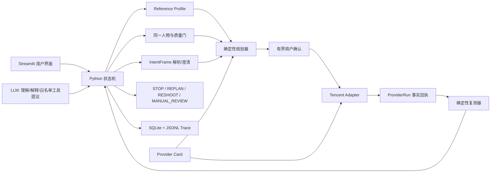

# 母版人像一致性 Agent｜执行版 PRD

> 文档版本：`v0.1-current`
> 最近同步：2026-08-27
> 文档性质：**当前产品与工程的共同真相源，持续更新**
> 当前阶段：合同 `v0.2-frozen` 已落地；检查点 6 的质量门、主体/安全 Adapter、Profile v0 与 Streamlit 按钮入口已实现，CompareFace 已完成一次真实 live smoke；ImageModeration 尚待 live 验证
> 提交目标：2026-09-04 前完成真实可演示闭环和录屏备份

## 0. 这份文档和原启动蓝图是什么关系

[原启动蓝图](../../outputs/人像修图一致性Agent-项目启动蓝图.md)记录了项目最初的探索、候选方案和排期，其中保留了一些后来被否决的设计，例如展示实验性 0—100 指数、把最多三轮写进合同类型、每轮最多三个参数等。它继续作为“为什么这样探索”的历史资料，但**不再代表当前实际产品**。

从现在开始，文档优先级固定为：

1. 代码、测试和真实运行回执：证明“已经做了什么”；
2. 本执行版 PRD：说明“当前产品最终要做什么、真实做到哪里”；
3. [PRODUCT_RULES.md](PRODUCT_RULES.md)、[CONTRACTS.md](CONTRACTS.md)、[AGENT_PROMPTS.md](AGENT_PROMPTS.md)：各模块的详细规则；
4. 原启动蓝图：只保留最初计划、研究和备选路线。

本文件中的状态标记只有三种：

| 标记         | 含义                          |
| ---------- | --------------------------- |
| **已实现并验证** | 代码存在，并有测试、真实运行或可读取的回执证明     |
| **已冻结待开发** | 产品规则已经由用户确认，但工程链路还没有完成      |
| **未来候选**   | 方向保留，尚未冻结具体产品规则，也不能对外称为已有能力 |

任何功能从“待开发”变成“已实现”，必须同时修改代码、测试、本文件的实现矩阵和开发进展；不能只改文案。

---

## 1. 产品定义

### 1.1 一句话定义

> **母版人像一致性 Agent：帮助用户建立自己的长期五官与脸型标准，并将单张或同组照片中的本人面部，分别调整到这套标准；执行后重新测量，处理失败和例外。**

它不是把两张照片变成像素级相同，也不是判断两个人长得像不像，更不是用统一审美评价用户。它解决的是：同一个人在不同时间、角度和拍摄组图中，修图结果容易“每张像不同的人”，而用户不想逐张猜滑杆。

### 1.2 核心用户

第一目标用户按行为定义：

- 经常发布本人照片，有一张自己认可的成片作为长期参照；
- 在意朋友圈、小红书、写真、毕业照、求职照或九宫格中五官与脸型的一致性；
- 会使用修图工具，但不想反复试参数；
- 愿意在明确告知、授权和可删除的前提下，让工具处理本人照片。

### 1.3 核心用户价值

用户不再自己判断“该瘦脸多少、眼睛该加多少”，而是完成以下任务：

```text
确认母版标准
→ 系统逐张判断是否可处理
→ 解释哪些五官/脸型存在差异
→ 生成当前工具真实能执行的计划
→ 用户授权
→ 工具执行
→ 系统重新测量结果
→ 接受、继续调整、重新上传或开发者复核
```

### 1.4 明确不做

- 不做陌生人搜索、1:N 人脸库、姓名识别、身份认证或风控；
- 不判断美丑，不提供医美建议，不推断年龄、性别、种族或健康；
- 不以肤色、妆面、身体或隐私部位建立长期母版；
- 不承诺“相似度 90%”或一次修好；
- 不让 LLM 看图凭感觉打分、猜滑杆或自行授权；
- 不自动发布图片，不操控醒图手机端，不使用通用生成模型重绘整张脸；
- 不把小样本 smoke test 写成上线、A/B、准确率或用户增长；
- Beta 不处理未获得权利人授权的他人照片，也不以未成年人为测试对象。

---

## 2. 当前冻结的产品决策

### 2.1 产品结果不展示总分

V0 不展示：

- 0—100“一致性指数”；
- 固定 90 分目标线；
- “与母版相似度 xx%”；
- 未经校准的接受概率。

==用户看到的是定性但可解释的结果==：

- 当前照片可继续、警告后继续或需要重新上传；
- 哪些脸型/五官差异可测量、哪些不可测量；
- 哪些变化可以由当前 Provider 自动执行，哪些只能手动建议；
- 执行后逐特征差异是缩小、无变化、变大还是无法复测；
- 下一步是接受、继续规划、重新上传还是待开发者复核。

未来只有在独立人工金标准、person-disjoint holdout、校准模型和校准报告全部成立后，才可以另行提案展示“人类接受概率”。腾讯参数、几何距离和 LLM 输出都不能直接冒充概率。

### 2.2 外部工具能力不写死在产品层

当前已接入的腾讯云 `BeautifyPic` 真实支持：瘦脸、大眼、美白、磨皮。四项都属于 Provider 能力，但产品默认只主动处理五官与脸型：

- `FaceLifting`、`EyeEnlarging`：可在允许范围内规划与执行；
- `Whitening`、`Smoothing`：默认值固定为 0，启用前必须单独说明影响并获得本任务授权；
- 眼距、嘴型、唇厚、鼻翼等保留在产品特征词表中；当前工具不支持时只能输出 suggestion-only，未来某个已审核 Provider Card 支持后才能自动执行。

腾讯参数是 0—100 的绝对值。用户可以表达“再瘦一点”或较大的相对愿望，但==确定性规划器必须依据能力卡和 Safety Policy 截断或拒绝；后台绝不发送小于 0 或大于 100 的值==。

### 2.3 执行确认采用“有界计划族”

一次确认只授权：

- 当前照片或当前批次；
- 明确允许的部位；
- 当前 Safety Policy 允许的最多轮次；
- 明确预算和有效期内的计划族。

在同一作用域内，复测后可以生成新 revision，不要求用户每次重新点确认。出现以下任一变化必须重新确认：==更换照片/母版、扩大部位、启用美白/磨皮、超过预算、原确认过期或用户改口。==

“以后默认直接执行”只能作为以后预选执行路径，不能永久取消新任务的确认。

### 2.4 轮次属于可配置策略

V0 当前 Safety Policy 为：

- 最多 3 轮真实 Provider 执行；
- 连续 2 轮无改善则提前停止；
- 同一个计划最多 3 次外部尝试（首次 + 有界重试）。

这些数字保存在带版本的 Policy 快照中，不写死在 `RoundNumber` 合同类型。==未来基于成本、用户反馈和评测可以修改配置，而不用破坏六个合同==。

### 2.5 多脸目标是自动隔离，失败时要求用户裁剪

完整目标链路已经冻结为：

```text
检测多脸
→ 用户选择目标脸
→ 系统隔离目标脸和必要上下文
→ 编辑裁剪结果
→ 对齐并回贴原图
→ 检查接缝、背景和其他人脸是否被改变
→ 只对目标脸复测
```

==任何一步不能稳定完成时，说明具体失败原因，并要求用户先裁剪成单脸照片再上传==。当前工程尚未实现这条链路，所以现阶段运行时不能直接把多脸整图发送给腾讯并承诺“只改所选脸”。

### 2.6 Beta 人工复核的真实含义

`MANUAL_REVIEW` 只表示“==进入项目开发者待复核列表”==，不代表已有客服或运营团队。默认只能查看脱敏 Trace；如果确实需要查看原图排错，必须取得独立原图查看授权并留下引用。用户不同意时，只能基于脱敏信息复核或建议重传。

### 2.7 三类判断信号必须分开

==人脸一致性、质量检测和可编辑性==

- `subject_match`：独立输出 `match / uncertain / no_match`，同时保留供应商原始分、分值范围、模型/阈值版本与回执；未校准的原始分不写成 confidence，也不与照片质量混成一个数字；
- `quality_confidence`：照片本身是否适合稳定分析；
- `editability_confidence`：当前 Provider 是否有能力稳定处理。

页面不展示这两个内部置信数值，也不把它们解释为用户接受概率；V0 只展示定性路由和具体失败原因。

==当前 0.50/0.80 只应用于质量与可执行性==，并取两者中更严格的路由：

| 最严格置信度 | 路由 |
|---:|---|
| `≤0.50` | 拒绝并要求重新上传 |
| `>0.50 且 <0.80` | 告知偏差风险后继续 |
| `≥0.80` | 进入下一步 |

`subject_match=uncertain` 独立进入确认/重新上传；`no_match` 拒绝，不会因为质量高而放行。

---

## 3. 两条主用户旅程

### 3.1 通路 A：长期母版 + 单张照片

```text
阅读人脸数据说明并单独同意
→ 上传已完成、自己认可的候选母版
→ 内容安全、单脸、清晰度、姿态、遮挡等检查
→ 提取归一化五官/脸型特征
→ 用户确认“这就是长期母版”
→ 原子性建立 ReferenceProfile
→ 上传一张目标照并表达目标
→ 同一人物、质量、可执行性检查
→ IntentFrame 结构化 + 必要时只追问一个问题
→ 逐特征差异诊断
→ 生成该照片独立 EditPlan
→ 有界确认
→ 腾讯 API 执行并生成 ProviderRun
→ 重新提取特征并生成 VerificationResult
→ STOP / REPLAN / RESHOOT / MANUAL_REVIEW
```

母版必须是用户已经确认的最终照片；系统不提供“在母版档案里继续 P”入口。用户要换母版时，重新上传完整成片，成功建立新 Profile 后才删除旧特征正文。

### 3.2 通路 B：同组照片统一

```text
上传一组照片
→ 用户从组内选择一张完成版作为母版
→ 建立/确认本组 Profile
→ 逐张做 subject/quality/editability 门控
→ 先列出失败、警告和可执行照片
→ 用户确认继续处理有效照片
→ 每张照片独立生成 EditPlan
→ 在授权、预算和并发限制内逐张执行
→ 每张独立复测
→ 输出已完成、需重传、待开发者复核清单
```

同组照片共享目标 Profile，但不能共享同一组滑杆，因为角度、表情、原始修图和遮挡都不同。一张失败不回滚其他成功照片，也不能用“整组成功”掩盖单张失败。

### 3.3 关键页面与反馈

| 页面/状态 | 用户必须看到 |
|---|---|
| 上传母版前 | 格式、单脸、正面、自然表情、清晰、无遮挡、本人/有授权、内容安全要求 |
| 建档中 | 真实的检查/提取/保存状态，不用虚假思考文本冒充成功 |
| 建档成功 | “母版档案已建立”；说明只保存派生五官/脸型数据，不保存原图 |
| 上传失败 | 明确失败原因和重新上传入口 |
| 意图澄清 | Agent 对已理解内容的简短复述；每次只问一个会改变结果的问题 |
| 计划确认 | 改哪些部位、用户层相对变化、Provider 绝对值、风险、轮次/预算作用域 |
| 执行中 | 正在调用的真实工具状态；不能显示隐藏思维链 |
| 执行成功 | 结果图、脱敏回执摘要、逐特征复测趋势和下一步 |
| 执行失败 | 失败层、可否重试、是否扣费未知/已知、换图或稍后再试建议 |
| 批量完成 | 每张照片的成功/警告/失败状态，允许部分接受 |

页面体验目标是 3—5 秒内出现首个真实反馈，例如“正在检查照片”，采用流式输出以及相应的产品ui设计。这只是响应体验目标，不代表完整处理要在 5 秒内完成。

---

## 4. 为什么这里需要 Agent

==底层仍是确定性图片处理系统；Agent 的价值不在“会聊天”，而在不确定任务中的自然语言转换、意图澄清、持续决策、规划、调用工具、权限和回滚恢复==：

1. 把自然语言目标转换成结构化约束；
2. 只补齐会改变路由、参数、权限或数据生命周期的缺失信息；
3. 根据当前 Profile、照片门控、用户授权和 Provider 能力选择可行路径；
4. 为每张照片产生独立计划；
5. 在明确确认后调用外部工具；
6. 读取真实回执和复测结果，决定停止、重规划、重传或开发者复核；
7. 在批量任务中隔离异常，不因单张失败污染整组。

如果最后只实现“上传两张图，然后固定参数调用一次 API”，它应被称为图片处理 workflow。只有==澄清、权限、状态、工具调用、真实复测和异常恢复都在运行，才可对外称为 Agent 闭环。==

---

## 5. Agent 编排与模块边界

### 5.1 冻结架构



控制权固定为：

- Python 状态机：决定当前合法状态、权限和可调用工具；
- 受限 ReAct：LLM 只能在当前状态的白名单中建议下一工具；
- 视觉工具：计算人脸、质量、特征和差异；
- 确定性规划器 + Safety Policy：生成数值、截断、预算和轮次；
- Provider Adapter：真实执行并生成回执；
- 验证器：重新测量真实结果；
- LLM：理解用户话语、生成一个澄清问题、解释结构化事实和提出候选失败标签。

LLM 永远不能：修改工具数值、生成 RequestId、越过确认、决定安全上限、把沉默解释成满意、输出隐藏思维链。

### 5.2 为什么采用“状态机放行 + 受限 ReAct 提议”

这句话的意思是：LLM 不是这个产品里的“总负责人”，它更像一个会理解用户话、会解释结果、会提出下一步建议的前台助手；真正决定系统现在能不能做某件事的，是后面的状态机。比如用户说“直接帮我修吧”，LLM 可以理解为用户有执行倾向，但它不能立刻调用修图 API。状态机会先检查：母版有没有锁定、目标照有没有过质量门、是不是同一个人、内容安全有没有通过、用户有没有明确同意把照片发给腾讯、这一步是不是已经有可执行的 EditPlan。只有这些条件都满足，状态机才会放行到执行工具。

从 Agent 编排角度看，这个设计是在把“会思考”和“能行动”拆开。ReAct 风格的核心是让模型一边理解任务，一边选择下一步工具；但如果直接让 LLM 自由选择工具，它很容易因为一句模糊的话就越权执行，也可能在缺少证据时跳过质量门、跳过确认，甚至编造一个看起来合理的工具结果。所以我们只允许 LLM 在当前状态的白名单里提议下一步。当前状态是 `PROFILE_ACTIVE`，它最多只能提议上传目标照或进入意图澄清；当前状态是 `CONFIRM`，它最多只能提议等待用户确认或取消；当前状态是 `EXECUTE`，它也只是建议调用哪个已授权工具，最后仍由状态机检查权限和参数边界。这就像给 LLM 一张“当前场景允许做什么”的菜单，它可以帮用户点菜，但不能自己进厨房改火候、改账单、或者假装菜已经做好了。

从产品设计角度看，这个设计解决的是信任问题。人像修图不是普通文本生成，它涉及用户照片、脸部特征、同一人物判断、外部 API 发送和不可逆的审美结果。用户愿意用这个 Agent，不只是因为它聪明，而是因为它每一步都能解释：为什么现在要问这个问题，为什么这张图不能处理，为什么要先确认，为什么只调用这些参数，为什么失败后不能继续硬修。如果产品把所有决策都交给 LLM，用户和面试官都会追问：你怎么保证它不会乱改、乱传、乱执行、乱解释？状态机就是这个产品的安全骨架，LLM 是让这个骨架变得自然好用的交互层。

这个设计也让项目更容易调试和复盘。之后每一次 bad case 都可以拆开看：是 LLM 把用户意图理解错了，还是状态机放行规则太松，还是质量门误判，还是 Provider API 失败，还是 VerificationResult 复测没变好。这样问题不会糊成一句“模型不稳定”。对 AI 产品经理来说，这正是你能把控的核心点：你不是只说“我接了一个大模型”，而是定义了任务状态、工具权限、确认机制、失败路由和可审计 Trace，让 Agent 的智能被放在一个可验证、可回滚、可解释的产品系统里。

所以这套编排的最终原则是：LLM 负责把用户表达变成结构化意图，并在证据范围内提出下一步；状态机负责判断当前是否允许这么做；确定性工具负责产生事实和数值；外部 Adapter 负责真实执行并返回回执；验证器负责检查结果是否真的变好。只有这几层合起来，才是一个可以拿去展示和追问的 C 端 Agent，而不是一个看起来很会聊天、但行为不可控的图片处理对话框。

### 5.3 当前状态机目标

```text
NEW
→ CONSENT
→ REFERENCE_UPLOAD
→ REFERENCE_QUALITY_GATE
→ PROFILE_CONFIRM
→ PROFILE_ACTIVE
→ TARGET_UPLOAD / BATCH_UPLOAD
→ INTENT_CAPTURE / CLARIFY
→ TARGET_QUALITY_GATE
→ DIAGNOSE
→ PLAN
→ CONFIRM
→ EXECUTE
→ VERIFY
→ STOP / REPLAN / RESHOOT / MANUAL_REVIEW
→ CLOSE / DELETE
```

当前工程尚未实现完整状态机；质量门、主体/安全 Adapter 和 Profile v0 已有独立服务、测试和 Streamlit 检查点 6 入口，但 LLM 澄清、EditPlan、修图执行和 VerificationResult 尚未串起。

### 5.4 工具目录

| 工具 | 责任 | 当前状态 |
|---|---|---|
| `review_reference_candidate` | 检查候选母版是否可建档 | OpenCV/Pillow 质量门已实现；Streamlit 检查点 6 入口已接入 |
| `lock_reference_profile` | 原子性建立/替换 Profile | Profile v0 构建器与 SQLite 原子替换已实现；UI 待接入 |
| `validate_photo` | 内容安全、subject、quality、editability、多脸路由 | 质量门、CompareFace、ImageModeration Adapter 和页面显式按钮已实现；CompareFace live 已验证，ImageModeration 与完整状态机待接入 |
| `extract_face_features` | 提取并归一化五官/脸型特征 | V0 已实现脸框/眼睛几何基线；关键点模型待后续替换 |
| `parse_intent` | 文本转 IntentFrame | 模板 fallback 已实现；LLM 待接入 |
| `clarify_constraints` | 只问一个关键缺失槽位 | Prompt 已冻结待接入 |
| `diagnose_differences` | 逐特征差异与可执行性 | 已冻结待开发 |
| `plan_edit` | 规则生成每张独立 EditPlan | 合同已实现；规划器待开发 |
| `retrieve_provider_capabilities` | 读取已审核能力卡 | Provider Card 文件与 loader 已实现 |
| `execute_beautify` | 调腾讯 BeautifyPic | Adapter + 独立 live smoke 已实现；UI/状态机未连通 |
| `verify_result` | 修后逐特征复测 | 合同已实现；CV 验证器待开发 |
| `route_batch_exceptions` | 批量中隔离失败和部分成功 | 已冻结待开发 |
| `purge_user_data` | 按作用域删除会话/图片/Profile | 已冻结待开发 |

---

## 6. 六个数据合同

六个合同是模块之间的统一交接表，代码真相源为 `src/portrait_consistency_agent/core/contracts.py`，当前版本为 `0.2`。

### 6.1 `ReferenceProfile`：长期母版档案

==保存：版本、状态、归一化五官/脸型字段、每项可用性与置信度、提取/归一化版本、允许/禁止/保留项、Provider 能力映射，以及经单独同意的主体锚点元数据。==

不保存：原图、文件路径、文件名、EXIF、肤色/妆面/背景/身体、原始关键点数组、明文 embedding。

主体锚点为加密、受限访问、可删除的不透明引用，保留半年。到期后重新同意/上传，或删除锚点并将 Profile 降级为 geometry-only。

新 Profile 先写入；成功后旧 Profile 的特征正文才被删除，并保留脱敏替换事件。

### 6.2 `PhotoQualityResult`：照片能不能进入处理

==分别保存 subject match、quality、editability、内容安全、多脸选择/隔离状态和最终路由。==`passed/blocked` 内容安全结论必须附带 provider、operation、模型/策略版本及 receipt 引用，不能由用户声明直接生成。

路由由当前 `QualityRoutingPolicySnapshot` 计算，0.50/0.80 是配置值，不是合同类型边界。

多脸依次进入 `SELECT_FACE → ISOLATION_PENDING → CONTINUE`；隔离失败进入 `REQUIRE_USER_CROP`。目标照 subject 不确定时进入独立确认，不能被高质量置信度覆盖。

### 6.3 `IntentFrame`：用户当前要什么

==保存目标、单张/批量、输出偏好、目标范围、母版来源、允许/禁止/保留项、调整模式、速度/成本/少改优先级、用户请求轮数、批量失败策略、字段来源、逐槽置信、缺失槽位、解析模式和有界确认。==

它不保存工作流状态或工具成功结果。

高置信只能少问问题，不能取消执行确认。

用户改口后，新 IntentFrame 通过 `supersedes_intent_id` 覆盖旧意图，旧计划与确认应失效。

### 6.4 `EditPlan`：单张照片的不可变施工单

==保存修前逐特征差异、Provider 可执行变化、suggestion-only 变化、四个显式腾讯绝对值、约束快照、Safety Policy、风险、确认引用和版本。==没有 `expected_index_gain`，也不保存修后结果。

计划一次创建后不可原地改参数；复测后必须创建新 revision。未来特征可留在词表，但没有能力卡时只能 suggestion-only。

### 6.5 `ProviderRun`：一次真实外部调用回执

每次尝试单独保存：==计划/照片/attempt、Provider/API/region/endpoint/能力卡、脱敏参数、输入哈希、确认与同意引用、幂等键、状态、RequestId、结果哈希/引用、耗时、成本、错误分类、是否可重试和结果删除生命周期。==

它只能由 Adapter 与审计代码生成。API 成功证明“工具确实返回结果”，不证明“修图已经符合母版”。Base64、密钥、签名 URL和原图不得进入回执投影。

### 6.6 `VerificationResult`：修后验收与下一步

==保存逐特征修前/修后差异和趋势、结果质量、禁改项、真实轮次、无改善连续次数、Safety Policy、显式用户反馈、结果回退引用和下一状态。==它没有 before/after 总指数。

V0 的 `calibrated_acceptance` 必须为空。达到可配置轮次或无改善门后禁止继续 REPLAN；结果变差时必须保留 last-known-good 并说明回退原因；MANUAL_REVIEW 必须明确责任人是项目开发者及是否获得原图查看授权。

### 6.7 合同存储

SQLite 目前已经有六类合同表：

```text
reference_profiles
photo_quality_results
intent_frames
edit_plans
provider_runs
verification_results
```

迁移标识为 `contract_v0_2_tables`。本地数据库保存的是脱敏 JSON 投影；当前它不是生产级生物特征库，也没有完成真正的加密密钥管理、多租户隔离、TTL worker 或删除任务。

---

## 7. 人脸一致性判断与未来概率

### 7.1 V0 计算方式

V0 计划==由确定性视觉模块完成==：

1. 检测人脸与关键点；
2. 用姿态/变换矩阵做旋转、平移和尺度归一化；
3. 计算脸宽高、额中下面比例、颧/下颌/下巴、眼宽高/眼距/眼角、鼻宽长、嘴宽/唇厚/嘴角等结构化字段；
4. 对每一特征比较母版与目标差异；
5. 根据可测量性、用户禁改项和 Provider 能力标记 executable 或 suggestion-only；
6. 修图后重新提取同一组字段，输出 improved/no_change/worsened/unverifiable。

检查点 6 已实现 ==OpenCV Haar + Pillow== 的可解释基线：尺寸、清晰度、曝光、脸框大小、眼睛可见性和脸框/眼睛归一化几何。它不是完整关键点模型，不能声称覆盖所有角度、遮挡或五官，也不输出一致性总分；后续可替换为经过授权和 benchmark 验证的关键点 Adapter。

### 7.2 未来接受概率

未来概率模型需要：

```text
授权照片对 + 修前/修后特征
→ 人工独立回答“是否已达到这位用户的母版要求”
→ human_gold / interaction_weak / synthetic 分层
→ 按人切分训练集和 holdout
→ 训练接受分类模型
→ 概率校准与校准曲线
→ 只在限定人群、照片条件和评审标准下解释概率
```

用户点击接受/继续、重新上传等可以自动形成弱标签；模型可合成边界案例做规则和回归测试；两者都不能替代人工金标准或进入 holdout 自证结果。

---

## 8. 腾讯 BeautifyPic 执行链

截至 2026-08-27，官方文档确认：接口为 `BeautifyPic`，版本 `2019-12-13`，端点 `fmu.tencentcloudapi.com`；四个参数范围均为 0—100；Base64 编码后不超过 5M、单边不超过 4000；支持 PNG/JPG/JPEG/BMP，不支持 GIF 和透明通道；URL 输出有效期一天；接口可能处理图片中最大的五张人脸，但没有指定目标脸的请求参数。[腾讯云官方文档](https://cloud.tencent.com/document/product/1172/40715)

当前请求原则：

```json
{
  "FaceLifting": 0,
  "EyeEnlarging": 0,
  "Whitening": 0,
  "Smoothing": 0,
  "RspImgType": "base64"
}
```

四个值必须全部显式发送，避免腾讯的非零默认值产生无意修改。成功必须有 `RequestId`、结果引用/哈希和耗时；失败必须有错误阶段、类别、错误码和是否可重试。

当前真实 live smoke 证据（来自合同升级前的成功调用）：

- 日期：2026-08-26；
- 单人授权测试照片；
- 四个参数均显式为 0；
- `RequestId=1e519f22-b119-41bb-9242-76798f7cab61`；
- `latency_ms=3438`；
- 本地结果引用：`storage/results/1e519f22-b119-41bb-9242-76798f7cab61.jpg`；
- `run_id=run_9559220a5f844122928399cd9d50cd9b`。

这只证明账号、权限、服务、SDK 签名和单次调用成功，不证明修图有效、稳定性、成本、批量、人脸一致性或用户接受。

当前 smoke 脚本已经升级为 `ProviderRun v0.2` 并通过不联网 dry run；本轮没有再次读取人脸照片或产生付费调用，因此不能说“v0.2 回执已经完成新的 live 验证”。

---

## 9. 技术栈与环境

| 层           | 当前实际采用                                | 当前状态                       | 为什么                                              |
| ----------- | ------------------------------------- | -------------------------- | ------------------------------------------------ |
| 语言/环境       | Python 3.10 + `uv` + `uv.lock`        | 已实现并验证                     | 可复现、适合 CV/SDK/Streamlit                          |
| UI          | Streamlit 单进程                         | 本地壳已实现                     | 截止日前最快形成真实任务界面                                   |
| 编排          | Python 状态机 + 受限 ReAct                 | 架构已冻结，状态机待开发               | 路径清楚、权限可控、便于 Trace                               |
| 合同          | Pydantic v2                           | v0.2 已实现并测试                | 模块输入输出可校验、可版本化                                   |
| 本地数据        | SQLite + JSONL                        | 六合同表与脱敏 Trace 已实现          | Demo 可追溯且无需先建云数据库                                |
| 图片编辑        | 腾讯云 FMU Python SDK                    | Adapter 和独立 live smoke 已实现 | 真实工具执行，不依赖醒图 API/RPA                             |
| Provider 知识 | JSON Provider Card + loader           | 已实现                        | 先解决版本、范围、默认值和限制                                  |
| 几何与质量视觉     | Pillow + OpenCV Haar V0               | 已实现并测试                     | 真实图片解码、质量/可编辑性指标和粗粒度几何；不承担同一人物判断                 |
| 主体匹配        | 腾讯 IAI `CompareFace` 3.0 + 独立 Adapter | Adapter 已实现；真实同图 smoke 已验证   | 只做当前会话 1:1 同人路由；供应商原始分不作为产品一致性分数展示               |
| 内容安全        | 腾讯 IMS `ImageModeration` + 独立 Adapter | Adapter 已实现；服务开通/策略待验证     | `Pass` 放行，`Review/Block` V0 保守拦截；结果必须有 RequestId |
| LLM         | 可替换 Adapter                           | Provider 尚未决定，未接入          | 只做意图、澄清、解释和候选路由                                  |
| RAG         | V0 Provider Card metadata baseline    | 文件读取已实现；非完整 RAG            | 当前没有必要先上向量库                                      |
| 部署          | 受邀访问的 Streamlit 分享 URL                | 方案已冻结，平台/访问控制待定            | 先服务小范围测试者，公网后置                                   |

本地命令：

```bash
uv sync --all-groups
make check-env
make test
make lint
make run
```

本地服务只绑定 `127.0.0.1:8501`。真实密钥只在 Git 忽略的 `.env`；未来部署时放平台 Secrets，不进入浏览器、Prompt、日志或仓库。

### 9.1 为什么当前不用 LangChain/LangGraph

当前路径、权限和外部副作用高度确定，Python 状态机更易读、测试和回放。LangGraph 的 checkpoint、跨会话恢复和 HITL interrupt 只有在批量长任务、跨会话等待或复杂恢复真实出现后才有价值。框架不影响 Streamlit 部署；编排选择与公网部署是两件事。

### 9.2 RAG 的演进边界

- V0：读取经审核的 Provider Card；它是结构化知识基线，不包装成完整向量 RAG；
- ==P1：官方文档分块、metadata + 关键词/向量混合检索、引用回溯；==
- ==P2：多 Provider、SDK/License/地区/版本兼容性路由==。

RAG 只回答“当前工具能不能做、怎样调用、有什么限制”，不回答“这张脸该怎么改”或“是否已经足够一致”。

---

## 10. 数据、隐私与安全

### 10.1 数据生命周期

| 数据 | 当前/目标规则 |
|---|---|
| 原始母版 | 当前 Streamlit 只做内存预览；长期不保存 |
| 目标原图 | 只在完成本次分析/调用所需的临时上下文中存在；不得进入 Trace |
| 腾讯结果图 | 当前 live smoke 保存在 Git 忽略目录；目标是 24 小时 TTL/用户主动删除 |
| Profile 几何字段 | 结构化、版本化、可删除；不含肤色/妆面/身体 |
| 主体锚点 | 单独同意、加密引用、受限访问、半年到期；当前仅有合同，未实现加密存储 |
| Trace | 只保存哈希、结构化状态、版本、参数和脱敏回执 |
| 自由文本 | 当前只保存文本哈希；未来是否保存脱敏原文需另行决定 |

### 10.2 内容与用途安全

拒绝或警告范围包括：色情/裸露、未成年人不当内容、暴力/血腥、自残/虐待、仇恨/羞辱、未经同意的第三方照片、恶意换脸、冒充/诈骗、证件伪造、身份认证或风控误用、绕过安全检查和删除水印。

安全失败时不调用外部图片 API、不保存原图到 Trace，只记录脱敏风险类别和处理结果。

### 10.3 当前仍缺少的隐私工程

- Profile 主体锚点的实际加密存储和密钥管理；
- 同意/撤回页面和策略版本；
- 半年到期提醒 worker；
- 原图/结果图自动 TTL 与删除证明；
- 部署后的访问控制、多用户隔离和权限测试；
- 简版 PIA 和受邀测试者授权材料。

---

## 11. Trace、监控和 Bad Case

### 11.1 Trace 必须回答的问题

- 这是哪个匿名 session、Profile 和照片；
- 用户目标被解析成哪个 IntentFrame；
- 哪些槽位来自用户、Profile 或产品默认；
- 哪个质量/主体/内容安全门放行或拒绝；
- 哪个 Provider Card 和 Safety Policy 生成了计划；
- 用户确认覆盖了什么范围；
- 外部 API 每一次尝试是否成功、RequestId、耗时、错误和可否重试；
- 修后哪些特征改善、无变化、变差或无法测量；
- 为什么 STOP/REPLAN/RESHOOT/MANUAL_REVIEW；
- 用户是否显式接受，以及标签来源是什么。

当前 SQLite/JSONL 已递归红删密钥、确认引用、主体锚点、Base64、原图 payload、输入 artifact 引用和签名 URL。

==UI 可以显示进度、调用工具、参数依据、回执和决策摘要，不显示模型隐藏思维链。==

### 11.2 Bad Case taxonomy

| 类别 | 典型问题 | 首要修复层 |
|---|---|---|
| `INPUT_QUALITY` | 模糊、侧脸、遮挡、多脸隔离失败 | 质量门与上传 UX |
| `SUBJECT_MATCH` | 同一人物不确定或误判 | 主体锚点、模型与校准 |
| `FEATURE_EXTRACTION` | 关键点/几何特征漂移 | CV 算法与测试 |
| `ACCEPTANCE_CALIBRATION` | 系统趋势与人工接受冲突 | 金标准、模型与校准 |
| `PARAMETER_MAPPING` | 参数方向或幅度错误 | 规则规划器/响应矩阵 |
| `PARAMETER_INTERACTION` | 多参数叠加过修 | Safety Policy/规划器 |
| `PROVIDER_CAPABILITY` | 工具不支持或版本变化 | Provider Card/Adapter |
| `TOOL_FAILURE` | timeout、限频、5xx、无结果图 | 重试、幂等和 ProviderRun |
| `UX_MISUNDERSTANDING` | 用户误解授权、参数或结果 | 文案和交互 |
| `USER_PREFERENCE` | 几何改善但用户不满意 | 澄清、Profile 约束和反馈 |
| `PRIVACY_CONTROL` | 数据超期、越权查看或删除失败 | 立即停止 Pilot 并修复 |
| `UNKNOWN` | 证据不足 | 补日志与最小复现实验 |

LLM 只能根据已有证据提出候选根因；最终标签由规则或开发者确认。没有证据必须输出 UNKNOWN。

---

## 12. 评测与用户测试

### 12.1 ==9 月 4 日前==

- ==5—10 个获授权 smoke case；==
- ==至少一个未参与规则调整的 holdout；==
- ==一个正常单张闭环、一个质量拒绝、一个 API 失败、一个结果变差/无改善；==
- ==若批量可演示，用 2—3 张证明逐张 plan 和异常隔离；==
- ==2—3 名受邀用户做无引导可用性 smoke，只报告任务是否跑通、哪里误解和修了什么。==

### 12.2 提交后

- 问题访谈：5—8 名目标用户；
- 可用性：8—12 名无引导完成；
- ==接受概率准备：有授权照片对、按人切分、独立标注和 holdout；==
- ==Intent eval：字段准确率、Schema 合法率、平均澄清轮数、越权执行率、fallback 率、成本；==
- ==Agent eval：任务成功、执行轮数、恢复率、Provider 错误率、每成功任务成本；==
- ==RAG eval：能力卡 Recall@k、引用正确率、过期卡拦截和 unsupported rate。==

所有数字在真实产生前都是目标，不进入简历结果。

---

## 13. 当前真实实现矩阵

> ==这是本 PRD 最重要的防夸写区域==。最近核对时间：2026-08-27。

| 模块                                   | 状态           | 真实证据                                                                    | 当前边界                                                  |
| ------------------------------------ | ------------ | ----------------------------------------------------------------------- | ----------------------------------------------------- |
| 项目仓库与 Git 回滚点                        | **已实现并验证**   | 独立 Git 仓库，已有 5 个基础提交                                                    | 本轮未自动提交                                               |
| Python/uv 环境                         | **已实现并验证**   | Python 3.10、`.venv`、`uv.lock`、环境检查                                      | 仅本地开发                                                 |
| 六合同 v0.2                             | **已实现并验证**   | Pydantic 合同 + 51 个总测试通过                                                 | 视觉字段已可由质量门/Profile V0 产生；完整关键点模型仍未接入                  |
| 可配置质量/Safety Policy                  | **已实现并验证**   | `core/policies.py`；测试证明第 4 轮可被未来策略允许、当前策略拒绝                             | 尚未接入状态机/UI                                            |
| 六合同 SQLite 表                         | **已实现并验证**   | `contract_v0_2_tables` 迁移；六表落库测试                                        | 本地独立脱敏投影，不是生产数据库；跨合同关联尚未由完整状态机/端到端测试强制                |
| Profile 原子替换                         | **已实现并验证**   | 新 Profile 成功后旧特征正文 tombstone，审计事件保留                                     | 真实 Profile 提取已实现 V0 脸框/眼睛基线；加密锚点未实现                   |
| 脱敏 Trace                             | **已实现并验证**   | SQLite + JSONL；敏感字段回归测试                                                 | TTL/删除任务未实现                                           |
| Tencent Provider Card                | **已实现并验证**   | 官方来源、参数范围、默认值、多人行为和错误策略                                                 | 结构化读取，不是完整向量 RAG                                      |
| Tencent Adapter                      | **已实现并验证**   | SDK 请求构造、凭据前置检查、错误码保留测试                                                 | 仅 BeautifyPic 四参数                                     |
| Tencent live smoke                   | **已实现并验证**   | 升级前真实 RequestId、结果文件、3438 ms；v0.2 脚本 dry run                            | v0.2 回执结构尚未再次 live 验证；单次四参数为 0 不代表效果                  |
| Streamlit 本地壳                        | **已实现并验证**   | session、双图内存预览、质量门、显式安全/同人按钮、Profile v0、模板 IntentFrame、Trace；健康检查通过     | 页面尚未接入 LLM、完整状态机、Beautify 执行和修后复测                     |
| Reference Profile 真实建档               | **部分已实现并验证** | `reference_profile.py` + 4 个 Profile 测试 + Checkpoint 6 临时 SQLite 纵向测试   | V0 仅脸框/眼睛几何；无加密锚点和 UI                                 |
| 内容安全 + subject/quality/editability 门 | **部分已实现并验证** | OpenCV/Pillow 质量门、Tencent Adapter、页面显式同意按钮、模块测试；CompareFace live 同图 smoke 成功 | ImageModeration 尚未 live 验证；完整状态机和多脸隔离尚未实现；不能夸写为线上稳定能力 |
| 多脸隔离/裁剪/回贴/复测                        | **已冻结待开发**   | 产品链路与合同路由                                                               | 当前必须要求用户单脸/先裁剪                                        |
| LLM IntentFrame                      | **已冻结待开发**   | Prompt 与 Schema                                                         | 当前是 `template_fallback`                               |
| Python 状态机/受限 ReAct                  | **已冻结待开发**   | 状态与权限设计                                                                 | 尚无完整 Agent loop                                       |
| 差异诊断与规则规划器                           | **已冻结待开发**   | EditPlan 合同                                                             | 尚不能从真实照片生成参数                                          |
| UI 内真实 API 执行                        | **已冻结待开发**   | Adapter 可独立调用                                                           | 未接确认、计划、Trace 和结果展示                                   |
| VerificationResult 真实复测              | **已冻结待开发**   | 合同与策略测试                                                                 | 无 CV 验证器                                              |
| 批量模式                                 | **已冻结待开发**   | 用户旅程与逐张合同                                                               | 无批量执行代码                                               |
| 受邀 Streamlit URL                     | **已冻结待开发**   | 部署方向已确认                                                                 | 平台、认证和 Secrets 尚未配置                                   |
| 接受概率模型                               | **未来候选**     | 数据/评测规则已定义                                                              | V0 禁止显示                                               |
| 完整文档 RAG/向量库                         | **未来候选**     | 演进边界已定义                                                                 | 当前只有 Provider Card baseline                           |

### 13.1 当前测试证据

2026-08-27 本轮验证：

```text
uv run pytest -q                 → 51 passed
uv run ruff check .              → All checks passed
uv run ruff format --check .     → 40 files already formatted
无 --allow-live 的 smoke         → network_called=false
app import + 本地 schema 迁移    → app_import_and_schema_v0_2_ok
CompareFace --allow-live        → 到达腾讯但 AuthFailure.UnauthorizedOperation（RequestId 已记录）
```

不在没有新授权图片和明确预算动作时重复调用付费 API；此前真实 RequestId 已足以证明当前 API Gate。

---

## 14. 9 月 4 日前的开发顺序

当前最小纵向切片的基础设施和合同 Gate 已完成。后续严格按模块验收：

1. **检查点 6：质量门、CompareFace 和 Profile v0 已完成；补充安全门 live 验证与失败路径录屏**
   真实上传照片后，由 ==Pillow/OpenCV 产生质量与几何字段，ImageModeration 先做安全门，CompareFace 再做当前会话同人路由；通过的母版生成结构化几何 Profile，不输出总分==。当前 CompareFace 已在 IAI 服务开通和 CAM 最小权限补齐后完成真实同图 smoke，返回原始分 100（不作为用户分数）。
2. **逐特征差异 + 确定性 EditPlan**
   从母版/目标特征生成真实差异，先只稳定映射瘦脸和大眼，美白/磨皮保持关闭。
3. **Streamlit 单张端到端**
   把确认、腾讯 Adapter、ProviderRun、结果图和 VerificationResult 接进同一 session/Trace。
4. **LLM IntentFrame + 模板 fallback**
   自然语言解析、一个问题澄清、Schema/权限校验；LLM 断网仍能演示。
5. **状态机和失败恢复**
   STOP/REPLAN/RESHOOT/MANUAL_REVIEW、有界轮次、last-known-good。
6. **2—3 张批量 smoke 与多脸降级**
   先保证每张独立 plan 和失败隔离；完整多脸回贴来不及则要求先裁剪并如实演示边界。
7. **受邀部署、用户走查、录屏和证据包**
   平台 Secrets、访问控制、数据删除；9 月 3 日完成录制，9 月 4 日只做 QA 和提交。

每一模块继续遵循：讲清模块 → 用户决定产品规则 → 开发 → 3—5 个案例 → 一条真实 Trace → 用户验收。

---

## 15. 尚未冻结、以后仍需用户决定

这些问题没有被本轮五项确认自动决定：

- 人工金标准的具体问法、评审人数和冲突处理；
- 哪些用户行为只算弱标签，退出/沉默如何记录为“未知”而非拒绝；
- 主体锚点同意文案、提前多少天提醒、撤回后的删除 SLA；
- V0 同一人物门控具体采用哪个模型/服务、许可与数据边界，以及在没有授权 benchmark 前如何处理 `uncertain/no_match`；
- V0 图片内容安全采用本地模型、云审核服务还是受邀 Beta 的人工前置审核；用户上传声明只证明授权，不等于机器审核通过；
- 9 月 4 日 Demo 是否先只持久化几何 Profile，还是同时实现真正加密、半年到期和可删除的主体锚点；
- 真实测试照片的授权书、保留期和公开演示授权范围；
- Streamlit 具体平台、访问密码/邀请机制、受邀名单、费用上限和部署区；
- LLM Provider、模型、预算和数据出境/留存边界；
- 多脸隔离的具体算法方案和视觉验收阈值；
- 用户不满意但仍在授权范围内时，是否默认继续或再次确认；
- 何时从本地 SQLite 升级为 PostgreSQL/对象存储。

其中有一个不能绕开的耦合约束：如果产品同时要求“跨会话长期确认同一人物”和“不保存母版原图”，Subject Match Adapter 就必须能生成、加密保存并再次比较派生主体锚点。只接受两张图片的云端比对 API 只能服务当前会话；除非每次重新上传母版或允许供应商保存参考脸，否则不能独自实现长期 Profile。

这些会继续按“用户先定初步规则—补充遗漏与权衡—再次确认—明确冻结—再写代码”的方式推进。

---

## 16. 文档更新规则

每次产品规则或代码变化后必须同时检查：

1. 本 PRD 的冻结决策和实现矩阵；
2. 对应专项文档；
3. `DECISION_LOG.md`；
4. `DEVELOPMENT_PROGRESS.md`；
5. 合同/代码/测试是否仍与文字一致；
6. README 的当前能力和不可夸写边界。

原启动蓝图不再被反复覆盖；它只记录项目出发点。本执行版 PRD负责持续贴合最终真实产品。
